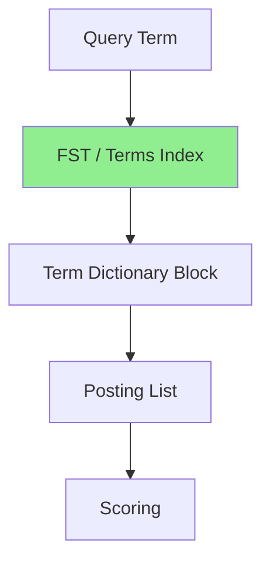

# A) Finite State Transducer ?

Finite State Transducer(FST)는 문자열 같은 입력 시퀀스를 읽으면서, 그 입력에 대응하는 출력 값을 함께 반환할 수 있는 finite state machine이다.

단순화하면 **압축된 trie에 value lookup 기능을 붙인 자료구조** 로 생각하면 된다.

# B) Trie와의 차이

Trie는 문자열 집합을 저장하고, 어떤 문자열이 존재하는지 빠르게 찾는 데 사용된다.

```text
Trie:
"cat" exists?
"car" exists?
"dog" exists?
```

FST는 문자열 존재 여부뿐 아니라, 문자열을 어떤 값으로 매핑할 수 있다.

```text
FST:
"cat" -> 120
"car" -> 128
"dog" -> 340
```

여기서 출력 값은 상황에 따라 다르다. Lucene에서는 term dictionary의 block 위치, term metadata, file pointer 같은 값을 찾는 데 사용할 수 있다.

# C) 왜 쓰는가

FST는 많은 문자열이 prefix나 suffix를 공유할 때 메모리를 아낄 수 있다.

예를 들어 `cat`, `car`, `cart` 같은 term은 앞부분 `ca`를 공유한다. Trie는 prefix 공유를 잘 활용한다. FST는 여기서 한 걸음 더 나아가, 같은 형태의 suffix/subgraph도 합칠 수 있어 더 compact한 표현이 가능하다.

검색 엔진에서는 term 수가 매우 많기 때문에, term dictionary를 메모리에 효율적으로 올리고 빠르게 lookup하는 것이 중요하다. FST는 이 지점에서 유용하다.

# D) Lucene에서의 역할

[[Lucene]]에서 FST는 posting list 자체라기보다는, **term을 빠르게 찾기 위한 dictionary/index 쪽 구조** 로 이해하는 게 좋다.

Lucene의 full-text search 흐름을 단순화하면:



FST는 `"파스타"` 라는 term이 term dictionary의 어느 block이나 file offset 근처에 있는지 빠르게 찾도록 돕는다. 그 다음 실제 문서 목록은 posting list에서 읽는다.

즉:

| 구조 | 담당 |
|---|---|
| FST / terms index | term lookup, dictionary block 탐색 |
| Term dictionary | term metadata, postings 위치 정보 |
| Posting list | 해당 term이 등장한 document ID 목록 |

따라서 `FST = inverted index 전체` 도 아니고, `FST = posting list` 도 아니다. Lucene의 inverted index를 구성하는 여러 부품 중에서 **term dictionary lookup을 빠르게 만드는 압축된 lookup structure** 에 가깝다.

# E) References

- [Apache Lucene - org.apache.lucene.util.fst package](https://lucene.apache.org/core/3_6_0/api/core/org/apache/lucene/util/fst/package-summary.html)
- [Apache Lucene - BlockTreeTermsWriter](https://lucene.apache.org/core/4_7_2/core/org/apache/lucene/codecs/BlockTreeTermsWriter.html)
- [Apache Lucene - BlockTree codec package](https://lucene.apache.org/core/8_0_0/core/org/apache/lucene/codecs/blocktree/package-summary.html)
