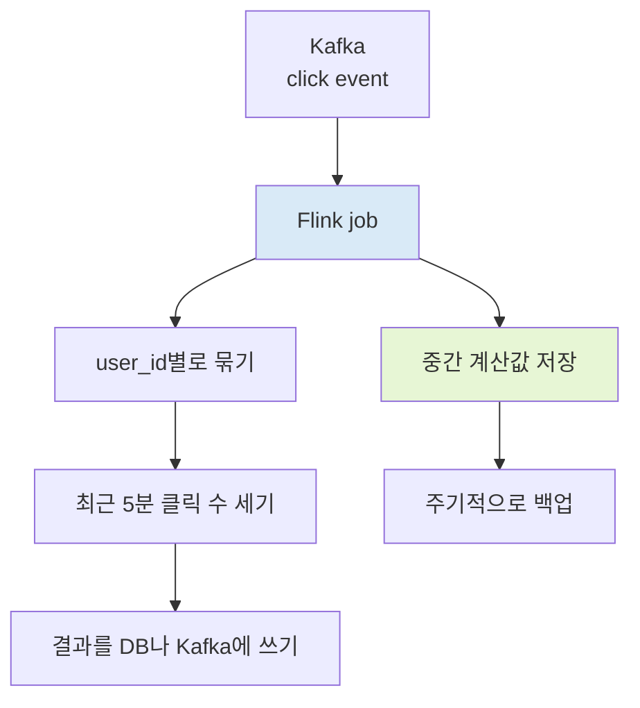

# A) Apache Flink

Apache Flink는 **계속 들어오는 데이터를 읽어서, 그때그때 계산 결과를 갱신하는 분산 처리 엔진**이다.

예를 들어 쇼핑몰에서 사용자가 상품을 클릭할 때마다 [[Kafka]]에 click event가 쌓인다고 해 보자. Flink는 이 event를 계속 읽으면서 "최근 5분 동안 상품별 클릭 수", "사용자별 최근 행동", "이상 행동 알림", "실시간 추천 feature" 같은 값을 계산한다.

한 번 실행하고 끝나는 스크립트라기보다, 계속 켜 둔 계산 서비스에 가깝다. 데이터가 들어오는 동안 Flink job도 계속 살아 있고, 새로운 event가 들어올 때마다 중간 계산값과 결과를 갱신한다.

Flink 문서에서는 **bounded stream**과 **unbounded stream**이라는 말을 자주 쓴다. 어렵게 들리지만 뜻은 단순하다.

- bounded stream: 로그 파일이나 하루치 partition처럼 끝이 있는 데이터
- unbounded stream: Kafka topic처럼 끝없이 들어오는 데이터

Flink는 둘을 완전히 다른 방식으로 보지 않는다. "데이터가 순서대로 흘러온다"는 관점에서 같은 stream 모델 위에 올린다. 끝이 있으면 언젠가 job이 끝나고, 끝이 없으면 계속 실행된다.

그래서 Flink를 이해할 때 첫 질문은 "빠른 batch engine인가?"가 아니다. 더 중요한 질문은 "데이터가 계속 들어오는 동안 무엇을 기억해야 하고, 결과를 언제 확정해야 하며, 장애가 나면 어디서 다시 이어서 처리할 것인가?"이다. 이 질문이 중요해지는 상황에서 Flink가 빛난다.

2026년 6월 기준 공식 문서의 stable 버전은 Flink 2.3이고, Apache Flink 2.3.0은 2026-06-25에 release되었다. 2.3에는 SQL changelog 변환, materialized table 개선, native S3 filesystem, watermark alignment 개선, recovery 중 checkpoint 지원처럼 SQL과 운영에 가까운 변화가 들어왔다.

# B) Flink가 유용한 순간

Flink는 "실시간"이라는 말이 붙는 모든 작업에 필요한 도구는 아니다. 단순히 데이터를 빨리 옮기는 정도라면 더 가벼운 선택지가 많다.

Flink가 잘 맞는 순간은 보통 **stream이 계속 살아 있고, 그 안에서 기억해야 할 상태가 커지며, 장애가 나도 계산을 이어 가야 할 때**다.

| 상황 | 왜 Flink가 잘 맞나 | 예시 |
| --- | --- | --- |
| key별 중간값을 오래 기억해야 할 때 | state를 job 안에서 관리하고 checkpoint로 복구할 수 있음 | 사용자별 최근 행동, 상품별 실시간 집계, session state |
| event가 늦게 도착해도 정확한 시간 기준으로 집계해야 할 때 | event time과 watermark로 window를 닫는 시점을 제어할 수 있음 | 5분 클릭 수, 광고 노출/클릭 집계, 센서 데이터 집계 |
| 장애가 나도 중복·누락을 줄이며 이어서 처리해야 할 때 | checkpoint로 state와 source 위치를 함께 복구할 수 있음 | Kafka 소비 후 DB/Kafka/lakehouse에 결과 쓰기 |
| 실시간 ETL이나 CDC pipeline을 운영해야 할 때 | SQL/Table API로 지속 실행되는 변환 job을 만들 수 있음 | DB 변경 로그를 정제해 Kafka나 warehouse로 전달 |
| stream 결과가 제품 기능에 바로 연결될 때 | latency와 복구, state 크기를 함께 관리할 수 있음 | 실시간 추천 feature, fraud detection, alerting |

반대로 이런 경우에는 Flink가 과할 수 있다.

| 상황 | 더 단순한 선택 |
| --- | --- |
| 하루치 로그를 한 번 읽고 끝나는 분석 | batch Spark, SQL warehouse |
| Kafka topic 하나를 거의 그대로 다른 topic으로 옮기는 작업 | Kafka Connect, 작은 consumer app |
| 요청이 올 때마다 모델을 호출하는 online API | 일반 serving stack |
| 몇 분마다 작은 테이블을 갱신하는 cron job | scheduler + SQL/script |

짧게 말하면, Flink는 **계속 들어오는 event를 보면서, 큰 중간 상태를 들고, 시간 기준 집계와 장애 복구까지 챙겨야 할 때** 검토할 만하다. 단순히 "실시간"이라는 이유만으로 바로 Flink를 쓰는 것은 좋은 판단 기준이 아니다.

# C) 예시로 먼저 보기

Flink를 처음 볼 때는 "사용자별 클릭 수를 계속 세는 job"을 떠올리면 이해하기 쉽다.



이 job이 제대로 돌려면 세 가지를 챙겨야 한다.

1. 지금까지 user_id별로 몇 번 클릭했는지 기억해야 한다.
2. "최근 5분"을 어떤 시간 기준으로 볼지 정해야 한다.
3. 서버가 죽어도 마지막으로 계산하던 지점에서 다시 시작할 수 있어야 한다.

Flink의 핵심 개념인 **state**, **event time**, **checkpoint**는 모두 이 문제에서 나온다.

# D) Flink가 풀려는 문제

실시간 데이터 처리는 "빨리 처리한다"로 끝나지 않는다. 운영에서 어려운 부분은 대체로 이런 질문들이다.

1. 늦게 도착한 event는 이미 낸 집계 결과에 어떻게 반영할 것인가?
2. 장애가 나면 어디까지 처리했다고 보고 다시 시작할 것인가?
3. 사용자, 상품, 세션처럼 key별로 쌓인 중간 계산값을 어디에 둘 것인가?
4. 결과를 sink에 쓸 때 중복이나 누락을 어떻게 줄일 것인가?

Flink는 이 문제를 **state + time + checkpoint** 조합으로 푼다.

| 개념 | 쉽게 말하면 | 왜 필요한가 |
| --- | --- | --- |
| State | 지금까지 계산해 둔 중간값 | 다음 event가 들어왔을 때 이어서 계산하려고 |
| Time | event를 어떤 시간 기준으로 볼지 | window 집계와 late event 처리를 정하려고 |
| Checkpoint | 중간 계산값의 주기적 백업 | 장애 후 같은 지점에서 다시 시작하려고 |

# E) 핵심 개념

## E.1) Stream

Flink는 데이터를 stream으로 본다. stream은 "데이터가 순서대로 흘러온다"는 뜻에 가깝다.

| 구분 | 의미 | 예시 | 처리 감각 |
| --- | --- | --- | --- |
| Bounded stream | 언젠가 끝나는 데이터 | 과거 로그 파일, 일 단위 partition | 다 읽으면 job이 끝남 |
| Unbounded stream | 끝없이 들어오는 데이터 | Kafka topic, click event, sensor event | job이 계속 살아 있음 |

batch와 streaming을 완전히 다른 시스템으로 나누지 않는다는 점이 중요하다. 같은 Table API/SQL이나 DataStream API 위에서 작업을 표현하고, 입력이 끝나는 데이터인지 끝없는 데이터인지에 따라 실행 방식이 달라진다.

## E.2) State

Flink에서 state는 **다음 event를 처리할 때 다시 꺼내 봐야 하는 중간 계산값**이다.

예를 들어 5분 단위 클릭 수를 집계한다면, 아직 닫히지 않은 window의 누적 count가 state다. 사용자별 최근 행동으로 fraud pattern을 찾는다면, 지금까지 본 event sequence가 state다. online feature를 만든다면 user_id별 최신 통계량이 state가 된다.

여기서 헷갈리기 쉬운 부분은 state가 꼭 외부 DB에만 저장되는 값은 아니라는 점이다. Flink는 보통 계산 중인 state를 자기 작업자 안에 들고 있다. 이 작업자를 Flink에서는 **TaskManager**라고 부른다.

조금 풀어 쓰면 이렇다.

1. Kafka에서 event가 들어온다.
2. Flink operator가 event를 처리한다.
3. user_id별 count 같은 중간값은 TaskManager 안의 local state에 갱신한다.
4. 장애에 대비해 이 local state를 주기적으로 외부 저장소에 백업한다.

여기서 **local state**는 작업자가 바로 꺼내 볼 수 있는 작업 노트에 가깝다. 매 event마다 외부 DB에 물어보면 느리기 때문에, Flink는 계산에 필요한 값을 가까운 곳에 들고 있다. 대신 작업자가 죽을 수 있으니, 주기적으로 HDFS나 S3 같은 durable storage에 복사본을 남긴다. 이 백업이 checkpoint다.

state가 작으면 memory에 두는 방식이 단순하고 빠르다. state가 커지면 RocksDB 같은 backend를 써서 local disk까지 활용한다. 이 선택은 성능, memory 사용량, recovery 시간에 영향을 준다.

## E.3) Event Time과 Watermark

streaming에서는 "처리한 시간"과 "event가 실제로 발생한 시간"이 다를 수 있다.

예를 들어 사용자가 10:01에 클릭했는데, 네트워크 지연 때문에 event가 10:04에 도착할 수 있다. 그러면 "10:00-10:05 클릭 수"를 계산할 때 어떤 시간을 기준으로 삼아야 할까?

| 시간 기준 | 의미 | 장점 | 주의점 |
| --- | --- | --- | --- |
| Processing time | Flink가 event를 처리한 시간 | 단순하고 latency가 낮음 | 지연이나 재처리 상황에서 결과가 흔들릴 수 있음 |
| Event time | event가 실제로 발생한 시간 | 늦게 도착한 event와 재처리에 강함 | watermark 설계가 필요함 |

실무에서는 event time 기준이 더 자연스러운 경우가 많다. "어제 10:00-10:05 사이의 클릭 수"는 Flink가 언제 처리했는지가 아니라 사용자가 언제 클릭했는지를 기준으로 봐야 하기 때문이다.

이때 필요한 것이 **watermark**다. watermark는 "이 시각 이전의 event는 대체로 도착했다고 보고 window를 닫자"는 신호다. 너무 빨리 닫으면 늦게 온 event를 놓칠 수 있고, 너무 늦게 닫으면 결과가 늦게 나온다. 그래서 watermark는 데이터 지연 분포와 비즈니스 허용 오차를 보고 정해야 한다.

## E.4) Checkpoint와 Savepoint

checkpoint는 **Flink job의 중간 계산 상태를 주기적으로 백업하는 장치**다.

장애가 났을 때 처음부터 다시 읽으면 너무 오래 걸린다. Flink는 마지막으로 성공한 checkpoint로 돌아간 뒤, 그 지점부터 다시 읽는다. 이때 checkpoint에는 state뿐 아니라 Kafka offset 같은 source 위치도 함께 들어간다.

| 개념 | 누가 만드는가 | 목적 | 실무 감각 |
| --- | --- | --- | --- |
| Checkpoint | Flink가 주기적으로 자동 생성 | 장애 복구 | runtime 안전망 |
| Externalized checkpoint | 자동 checkpoint를 job 종료 후에도 보존 | 수동 복구 | 사고 대응용 복구 지점 |
| Savepoint | 사용자가 명시적으로 생성 | upgrade, rescale, migration | 배포 전에 남기는 기준점 |

production에서는 checkpoint를 JobManager memory 같은 곳에 두지 않는다. 작업자가 죽어도 남아 있어야 하므로 HDFS, S3 같은 durable storage에 저장한다.

```java
StreamExecutionEnvironment env = StreamExecutionEnvironment.getExecutionEnvironment();

env.enableCheckpointing(60_000);
env.getCheckpointConfig().setCheckpointTimeout(10 * 60_000);
env.getCheckpointConfig().setMinPauseBetweenCheckpoints(30_000);
```

`exactly-once`라는 표현도 조심해서 읽어야 한다. Flink 내부 state를 exactly-once로 복구하는 것과, 외부 sink까지 end-to-end exactly-once로 맞추는 것은 다르다. Kafka transaction sink나 two-phase commit이 가능한 sink는 비교적 맞추기 쉽지만, REST API 호출처럼 외부 side effect가 바로 생기는 sink는 idempotency나 deduplication 설계를 따로 해야 한다.

# F) API를 어떻게 고를까

Flink는 여러 수준의 API를 제공한다. 처음부터 가장 낮은 API로 내려가기보다, 하고 싶은 일을 어느 수준에서 자연스럽게 표현할 수 있는지 먼저 보는 편이 좋다.

| API | 잘 맞는 작업 | 장점 | 한계 |
| --- | --- | --- | --- |
| Flink SQL / Table API | streaming ETL, window aggregation, join, CDC pipeline | SQL처럼 선언적으로 쓰기 좋음 | 복잡한 custom state machine은 답답할 수 있음 |
| DataStream API | event-level transformation, custom window, custom state | state와 time을 더 직접 제어 가능 | SQL보다 코드량이 늘어남 |
| ProcessFunction | timer, side output, 복잡한 event-time logic | 가장 세밀한 제어 | 운영자가 읽기 어려운 job이 되기 쉬움 |
| PyFlink | Python 중심 팀의 pipeline | Python 생태계 접근성 | Java/Scala 대비 connector와 성능 경계를 확인해야 함 |

SQL로 표현 가능한 pipeline은 SQL/Table API로 시작하는 편이 좋다. 정말 event별 state machine이 필요할 때 DataStream API나 ProcessFunction으로 내려가면 된다.

# G) 운영에서 먼저 보는 것들

## G.1) State 크기

Flink job이 무거워지는 가장 흔한 이유는 CPU보다 state다.

state는 key cardinality, window 크기, join retention, late event 허용 시간, deduplication TTL에 따라 커진다. user_id가 많고, window가 길고, late event를 오래 기다릴수록 Flink가 기억해야 할 값도 늘어난다.

state가 작고 latency가 중요하면 memory 기반 backend가 단순할 수 있다. state가 크거나 recovery 시간이 중요하면 RocksDB backend와 incremental checkpoint를 검토한다. 다만 RocksDB는 serialization, compaction, local disk I/O가 병목이 될 수 있으므로 metric을 같이 봐야 한다.

## G.2) Checkpoint가 계속 성공하는가

checkpoint는 켜는 것보다 계속 성공하게 만드는 일이 더 어렵다. 먼저 볼 항목은 다음과 같다.

1. checkpoint duration이 interval보다 길어지고 있지 않은가?
2. checkpoint storage가 병목이 되지 않는가?
3. backpressure 때문에 checkpoint barrier가 늦게 전달되지 않는가?
4. state가 계속 증가하고 있지 않은가?
5. 장애 후 restore가 목표 시간 안에 끝나는가?

Flink에서 "장애 복구가 된다"는 말은 마지막 checkpoint로 돌아갈 수 있다는 뜻이다. checkpoint가 계속 timeout되면 복구 지점도 오래된 상태로 밀린다.

## G.3) Backpressure

streaming job은 한 단계가 느려지면 앞 단계까지 밀린다. 이것을 backpressure라고 부른다.

sink가 느리거나, 특정 key에 데이터가 몰리거나, RocksDB compaction이 밀리거나, network shuffle이 막히면 전체 pipeline latency가 늘어난다. 이때 parallelism만 올리는 것은 절반의 답이다. key skew가 원인이라면 특정 subtask만 계속 바쁠 수 있고, sink throughput이 원인이라면 upstream을 늘려도 마지막에서 막힌다.

Flink Web UI에서는 backpressure, busy time, checkpoint metric을 같이 봐야 한다.

# H) Spark Streaming, Kafka Streams와 비교

| 도구 | 중심 문제 | 강한 영역 | 조심할 점 |
| --- | --- | --- | --- |
| Flink | 큰 state를 가진 continuous event processing | event time, stateful operator, 복잡한 streaming pipeline | 운영 튜닝 포인트가 많음 |
| [[Apache Spark]] Structured Streaming | Spark ecosystem 위의 streaming/batch 통합 | lakehouse batch와 streaming을 함께 다루기 좋음 | 낮은 latency의 event-by-event 처리 감각은 Flink와 다름 |
| Kafka Streams | Kafka application 안의 lightweight stream processing | Kafka-native topology, embedded app | cluster-level resource management와 큰 state 운영은 별도 고민 필요 |

이미 Spark 중심 lakehouse가 있고 latency 요구가 초 단위 이상이면 Spark Structured Streaming이 자연스러울 수 있다. Kafka topic 사이의 가벼운 변환이나 join을 app 안에 넣고 싶다면 Kafka Streams가 단순하다.

반대로 event time, 큰 keyed state, 복잡한 window/join, 별도 cluster에서 오래 살아 있는 streaming job이 중요하면 Flink를 검토할 이유가 커진다.

# I) Flink를 쓸 때의 감각

Flink는 "streaming SQL도 되는 빠른 engine" 정도로 보면 장점이 잘 안 보인다. 더 정확히는 **계속 들어오는 event를 보면서, 중간 상태를 기억하고, 장애가 나도 이어서 계산하게 해 주는 runtime**이다.

그래서 Flink 설계는 query보다 state lifecycle에서 출발하는 편이 좋다.

1. key는 무엇인가?
2. state는 얼마나 커지는가?
3. event time 기준 결과는 언제 닫는가?
4. late event는 버릴 것인가, 보정할 것인가?
5. 장애 후 source와 sink까지 같은 의미로 복구되는가?
6. 배포나 upgrade 때 savepoint로 상태를 이어 갈 수 있는가?

이 질문에 답할 수 있으면 Flink job은 꽤 명확해진다. 반대로 이 질문이 흐릿하면 코드가 짧아도 운영에서 흔들린다.

# J) References

- [Apache Flink - Stateful Computations over Data Streams](https://flink.apache.org/)
- [Apache Flink Architecture](https://flink.apache.org/what-is-flink/flink-architecture/)
- [Apache Flink Concepts Overview](https://nightlies.apache.org/flink/flink-docs-stable/docs/concepts/overview/)
- [Apache Flink Stateful Stream Processing](https://nightlies.apache.org/flink/flink-docs-stable/docs/concepts/stateful-stream-processing/)
- [Apache Flink Timely Stream Processing](https://nightlies.apache.org/flink/flink-docs-stable/docs/concepts/time/)
- [Apache Flink Fault Tolerance](https://nightlies.apache.org/flink/flink-docs-stable/docs/learn-flink/fault_tolerance/)
- [Apache Flink Checkpointing](https://nightlies.apache.org/flink/flink-docs-stable/docs/dev/datastream/fault-tolerance/checkpointing/)
- [Apache Flink 2.3.0 Release Announcement](https://flink.apache.org/2026/06/25/apache-flink-2.3.0-release-announcement/)
