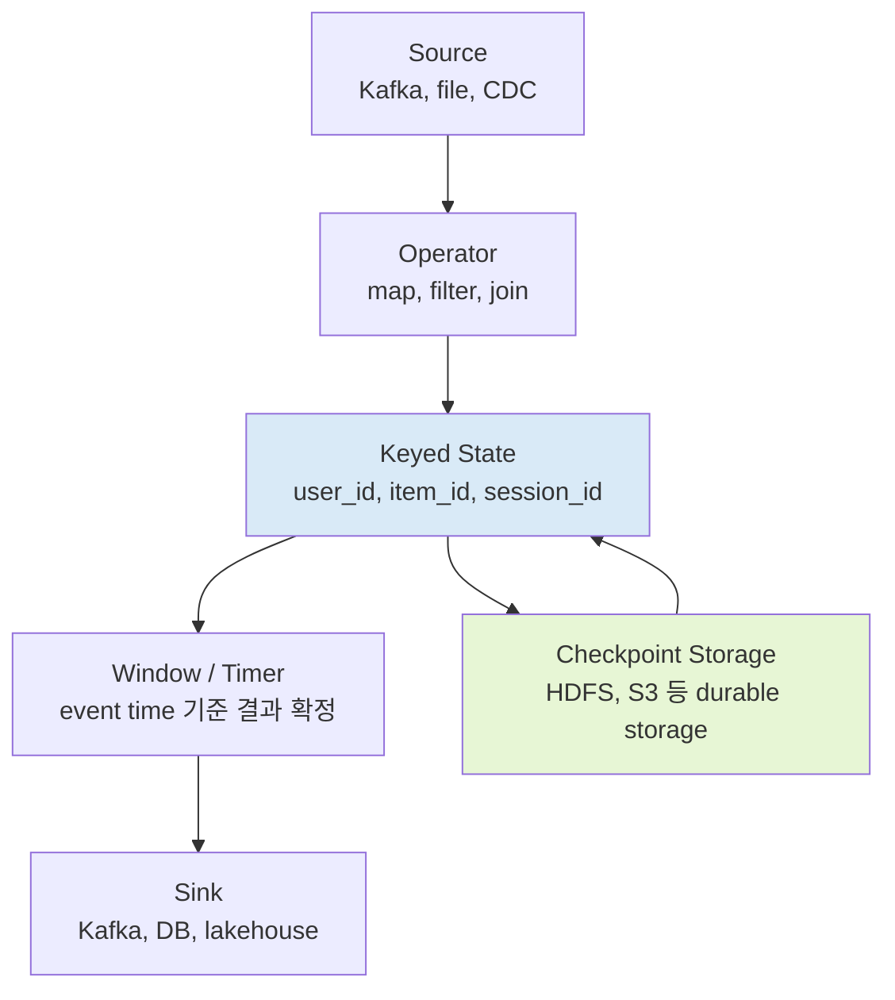

---
tags:
  - data_engineering
  - streaming
  - flink
  - distributed_system
aliases: ["Apache Flink", "Flink"]
---

# A) Apache Flink

Apache Flink는 **bounded stream과 unbounded stream을 같은 실행 모델로 처리하는 stateful stream processing engine** 이다. 파일이나 테이블처럼 끝이 있는 데이터도 stream으로 보고, Kafka topic처럼 끝없이 들어오는 데이터도 stream으로 본다.

그래서 Flink를 볼 때 핵심은 "빠른 batch engine인가?"가 아니라 "이벤트가 계속 들어오는 동안, key별 상태를 잃지 않고, event time 기준으로 결과를 언제 확정할 것인가?"이다.

[[Kafka]]가 event log를 오래 보관하고 전달하는 쪽에 가깝다면, Flink는 그 event를 읽어서 window aggregation, join, enrichment, alerting, feature 계산 같은 **계속 살아 있는 계산**을 수행한다. [[Apache Spark]]와도 겹치는 영역이 있지만, Flink의 기본 감각은 micro-batch보다 record-by-record streaming runtime에 더 가깝다.

2026년 6월 기준 공식 문서의 stable 버전은 Flink 2.3이며, Apache Flink 2.3.0은 2026-06-25에 release되었다. 2.3에서는 SQL changelog 변환, materialized table 개선, native S3 filesystem, watermark alignment 개선, recovery 중 checkpoint 지원 같은 운영/SQL 쪽 변화가 들어왔다.

# B) Flink가 풀려는 문제

실시간 데이터 처리는 단순히 "빨리 처리한다"로 끝나지 않는다. 실제로 어려운 부분은 다음 질문들이다.

1. 이벤트가 늦게 도착하면 이미 낸 집계 결과를 어떻게 수정할 것인가?
2. 장애가 나면 어디까지 처리했다고 보고 다시 시작할 것인가?
3. 사용자, 상품, 세션처럼 key별로 쌓인 상태를 어디에 저장하고 어떻게 scale-out할 것인가?
4. sink에 쓴 결과까지 exactly-once에 가깝게 맞출 수 있는가?

Flink는 이 문제를 **state + time + checkpoint** 조합으로 푼다.



그림에서 중요한 점은 state가 외부 DB에 매번 왕복하는 값이 아니라는 것이다. Flink operator는 key별 state를 TaskManager 쪽 local state로 들고 있고, checkpoint 시점에 durable storage로 snapshot을 남긴다.

# C) 핵심 모델

## C.1) Bounded Stream과 Unbounded Stream

Flink는 모든 데이터를 stream으로 본다.

| 구분 | 의미 | 예시 | 처리 감각 |
| --- | --- | --- | --- |
| Bounded stream | 시작과 끝이 있는 데이터 | 과거 로그 파일, 일 단위 partition | batch처럼 전체를 읽고 끝낼 수 있음 |
| Unbounded stream | 시작은 있지만 끝이 없는 데이터 | Kafka topic, click event, sensor event | 계속 실행되며 결과를 갱신해야 함 |

이 관점이 중요한 이유는 batch와 streaming을 완전히 다른 시스템으로 나누지 않아도 되기 때문이다. 같은 Table API/SQL 또는 DataStream API 위에서 입력이 bounded인지 unbounded인지에 따라 실행 전략이 달라진다.

## C.2) State

Flink에서 state는 operator가 여러 event에 걸쳐 기억해야 하는 값이다.

예를 들어 5분 단위 클릭 수를 집계한다면 아직 닫히지 않은 window의 누적 count가 state다. 사용자의 최근 행동 sequence를 보고 fraud pattern을 찾는다면 지금까지 관측된 event sequence가 state다. online feature를 만든다면 user_id별 최신 통계량이 state다.

가장 자주 보는 형태는 **keyed state**다. `keyBy(user_id)`처럼 stream을 key 기준으로 partitioning하면, 해당 key의 state는 같은 parallel subtask 안에서 local하게 갱신된다. 이 구조 덕분에 매 event마다 분산 transaction을 걸지 않고도 key 단위 일관성을 유지할 수 있다.

state가 커지면 state backend 선택이 중요해진다. Heap 기반 backend는 접근이 빠르지만 JVM heap과 GC 영향을 받는다. RocksDB 기반 backend는 serialization 비용 때문에 느릴 수 있지만 local disk를 활용해 memory보다 큰 state를 다루기 좋고 incremental checkpoint를 활용할 수 있다.

## C.3) Event Time과 Watermark

streaming에서 시간은 하나가 아니다.

| 시간 기준 | 의미 | 장점 | 주의점 |
| --- | --- | --- | --- |
| Processing time | operator가 실행되는 machine의 wall-clock 시간 | 단순하고 latency가 낮음 | 재처리, 지연, 장애 상황에서 결과가 흔들릴 수 있음 |
| Event time | event가 실제로 발생한 시간 | 늦게 도착한 event와 재처리에 강함 | watermark와 allowed lateness 설계가 필요함 |

실무에서는 "어제 10:00-10:05 사이의 클릭 수"처럼 event가 실제로 발생한 시간을 기준으로 보고 싶은 경우가 많다. 이때 Flink는 event timestamp를 추출하고, watermark로 "이 시각 이전 event는 대체로 도착했다고 보자"는 진행 신호를 보낸다.

watermark는 완벽한 정답 선언이 아니다. 너무 빠르게 밀면 late event가 많이 생기고, 너무 보수적으로 잡으면 window가 늦게 닫혀 latency가 커진다. 결국 watermark는 데이터 지연 분포와 비즈니스 허용 오차를 반영한 운영 파라미터다.

# D) Checkpoint와 Savepoint

Flink의 fault tolerance는 snapshot을 중심으로 이해하면 편하다.

| 개념 | 트리거 | 목적 | 실무 감각 |
| --- | --- | --- | --- |
| Checkpoint | Flink가 주기적으로 자동 수행 | 장애 복구 | 빠른 recovery를 위한 runtime 안전망 |
| Externalized checkpoint | 자동 checkpoint를 job 종료 후에도 보존 | 수동 복구 | 운영 사고 대응용으로 쓸 수 있음 |
| Savepoint | 사용자가 수동으로 생성 | upgrade, rescale, migration | 배포/버전 변경 전 의식적으로 남기는 기준점 |

checkpoint에는 operator state뿐 아니라 Kafka offset 같은 source position도 함께 들어간다. 장애가 나면 Flink는 마지막 성공 checkpoint로 state와 source position을 되돌린 뒤 다시 읽는다. 그래서 source는 replay가 가능해야 하고, checkpoint storage는 durable해야 한다. production에서는 JobManager heap보다 HDFS, S3 같은 외부 durable filesystem을 쓰는 구성이 일반적이다.

```java
StreamExecutionEnvironment env = StreamExecutionEnvironment.getExecutionEnvironment();

env.enableCheckpointing(60_000);
env.getCheckpointConfig().setCheckpointTimeout(10 * 60_000);
env.getCheckpointConfig().setMinPauseBetweenCheckpoints(30_000);
```

`exactly-once`라는 표현은 조심해서 읽어야 한다. Flink 내부 state의 exactly-once와 end-to-end exactly-once는 다르다. end-to-end로 맞추려면 source replay, checkpoint, sink commit protocol이 함께 맞아야 한다. 예를 들어 Kafka transaction sink나 two-phase commit이 가능한 sink는 맞추기 쉽지만, 일반 REST API 호출처럼 side effect가 바로 외부에 나가는 sink는 idempotency나 deduplication 설계를 따로 해야 한다.

# E) API를 어떻게 고를까

Flink는 추상화 수준이 여러 층이다.

| API | 잘 맞는 작업 | 장점 | 한계 |
| --- | --- | --- | --- |
| Flink SQL / Table API | streaming ETL, window aggregation, join, CDC pipeline | 선언적이고 optimizer를 활용하기 좋음 | 복잡한 custom state machine은 답답할 수 있음 |
| DataStream API | event-level transformation, custom window, custom state | state와 time을 더 직접 제어 가능 | SQL보다 코드량이 늘어남 |
| ProcessFunction | timer, side output, 복잡한 event-time logic | 가장 세밀한 제어 | 운영자가 읽기 어려운 job이 되기 쉬움 |
| PyFlink | Python 중심 팀의 pipeline | Python 생태계 접근성 | Java/Scala 대비 connector와 성능 경계를 확인해야 함 |

처음부터 ProcessFunction으로 내려가면 자유도는 높지만 운영 난도가 올라간다. SQL로 표현 가능한 pipeline은 SQL/Table API로 시작하고, 정말 event별 state machine이 필요할 때 DataStream API나 ProcessFunction으로 내려가는 편이 읽기 좋다.

# F) 운영에서 먼저 보는 것들

## F.1) State 크기와 backend

Flink job이 무거워지는 가장 흔한 이유는 CPU보다 state다. key cardinality, window 크기, join retention, late event 허용 시간, deduplication TTL이 state 크기를 만든다.

state가 작고 latency가 민감하면 heap 기반 backend가 단순할 수 있다. state가 크거나 window가 길고 recovery 비용이 중요하면 RocksDB backend와 incremental checkpoint를 검토한다. 다만 RocksDB는 serialization, compaction, local disk I/O가 성능 병목이 될 수 있으므로 metric을 같이 봐야 한다.

## F.2) Checkpoint가 성공하는가

checkpoint는 켜는 것보다 계속 성공하게 만드는 것이 어렵다. 체크할 항목은 다음과 같다.

1. checkpoint duration이 interval보다 길어지고 있지 않은가?
2. checkpoint storage가 병목이 되지 않는가?
3. backpressure 때문에 barrier가 늦게 전달되지 않는가?
4. state가 계속 증가하고 있지 않은가?
5. recovery time objective에 맞게 restore가 끝나는가?

Flink에서 "장애 복구가 된다"는 말은 마지막 checkpoint로 돌아갈 수 있다는 뜻이다. checkpoint가 계속 timeout되면 장애 복구 지점도 오래된 상태로 밀린다.

## F.3) Backpressure

streaming job은 한 operator가 느려지면 upstream까지 압력이 전파된다. sink가 느리거나, 특정 key에 skew가 있거나, RocksDB compaction이 밀리거나, network shuffle이 막히면 전체 pipeline latency가 늘어난다.

이때 parallelism만 올리는 것은 절반의 답이다. key skew가 원인이라면 특정 subtask만 계속 바쁠 수 있고, sink throughput이 원인이라면 upstream을 늘려도 마지막에서 막힌다. Flink Web UI의 backpressure, busy time, checkpoint metric을 같이 봐야 한다.

# G) Spark Streaming, Kafka Streams와 비교

| 도구 | 중심 문제 | 강한 영역 | 조심할 점 |
| --- | --- | --- | --- |
| Flink | 큰 state를 가진 continuous event processing | event time, stateful operator, complex streaming pipeline | 운영 튜닝 포인트가 많음 |
| [[Apache Spark]] Structured Streaming | Spark ecosystem 위의 streaming/batch 통합 | lakehouse batch와 streaming을 함께 다루기 좋음 | low-latency event-by-event 처리 감각은 Flink와 다름 |
| Kafka Streams | Kafka application 안의 lightweight stream processing | Kafka-native topology, embedded app | cluster-level resource management와 큰 state 운영은 별도 고민 필요 |

대략적으로, 이미 Spark 중심 lakehouse가 있고 latency 요구가 초 단위 이상이면 Spark Structured Streaming이 자연스러울 수 있다. Kafka topic 사이의 가벼운 변환이나 join을 app 안에 넣고 싶으면 Kafka Streams가 단순하다. 반대로 event time, 큰 keyed state, 복잡한 window/join, 별도 cluster에서 오래 살아 있는 streaming job이 중요하면 Flink를 검토할 이유가 커진다.

# H) Flink를 쓸 때의 감각

Flink는 "streaming SQL도 되는 빠른 engine" 정도로 보면 장점이 잘 안 보인다. 더 정확히는 **시간이 흐르는 동안 상태가 계속 변하는 계산을, 장애와 지연을 감안하면서 운영하는 runtime**이다.

그래서 Flink 설계의 출발점은 query가 아니라 state lifecycle이어야 한다.

1. key는 무엇인가?
2. state는 얼마나 커지는가?
3. event time 기준 결과는 언제 닫는가?
4. late event는 버릴 것인가, 보정할 것인가?
5. 장애 후 source와 sink까지 같은 의미로 복구되는가?
6. 배포/upgrade 시 savepoint로 상태를 이어갈 수 있는가?

이 질문에 답할 수 있으면 Flink job은 꽤 명확해진다. 반대로 이 질문이 흐릿하면 코드가 아무리 짧아도 운영에서 흔들린다.

# I) References

- [Apache Flink - Stateful Computations over Data Streams](https://flink.apache.org/)
- [Apache Flink Architecture](https://flink.apache.org/what-is-flink/flink-architecture/)
- [Apache Flink Concepts Overview](https://nightlies.apache.org/flink/flink-docs-stable/docs/concepts/overview/)
- [Apache Flink Stateful Stream Processing](https://nightlies.apache.org/flink/flink-docs-stable/docs/concepts/stateful-stream-processing/)
- [Apache Flink Timely Stream Processing](https://nightlies.apache.org/flink/flink-docs-stable/docs/concepts/time/)
- [Apache Flink Fault Tolerance](https://nightlies.apache.org/flink/flink-docs-stable/docs/learn-flink/fault_tolerance/)
- [Apache Flink Checkpointing](https://nightlies.apache.org/flink/flink-docs-stable/docs/dev/datastream/fault-tolerance/checkpointing/)
- [Apache Flink 2.3.0 Release Announcement](https://flink.apache.org/2026/06/25/apache-flink-2.3.0-release-announcement/)
