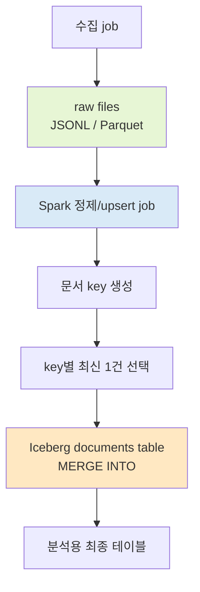
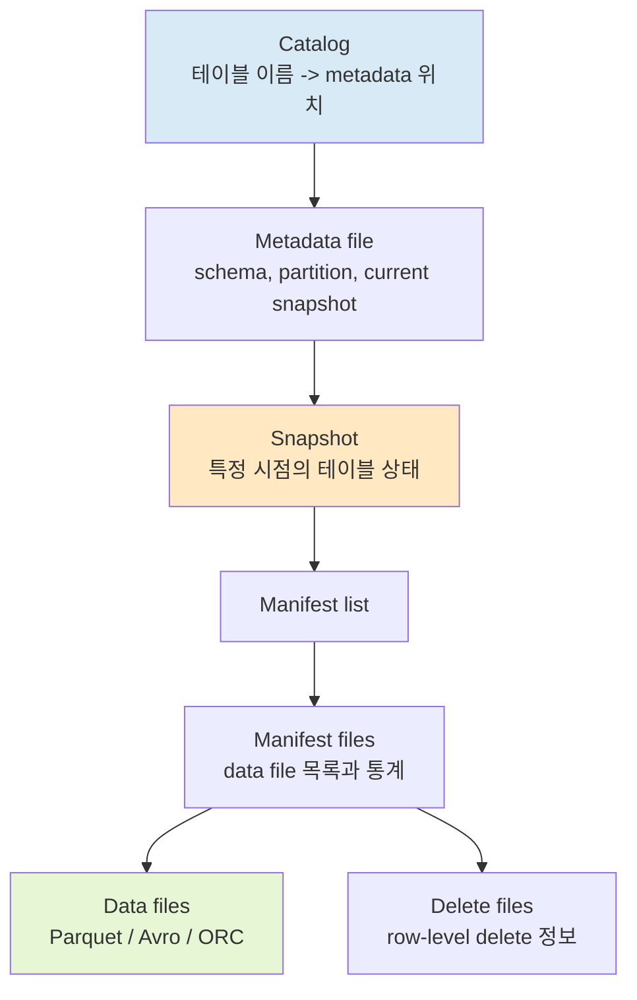

# A) Apache Iceberg

Apache Iceberg는 **대용량 분석 테이블을 파일 위에서 안전하게 관리하기 위한 open table format**이다.

여기서 중요한 말은 "테이블 포맷"이다. Iceberg는 [[HDFS]]나 S3처럼 파일을 저장하는 저장소도 아니고, [[Apache Spark]]나 [[Presto]]처럼 쿼리를 실행하는 엔진도 아니다. 파일 저장소 위에 있는 데이터를 여러 엔진이 같은 테이블처럼 읽고 쓰게 해 주는 규칙과 메타데이터 계층에 가깝다.

예를 들어 웹 문서 수집 결과가 HDFS에 jsonl 파일로 떨어졌다고 해 보자. HDFS 입장에서는 그냥 파일과 줄이다. 같은 문서가 두 번 들어와도 HDFS는 "중복 문서"라는 개념을 모른다.

반대로 Iceberg 테이블은 이 파일들을 테이블로 관리한다. Spark가 `MERGE INTO`를 실행하면, 같은 key를 가진 row를 갱신하거나 새 row를 넣는 식으로 최종 테이블 상태를 만들 수 있다.

짧게 말하면 다음과 같다.

| 구분 | 쉽게 말하면 | 예시 |
| --- | --- | --- |
| HDFS, S3 | 파일을 저장하는 창고 | jsonl, parquet 파일 저장 |
| Hive Metastore, Iceberg Catalog | 테이블 이름과 위치를 찾는 주소록 | `analytics.documents` |
| Iceberg | 파일 묶음을 테이블답게 관리하는 규칙 | snapshot, schema, partition, manifest |
| Spark, Trino, Flink | 테이블을 읽고 쓰는 실행 엔진 | `SELECT`, `MERGE INTO`, streaming write |

# B) 왜 필요한가

데이터 레이크에서는 보통 파일을 많이 쌓는다. 하루치 로그를 `dt=2026-07-03/hr=10` 같은 경로에 저장하고, Spark나 Hive가 그 파일을 읽는다.

처음에는 이 방식이 단순하다. 하지만 데이터가 커지고 여러 job이 동시에 읽고 쓰기 시작하면 문제가 생긴다.

1. 어떤 파일들이 현재 테이블의 최신 상태인지 알아야 한다.
2. 쓰는 도중 실패했을 때 절반만 반영된 상태를 피해야 한다.
3. schema가 바뀌어도 예전 데이터와 새 데이터를 같이 읽어야 한다.
4. partition 전략을 바꿔도 읽는 쪽 쿼리를 너무 많이 고치고 싶지 않다.
5. `UPDATE`, `DELETE`, `MERGE`처럼 row 수준 변경을 표현하고 싶다.

Iceberg는 이 문제를 **데이터 파일 + 메타데이터 + snapshot** 조합으로 푼다.

파일 자체는 여전히 HDFS나 S3 같은 저장소에 있다. Iceberg는 "현재 테이블은 어떤 data file들의 조합인가", "이전 snapshot은 무엇인가", "schema와 partition은 어떻게 변했는가"를 메타데이터로 관리한다.

# C) 예시로 먼저 보기

문서 수집 데이터를 테이블로 정리하는 일반적인 흐름을 보면 감이 잡힌다.



여기서 raw file은 원천 로그에 가깝다. 같은 웹 문서가 여러 번 들어갈 수 있다.

최종적으로 읽고 싶은 것은 raw file이 아니라 `documents` 같은 정리된 Iceberg 테이블이다. 이 테이블에 적재할 때 문서 key 기준으로 `MERGE INTO`를 쓰면, 같은 문서는 최신 수집 결과 1건으로 수렴시킬 수 있다.

단, Iceberg가 RDB의 primary key처럼 중복을 자동으로 막아 주는 것은 아니다. 중복을 어떻게 볼지는 writer가 정한 `MERGE` 조건에 달려 있다. 예를 들어 `ON t.document_id = s.document_id`로 merge하면 `document_id`가 같은 row를 같은 문서로 본다.

# D) Iceberg가 테이블을 보는 방식

Iceberg 테이블은 대략 이런 층으로 이해하면 된다.



사용자가 `SELECT * FROM table`을 실행하면 Spark나 Trino가 Iceberg metadata를 먼저 읽는다. 그 다음 현재 snapshot에 포함된 data file만 골라 읽는다.

이 구조 때문에 Iceberg는 다음을 할 수 있다.

| 기능 | 의미 |
| --- | --- |
| Snapshot | 특정 시점의 테이블 상태를 보존 |
| Time travel | 과거 snapshot 기준으로 읽기 |
| Schema evolution | column 추가, 이름 변경 같은 schema 변화 관리 |
| Partition evolution | partition 전략이 바뀌어도 테이블 단위로 관리 |
| Metadata pruning | 모든 파일을 열기 전에 metadata로 읽을 파일을 줄임 |
| Row-level operation | Spark 등에서 `MERGE`, `UPDATE`, `DELETE` 표현 |

# E) HDFS, Hive, Iceberg 차이

## E.1) HDFS

HDFS는 파일 시스템이다. 파일을 저장하고 나눠 보관한다. 어떤 row가 최신인지, 같은 key가 중복인지, schema가 바뀌었는지는 HDFS가 판단하지 않는다.

```text
/warehouse/raw/documents/dt=2026-07-03/hr=10/part-000.jsonl
```

이 경로에 같은 문서가 두 줄 있어도 HDFS는 그냥 두 줄을 저장한다.

## E.2) Hive

[[Hive]]는 HDFS 같은 분산 저장소 위 데이터를 SQL로 다루기 쉽게 만든 데이터 웨어하우스 계층이다. Hive table은 보통 metastore에 table schema와 location을 등록하고, 실제 데이터는 HDFS에 둔다.

다만 전통적인 Hive-style table은 파일과 partition을 기준으로 관리하는 감각이 강하다. row-level update나 partition evolution, 여러 엔진의 동시 write를 깔끔하게 다루려면 추가 설계가 필요하다.

## E.3) Iceberg

Iceberg는 파일을 테이블 snapshot으로 관리한다. 그래서 단순히 "이 경로의 파일을 읽는다"보다 "현재 snapshot이 가리키는 파일 집합을 읽는다"에 가깝다.

또 Spark, Trino, Flink 같은 여러 엔진이 같은 테이블을 읽고 쓸 수 있도록 table format을 표준화한다.

# F) MERGE INTO와 중복 처리

Iceberg 자체가 "이 컬럼은 primary key니까 중복 insert 금지"처럼 자동 제약을 걸어 주는 것은 아니다.

대신 Spark 같은 엔진에서 `MERGE INTO`를 실행하면 target table과 source data를 특정 조건으로 맞춰 보고, match 여부에 따라 update 또는 insert를 할 수 있다.

예시는 다음과 같다.

```sql
MERGE INTO iceberg.analytics.documents t
USING incoming_documents s
ON t.document_id = s.document_id
WHEN MATCHED AND s.updated_at > t.updated_at THEN UPDATE SET *
WHEN NOT MATCHED THEN INSERT *
```

이렇게 쓰면 의미는 단순하다.

| 상황 | 처리 |
| --- | --- |
| 같은 `document_id`가 target에 없음 | 새 row insert |
| 같은 `document_id`가 target에 있고 source가 더 최신 | 기존 row update |
| 같은 `document_id`가 target에 있고 source가 같거나 더 오래됨 | 기존 row 유지 |

그래서 최종 Iceberg 테이블에서 중복이 없다는 말은 보통 **writer가 정한 key 기준으로 최신 1건이 남도록 MERGE한다**는 뜻이다. Iceberg가 모든 중복을 자동으로 알아서 제거한다는 뜻은 아니다.

실무에서는 source 쪽도 먼저 dedup하는 편이 좋다. 하나의 target row에 여러 source row가 동시에 매칭되면 `MERGE`가 실패할 수 있기 때문이다. 그래서 `ROW_NUMBER() OVER (PARTITION BY document_id ORDER BY updated_at DESC)`처럼 source를 key별 최신 1건으로 줄인 뒤 merge한다.

# G) 언제 Iceberg를 쓰면 좋은가

Iceberg는 다음 상황에서 특히 잘 맞는다.

| 상황 | 왜 Iceberg가 맞나 |
| --- | --- |
| 데이터가 HDFS/S3에 크고 많이 쌓임 | 파일 기반 lakehouse 구조와 잘 맞음 |
| Spark, Trino, Flink 등 여러 엔진이 같은 테이블을 봄 | open table format으로 엔진 간 공유 가능 |
| overwrite보다 update/merge가 필요함 | row-level operation을 표현할 수 있음 |
| schema나 partition이 바뀔 가능성이 큼 | evolution을 metadata로 관리 |
| 과거 상태를 다시 봐야 함 | snapshot과 time travel 사용 가능 |
| 실패한 write가 테이블을 망가뜨리면 안 됨 | commit 단위로 table state 관리 |

반대로 단순히 작은 CSV 파일 몇 개를 읽는 정도라면 Iceberg는 과할 수 있다. Iceberg의 장점은 파일 수와 데이터 규모가 커지고, 여러 job과 엔진이 같은 데이터를 다루며, 테이블 상태를 안전하게 관리해야 할 때 나온다.

# H) 헷갈리기 쉬운 말

| 표현 | 정확한 감각 |
| --- | --- |
| "Iceberg에 저장한다" | 실제 파일은 HDFS/S3에 있고, Iceberg table metadata로 관리한다 |
| "Iceberg가 중복 제거한다" | 자동 PK 제약이 아니라 writer의 `MERGE` 조건으로 중복을 줄인다 |
| "HDFS 테이블" | HDFS는 파일 저장소이고, 테이블처럼 보이게 하는 것은 Hive/Iceberg 같은 계층이다 |
| "Snapshot" | 어느 시점의 테이블 파일 목록과 metadata 상태다 |
| "Catalog" | table 이름을 실제 metadata 위치로 찾아 주는 주소록이다 |
| "Manifest" | snapshot이 포함하는 data file들의 목록과 통계 정보다 |

# I) 한 줄 정리

Apache Iceberg는 HDFS/S3 위에 있는 파일들을 **분석 테이블처럼 안전하게 읽고 쓰기 위한 테이블 포맷**이다. HDFS가 원본 파일 창고라면, Iceberg는 그 파일들을 현재 테이블 상태, schema, snapshot, merge 규칙으로 관리하는 장부에 가깝다.

# J) Related

- [[HDFS]]
- [[Hive]]
- [[Apache Spark]]
- [[Presto]]
- [[Apache Flink]]
- [[data warehouse]]
- [[columnar storage]]

# K) References

- [Apache Iceberg - Introduction](https://iceberg.apache.org/docs/latest/)
- [Apache Iceberg Table Spec](https://iceberg.apache.org/spec/)
- [Apache Iceberg - Spark Writes](https://iceberg.apache.org/docs/latest/spark-writes/)
- [Apache Iceberg - Spark Queries](https://iceberg.apache.org/docs/latest/spark-queries/)
