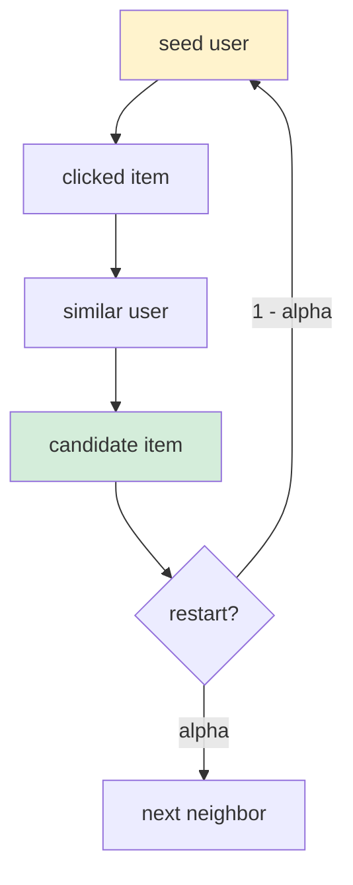

# A) Personalized PageRank ?

Personalized PageRank(PPR)는 [[retrieval/ranking/PageRank|PageRank]]에서 "다시 시작할 위치"를 특정 seed node 또는 seed set에 집중시키는 방법이다. global PageRank가 "전체 graph에서 중요한 node"를 찾는다면, PPR은 [[graph/random walk|random walk]] 를 통해 **특정 출발점 주변에서 가깝고 중요한 node** 를 찾는다.

추천 시스템에서는 이 차이가 중요하다. 전체 graph에서 유명한 item은 모든 사용자에게 비슷하게 높게 나올 수 있다. 반면 PPR은 특정 user에서 시작한 random walk가 자주 도착하는 item을 높게 평가하기 때문에, 개인화된 추천 후보를 만드는 데 쓰기 좋다.

# B) PageRank와 다른 점

PageRank의 기본식은 다음과 같다.

$$
x = \alpha P x + (1 - \alpha)v
$$

PPR도 수식은 같다. 차이는 $v$가 어디에서 다시 시작하도록 만들 것인가에 있다.

| 방법 | 다시 시작할 위치 $v$ | 해석 |
|---|---|---|
| PageRank | 전체 node에 거의 균등 | graph 전체에서 중요한 node |
| Topic-sensitive PageRank | 특정 topic page set에 집중 | topic별로 중요한 node |
| PPR | 특정 user, item, query, seed node에 집중 | seed 주변에서 중요한 node |

seed user $u$에 대한 PPR이라면 $v$는 다시 시작할 확률을 거의 $u$에 둔다. random walk는 graph를 따라 퍼지지만, 일정 확률로 계속 $u$ 근처로 돌아온다. 그래서 seed에서 멀리 떨어진 인기 node보다 seed 주변의 관련 node가 더 높게 나온다.

# C) Random Walk with Restart 관점

PPR은 Random Walk with Restart(RWR)로도 설명된다.

1. seed node에서 시작한다.
2. 확률 $\alpha$로 graph edge를 따라 이웃으로 이동한다.
3. 확률 $1 - \alpha$로 seed node에서 다시 시작한다.
4. 오래 반복했을 때 자주 방문한 node를 높은 순서로 정렬한다.



이 관점에서는 PPR score $\pi(s,t)$를 "출발 node $s$에서 시작한 random walk가 목표 node $t$에 도착할 가능성"으로 볼 수 있다.

# D) 추천에서 쓰는 방식

user와 item을 두 종류의 node로 두고, interaction을 edge로 연결하면 PPR은 다음과 같은 후보를 찾는다.

```text
user u
  -> u가 본 item
  -> 그 item을 본 다른 user
  -> 그 user들이 본 다른 item
```

이 흐름은 [[recommendation_system/collaborative filtering|collaborative filtering]]과 닮아 있다. 다만 embedding을 학습하지 않고, graph 위를 걸어 다니며 가까운 item을 찾는다는 점이 다르다.

추천 후보 생성에서 PPR을 쓰는 흔한 패턴은 다음과 같다.

1. user-item graph를 만든다.
2. edge weight를 클릭, 구매, 체류 시간 같은 interaction 강도로 둔다.
3. 각 user에 대해 top-k PPR item을 계산한다.
4. 이미 본 item, 품절 item, policy 위반 item을 filter한다.
5. ranking model에 candidate로 넘긴다.

PPR은 특히 cold-start가 완전히 심하지 않고 interaction graph가 어느 정도 쌓여 있을 때 강하다. content feature 없이도 graph를 통해 "비슷한 사용자가 이어서 본 item"을 끌어올 수 있기 때문이다.

# E) Hyperparameter와 설계 선택

| 선택지 | 의미 | 실무 영향 |
|---|---|---|
| $\alpha$ | restart하지 않고 walk를 계속할 확률 | 클수록 멀리 퍼지고, 작을수록 seed 주변에 머묾 |
| seed distribution | user 하나, 여러 item, topic set 등 | 어디에서 출발할지가 달라짐 |
| edge direction | user-to-item, item-to-user, bidirectional | score의 의미가 달라짐 |
| edge weight | click, purchase, dwell time, recency 등 | 약한/강한 signal 반영 방식 결정 |
| top-k size | 후보로 가져올 item 수 | recall과 serving 비용의 trade-off |

보통 추천에서는 $\alpha$를 너무 크게 두면 인기 item 쪽으로 퍼지고, 너무 작게 두면 seed 주변만 반복해서 다양성이 부족해진다. 따라서 offline metric뿐 아니라 coverage, novelty, popularity bias도 같이 본다.

# F) 계산 비용

PPR은 출발 node마다 다른 score를 계산해야 하므로 정확히 계산하려면 비용이 크다. 모든 user에 대해 전체 item score를 저장하면 graph가 커질수록 메모리와 업데이트 비용이 커진다.

대규모 환경에서는 다음 근사 기법을 고려한다.

| 접근 | 아이디어 | 적합한 상황 |
|---|---|---|
| Monte Carlo random walk | 짧은 random walk를 많이 샘플링 | 구현이 단순하고 병렬화 쉬움 |
| Forward push | 출발 node에서 확률을 필요한 만큼만 밀어 보냄 | 한 user의 top-k 후보 계산 |
| Reverse push | 목표 node에서 거꾸로 영향권을 계산 | 특정 item을 좋아할 user 탐색 |
| Precompute + cache | 주요 user/item seed의 PPR vector 저장 | graph update가 느리고 query latency가 중요할 때 |

실시간 추천에서는 정확한 PPR보다 근사 PPR이 훨씬 현실적이다. 뒤에 ranking model이 한 번 더 걸러주기 때문에, 후보 생성 단계의 목표는 완벽한 score가 아니라 좋은 후보를 충분히 빠르게 많이 가져오는 것이다.

# G) PageRank, PPR, LightGCN의 관계

PPR과 [[recommendation_system/LightGCN|LightGCN]]은 모두 graph를 따라 user/item signal을 퍼뜨린다는 점에서 닮았다.

차이는 학습 여부다. PPR은 이동 규칙과 restart 확률만으로 score를 계산하는 graph 알고리즘이다. LightGCN은 user/item embedding을 학습하고, 이웃 embedding을 여러 층에 걸쳐 섞는다.

그래서 PPR은 학습 전 baseline이나 후보 생성기로 좋고, LightGCN은 interaction pattern을 embedding으로 압축해 retrieval/ranking에 쓰기 좋다. 실제 시스템에서는 PPR 후보와 embedding retrieval 후보를 함께 섞어 후보 출처를 다양하게 만들 수 있다.

# H) References

- David F. Gleich, "PageRank Beyond the Web", 2015. https://arxiv.org/abs/1407.5107
- Hanzhi Wang et al., "Personalized PageRank to a Target Node, Revisited", KDD 2020. https://arxiv.org/abs/2006.11876
- Sibo Wang et al., "Efficient Algorithms for Approximate Single-Source Personalized PageRank Queries", 2019. https://arxiv.org/abs/1908.10583
