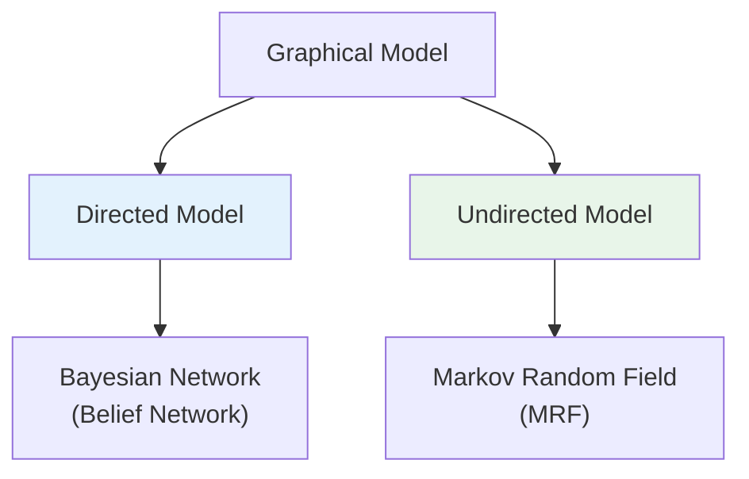
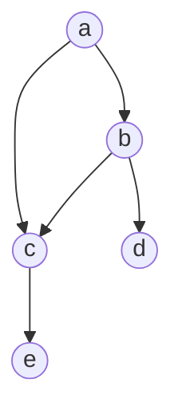
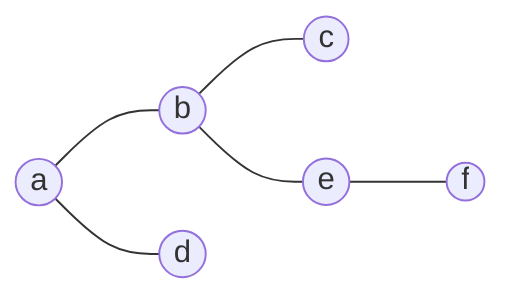

# A) 핵심 요약

**Graphical Model (확률 그래프 모델)**: 확률 분포를 그래프 구조로 표현하는 방법. 노드는 랜덤 변수, 엣지는 변수 간 의존 관계를 나타낸다.

# B) 기본 개념

## B.1) 왜 Graphical Model인가?

| 문제 | Graphical Model 해결책 |
|------|----------------------|
| 고차원 확률 분포 표현 | 조건부 독립성으로 분해 |
| 복잡한 의존 관계 시각화 | 그래프로 직관적 표현 |
| 효율적인 추론 | 그래프 구조 활용한 알고리즘 |

## B.2) 두 가지 종류



| 종류 | 별칭 | 엣지 | 특징 |
|------|------|------|------|
| **Directed** | Bayesian Network, Belief Network | 방향 있음 (→) | 인과 관계 표현 |
| **Undirected** | Markov Random Field (MRF) | 방향 없음 (—) | 상호 연관 표현 |

# C) Directed Model (Bayesian Network)

## C.1) 핵심 아이디어

방향 있는 비순환 그래프 (DAG)로 확률 분포를 인수분해:

$$p(\mathbf{x}) = \prod_{i} p\left(x_i \mid Pa(x_i)\right)$$

- $Pa(x_i)$: 노드 $x_i$의 **부모 노드들**
- $p(x_i \mid Pa(x_i))$: **지역 조건부 확률** (Local Conditional Probability)

## C.2) 예시



$$p(a,b,c,d,e) = p(a) \cdot p(b|a) \cdot p(c|a,b) \cdot p(d|b) \cdot p(e|c)$$

| 노드 | 부모 | 조건부 확률 |
|------|------|------------|
| a | 없음 | $p(a)$ |
| b | a | $p(b \mid a)$ |
| c | a, b | $p(c \mid a, b)$ |
| d | b | $p(d \mid b)$ |
| e | c | $p(e \mid c)$ |

## C.3) 특징

- **인과 관계** 표현에 적합
- 부모 → 자식 방향으로 확률 흐름
- 조건부 독립성 쉽게 파악 (d-separation)

# D) Undirected Model (Markov Random Field)

## D.1) 핵심 아이디어

방향 없는 그래프로 확률 분포를 인수분해:

$$p(\mathbf{x}) = \frac{1}{Z} \prod_{\mathcal{C} \in \mathcal{G}} \phi(\mathcal{C})$$

| 기호 | 의미 |
|------|------|
| $\mathcal{C}$ | **Clique** (완전 연결된 노드 부분집합) |
| $\phi(\mathcal{C})$ | **Potential Function** (비음수 함수) |
| $Z$ | **Partition Function** (정규화 상수) |

## D.2) Clique란?

```
Clique: 그래프에서 모든 노드가 서로 연결된 부분집합

예시:
  A --- B
  |     |
  D --- C

Cliques: {A,B}, {B,C}, {C,D}, {A,D}
Maximal Clique: {A,B}, {B,C}, {C,D}, {A,D} (더 확장 불가)
```

## D.3) 예시



$$p(a,b,c,d,e,f) = \frac{1}{Z} \phi_{ab}(a,b) \cdot \phi_{bc}(b,c) \cdot \phi_{ad}(a,d) \cdot \phi_{be}(b,e) \cdot \phi_{ef}(e,f)$$

## D.4) Potential Function의 의미

- $\phi(\mathcal{C})$: 해당 clique의 변수들이 특정 상태에 있을 **친화도 (affinity)**
- 확률이 아님 → 정규화 필요 ($Z$로 나눔)
- 값이 클수록 해당 상태가 더 선호됨

# E) Directed vs Undirected 비교

| 항목 | Directed (Bayesian Network) | Undirected (MRF) |
|------|----------------------------|------------------|
| **엣지** | 방향 있음 (→) | 방향 없음 (—) |
| **분해** | 조건부 확률 곱 | Potential 함수 곱 |
| **정규화** | 자동 (확률 곱) | 필요 ($Z$ 계산) |
| **표현** | 인과 관계 | 상호 연관 |
| **예시** | 질병-증상 관계 | 이미지 픽셀 연관 |

# F) 응용 분야

| 분야 | 모델 | 예시 |
|------|------|------|
| **자연어 처리** | HMM, CRF | 품사 태깅, 개체명 인식 |
| **컴퓨터 비전** | MRF | 이미지 분할, 노이즈 제거 |
| **의료** | Bayesian Network | 질병 진단 |
| **추천 시스템** | Factor Graph | 협업 필터링 |

# G) Related

- [[Bayesian network]]
- [[conditional probability]]
- [[Markov chain]]
- [[Hidden Markov Model]]

# H) References

- Deep Learning Book, Chapter 16: Structured Probabilistic Models
- Pattern Recognition and Machine Learning (Bishop), Chapter 8
