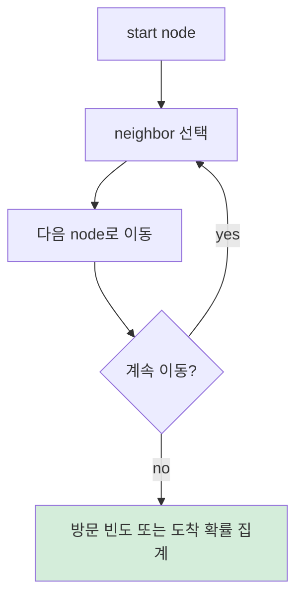

# A) Random Walk ?

Random walk는 graph 위에서 현재 node의 이웃 중 하나를 확률적으로 선택해 이동하는 과정이다. graph의 node를 state로 보고, edge를 이동 경로로 보면 [[RL/Markov Chain|Markov Chain]]의 한 형태로 이해할 수 있다.

Graph algorithm에서 random walk가 중요한 이유는 **몇 단계 떨어진 관계도 점수로 표현할 수 있기 때문** 이다. 직접 연결된 이웃만 보는 것이 아니라, 여러 step을 이동하면서 자주 도달하는 node를 "가깝다" 또는 "관련 있다"고 볼 수 있다.

# B) 기본 흐름



edge weight가 없는 graph에서는 이웃을 균등하게 선택한다. edge weight가 있는 graph에서는 weight가 큰 edge를 더 자주 선택하도록 확률을 만든다. 이때 많은 edge 중 하나를 빠르게 뽑아야 하면 [[statistic/Alias Method|Alias Method]] 같은 기법이 쓰일 수 있다.

# C) PageRank와의 관계

[[retrieval/ranking/PageRank|PageRank]]는 random walk에 teleportation을 추가한 알고리즘이다. 사용자는 확률 $\alpha$로 link를 따라 이동하고, 확률 $1-\alpha$로 임의의 node로 이동한다.

[[graph/PPR|Personalized PageRank]]는 다시 시작할 위치를 특정 seed node에 집중시킨다. 그래서 graph 전체에서 중요한 node보다 seed 주변에서 중요한 node를 찾는 데 적합하다.

# D) 추천에서의 의미

추천 시스템에서는 user-item graph 위의 random walk가 "비슷한 user가 같이 본 item" 같은 관계를 찾아준다.

```text
user -> item -> similar user -> candidate item
```

이 경로를 따라 자주 도달하는 item은 seed user와 graph 위에서 가까운 item이다. 그래서 random walk 계열 방법은 추천 후보 생성, graph 기반 collaborative filtering, cross-domain recommendation에서 자주 등장한다.

# E) References

- David F. Gleich, "PageRank Beyond the Web", 2015. https://arxiv.org/abs/1407.5107
