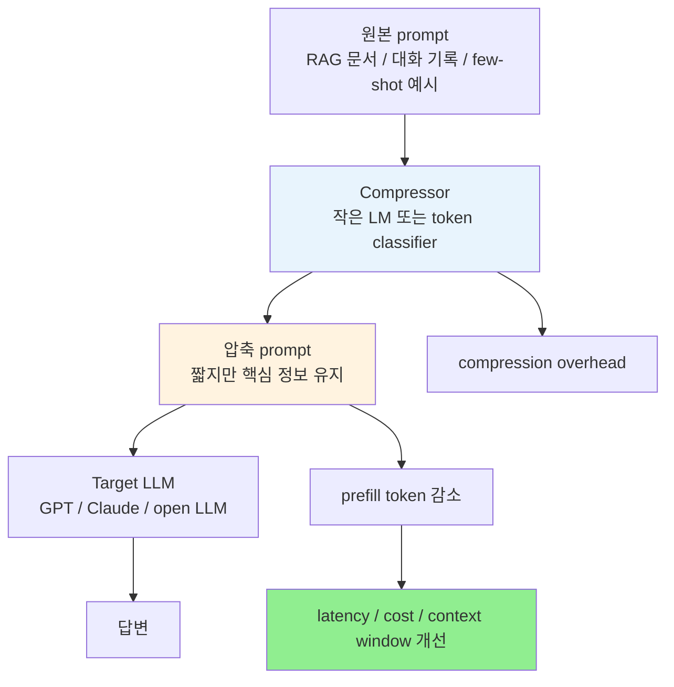

# A) 한줄 요약

**LLMLingua** 는 긴 prompt에서 덜 중요한 token을 제거해 [[Large Language Model|LLM]] 입력을 짧게 만드는 prompt compression 계열 방법이다. 모델 파라미터를 건드리지 않고 **일반 텍스트 prompt를 더 짧은 텍스트 prompt로 바꾼다** 는 점이 핵심이다. 그래서 GPT 계열 API처럼 내부 activation이나 embedding에 접근할 수 없는 black-box LLM에도 붙일 수 있다.

실무적으로는 [[Retrieval-Augmented Generation|RAG]], 긴 대화 기록, meeting transcript, code context, CoT, few-shot ICL처럼 입력이 길어지는 곳에서 쓴다. 목표는 단순히 token 수를 줄이는 것이 아니라, [[Prefill]] 시간, 입력 token 비용, context window 압박을 줄이면서 답변 품질은 최대한 유지하는 것이다.

다만 LLMLingua는 **lossy compression** 이다. 압축된 prompt는 사람이 읽기에 깨진 문장처럼 보일 수 있고, 중요한 숫자나 조건이 빠지면 답변도 틀어진다. 또 compression model을 먼저 돌리는 시간이 있으므로, 짧은 prompt에서는 오히려 전체 latency가 늘 수 있다.

# B) 왜 필요한가

LLM inference 비용은 output token만으로 결정되지 않는다. 긴 prompt를 넣으면 모델은 먼저 input token 전체를 읽고 [[KV Cache]]를 만든다. 이 구간이 [[Prefill]] 이고, RAG나 agent처럼 context를 많이 붙이는 서비스에서는 첫 token이 늦게 나오는 주요 원인이 된다.

```text
긴 prompt
-> prefill 비용 증가
-> TTFT 증가
-> input token 과금 증가
-> context window 압박 증가
```

prompt compression은 이 문제를 입력 쪽에서 푼다. model quantization, pruning, speculative decoding처럼 모델 실행 자체를 바꾸는 대신, **모델에 넣기 전 prompt를 더 정보 밀도 높은 형태로 줄인다**.



LLMLingua가 흥미로운 지점은 압축 결과가 꼭 자연어 문장일 필요는 없다는 데 있다. 사람에게는 어색한 "키워드 뭉치"처럼 보여도, LLM이 답변에 필요한 단서를 복원할 수 있으면 충분하다. 즉, 사람이 읽기 좋은 요약이 아니라 **LLM이 읽기 좋은 압축문** 을 만드는 문제에 가깝다.

# C) LLMLingua 원 논문의 핵심 아이디어

원래의 LLMLingua는 Microsoft 연구진이 EMNLP 2023에서 발표한 방법이다. 논문 제목은 *LLMLingua: Compressing Prompts for Accelerated Inference of Large Language Models* 이다.

핵심 가정은 단순하다.

> 작은 언어 모델이 쉽게 예측하는 token은 정보량이 낮을 가능성이 크고, 예측하기 어려운 token은 더 중요한 정보일 가능성이 크다.

이를 [[perplexity]] 관점으로 보면, 낮은 perplexity token은 제거 후보가 되고 높은 perplexity token은 보존 후보가 된다. 예를 들어 "하늘은 매우" 다음에 "푸르다"가 올 가능성은 높다. 이런 표현은 문장을 자연스럽게 만들지만, task를 푸는 데 꼭 필요한 정보는 아닐 수 있다. 반대로 날짜, 수치, 고유명사, 질문 조건처럼 예측하기 어려운 token은 남겨야 할 가능성이 높다.

LLMLingua는 이 아이디어를 바로 token 단위 삭제로만 밀어붙이지 않는다. 세 단계로 나눠 안정성을 높인다.

## C.1) Budget Controller

prompt는 보통 지시문, few-shot 예시, 실제 질문, 검색 문서처럼 성격이 다른 덩어리로 구성된다. 이 덩어리들을 같은 비율로 줄이면 중요한 질문이나 지시문까지 과하게 사라질 수 있다.

그래서 LLMLingua는 먼저 전체 compression budget을 구성 요소별로 나눈다.

| 구성 요소 | 일반적인 중요도 | 압축 방향 |
| --- | --- | --- |
| Instruction | 높음 | 많이 보존 |
| Question | 높음 | 많이 보존 |
| Demonstrations / Examples | 중간 또는 낮음 | 중복 예시를 더 많이 제거 |
| Retrieved context | query 관련성에 따라 다름 | 관련 없는 문장이나 문서를 제거 |

few-shot 예시가 여러 개라면 token을 조금씩 깎기보다, 예시 단위로 먼저 솎아내는 편이 의미 보존에 유리할 수 있다. LLMLingua의 coarse-grained compression은 이 역할을 한다.

## C.2) Iterative Token-Level Compression

두 번째 단계에서는 남은 텍스트를 token 단위로 압축한다. 작은 language model이 각 token의 perplexity를 계산하고, 중요도가 낮다고 판단한 token을 제거한다.

여기서 "iterative"가 중요하다. token 하나를 제거하면 주변 문맥이 달라지고, 다른 token의 중요도도 바뀐다. 그래서 LLMLingua는 한 번에 모든 token 점수를 고정해 버리지 않고, segment 단위로 압축 결과를 이어 붙이면서 조건부 확률을 다시 반영한다.

결과는 사람이 읽는 문장으로는 이상할 수 있다.

```text
원본:
Please answer the question based on the following documents.
Document 1 says that the contract was signed in Seoul on May 3, 2024.

압축 예시:
answer question documents contract signed Seoul May 3 2024
```

문법은 사라졌지만, 질문에 필요한 핵심 단서는 남아 있다. LLMLingua가 노리는 것은 바로 이 지점이다.

## C.3) Distribution Alignment

압축을 담당하는 작은 모델과 최종 답변을 만드는 target LLM은 다르다. 작은 모델 기준으로 중요해 보이는 token이 GPT-4나 Claude 기준에서도 중요하리라는 보장은 없다.

LLMLingua는 이 간극을 줄이기 위해 instruction tuning을 사용한다. target LLM이 생성한 데이터를 이용해 작은 compressor model을 조정하고, 작은 모델이 target LLM의 정보 선호를 더 잘 흉내 내게 만든다. 논문에서는 이를 distribution alignment로 설명한다.

# D) LongLLMLingua: 긴 context와 RAG를 겨냥한 변형

**LongLLMLingua** 는 ACL 2024 논문으로, 원래 LLMLingua를 long-context 상황에 맞게 확장한 방법이다. 여기서 핵심 문제는 단순히 prompt가 길다는 것이 아니다. 긴 context에서는 중요한 정보가 중간에 묻히는 **lost in the middle** 현상과, 관련 없는 문서가 prompt budget을 잡아먹는 문제가 같이 생긴다.

LongLLMLingua는 질문을 압축 기준에 더 적극적으로 넣는다. RAG에서 질문이 주어졌다면, 모든 문장을 일반적인 정보량 기준으로 보는 것보다 **이 질문에 답하는 데 필요한 문장인가** 를 보는 편이 낫다.

주요 아이디어는 세 가지다.

1. **Question-aware coarse-grained compression**: 문서나 문단을 질문과의 관련성 기준으로 먼저 고른다.
2. **Dynamic compression ratio**: 모든 문서를 같은 비율로 줄이지 않고, 더 중요한 문서에는 더 많은 token budget을 준다.
3. **Document reordering / subsequence recovery**: 중요한 정보가 LLM이 잘 보는 위치에 오도록 재배치하고, 압축 때문에 깨진 subsequence를 원문 기반으로 복원한다.

NaturalQuestions 실험에서는 GPT-3.5-Turbo에서 약 4배 적은 token으로 성능을 최대 21.4% 끌어올렸다고 보고한다. LooGLE에서는 비용을 94.0% 줄였고, 약 10k token prompt를 2x-6x로 압축할 때 end-to-end latency를 1.4x-2.6x 개선했다고 보고한다.

여기서 중요한 해석은 "압축했는데도 성능이 덜 떨어졌다"가 아니다. 긴 prompt에서는 관련 없는 정보와 위치 bias가 오히려 답변을 방해할 수 있다. 잘 압축하고 잘 재배치하면, LLM이 핵심 정보를 더 잘 볼 수 있어 성능이 오를 수도 있다.

# E) LLMLingua-2: perplexity 대신 token classification

**LLMLingua-2** 는 ACL Findings 2024 논문으로, 원래 LLMLingua의 perplexity 기반 압축을 더 빠르고 일반화하기 쉬운 방식으로 바꾼다.

원 논문의 한계는 두 가지다.

1. causal language model의 perplexity는 왼쪽 문맥 위주라 bidirectional context를 충분히 보지 못한다.
2. perplexity가 prompt compression objective와 완전히 일치하는 지표는 아니다.

LLMLingua-2는 prompt compression을 **preserve / discard token classification** 문제로 바꾼다. GPT-4로 extractive compression 데이터를 만들고, 이를 품질 필터링한 뒤, Transformer encoder가 각 token을 남길지 버릴지 예측하게 학습한다.

```text
원본 prompt token
-> encoder model
-> token별 preserve probability
-> 상위 token 보존
-> 원래 순서대로 압축 prompt 구성
```

encoder를 쓰기 때문에 양방향 문맥을 볼 수 있고, inference도 decoder 기반 perplexity 계산보다 빠르다. 논문은 LLMLingua-2가 기존 prompt compression 방법보다 3x-6x 빠르고, 2x-5x compression ratio에서 end-to-end latency를 1.6x-2.9x 개선한다고 보고한다.

단, LLMLingua-2는 기본적으로 task-agnostic compression에 강하다. 질문이 명확한 RAG에서는 LongLLMLingua처럼 query-aware ranking과 함께 쓰는 편이 더 자연스럽다. LLMLingua-2 논문도 원래 LLMLingua의 budget controller에 token-classification compressor를 끼워 넣을 수 있다고 설명한다.

# F) 세 변형 비교

| 방법 | 압축 기준 | compressor | 잘 맞는 상황 | 주의점 |
| --- | --- | --- | --- | --- |
| LLMLingua | perplexity 기반 token pruning | GPT-2, LLaMA 계열 작은 decoder LM | CoT, ICL, 대화, 일반 긴 prompt | compressor가 무거우면 overhead가 커짐 |
| LongLLMLingua | 질문 인식 + 동적 문서/문장 압축 | LLaMA-2 계열 compressor | RAG, multi-document QA, long context | query가 있어야 장점이 뚜렷함 |
| LLMLingua-2 | preserve/discard token classification | XLM-R, mBERT, BERT 계열 encoder | task-agnostic compression, 빠른 압축 | 압축도 여전히 lossy라 검증 필요 |

한 줄로 정리하면, **LLMLingua는 원형**, **LongLLMLingua는 RAG/long-context 특화**, **LLMLingua-2는 더 빠른 general-purpose compressor** 에 가깝다.

# G) 실무에서 쓸 때의 판단 기준

LLMLingua를 도입할지는 "압축률이 높다"만 보고 결정하면 안 된다. 실제 이득은 아래 부등식에 달려 있다.

```text
compression overhead < 줄어든 prompt로 절약한 prefill / API latency / 비용
```

2026년 ECIR 논문 *Prompt Compression in the Wild* 는 이 점을 실측으로 강조한다. prompt 길이, compression ratio, hardware가 잘 맞으면 LLMLingua 계열이 end-to-end latency를 최대 18% 줄였고 품질도 통계적으로 유지됐다. 반대로 짧은 prompt나 맞지 않는 환경에서는 compression step 자체가 이득을 잡아먹었다. 이 논문은 5k token을 넘는 긴 prompt에서 이득이 커지고, GPU memory도 최대 75% 줄 수 있다고 보고한다.

그래서 실무에서는 아래처럼 판단하는 편이 좋다.

| 상황 | 추천 |
| --- | --- |
| prompt가 짧고 output이 긴 chat | 대체로 비추천. decode가 병목일 가능성이 큼 |
| RAG context가 길어 TTFT가 커짐 | 추천 후보. LongLLMLingua 또는 LLMLingua-2 평가 |
| API input token 비용이 크고 품질 손실을 감수할 수 있음 | 추천 후보 |
| 숫자, 날짜, 계약 조건, citation이 매우 중요함 | 낮은 compression ratio부터 검증 |
| compressor를 7B 모델로 돌려야 하는데 GPU 여유가 없음 | LLMLingua-2-small 또는 단순 retrieval filtering과 비교 |
| long-context LLM이 이미 충분히 빠르고 정확함 | 실제 latency/cost 측정 전까지 보류 |

# H) RAG에 붙일 때의 패턴

RAG에서 LLMLingua를 쓰는 기본 흐름은 다음과 같다.

```text
query
-> retrieve top-k documents
-> rerank / filter
-> selected context 압축
-> compressed context + question을 target LLM에 입력
-> answer 생성
```

여기서 중요한 것은 citation과 원문 추적이다. 압축된 prompt는 원문 일부가 삭제된 텍스트이므로, 답변의 출처를 압축 prompt 자체로만 잡으면 위험하다. production에서는 압축 전 원문 document id, chunk id, span metadata를 유지해야 한다.

실무적으로는 아래 지표를 같이 봐야 한다.

1. answer correctness
2. citation faithfulness
3. compression time
4. target LLM TTFT
5. end-to-end latency
6. input token cost
7. compression ratio adherence

특히 RAG에서는 "관련 문서를 얼마나 잘 찾았는가"와 "찾은 문서를 얼마나 잘 줄였는가"가 섞인다. 그래서 [[Re-ranking]] 품질, [[Context Precision]], 최종 answer quality를 함께 봐야 한다.

# I) xRAG와의 차이

[[xRAG]]도 RAG context를 줄이는 방법이지만 접근이 다르다.

| 구분 | LLMLingua | xRAG |
| --- | --- | --- |
| 압축 형태 | 짧아진 텍스트 prompt | 문서 embedding을 특수 token처럼 사용 |
| target LLM 수정 | 보통 불필요 | LLM이 embedding token을 이해하도록 학습 필요 |
| black-box API 호환 | 높음 | 낮음 |
| 장점 | 기존 RAG pipeline에 붙이기 쉬움 | 극단적인 token 절감 가능 |
| 단점 | lossy text pruning, overhead 존재 | 모델 학습/수정 필요 |

black-box API나 hosted LLM을 쓰는 서비스에서는 LLMLingua가 훨씬 붙이기 쉽다. 반대로 모델을 직접 학습하고 serving할 수 있다면 xRAG처럼 representation-level compression도 비교할 만하다.

# J) 간단한 사용 예시

공식 구현은 `llmlingua` Python package로 제공된다.

```python
from llmlingua import PromptCompressor

compressor = PromptCompressor()

result = compressor.compress_prompt(
    prompt,
    instruction="Answer the question using the provided context.",
    question=question,
    target_token=200,
)

compressed_prompt = result["compressed_prompt"]
```

LongLLMLingua 계열 옵션을 쓸 때는 `question`, `condition_in_question`, `reorder_context`, `dynamic_context_compression_ratio`, `rank_method` 같은 설정을 함께 둔다. 실제 서비스에서는 압축 결과만 보지 말고 `origin_tokens`, `compressed_tokens`, `ratio`, compression latency를 로그로 남기는 편이 좋다.

# K) 실무적 결론

LLMLingua는 "긴 prompt를 더 싼 prompt로 바꾸는 요약기"가 아니다. 더 정확히는 **LLM이 답변하는 데 필요한 token만 남기려는 lossy input optimizer** 다.

잘 맞는 곳에서는 RAG context를 줄이고, TTFT를 낮추고, input token 비용을 줄인다. LongLLMLingua처럼 질문 기준으로 문서를 다시 압축하면 long-context LLM의 position bias까지 완화할 수 있다.

하지만 모든 prompt에 무작정 붙일 기술은 아니다. 짧은 prompt, 정밀한 citation, 숫자/조건이 많은 업무, compressor overhead가 큰 환경에서는 이득이 사라지거나 답변 품질이 떨어질 수 있다. 도입 기준은 "압축률"이 아니라 **원본 대비 품질, 전체 latency, 비용, memory를 함께 본 break-even point** 여야 한다.

LLMLingua 이후의 흐름은 token pruning에서 끝나지 않는다. query-aware RAG compression, generative rewrite, gist token과 memory slot 기반 soft compression까지 넓어지고 있으며, 큰 그림은 [[Prompt Compression Trends|Prompt Compression Trends - From Token Pruning to Context Engineering]]에서 따로 정리한다.

# References

- [[Prompt Compression Trends|Prompt Compression Trends - From Token Pruning to Context Engineering]]
- Jiang et al., [LLMLingua: Compressing Prompts for Accelerated Inference of Large Language Models](https://aclanthology.org/2023.emnlp-main.825/) (EMNLP 2023)
- Jiang et al., [LongLLMLingua: Accelerating and Enhancing LLMs in Long Context Scenarios via Prompt Compression](https://aclanthology.org/2024.acl-long.91/) (ACL 2024)
- Pan et al., [LLMLingua-2: Data Distillation for Efficient and Faithful Task-Agnostic Prompt Compression](https://aclanthology.org/2024.findings-acl.57/) (Findings of ACL 2024)
- Microsoft, [LLMLingua Series project page](https://llmlingua.com/)
- Microsoft, [microsoft/LLMLingua](https://github.com/microsoft/LLMLingua)
- Kummer et al., [Prompt Compression in the Wild: Measuring Latency, Rate Adherence, and Quality for Faster LLM Inference](https://arxiv.org/abs/2604.02985) (ECIR 2026)
- [[Prompt Compression]]
- [[Prefill]]
- [[Retrieval-Augmented Generation]]
