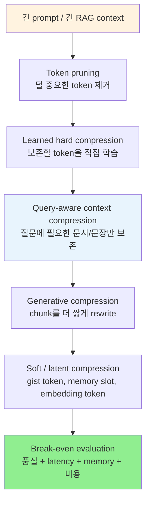

# A) 한줄 요약

2026년 7월 기준으로 "문장 압축"은 예전처럼 사람이 읽기 좋은 짧은 문장을 만드는 기술이라기보다, [[Large Language Model|LLM]]이 답하는 데 필요한 정보만 남겨 **context budget, [[Prefill]] latency, input token 비용, [[KV Cache]] memory를 관리하는 기술** 로 발전하고 있다.

초기에는 [[LLMLingua]]처럼 덜 중요한 token을 제거하는 hard prompt compression이 중심이었다. 최근에는 질문에 맞춰 RAG context를 줄이는 query-aware compression, 의미 단위 chunk를 다시 쓰는 generative compression, embedding이나 memory slot으로 텍스트를 대체하는 soft/latent compression, 그리고 실제 serving에서 break-even point를 재는 평가로 관심이 넓어졌다.

# B) 왜 "문장 압축"의 의미가 바뀌었나

전통적인 sentence compression은 문장을 짧고 자연스럽게 만드는 일이었다. 예를 들어 "어제 열린 회의에서 발표된 신규 정책은 다음 달부터 시행될 예정이다"를 "신규 정책은 다음 달 시행된다"처럼 줄이는 식이다.

LLM 시대의 prompt compression은 목표가 조금 다르다. 압축 결과가 사람이 읽기 좋은 문장일 필요는 없다. LLM이 답변에 필요한 단서를 잃지 않으면 된다.

```text
예전 sentence compression:
  사람이 읽기 좋은 짧은 문장

LLM prompt/context compression:
  LLM이 답하기에 충분한 짧은 입력
```

이 차이 때문에 요즘 연구는 문법적 자연스러움보다 **task quality, faithfulness, latency, memory, cost** 를 함께 본다. 특히 [[Retrieval-Augmented Generation|RAG]]에서는 문서를 줄이다가 숫자, 날짜, 고유명사, 근거 span을 빼면 답변이 바로 틀어진다. 그래서 "얼마나 많이 줄였나"보다 "무엇을 남겼나"가 더 중요해졌다.

# C) 발전 흐름

큰 흐름은 아래처럼 볼 수 있다.



## C.1) Token Pruning에서 Learned Token Selection으로

[[LLMLingua]]의 출발점은 낮은 [[perplexity]] token을 제거하는 방식이다. 작은 language model이 쉽게 예측하는 token은 정보량이 낮다고 보고, 그런 token부터 줄인다.

이 방식은 black-box LLM API에도 붙이기 쉽다. 압축 결과가 여전히 텍스트이기 때문이다. 다만 token을 잘라내는 방식은 문법을 깨뜨리고, phrase 일부만 남기거나 숫자 주변의 조건을 누락할 수 있다.

그래서 LLMLingua-2는 prompt compression을 **preserve / discard token classification** 문제로 바꿨다. GPT-4로 만든 extractive compression 데이터를 distillation하고, encoder model이 양방향 문맥을 보며 각 token을 남길지 버릴지 예측한다. 흐름이 "perplexity로 추정"에서 "압축 목표를 직접 학습"으로 이동한 셈이다.

## C.2) RAG에서는 Query-Aware Compression이 핵심이 됨

RAG context는 일반 문서와 다르다. 같은 문장이라도 질문이 무엇인지에 따라 중요도가 달라진다.

예를 들어 문서에 회사 연혁, 제품명, 가격, 계약 조건이 모두 들어 있어도, 질문이 "계약 해지 조건이 뭐야?"라면 연혁은 거의 필요 없다. 반대로 "언제 출시됐어?"라면 날짜와 이벤트 순서가 중요하다.

그래서 LongLLMLingua, RECOMP 같은 흐름은 context 전체를 일반 요약하지 않고, **질문에 답하는 데 필요한 문서/문장/구절만 남기는 방향** 으로 간다. 이때 [[Re-ranking]]과 compression의 경계도 흐려진다. 먼저 관련 문서를 고르고, 그 안에서 관련 문장을 줄이고, 마지막에 LLM이 답할 수 있는 형태로 재구성하기 때문이다.

RAG에서 중요한 점은 압축 후에도 원문 metadata를 잃지 않는 것이다.

```text
retrieved chunk id
-> 압축에 사용된 span
-> 압축 prompt
-> final answer
-> citation / evidence check
```

압축 prompt만 남겨두면 나중에 답변 근거를 추적하기 어렵다. production에서는 압축 전 document id, chunk id, span offset을 같이 들고 가야 한다.

## C.3) Token 삭제의 한계를 Generative Compression으로 보완

token pruning은 빠르지만 과하게 줄이면 문장이 부서진다. 사람이 보기에도 어색하고, LLM 입장에서도 phrase boundary가 깨지면 중요한 관계를 놓칠 수 있다.

SCOPE 같은 generative prompt compression은 이 문제를 다르게 푼다. prompt를 의미적으로 일관된 chunk로 나누고, 각 chunk를 더 짧게 rewrite한 뒤 다시 합친다.

```text
token pruning:
  "contract signed Seoul May 3 2024"

generative compression:
  "The contract was signed in Seoul on May 3, 2024."
```

첫 번째는 더 짧을 수 있지만, 두 번째는 구조와 의미 관계가 더 안정적이다. 특히 고압축률에서는 단순 token 삭제보다 rewrite 방식이 품질을 더 잘 버틸 수 있다. 대신 compressor 자체가 더 비싸지고, rewrite 과정에서 원문에 없던 표현이 섞일 위험도 있다.

## C.4) Text를 줄이는 방식에서 Representation을 줄이는 방식으로

hard compression은 압축 결과가 텍스트다. 그래서 API 기반 LLM에 붙이기 쉽다.

반면 soft/latent compression은 텍스트를 그대로 넣지 않고, LLM이 이해할 수 있는 특수 token, memory slot, embedding으로 바꾼다. Gist Tokens는 prompt를 gist token으로 압축해 재사용하려고 하고, ICAE는 긴 context를 compact memory slot으로 압축한다. [[xRAG]]는 RAG 문서의 embedding을 LLM representation space에 연결해, 문서 텍스트 자체를 거의 없애려는 접근이다.

이 방향은 압축률이 훨씬 커질 수 있다. 하지만 target LLM을 학습하거나 내부 representation에 접근해야 하므로 black-box API에는 잘 맞지 않는다.

| 구분 | 압축 결과 | 장점 | 단점 |
| --- | --- | --- | --- |
| Hard compression | 짧은 텍스트 | 기존 LLM API에 바로 넣기 쉬움 | 정보 손실과 문장 붕괴 가능 |
| Generative compression | 짧게 rewrite된 텍스트 | 의미 관계와 가독성 보존에 유리 | rewrite hallucination과 비용 |
| Soft / latent compression | gist token, memory slot, embedding | 높은 압축률과 재사용 가능성 | 모델 학습/수정 필요 |

## C.5) 평가의 중심이 Compression Ratio에서 Break-Even으로 이동

최근에는 "5배 압축했다" 같은 숫자만으로는 부족하다. compressor를 먼저 돌리는 시간이 있고, 그 과정에서 품질이 떨어질 수도 있기 때문이다.

실제 이득은 아래 조건이 맞을 때 생긴다.

```text
compression overhead < 줄어든 target LLM prefill / decoding / memory / API cost
```

2026년 ECIR 논문 *Prompt Compression in the Wild* 는 이 점을 실측으로 보여준다. prompt 길이, compression ratio, model, hardware가 잘 맞으면 LLMLingua 계열이 end-to-end latency를 줄일 수 있지만, 조건이 맞지 않으면 compression step이 이득을 잡아먹는다.

그래서 앞으로의 평가는 압축률 하나가 아니라 다음 지표를 같이 봐야 한다.

1. answer correctness
2. citation faithfulness
3. compression latency
4. target LLM TTFT
5. end-to-end latency
6. peak GPU memory
7. input token cost
8. compression ratio adherence

# D) 실무 관점에서의 선택 기준

| 상황 | 잘 맞는 방향 | 이유 |
| --- | --- | --- |
| GPT/Claude 같은 hosted API 사용 | hard/generative compression | 압축 결과가 텍스트라 바로 입력 가능 |
| RAG context가 길고 질문이 명확함 | query-aware compression | 질문에 필요한 근거만 남길 수 있음 |
| 법률/계약/금융처럼 citation이 중요함 | 낮은 압축률 + span metadata 유지 | 숫자와 근거 누락 위험이 큼 |
| 반복되는 system prompt나 instruction이 큼 | gist token류 또는 cached prefix | 같은 prompt를 여러 번 재사용할 수 있음 |
| 자체 LLM을 학습/서빙할 수 있음 | soft/latent compression | 더 큰 압축률을 노릴 수 있음 |
| prompt가 짧고 output이 김 | compression 보류 | 병목이 prefill이 아니라 decode일 가능성이 큼 |

특히 RAG에서는 압축을 [[Context Precision]]의 후처리처럼만 보면 부족하다. retrieval, reranking, compression, answer generation이 한 덩어리로 품질을 만든다. 잘못 압축하면 relevant chunk를 가져와도 답변에 필요한 조건이 사라진다.

또 하나의 중요한 기준은 **압축된 입력을 어느 단계에 쓰는가** 다. token pruning 기반 compression은 문장을 사람이 읽기 어렵게 만들 수 있고, LLM이 자연스러운 답변을 만들 때 필요한 구문 관계도 약해질 수 있다. 그래서 압축문을 그대로 최종 generation context로 넣는 것은 위험하다.

반면 reranker나 relevance judge는 상황이 다르다. 이 단계의 목표는 자연스러운 답변 생성이 아니라 "질문과 후보 문서가 관련 있는가"를 판단하는 것이다. 관련성 판단에는 핵심 키워드, 고유명사, 도메인 단서, 일부 조건만으로도 충분한 경우가 많다. 그래서 LLMLingua류 압축은 **최종 답변용 context** 보다 **rerank/filter 단계의 가벼운 입력 표현** 으로 보는 편이 더 보수적이고 실용적이다.

| 사용 위치 | 실무 판단 |
| --- | --- |
| Retrieval 이후 후보 filtering | 압축문 활용 가능. 관련성 신호만 빠르게 보면 됨 |
| Reranker / LLM judge 입력 | 활용 가능. 단, 숫자/부정/조건이 중요한 task는 검증 필요 |
| 최종 answer generation | 조심. 압축문만 넣으면 hallucination, citation 오류, 응답 자연스러움 저하 위험 |
| Evidence display / 감사 로그 | 원문 span 유지 필요. 압축문은 근거로 보여주기 부적합 |

# E) 남은 문제

첫째, faithfulness가 어렵다. token을 지우거나 문장을 rewrite하면 원문과 압축문 사이에 미묘한 의미 차이가 생길 수 있다. 요약 평가보다 더 까다롭다. 압축문은 최종 답변의 근거가 되기 때문이다.

둘째, 숫자와 조건 보존이 어렵다. 날짜, 수치, 부정 표현, 비교 조건, 예외 조항은 token 수는 작지만 의미 영향은 크다. compressor가 이런 요소를 놓치면 답변 품질은 크게 떨어진다.

셋째, 한국어와 다국어 압축은 따로 봐야 한다. 영어 기준으로 잘 되는 token pruning이 조사, 어순, 형태소 정보가 중요한 한국어에서도 같은 안정성을 보인다고 가정하면 위험하다. 한국어 RAG에서는 문장 단위, 구절 단위, 형태소 단위 보존을 따로 평가해야 한다.

넷째, serving 환경별 break-even point가 다르다. 같은 압축률이라도 A100, 4090, CPU offload, hosted API 환경에서 이득이 달라진다. 결국 production에서는 자체 workload로 profiling해야 한다.

# F) 정리

요즘 prompt/context compression은 단순히 "문장을 짧게 줄이는 기술"이 아니다. 더 정확히는 **LLM에게 보여줄 context를 선택하고, 재작성하고, 때로는 representation으로 바꿔서, 품질과 비용의 균형점을 찾는 context engineering 기술** 에 가깝다.

black-box API 환경에서는 [[LLMLingua]], LLMLingua-2, LongLLMLingua, SCOPE 같은 text-based compression이 현실적이다. 자체 모델을 다룰 수 있다면 Gist Tokens, ICAE, [[xRAG]]처럼 representation-level compression도 비교할 수 있다.

실무에서의 질문은 "얼마나 줄였나?"가 아니라 "줄였는데도 답이 맞고, 근거가 남고, 전체 latency와 비용이 실제로 줄었나?"여야 한다.

# References

- Li et al., [Prompt Compression for Large Language Models: A Survey](https://arxiv.org/abs/2410.12388)
- Zhang et al., [An Empirical Study on Prompt Compression for Large Language Models](https://arxiv.org/abs/2505.00019)
- Zhang et al., [SCOPE: A Generative Approach for LLM Prompt Compression](https://arxiv.org/abs/2508.15813)
- Kummer et al., [Prompt Compression in the Wild: Measuring Latency, Rate Adherence, and Quality for Faster LLM Inference](https://arxiv.org/abs/2604.02985)
- Xu et al., [RECOMP: Improving Retrieval-Augmented LMs with Compression and Selective Augmentation](https://arxiv.org/abs/2310.04408)
- Mu et al., [Learning to Compress Prompts with Gist Tokens](https://arxiv.org/abs/2304.08467)
- Ge et al., [In-context Autoencoder for Context Compression in a Large Language Model](https://arxiv.org/abs/2307.06945)
- Cheng et al., [xRAG: Extreme Context Compression for Retrieval-augmented Generation with One Token](https://arxiv.org/abs/2405.13792)
- [[Prompt Compression]]
- [[LLMLingua]]
- [[xRAG]]
