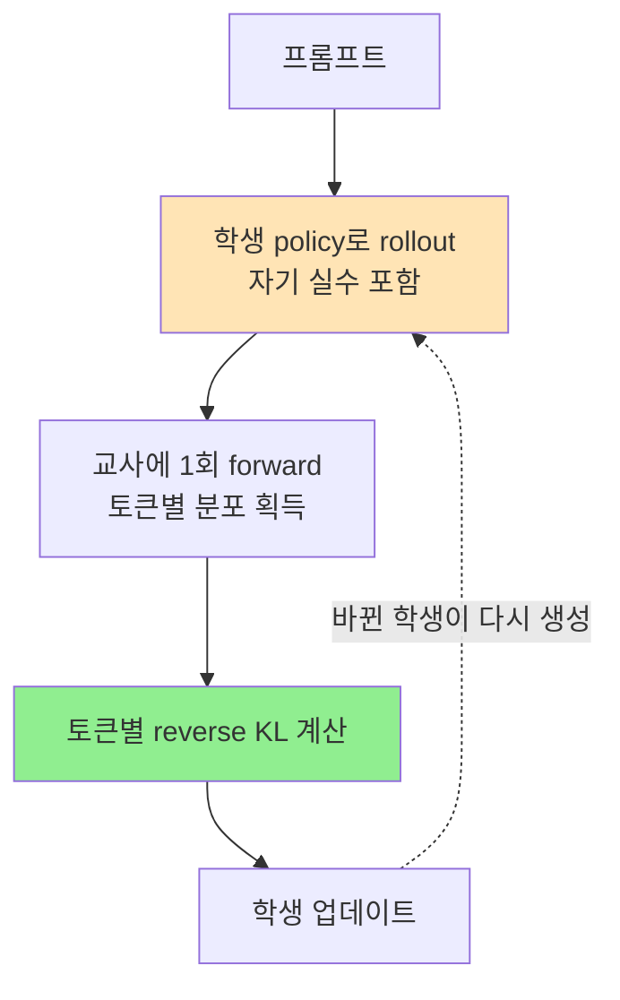

# A) 한줄 요약

On-policy distillation은 **학생이 직접 생성한 문장 위에서, 교사가 매 토큰을 채점하는** 증류 방식이다. 교사가 미리 써놓은 정답지를 베끼는 기존 방식(off-policy)과 달리, 학생이 실제로 헤매는 지점에서 교정이 들어온다.

2025~2026년 들어 이 기법이 갑자기 자주 언급되는 이유는 성능보다 **비용** 쪽이다. Qwen3 계열 실험에서 RL로 얻던 추론 성능을 GPU 시간 기준 10분의 1 수준으로 재현했고, Qwen3·MiMo·GLM 같은 실제 post-training 파이프라인에 들어가면서 "작은 모델 만드는 표준 레시피"의 한 칸을 차지했다.

# B) Distillation을 RL 렌즈로 보면 축이 두 개다

[[knowledge distillation|지식 증류]]를 오래 쓰던 방식대로만 보면 "교사 분포를 학생이 흉내 낸다"는 한 줄로 끝난다. 그런데 언어모델의 생성은 지금까지 뱉은 토큰이 곧 다음 상태가 되는 순차 결정 문제다. [[Markov Decision Process|MDP]]로 옮기면 state는 프롬프트와 지금까지 생성한 토큰, action은 다음 토큰, policy는 모델 자신이다. 이렇게 놓고 보면 학습 신호를 두 축으로 쪼개 보는 게 훨씬 유용하다.

- **데이터를 누가 만들었나** — 지금 학습 중인 모델이 방금 뽑은 문장인가, 다른 데서 온 문장인가
- **감독 신호가 얼마나 촘촘한가** — 응답 전체에 스칼라 하나인가, 토큰마다 분포 하나인가

여기서 감독 신호(supervision signal)는 [[supervised learning]]의 label만 가리키는 게 아니다. 파라미터를 업데이트할 때 모델이 받는 정답·평가 정보를 통틀어 부르는 말이라, RL의 reward 스칼라도 감독 신호다. 어원만 겹칠 뿐 "supervised learning이냐"와는 다른 질문이다.

밀도 차이는 한 스텝에 실리는 정보량으로 보면 분명하다. RL의 outcome reward는 응답 하나에 실수 하나이고, SFT는 토큰마다 vocabulary에서 정답 하나를 지목하며, 증류의 교사 분포는 토큰마다 vocabulary 전체에 대한 확률을 통째로 준다. "정답은 빠르게"와 "빠르게 40% / 신속히 35% / 즉시 20%"의 차이다. 뒤쪽이 선택지 간 우열까지 담고 있어 같은 한 스텝에서 훨씬 많이 배운다.

첫 번째 축의 on/off-policy는 RL에서 그대로 가져온 말이다. 데이터를 만든 policy(behavior policy)와 지금 파라미터를 업데이트하는 policy(target policy)가 같으면 on-policy, 다르면 off-policy다.

여기서 자주 오해하는 게, 기준이 "출처가 남이냐"가 아니라 **"지금 이 파라미터가 방금 만든 것이냐"** 라는 점이다. 그래서 off-policy 쪽에는 사람이 쓴 정답 텍스트(SFT), 교사가 미리 생성해둔 응답(sequence-level KD)뿐 아니라 **며칠 전 체크포인트가 만들어 버퍼에 쌓아둔 자기 출력** 도 들어간다. 한 스텝만 업데이트해도 policy는 이미 달라지므로, 방금 뽑은 rollout이 아니면 엄밀히는 전부 off-policy다.

on-policy가 비싼 이유도 여기서 나온다. 데이터를 재활용할 수 없어서 매 스텝 새로 생성해야 한다. 반대로 off-policy는 한 번 만든 데이터셋을 몇 epoch씩 돌려 쓸 수 있다.

이 두 축으로 배치하면 익숙한 기법들이 한 표에 들어온다.

| 데이터 출처 | 감독 = sparse (응답당 스칼라) | 감독 = dense (토큰당 분포) |
| --- | --- | --- |
| 다른 policy가 만든 문장 (off-policy) | offline RL, [[DPO]] | [[supervised fine-tuning]], sequence-level KD, logit KD |
| 지금 학생이 뽑은 문장 (on-policy) | [[GRPO]], [[Proximal Policy Optimization]] | **on-policy distillation** |

오른쪽 아래 칸이 오래 비어 있던 자리다. 학생이 직접 써보게 하되(on-policy), 채점은 "정답/오답" 한 글자가 아니라 토큰마다 교사 분포로 받는다. RL의 탐색과 SFT의 정보 밀도를 한꺼번에 갖는 게 이 기법의 전부다.

# C) Off-policy Distillation — 교사의 답안지를 베낀다

기존 증류는 전부 여기에 속한다. 형태는 크게 둘이다.

**Sequence-level KD (hard distillation)**: 교사에게 프롬프트를 주고 응답을 뽑아 데이터셋을 만든 뒤, 학생은 그 텍스트로 그냥 SFT한다. DeepSeek-R1의 R1-Distill-Qwen 시리즈, Alpaca 계열이 이 방식이다.

$$
\mathcal{L}_{\text{seq}} = -\mathbb{E}_{y \sim \pi_T(\cdot|x)}\big[\log \pi_\theta(y \mid x)\big]
$$

여기서:

| 기호 | 뜻 |
| --- | --- |
| $x$ | 프롬프트. 조건으로 주는 입력 |
| $y = (y_1, \dots, y_{\lvert y \rvert})$ | 응답 시퀀스 **전체**. 토큰 하나가 아니다 |
| $y_t$ / $y_{<t}$ | $t$번째 토큰 / 그 앞까지의 토큰들 |
| $\pi_T$ | 교사 policy. 아래첨자 $T$는 teacher이고, 위치 인덱스 $t$와는 다른 기호다 |
| $\pi_\theta$ | 학생 policy. $\theta$ 가 지금 학습되는 파라미터 |
| $y \sim \pi_T(\cdot \mid x)$ | 교사에 $x$ 를 넣어 응답 $y$ 를 샘플링했다는 뜻 |
| $\mathcal{D}$ | 학습 전에 만들어두고 학습 내내 바뀌지 않는 데이터셋 |
| $\mathcal{L}$ | loss. 경사하강으로 줄이는 대상 |

식이 낯설어 보여도 내용은 평범한 next-token prediction이다. autoregressive 모델에서 시퀀스 확률은 토큰별 조건부 확률의 곱이라, log를 씌우면 합으로 풀린다.

$$
\log \pi_\theta(y \mid x) = \sum_{t=1}^{\lvert y \rvert} \log \pi_\theta(y_t \mid x, y_{<t})
$$

결국 "교사가 뽑아준 응답을 학생이 그대로 뱉을 log 확률을 최대화하라"이고, 구현은 교사 텍스트에 대한 토큰별 cross-entropy다. sequence-level KD가 코드상으로는 그냥 SFT인 이유다. 데이터를 교사가 만들었다는 것만 다르다.

**Token-level logit KD (soft distillation)**: 미리 준비해둔 문장 위에서 각 위치의 교사 분포 전체를 학생이 맞추게 한다. Hinton식 KD를 autoregressive에 그대로 확장한 것으로, 보통 forward KL을 쓴다.

$$
\mathcal{L}_{\text{tok}} = \mathbb{E}_{y \sim \mathcal{D}}\Big[\textstyle\sum_t D_{KL}\big(\pi_T(\cdot \mid y_{<t}) \,\|\, \pi_\theta(\cdot \mid y_{<t})\big)\Big]
$$

여기서 $\mathcal{D}$ 가 "미리 준비해둔" 쪽을 담당한다. 사람이 쓴 골드 텍스트일 수도, 교사가 앞서 뽑아둔 응답일 수도 있는데 어느 쪽이든 학습 시작 전에 확정돼 학습 내내 그대로다. 학생이 아무리 변해도 연습하는 문장은 바뀌지 않는다. D절 on-policy 식에서 같은 자리가 $\pi_	heta$ 로 바뀌는 게 이 노트의 핵심 대비다.

두 번째 식의 $\pi_T(\cdot \mid y_{<t})$ 에서 가운뎃점은 "이 자리에 vocabulary의 모든 토큰이 들어간다"는 표시다. 첫 식은 교사가 실제로 고른 토큰 하나만 정답으로 쓰지만, 이 식은 그 위치에서 교사가 매긴 확률 전체를 쓴다. B절에서 말한 sparse/dense 차이가 두 식의 차이로 그대로 나타난다.

싸고 안정적이다. 교사 샘플링은 한 번만 하면 되고, 그 뒤로는 평범한 SFT 루프라 병렬화도 쉽다. sequence-level KD는 토크나이저가 달라도 되니 다른 패밀리 모델 사이에서도 쓸 수 있다.

## C.1) 문제는 학생이 가보지 않은 길

학습 내내 학생은 **교사가 자주 방문하는 상태** 에서만 다음 토큰을 연습한다. 추론 때는 자기가 뱉은 토큰 위에서 이어가야 하는데, 앞에서 한 번 어긋나면 그 뒤는 학습 중 본 적 없는 분포가 된다. 오차가 뒤로 갈수록 복리로 쌓이는 exposure bias다.

운전 교본을 아무리 정독해도 실제로 차선을 밟았을 때 어떻게 복구하는지는 배우지 못하는 것과 같다. 교본에는 차선을 밟은 상황 자체가 안 나오기 때문이다.

# D) On-policy Distillation — 학생이 직접 써보고 교사가 매 토큰 채점한다

절차는 세 단계다.

1. 학생이 프롬프트에 대해 응답을 직접 샘플링한다 (rollout)
2. 그 문장을 교사에 통째로 한 번 넣어 각 위치의 교사 분포를 얻는다 (teacher forcing)
3. 두 분포의 토큰별 KL을 줄이도록 학생을 업데이트한다



목적함수는 학생 rollout 분포 위에서의 per-token reverse KL이다.

$$
\mathcal{L}_{\text{OPD}} = \mathbb{E}_{y \sim \pi_\theta(\cdot|x)}\Big[\textstyle\sum_t D_{KL}\big(\pi_\theta(\cdot \mid y_{<t}) \,\|\, \pi_T(\cdot \mid y_{<t})\big)\Big]
$$

C절 식과 비교하면 바뀐 게 딱 두 군데다. 기댓값을 뜨는 분포가 $\mathcal{D}$에서 $\pi_\theta$로, 그리고 KL 방향이 뒤집혔다. 이 작은 차이가 학습이 일어나는 무대를 "교사가 방문하는 상태"에서 "학생이 방문하는 상태"로 옮긴다.

## D.1) 왜 Reverse KL인가

[[KL-Divergence]]는 비대칭이라 방향에 따라 학생의 성격이 달라진다. Forward KL은 교사가 확률을 준 곳을 학생이 버리면 벌점이 커서 **mode-covering** 이 되고, reverse KL은 학생이 확률을 준 곳을 교사가 인정하지 않으면 벌점이 커서 **mode-seeking** 이 된다.

증류에서 reverse KL을 쓰는 이유는 용량이 작은 학생에게 "모르는 건 말하지 마라"가 더 안전하기 때문이다. 다양성을 조금 잃더라도 뽑는 토큰마다 교사가 인정하는 쪽이, autoregressive 생성에서 실수가 뒤로 번지는 것보다 낫다. MiniLLM(Gu et al., 2023)이 이 관점을 처음 정식화했다.

부가 효과로 **reward hacking이 구조적으로 어렵다.** KL이 0에 가깝다는 건 학생이 교사 행동을 그대로 재현한다는 뜻이라, 낮은 loss가 곧 원하는 행동이다. judge 모델을 reward로 쓰는 RL에서 길이 뻥튀기나 아부 문체로 점수만 올리는 문제가 여기선 잘 생기지 않는다.

## D.2) 사실상 Dense Reward RL이다

토큰별 log-ratio $\log \pi_T(y_t \mid y_{<t}) - \log \pi_\theta(y_t \mid y_{<t})$ 를 reward로 보면, on-policy distillation은 **교사를 reward model로 쓰는 KL-constrained RL의 특수 케이스** 로 정확히 떨어진다. [[GRPO]]가 응답 하나에 스칼라 하나를 받는 것과 대비하면 신호 밀도가 응답 길이만큼 차이 난다.

실무적으로 중요한 건 credit assignment다. 3천 토큰짜리 추론에서 GRPO는 "이 답은 틀렸다" 한 마디만 주므로 어느 스텝이 문제였는지 모델이 스스로 알아내야 한다. On-policy distillation은 어긋난 그 토큰에 바로 벌점이 꽂힌다. RL보다 훨씬 적은 스텝으로 수렴하는 이유가 대부분 여기서 나온다.

비용 구조도 다르다. 교사는 학생 rollout을 **읽기만** 하므로 생성 없이 forward 한 번이면 끝난다. 느린 디코딩으로 교사 데이터를 미리 뽑아야 하는 off-policy 쪽보다 스텝당 교사 비용이 싸다.

# E) 세 방식 비교

| 항목 | Off-policy KD (SFT) | RL (GRPO 등) | On-policy distillation |
| --- | --- | --- | --- |
| rollout 주체 | 교사/사람 | 학생 | 학생 |
| 감독 신호 | 토큰별 정답 또는 분포 | 응답당 스칼라 reward | 토큰별 교사 분포 |
| exposure bias | 있음 | 없음 | 없음 |
| credit assignment | 불필요 | 어려움 (sparse) | 쉬움 (dense) |
| 성능 상한 | 교사 | 채점 가능하면 교사 초과 가능 | 대체로 교사 |
| 주 비용 | 교사 샘플링 (1회) | 학생 rollout + judge | 학생 rollout + 교사 forward |
| reward hacking | 해당 없음 | 있음 | 거의 없음 |

# F) 실제로 얼마나 싼가

Thinking Machines Lab이 2025년 10월 공개한 실험이 이 기법이 회자되는 직접적 계기다. Qwen3-8B-Base를 400K 프롬프트로 SFT해 AIME 2024에서 60%까지 올린 체크포인트가 출발점이다.

| 방법 | AIME 2024 | 비고 |
| --- | --- | --- |
| SFT 계속 (2M 프롬프트로 외삽) | ~70% | 기준 비용 1× |
| RL | 68% | 대략 1× |
| On-policy distillation | 70% | 약 150 스텝, 77K 프롬프트 |

같은 70%에 도달하는 비용이 SFT 데이터가 이미 있는 경우 **9배**, GPU 시간 기준으로는 18배, 교사 샘플링 비용까지 포함하면 **약 30배** 저렴하게 나왔다.


가로축이 추가로 투입한 training FLOPs, 세로축이 AIME 2024 점수다. 같은 연산을 넣었을 때 on-policy distillation 곡선이 SFT보다 확연히 위에 있고, 격차는 LoRA처럼 용량이 제한된 설정에서 더 벌어진다. rank 32 LoRA는 SFT만 하면 full finetuning에 13% 뒤지지만 on-policy distillation 뒤에는 6% 차이로 좁혀진다.

Qwen3 technical report의 8B 파이프라인 숫자도 같은 방향이다.

| 단계 | AIME 2024 | GPQA-Diamond | GPU hours |
| --- | --- | --- | --- |
| Off-policy distillation (SFT) | 55.0 | 55.6 | — |
| + RL | 67.6 | 61.3 | 17,920 |
| + On-policy distillation | 74.4 | 63.3 | 1,800 |

RL 대비 GPU 시간 10분의 1로 더 높은 점수가 나왔다.

같은 초기화에서 출발해 RL과 직접 붙인 통제 실험이 차이를 가장 선명하게 보여준다. 교사를 RL로 학습시킨 자기 자신으로 두고(self-distillation) 학생이 그 policy를 되찾는 데 걸리는 스텝을 잰 것이다.


RL이 70 스텝 걸린 지점을 on-policy distillation은 10 스텝 안에 통과한다. reverse KL이 0 근처로 떨어지면서 AIME 점수가 같이 회복되고, gradient step 기준 7~10배, 연산 기준으로는 50~100배 차이가 난다.

다만 "RL을 대체한다"기보다 **RL을 이미 돌린 큰 모델이 있으면, 그 능력을 작은 모델에 옮기려고 RL을 또 돌리지는 마라** 로 읽는 게 맞다.

## F.1) 도메인 학습 후 망가진 행동 복구

덜 알려졌지만 실무에서 더 자주 쓸 만한 용도다. 사내 문서로 mid-training을 하면 지식은 늘지만 instruction following이 깎이는 [[catastrophic forgetting]]이 생긴다.


문서와 chat 데이터를 어떤 비율로 섞든 IF-eval은 떨어진다. learning rate가 감쇠하면서 하락이 완만해지고 조금 회복되기는 하지만 원래 수준으로는 끝내 돌아오지 않는다. 배합비 조정만으로는 못 막는다는 뜻이다.

| 상태 | 사내 QA | IF-eval |
| --- | --- | --- |
| Qwen3-8B 원본 | 18% | 85% |
| 사내 문서 mid-training 후 | 36% | 79% |
| + on-policy distillation | 41% | 83% |

원본 모델 자신을 교사로 놓고 채팅 능력만 다시 증류하니, 새로 얻은 지식은 유지한 채 행동이 복구됐다. 문서와 chat 데이터 비율을 맞춰 재학습하는 것보다 손이 덜 간다.

# G) 언제 잘 안 되나

만능은 아니다. Li et al.(2026)이 실패 사례를 정리했는데, 두 조건이 갈림길이었다.

**사고 패턴이 호환돼야 한다.** 교사와 학생의 추론 전개 방식이 크게 다르면 벤치마크 점수 차이가 아무리 커도 신호가 잘 전달되지 않는다.

이유는 overlap이라는 지표로 설명된다. 학생 rollout의 각 위치에서 교사와 학생은 각자 vocabulary 위에 분포를 갖는데, 양쪽 모두가 높은 확률을 주는 토큰들이 overlap이다.

```text
어떤 위치에서
  교사:  따라서 0.50 / 그러므로 0.30 / 즉 0.15
  학생:  그러므로 0.40 / 따라서 0.25 / 하지만 0.20
  overlap = {따라서, 그러므로}
```

이때 학생이 배우는 건 "따라서"의 비중을 올리고 "하지만"을 버리는 **배분 조정** 이다. 교사만 아는 낯선 토큰이 주입되는 게 아니라, 이미 양쪽 다 후보로 들고 있던 토큰들 사이의 순위가 교사 쪽으로 맞춰진다.

측정 결과가 이걸 뒷받침한다. 성공한 학습에서는 overlap 비율이 72%에서 91% 이상으로 올라가지만, 실패하는 경우 처음부터 정체한다. overlap 토큰이 확률질량의 97~99%를 차지하고, **loss를 overlap 토큰에만 걸어도 최종 성능이 같게 나온다.** 나머지 토큰은 학습에 사실상 기여하지 않는다는 뜻이다.

함의가 중요하다. 처음부터 overlap이 작으면 신호를 걸 자리 자체가 없다. 반대로 정렬이 진행되면 overlap이 넓어지고, 넓어진 만큼 신호가 늘어 다시 정렬이 빨라지는 자기강화 루프가 돈다. cold start SFT가 효과를 내는 것도 이 루프의 출발점을 올려주기 때문이다.

**교사가 진짜 새 능력을 갖고 있어야 한다.** 같은 학습 파이프라인에서 크기만 다른 모델을 교사로 쓰면 점수가 높아도 이득이 거의 없다. RL로 얻은 능력이 있는 post-trained 교사여야 전이가 크다. 반대로 1.5B 모델을 자기 pre-RL 체크포인트 쪽으로 증류하면 성능이 그대로 되돌아간다.

실전 레시피로는 이렇게 정리된다.

1. **Off-policy cold start를 먼저 깐다.** 교사 rollout으로 SFT를 조금 돌려 사고 패턴 간극을 좁히면 초기 overlap이 올라가고 최종 천장도 높아진다
2. **프롬프트를 교사 post-training 분포에만 맞추지 않는다.** 정렬은 빨라지지만 entropy collapse 위험이 있어 OOD 프롬프트를 섞는다
3. **응답 길이 3~7K 토큰이 안정 구간.** 더 길어지면 뒷부분부터 토큰 reward 품질이 무너진다
4. **Top-1 대신 sampled token으로 KL을 계산한다.** Top-1은 mode 집중 때문에 불안정하다

# H) 어디에 끼워 넣나

정리하면 요즘 표준 분업은 이렇다. 단계마다 **주어가 어느 모델인지** 를 놓치면 안 된다.

```text
[교사 = 큰 모델]  ── 여기서만 RL을 돌린다
    RL (GRPO 등)로 능력 확보
         │
         │  교사가 프롬프트에 응답을 생성 → rollout 데이터
         ▼
[학생 = 작은 모델]  ── RL은 돌리지 않는다
    1. 그 rollout으로 SFT          (off-policy cold start)
    2. on-policy distillation      (reverse KL, 교사가 매 토큰 채점)
    3. 필요 시 DPO 한 라운드        (미세 스타일 보정)
```

헷갈리기 쉬운 게 "RL을 해놓고 왜 다시 SFT냐"인데, 그 둘은 **다른 모델에 하는 일** 이다. RL은 교사에서 끝났고, SFT는 아직 아무것도 안 배운 학생을 초기화하는 단계다. 한 모델이 RL 했다가 SFT로 되돌아가는 게 아니다.

학생에게 cold start SFT가 따로 필요한 이유는 G절의 조건 때문이다. 학생과 교사의 추론 전개 방식이 너무 다르면 on-policy distillation의 신호가 잘 안 먹힌다. 교사 rollout으로 SFT를 조금 돌려 어투와 추론 형식을 교사 근처로 데려다 놓아야, 그 다음 on-policy 교정이 제값을 한다. 2단계에서 학생이 생성할 문장의 출발점을 만들어주는 셈이다.

RL은 그룹 안에 좋은 응답이 샘플링돼야 신호가 생기는데 작은 모델은 그 확률이 낮다. 그래서 탐색은 큰 모델에서 한 번 하고, 작은 모델은 그 결과를 옮겨 받는 쪽이 압도적으로 싸다. 채점이 기계적으로 가능한 태스크(수학·코드)에서 **교사를 넘어서야 한다면** 그건 여전히 [[GRPO]] 몫이다. 증류는 교사 성능이 사실상 상한이다.

이 노트가 일반 개념이라면, forward/reverse KL과 데이터 비율 λ를 손잡이로 놓고 두 극단을 하나의 목적함수로 묶은 구체 알고리즘은 [[GKD]] 노트에 정리해뒀다. 지금 실무에서 on-policy distillation이라 부르는 설정은 대체로 GKD에서 λ=1, reverse KL을 고른 경우다.

# I) References

본문 그래프 세 개는 모두 Thinking Machines Lab 블로그 원문에서 가져왔다.

- Thinking Machines Lab, 2025-10, ["On-Policy Distillation"](https://thinkingmachines.ai/blog/on-policy-distillation/)
- Agarwal et al., 2023, ["On-Policy Distillation of Language Models: Learning from Self-Generated Mistakes"](https://arxiv.org/abs/2306.13649) (GKD)
- Gu et al., 2023, ["MiniLLM: On-Policy Distillation of Large Language Models"](https://arxiv.org/abs/2306.08543) — reverse KL + policy gradient
- Li et al., 2026, ["Rethinking On-Policy Distillation of Large Language Models: Phenomenology, Mechanism, and Recipe"](https://arxiv.org/abs/2604.13016)
- Qwen Team, 2025, ["Qwen3 Technical Report"](https://arxiv.org/abs/2505.09388)
