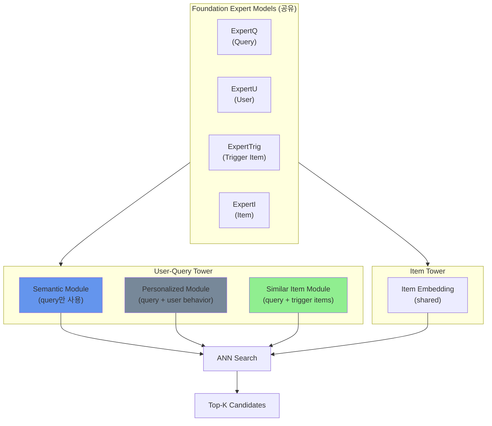
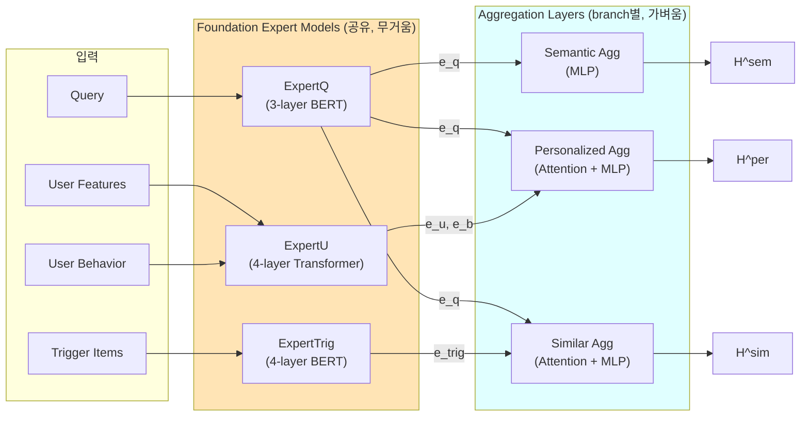
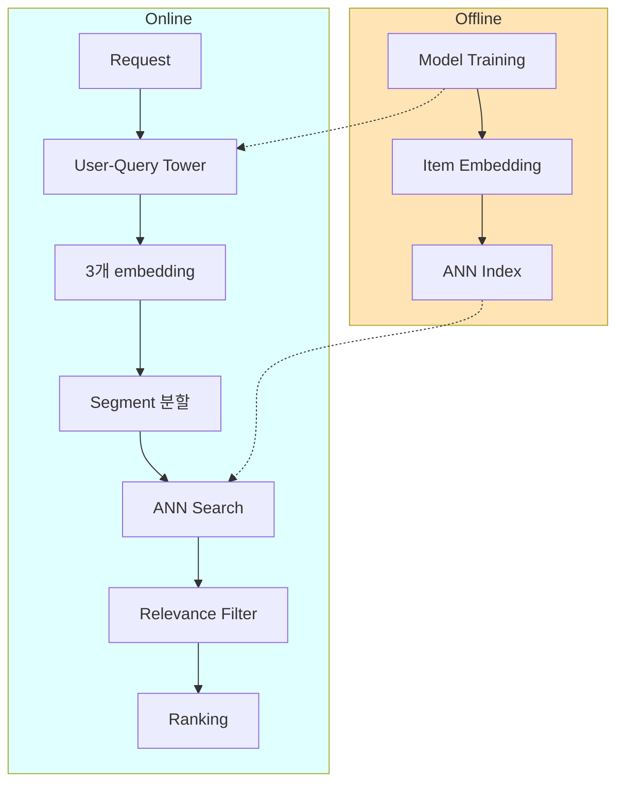

# A) 한줄 요약

**여러 EBR(Embedding-based Retrieval) branch를 하나의 프레임워크에서 joint training하여 중복 retrieval 줄이고 다양성 확보**

- 저자: Hao Jiang et al. (JD.com)
- 학회: KDD 2025

# B) 기존 방법의 한계

대부분의 산업 시스템에서 여러 retrieval branch를 **독립적으로 학습**하고 결과를 union하여 ranking으로 전달:
- Semantic retrieval (query 텍스트 기반)
- Personalized retrieval (user history 기반)
- Similar item retrieval (trigger item 기반, I2I)

이 방식의 문제점:

## B.1) 중복 Retrieval로 인한 자원 낭비

각 branch가 독립적으로 Top-K를 뽑다 보니, **서로 비슷한 상품을 중복으로 retrieve**하는 경우가 많음. 예를 들어 "아이폰 케이스"를 검색하면 semantic branch도, personalized branch도 비슷한 인기 상품을 가져옴. 결국 3개 branch가 각각 1000개씩 뽑아도 union하면 실제로는 2000개밖에 안 되는 식.

→ 컴퓨팅 자원은 3배 쓰면서 다양성은 확보 못함

## B.2) 결과 차별화 실패

모든 branch가 결국 **"relevance가 높은 상품"** 을 목표로 학습함. Semantic이든 Personalized든 학습 목표가 비슷하니까 embedding 공간도 비슷해지고, 결과적으로 각 branch의 결과가 거의 유사해짐.

→ 굳이 여러 branch를 운영하는 의미가 퇴색

## B.3) 독립 학습의 한계 (Local Optimum)

각 branch를 따로 최적화하면 **전체 시스템 관점의 최적화가 안 됨**. A branch를 개선했더니 A가 가져가던 좋은 상품을 B도 가져가게 되어서 B의 unique contribution이 줄어드는 식. 서로가 서로를 모르니까 이런 상호작용을 고려할 수 없음.

→ 개별 branch는 좋아져도 전체 retrieval 성능은 정체

## B.4) Feature 중복 추론

Query encoding 같은 공통 연산을 **각 모델에서 반복 수행**. Semantic model도 query를 인코딩하고, Personalized model도 query를 인코딩하고... 동일한 query에 대해 여러 번 inference하는 비효율.

→ Online latency 증가, 서빙 비용 증가

# C) 해결 방법 개요

UniERF는 위 문제들을 **joint training + 차별화 전략**으로 해결:

| 문제 | 해결책 |
|------|--------|
| Computing resource 낭비 | **Foundation Expert 공유** - query/user/item expert를 공유하여 중복 inference 제거 |
| Differentiation 부족 | **Differentiated Sample Construction** - 각 branch별로 다른 hard negative |
| Local optimum | **Joint Training** - 3개 branch를 하나의 프레임워크에서 동시 학습 |
| 결과 유사성 | **Diversity Loss** - branch 간 embedding이 너무 유사해지지 않도록 제약 |



**학습 흐름**:
1. Pre-trained expert model들을 distillation하여 foundation expert로 사용
2. 3개의 retrieval module이 서로 다른 입력으로 embedding 생성
3. Differentiated sample construction으로 각 branch별 hard negative 구성
4. Diversity loss로 branch 간 embedding 분리 유도

**추론 흐름**:
1. Request → User-Query Tower에서 3개 embedding 생성
2. 각 embedding으로 ANN search (segment별로 분산)
3. Relevance filter → Ranking

# D) 배경 지식

## D.1) Embedding-based Retrieval (EBR)

Two-tower 구조로 query/user와 item을 각각 embedding하고 ANN으로 Top-K 검색하는 방식. 장점은:
- Item embedding은 offline에서 미리 계산 가능
- Query embedding만 online에서 실시간 계산
- Semantic matching 가능 (keyword matching의 한계 극복)

# E) 제안 방법 상세

## E.1) User-Query Tower 동작 원리

핵심은 **무거운 Expert Model은 공유**하고, **가벼운 Aggregation Layer만 branch별로 분리**하는 것.



**Expert Model은 왜 3-4 layer인가?**

원래 BERT는 12-layer (BERT-base)지만, online serving에서 12-layer 그대로 쓰면 latency가 너무 높음. 그래서 **knowledge distillation**으로 layer 수를 줄임:

| Expert | 원본 | Distilled | 학습 데이터 |
|--------|------|-----------|------------|
| ExpertQ (Query) | 12-layer BERT | **3-layer** | 수십억 query 로그 |
| ExpertU (User) | 12-layer Transformer | **4-layer** | user behavior 시퀀스 |
| ExpertTrig/I (Item) | 12-layer BERT | **4-layer** | item title/category/shop |

Distillation: 큰 모델(teacher)의 출력을 작은 모델(student)이 흉내내도록 학습. 성능은 약간 손해보지만 속도는 크게 향상.

**왜 빨라지나?**

| 구분 | 기존 Multi-EBR | UniERF |
|------|---------------|--------|
| Query encoding | BERT × 3번 | BERT × 1번 (공유) |
| User encoding | Transformer × 1번 | Transformer × 1번 |
| Aggregation | MLP × 3번 | MLP × 3번 |
| **총 heavy inference** | **4번** | **2번** |

→ 실측: 40.82ms → 24.66ms (약 40% 감소)

## E.2) 각 Module의 입출력

### E.2.1) Semantic Retrieval Module

```python
Query text → [BERT 3-layer] → e_q → [MLP] → [L2norm] → H^sem
             ~~~~~~~~~~~~~~        ~~~~~~~~~~~~~~~~
               ExpertQ              Aggregation
```

- $e_q$: BERT의 출력 (순수 embedding vector)
- Aggregation: $e_q$를 MLP 통과 후 L2 normalize
- 다른 모듈과 달리 **attention/fusion 없이** 바로 MLP → 출력
- 순수 semantic 정보만 캡처 (user 정보 없음)

### E.2.2) Personalized Retrieval Module

**수식 (논문 Eq 6-13)**:

```python
User features → [Embedding] → e_u
User behavior → [ExpertU 4-layer] → e_b
Query + Behavior → [Interaction Network] → e_inter
```

$$e_u = \varphi_u(u; \theta), \quad e_b = \phi_u(b; \theta)$$

$$e_{\text{inter}} = \mathcal{E}_{\text{per}}(q, b; \theta)$$

**Aggregation** (Multi-head Attention Fusion):

$$E = \begin{bmatrix} e_u \\ e_b \\ e_q \\ e_{\text{inter}} \end{bmatrix} \in \mathbb{R}^{4 \times d}$$

$$Q_i = EW_i^Q, \quad K_i = EW_i^K, \quad V_i = EW_i^V$$

$$\alpha_i = \text{softmax}\left(\frac{Q_i K_i^T}{\sqrt{d_k}}\right), \quad \text{head}_i = \alpha_i V_i$$

$$e_{\text{fusion}} = W^O[\text{head}_1 \| \text{head}_2 \| \cdots \| \text{head}_h]$$

$$H^{\text{per}} = \text{l2norm}(f(e_{\text{fusion}}))$$

**핵심 포인트**:
- **Personalized Interaction Network** $\mathcal{E}_{\text{per}}$: query를 Q로, user history를 K, V로 attention → "현재 검색 의도와 관련된 과거 행동"을 추출
- Aggregation 입력은 **4개**: $e_u$ (user features) + $e_b$ (behavior embedding) + $e_q$ (query) + $e_{\text{inter}}$ (interaction)
- Concatenate가 아닌 **Multi-head Attention Fusion** 사용

### E.2.3) Similar Item Retrieval Module

**수식 (논문 Eq 14-17)**:

Trigger item은 이전 페이지에서 노출된 상품들 $g = (i_1, i_2, \ldots, i_k)$

$$e^{\text{sim}}_{\text{num}} = \text{mean\_pooling}(\varphi_{\text{trig}}(g; \theta))$$

$$e^{\text{sim}}_{\text{text}} = \text{mean\_pooling}(\phi_{\text{trig}}(g; \theta))$$

$$e^{\text{sim}}_{\text{inter}} = \mathcal{E}_{\text{sim}}(q, g; \theta)$$

$$H^{\text{sim}} = \text{l2norm}(f(\text{concat}(e_q, e^{\text{sim}}_{\text{inter}}, e^{\text{sim}}_{\text{num}}, e^{\text{sim}}_{\text{text}})))$$

**핵심 포인트**:
- **Similar Item Interaction Network** $\mathcal{E}_{\text{sim}}$: query와 trigger item 관계 모델링
- Trigger item의 numeric features와 text features를 **mean pooling**으로 aggregation
- Aggregation 입력은 **4개**: $e_q$ + $e^{\text{sim}}_{\text{inter}}$ + $e^{\text{sim}}_{\text{num}}$ + $e^{\text{sim}}_{\text{text}}$
- I2I (Item-to-Item) retrieval에 특화

### E.2.4) Item Tower

User-Query Tower가 3개 embedding을 만드는 반면, **Item Tower는 하나의 embedding만 생성**하고 3개 branch가 공유.

**수식 (논문 Eq 18-19)**:

$$e_{\text{num}} = \varphi_{\text{item}}(i; \theta), \quad e_{\text{text}} = \phi_{\text{item}}(i; \theta)$$

$$H^{\text{item}} = \text{l2norm}(f(\text{concat}(e_{\text{num}}, e_{\text{text}})))$$

| Feature 종류 | 예시 | 처리 방식 | 모델 |
|-------------|------|----------|------|
| **Numeric** | price, category ID, shop ID | $\varphi$ (embedding layer) | 단순 lookup |
| **Text** | title, category name, shop name | $\phi$ (expert model) | **4-layer BERT** |

→ Numeric은 BERT에 안 들어감. 각각 처리 후 **concat**해서 MLP 통과.

**왜 Item embedding은 하나인가?**

Item embedding은 **offline에서 미리 계산**해서 ANN index에 저장함. 만약 branch별로 다른 item embedding을 쓰면:
- Index를 3개 만들어야 함 (저장 공간 3배)
- 각 branch마다 별도 ANN search 필요

하나의 item embedding을 공유하면 index 하나로 3개 branch 모두 서빙 가능.

**ExpertTrig과 ExpertI의 관계**: 같은 pre-trained item model에서 distill. Trigger item과 candidate item이 **같은 latent space**에 있어야 similar item retrieval이 제대로 동작하기 때문.

## E.3) Differentiation Sample Construction

### E.3.1) Multiple Positives (논문 Section 4.3.1)

Positive sample은 보통 **유저가 클릭하거나 구매한 item**. 하지만 **Semantic Retrieval Module**의 경우:

| Positive 유형 | 설명 | 사용 모듈 |
|--------------|------|----------|
| Clicked | 유저가 클릭한 상품 | 전체 (Per, Sem, Sim) |
| **Exposed but not clicked** | 노출됐지만 클릭 안 함 | **Semantic만** |

**왜 Semantic에만 unclicked를 positive로?**

- Semantic retrieval의 목표는 **query-item relevance** 학습
- 노출됐다 = relevance filter 통과 = **semantic하게는 관련 있음**
- 클릭 안 됐어도 semantic 관점에서는 positive로 취급 가능

$$\mathcal{P} = \{(x_i, x_i^+) | x_i \in \mathcal{S}\}$$

### E.3.2) 왜 Branch별로 다른 Hard Negative가 필요한가?

Joint training을 하면 3개 branch가 **같은 데이터로 학습**하게 됨. 만약 negative sample도 동일하면 결국 3개 branch가 비슷한 embedding 공간을 학습하게 되어 **차별화 실패**.

각 branch의 "잘 구분해야 할 것"이 다르기 때문에 hard negative도 달라야 함:

| Branch | 목적 | Hard Negative | 직관적 설명 |
|--------|------|---------------|------------|
| **Personalized** | 이 유저가 클릭할 상품 찾기 | Ranking model 낮은 점수 item | "relevance는 높지만 이 유저는 안 살 것" |
| **Semantic** | Query와 의미적으로 맞는 상품 | Query-item relevance 낮은 item | "다른 건 맞아도 검색어랑 안 맞는 것" |
| **Similar Item** | Trigger와 비슷하게 생긴 상품 | Image/title 유사도 낮은 item | "카테고리는 같지만 생김새가 다른 것" |

**예시: "아이폰 케이스" 검색**

- Semantic hard negative: "아이폰 충전기" (검색어와 relevance 낮음)
- Personalized hard negative: "투명 케이스" (이 유저는 캐릭터 케이스만 사는데)
- Similar hard negative: "갤럭시 케이스" (trigger 상품과 외형이 다름)

$$\mathcal{N}_i = \mathcal{N}_i^{\text{batch}} \cup \mathcal{N}_i^{\text{rand}} \cup \mathcal{N}_i^{\text{per}} \cup \mathcal{N}_i^{\text{sem}} \cup \mathcal{N}_i^{\text{sim}}$$

## E.4) Diversity Loss

### E.4.1) 직관적 이해

**목표**: 같은 query에 대해 3개 branch가 만드는 embedding이 너무 비슷해지면 안 됨.

```python
"아이폰 케이스" 검색 시:

Branch들이 비슷하면:
  H^sem ≈ H^per ≈ H^sim  →  3개가 거의 같은 상품 retrieve → 중복!

Branch들이 달라야:
  H^sem: 검색어와 semantic match
  H^per: 이 유저 취향에 맞는 상품
  H^sim: trigger 상품과 비슷한 상품
  → 각각 다른 관점에서 상품 retrieve → 다양성 확보!
```

### E.4.2) $s_{ik}$가 뭔가?

**같은 query에 대해** branch i와 k가 출력한 embedding 간의 cosine similarity:

$$s_{ik} = \cos(H_n^{\text{ret}_i}, H_n^{\text{ret}_k})$$

예를 들어 "아이폰 케이스" query에 대해:
- $s_{\text{sem,per}}$ = $\cos(H^{\text{sem}}, H^{\text{per}})$ : Semantic ↔ Personalized 유사도
- $s_{\text{sem,sim}}$ = $\cos(H^{\text{sem}}, H^{\text{sim}})$ : Semantic ↔ Similar 유사도
- $s_{\text{per,sim}}$ = $\cos(H^{\text{per}}, H^{\text{sim}})$ : Personalized ↔ Similar 유사도

**$s_{ik}$가 높으면** (예: 0.9): 두 branch가 거의 같은 embedding → 같은 상품 retrieve → **나쁨**
**$s_{ik}$가 낮으면** (예: 0.3): 두 branch가 다른 embedding → 다른 상품 retrieve → **좋음**

### E.4.3) Loss 수식

$$\mathcal{L}_{\text{diversity}} = \log\left[1 + \sum_{(i,k), i \neq k} \exp\left(\tau \cdot \eta_n \cdot (s_{ik} - \Delta)\right)\right]$$

**구성 요소**:

| 기호 | 의미 | 값 |
|------|------|-----|
| $s_{ik}$ | branch i, k 간 similarity | 0~1 |
| $\Delta$ | target similarity (이보다 낮아야 함) | 0.8 |
| $\alpha$ | truncation threshold | 0.6 |
| $\eta_n$ | truncation 가중치 = $\max(s_{ik} - \alpha, 0)$ | - |
| $\tau$ | temperature | - |

**$s_{ik} - \Delta$의 의미**:
- $s_{ik} = 0.9$, $\Delta = 0.8$ → $0.9 - 0.8 = 0.1 > 0$ → **penalty 발생** (너무 유사함!)
- $s_{ik} = 0.5$, $\Delta = 0.8$ → $0.5 - 0.8 = -0.3 < 0$ → **penalty 거의 없음** (충분히 다름)

**직관**: "$s_{ik}$가 0.8보다 높으면 penalty, 낮으면 OK"

### E.4.4) Truncation이 왜 필요한가?

Diversity loss만 있으면 branch들이 **무한정 멀어지려고** 함. 하지만:

1. **Query를 공유**하므로 3개 branch가 완전히 다른 공간에 있으면 안 됨
2. 같은 positive item에 대해 3개 branch 모두 높은 score를 줘야 하는데, 완전히 분리되면 불가능

**Truncation의 역할**:

```python
similarity > α (0.6): "너무 유사함" → gradient 발생 → 더 멀어지도록 학습
similarity ≤ α (0.6): "충분히 다름" → gradient 차단 → 더 이상 밀어내지 않음
```

즉, **"적당히 다르면 됐어, 더 밀어내지 마"**라는 제약.

**왜 0.6인가?**: 논문에서 실험적으로 결정. 너무 낮으면 branch들이 뒤엉키고, 너무 높으면 retrieval 성능 저하.

## E.5) 전체 Loss

$$\mathcal{L} = \mathcal{L}_{\text{pos}} + \mathcal{L}_{\text{trip}} + \mathcal{L}_{\text{Info}} + \mathcal{L}_{\text{diversity}}$$

### E.5.1) 각 Loss 수식 (논문 Eq 28-31)

**1) Positive Loss** - 절대적 하한선:

$$\mathcal{L}_{\text{pos}} = \max\left\{\beta - \mathcal{T}[e_{\text{u-q}}, \mathcal{E}_I(i^+; \theta)], 0\right\}$$

**2) Triplet Loss** - 상대적 순서:

$$\mathcal{L}_{\text{trip}} = \max\left\{\mathcal{T}[e_{\text{u-q}}, \mathcal{E}_I(i^-; \theta)] - \mathcal{T}[e_{\text{u-q}}, \mathcal{E}_I(i^+; \theta)] + \gamma, 0\right\}$$

**3) InfoNCE Loss** - batch 내 비교:

$$\mathcal{L}_{\text{Info}} = -\frac{1}{N}\sum_{k=1}^{N}\log\left[\frac{\exp(\mathcal{T}(e_{\text{u-q}}, \mathcal{E}_I(i^+; \theta))/\tau)}{\sum_{j=1}^{N}\exp(\mathcal{T}(e_{\text{u-q}}, \mathcal{E}_I(i^-; \theta))/\tau)}\right]$$

**4) Diversity Loss** - branch 간 다양성 (E.4절 참조)

여기서:
- $e_{\text{u-q}}$: User-Query Tower 출력 ($H^{\text{sem}}$, $H^{\text{per}}$, or $H^{\text{sim}}$)
- $\mathcal{T}$: scoring function (cosine similarity)
- $\gamma$: triplet margin
- $\tau$: temperature

### E.5.2) $\mathcal{L}_{\text{pos}}$가 왜 필요한가?

[[Triplet Loss]]/[[InfoNCE]]는 **상대적 순서**만 학습. positive > negative면 OK인데, 둘 다 score가 0.1, 0.05여도 조건 만족함.

$\mathcal{L}_{\text{pos}}$는 "positive는 **절대적으로 β 이상**이어야 함"이라는 하한선 설정. 실제 serving에서 score threshold로 필터링할 때 score가 너무 낮으면 안 되니까.

### E.5.3) Search Ads를 위한 CTR 목표

일반 retrieval은 **click vs random negative**만 구분하면 되지만, search ads는 더 세분화:

```python
click (클릭함) > unclicked (노출됐는데 안 클릭) > negative (랜덤)
```

| 샘플 타입 | 의미 | 학습 목표 |
|----------|------|----------|
| click | 유저가 클릭한 상품 | 가장 높은 score |
| unclicked | 노출됐지만 클릭 안 함 | 중간 score (relevance는 있음) |
| negative | 랜덤 샘플 | 가장 낮은 score |

**왜 unclicked를 따로 구분하나?**

- 노출됐다는 건 relevance filter를 통과했다는 뜻 → **관련은 있음**
- 하지만 유저가 안 클릭함 → **CTR 관점에서는 별로**
- 완전 random보다는 낫지만, click보다는 낮아야 downstream ranking과 일관성 유지

**Search ads 특성**: 광고는 노출만 되고 클릭 안 되면 광고주한테 의미 없음. 그래서 retrieval 단계부터 "클릭할 것 같은 상품"을 우선 retrieve하도록 학습.

# F) 데이터셋

- **Offline**: JD.com 10일치 search log, 10억+ entries
- **Online**: JD App, JD Search Website 등 실제 트래픽

# G) Implementation Details (논문 Section 5.3)

## G.1) Model Architecture

| Expert | 구조 | Pre-trained | 입력 |
|--------|------|-------------|------|
| ExpertQ | **3-layer BERT** | 12-layer BERT (수십억 query) | Query text |
| ExpertU | **4-layer Transformer** | 12-layer Transformer (user behavior) | User history + time encoding |
| ExpertI/Trig | **4-layer BERT** | 12-layer BERT (item features) | Title + Category + Shop name |

Aggregation layer: Concatenation → MLP → L2 Normalization

## G.2) Hyperparameters

| Parameter | Value | 설명 |
|-----------|-------|------|
| Embedding size | **64** | User-Query/Item Tower 출력 차원 |
| Batch size | **128** | - |
| Attention heads | **4** | Interaction layer의 multi-head attention |
| Dropout | **0.2** | - |
| Sequence length | **120** | User behavior history 길이 |
| $\alpha$ (truncation) | **0.6** | Diversity loss truncation threshold |
| $\Delta$ (margin) | **0.8** | Diversity loss similarity margin |
| $\beta$ (positive threshold) | **미공개** | $\mathcal{L}_{\text{pos}}$의 하한선. 추정: **~0.7** (cosine sim 기준) |
| $\gamma$ (triplet margin) | **미공개** | $\mathcal{L}_{\text{trip}}$의 margin |
| $\epsilon, \tau, \lambda$ | **하위 30%** | Hard negative threshold (score 기준) |
| Learning rate (expert) | **0.0001** | Expert model용 |
| Learning rate (other) | **0.001** | 나머지 layer용 |
| Optimizer | **AdamW** | - |
| GPU | **8x H800** | - |

# H) Online Deployment 구조



**Offline 단계**:
1. 최근 2주 데이터로 모델 학습 (주기적 재학습)
2. Item Tower로 전체 상품 embedding 생성
3. ANN index 구축 (HNSW 등)

**Online 단계**:
1. Request 들어오면 User-Query Tower가 3개 embedding 생성
2. **Segment 분할**: 카테고리별로 나눠서 검색 (예: 전자제품/의류/식품)
3. 각 segment에서 ANN search로 Top-K 후보 추출
4. Relevance filter로 query와 무관한 상품 제거
5. Ranking 모델로 최종 순위 결정

**왜 Segment를 나누나?**: 전체 상품에서 검색하면 느림. 카테고리별로 나누면 각 ANN index가 작아져서 검색 속도 향상.

# I) 실험 결과

## I.1) Baseline: Adapted-DNN

YouTube DNN 아키텍처를 JD search ads에 맞게 커스터마이징한 **기존 시스템**:

- 3개 branch (Personalized, Semantic, Similar)를 **각각 독립 학습**
- Expert 공유 없음, diversity loss 없음
- Section B에서 설명한 "기존 방식 문제점"을 그대로 가진 시스템

## I.2) Offline 결과

| Method      | Precision_click | Recall@1  | Recall@100 | Recall@1000 |
| ----------- | --------------- | --------- | ---------- | ----------- |
| Adapted-DNN | 0.439           | 0.018     | 0.468      | 0.644       |
| **UniERF**  | **0.585**       | **0.036** | **0.552**  | **0.772**   |

- Recall@1000: **+12.8%**
- Precision_click: **+14.6%** (CTR 예측 정확도)

## I.3) Online A/B Test (7일)

**지표 설명:**

| 지표 | 의미 | 왜 중요한가 |
|------|------|------------|
| **IMP** | 광고 노출 수 | retrieval 품질 ↑ → relevance filter 통과율 ↑ → 노출 ↑ |
| **CLK** | 광고 클릭 수 | 유저가 관심 있는 상품 retrieve했다는 증거 |
| **COST** | 광고주 지불 비용 | CPC 모델이라 CLK ↑ → COST ↑ (플랫폼 매출) |

**결과:**

| Platform            | IMP        | CLK        | COST       |
| ------------------- | ---------- | ---------- | ---------- |
| JD APP on Mobiles   | +0.67%     | +1.21%     | +2.20%     |
| JD Search Products  | +1.13%     | +1.59%     | +2.41%     |
| **JD Whole Search** | **+0.96%** | **+1.37%** | **+2.24%** |

Search ads에서 **COST 증가 = 좋은 것**. 클릭 많이 발생 → 광고주 지불 증가 → 플랫폼 매출 증가.

## I.4) Ablation Study

Diversity loss + Differentiated sampling 제거 시:
- Precision_click: 0.585 → 0.545
- Recall@1000: 0.772 → 0.729

T-SNE 시각화: diversity 전략 없으면 3개 branch embedding이 뒤엉킴

## I.5) 실무적 시사점

1. **Joint training의 효과**: 독립 학습 대비 generalization bound 개선 (Theorem 1로 증명)
2. **Hard negative 설계가 중요**: branch 목적에 맞는 negative가 차별화에 핵심
3. **Diversity loss의 truncation**: 완전 분리가 아닌 적정 수준 유지 필요
4. **Latency 개선**: Multi-EBR 대비 실시간 40.82ms → 24.66ms

# J) Related

## J.1) 관련 방법론 비교 (논문 Table 4)

| Methods                  | DPSR | MGDSPR | MOPPR | **UniERF** |
| ------------------------ | ---- | ------ | ----- | ---------- |
| Semantic Relevance       | ✓    | ✓      | ✓     | ✓          |
| Individuation (개인화)      | ✓    | ✓      | ✓     | ✓          |
| Multi-channel Retrieval  | ✓    |        |       | ✓          |
| **Cooperative Training** |      |        |       | **✓**      |
| **Diversity Strategy**   |      |        |       | **✓**      |
| Hard Negative Samples    |      | ✓      | ✓     | ✓          |

**UniERF만의 차별점**:
- **Cooperative Training**: 여러 branch를 joint training하여 전체 최적화
- **Diversity Strategy**: branch 간 embedding 차별화를 위한 loss + sample construction

## J.2) 관련 노트

- [[Embedding-based Retrieval]]
- [[Two-tower Model]]
- [[retrieval/ranking/Rethinking the Role of Pre-ranking in Large-scale E-Commerce Searching System|Pre-ranking 논문]]
- [[Triplet Loss]]
- [[InfoNCE]]

# K) References

- 논문: https://doi.org/10.1145/3711896.3737270
- DPSR: JD의 personalized semantic retrieval (SIGIR 2020)
- MGDSPR: Alibaba의 multi-grained semantic personalized retrieval (KDD 2021)
- MOPPR: Alibaba의 multi-objective personalized product retrieval (2022)
