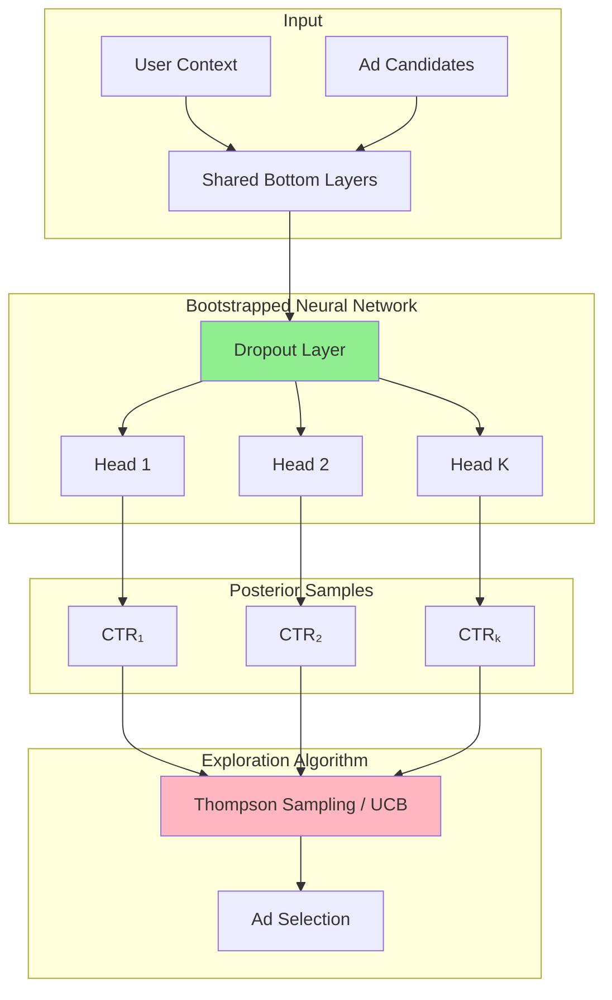
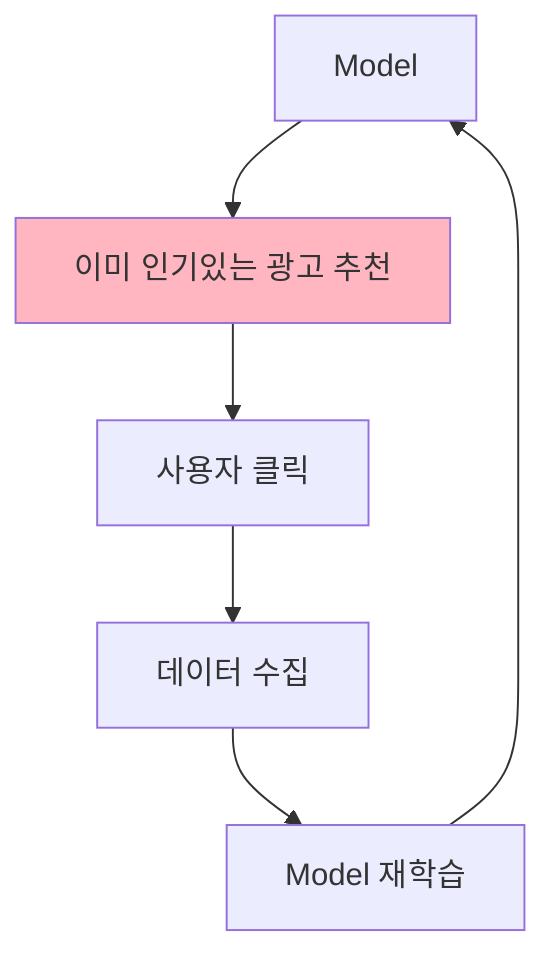
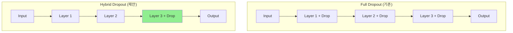

# A) 한줄 “요약

**Contextual Bandit + Bootstrapped Neural Network**로 CTR 예측의 불확실성을 추정하여 광고 추천에서 exploration을 수행.

- **저자**: Facebook (Dalin Guo, Sofia Ira Ktena, Ferenc Huszar 외)
- **발표**: RecSys 2020
- **핵심 기여**: 대규모 딥러닝 모델에서 불확실성 추정을 위한 Hybrid Dropout 방식 제안 및 production 배포

# B) 전체 구조

## B.1) 파이프라인



## B.2) 문제 정의

광고 추천을 **Contextual Bandit** 문제로 정의:

| 요소 | 광고 추천에서의 의미 |
|------|---------------------|
| Context $x$ | User features + Ad features |
| Action $a$ | 어떤 광고를 노출할지 선택 |
| Reward $r$ | 클릭 (1) 또는 미클릭 (0) |
| 목표 | 장기적 CTR 최대화 |

# C) 배경 지식

## C.1) Feedback Loop 문제 (Algorithmic Bias)

Continuous learning 시스템에서 발생하는 악순환:



**문제점**:
- 새로운 캠페인은 노출 기회가 없음
- 모델이 기존 인기 광고에만 greedy하게 행동
- 장기적으로 다양성 감소, 사용자 경험 저하

**해결책**: Exploration을 통해 새로운 광고도 탐색

## C.2) Exploration 알고리즘

### C.2.1) Thompson Sampling

Posterior 분포에서 sampling하여 action 선택:

```python
# Thompson Sampling
for each ad a:
    θ_a ~ P(θ|data)  # posterior에서 샘플링
    score_a = f(context, a; θ_a)  # CTR 예측

select ad with highest score
```

**장점**: 불확실한 광고에 자연스럽게 높은 탐색 확률 부여

### C.2.2) UCB (Upper Confidence Bound)

예측값 + 불확실성을 함께 고려:

$$\text{UCB}(a) = \hat{\mu}(a) + \beta \cdot \sigma(a)$$

- $\hat{\mu}(a)$: CTR 예측값 (exploitation)
- $\sigma(a)$: 예측 불확실성 (exploration)
- $\beta$: exploration 강도 조절

**"Optimism in the face of uncertainty"**: 불확실한 것에 대해 낙관적으로 행동

## C.3) 딥러닝에서 불확실성 추정이 어려운 이유

전통적 DNN은 **point estimate**만 제공:

```
Input → Neural Network → CTR = 0.15
                              ↑
                      불확실성 정보 없음
```

Bayesian approach가 필요하지만 계산 비용이 큼:
- Full Bayesian: Intractable
- Ensemble: 여러 모델 학습/추론 필요 → 비용 높음
- MC Dropout: 여러 forward pass 필요 → 느림

# D) 기존 방법의 한계

| 방법 | 설명 | 한계 |
|------|------|------|
| **ε-greedy** | 확률 ε로 random 탐색 | Context-aware 아님, 비효율적 |
| **Pure Bootstrapping** | 여러 모델 앙상블 | 학습/저장/추론 비용 높음 |
| **Full Dropout** | 모든 layer에서 dropout | 여러 full forward pass 필요 |

# E) 제안 방법

## E.1) Hybrid Dropout Architecture

**핵심 아이디어**: Dropout을 **마지막에서 두 번째 layer에만** 적용



## E.2) 동작 방식

### E.2.1) Training

일반 DNN과 동일하게 학습 (dropout regularization)

### E.2.2) Inference

```python
# Shared forward pass (1번만 실행)
hidden = model.forward_until_dropout(user_context, ad_features)

# Multiple dropout samples (병렬 실행 가능)
ctr_samples = []
for k in range(K):
    dropout_mask = sample_dropout()
    ctr_k = model.head_forward(hidden, dropout_mask)
    ctr_samples.append(ctr_k)

# Posterior statistics
mean_ctr = mean(ctr_samples)
std_ctr = std(ctr_samples)
```

### E.2.3) 계산 효율성

| 방법 | Forward Pass 횟수 | 추론 비용 |
|------|------------------|----------|
| Full Dropout | K번 (전체 network) | 높음 |
| Bootstrapping | K번 (K개 모델) | 매우 높음 |
| **Hybrid Dropout** | 1번 + K번 (last layer만) | **낮음** |

## E.3) Exploration 알고리즘 적용

### E.3.1) Hybrid Thompson Sampling

```python
def select_ad_thompson(user, candidates, model):
    hidden = model.forward_shared(user)

    best_ad, best_score = None, -inf
    for ad in candidates:
        # 한 번의 dropout sample로 CTR 예측
        ctr = model.forward_head_with_dropout(hidden, ad)
        if ctr > best_score:
            best_score = ctr
            best_ad = ad

    return best_ad
```

### E.3.2) Hybrid UCB

```python
def select_ad_ucb(user, candidates, model, beta=1.0):
    hidden = model.forward_shared(user)

    best_ad, best_ucb = None, -inf
    for ad in candidates:
        # K번의 dropout sample로 mean, std 계산
        samples = [model.forward_head_with_dropout(hidden, ad)
                   for _ in range(K)]
        mean_ctr = np.mean(samples)
        std_ctr = np.std(samples)

        ucb_score = mean_ctr + beta * std_ctr
        if ucb_score > best_ucb:
            best_ucb = ucb_score
            best_ad = ad

    return best_ad
```

# F) 실험

## F.1) Offline Simulation

- **데이터셋**: 공개 user-ads engagement 데이터셋
- **Baselines**: SGD (no exploration), ε-greedy, Full Bootstrap, Full Dropout

## F.2) Online A/B Test

Facebook production traffic에서 테스트:
- 대규모 광고 추천 시스템에 배포
- 실제 CTR, engagement 메트릭 측정

# G) 실험 결과

## G.1) 성능 비교

| 방법 | CTR 성능 | 계산 비용 |
|------|---------|----------|
| SGD (no exploration) | Baseline | 낮음 |
| Bootstrap UCB | **최고** | 매우 높음 |
| Full Dropout | 높음 | 높음 |
| **Hybrid Dropout** | Bootstrap 수준 | **낮음** |

## G.2) 핵심 발견

1. **Bootstrap UCB가 가장 높은 CTR** 달성 - 하지만 계산 비용 높음
2. **Hybrid 모델은 더 많은 epoch 필요** - 수렴 후에는 SGD UCB와 동등
3. **계산 효율성**: Hybrid가 같은 성능 대비 비용 훨씬 낮음
4. **Online 테스트에서 positive gain 확인**

## G.3) 실무적 시사점

- 즉각적인 production metric 개선은 관찰되지 않음
- 그러나 **장기적 모델 성능 향상** → 매출 증가 기대
- Exploration의 효과는 **장기적 관점**에서 평가해야 함

# H) 구현 고려사항

## H.1) Hyperparameters

| Parameter | 역할 | 고려사항 |
|-----------|------|---------|
| Dropout rate | 불확실성 크기 조절 | 높으면 더 많은 exploration |
| K (sample 수) | Posterior 근사 정확도 | 많을수록 정확하나 느림 |
| β (UCB) | Exploration 강도 | 도메인에 따라 튜닝 |

## H.2) Multi-head vs Dropout

둘 다 같은 효과:
- **Multi-head**: 물리적으로 K개 head 존재
- **Dropout**: K번 dropout sampling → 가상의 K개 head

Hybrid는 dropout을 사용하되 **마지막 layer에만** 적용하여 효율성 확보

# I) Related

- [[Thompson sampling]]
- [[UCB]]
- [[Contextual Bandit]]
- [[Exploration-Exploitation Tradeoff]]

# J) References

- [Deep Bayesian Bandits: Exploring in Online Personalized Recommendations (RecSys 2020)](https://arxiv.org/abs/2008.00727)
- [Deep Bayesian Bandits Showdown (Riquelme et al., 2018)](https://arxiv.org/abs/1802.09127) - 기초 연구
