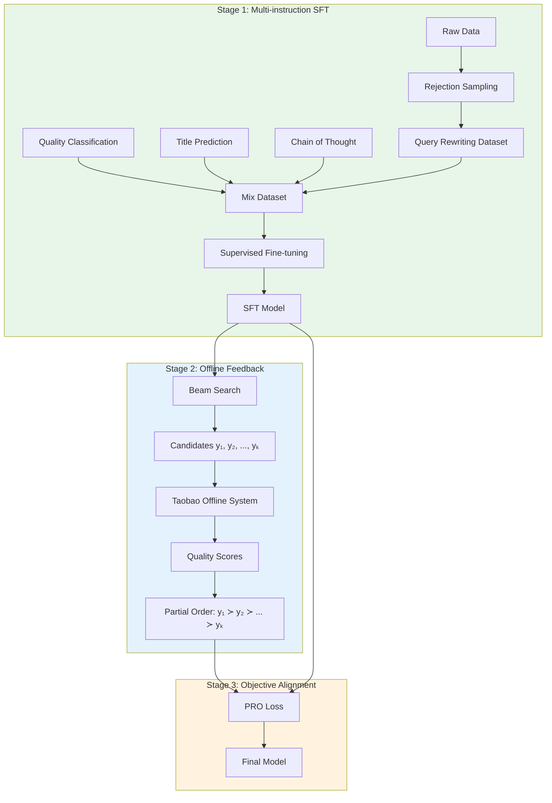
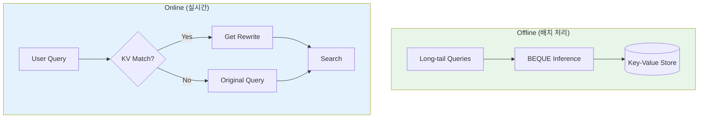

# A) 한줄 요약

**LLM 기반 3-stage fine-tuning으로 Long-tail Query의 semantic gap을 해결**하여 Taobao 검색에서 GMV +0.4%, few-recall query GMV +18.66% 달성.

- **저자**: Alibaba Taobao + USTC (2024)
- **발표**: WWW 2024
- **베이스 모델**: Qwen 7B
- **핵심 기여**: LLM을 산업용 Query Rewriting에 최초로 fine-tuning + Taobao offline system을 활용한 objective alignment

# B) 전체 구조

## B.1) 문제 정의: Semantic Gap

Long-tail query에서 발생하는 **semantic gap** 문제:

```python
User query: "자가제작 블라인드 박스" (self-building blind box)
                ↓
     Inverted Index 검색
                ↓
     "DIY"와 "자가제작" 매칭 실패 → few-recall
                ↓
     사용자 경험 저하
```

**해결책**: Query Rewriting으로 "자가제작" → "DIY"로 변환

## B.2) BEQUE 3-Stage Framework



# C) 배경 지식

## C.1) Query Rewriting 방법론

| 방법                     | 설명                        | 한계                                |
| ---------------------- | ------------------------- | --------------------------------- |
| **Discriminative**     | 후보 set에서 유사 term 선택       | Long-tail에 후보 없음 (Matthew effect) |
| **Generative (Small)** | Seq2seq로 rewrite 생성       | 작은 모델 → long-tail 이해 부족           |
| **LLM (no fine-tune)** | Prompt로 query 확장          | Task 특화 안 됨, hallucination        |
| **BEQUE**              | LLM + 3-stage fine-tuning | Long-tail 최적화 + 목표 정렬             |

## C.2) Long-tail Query의 특징

```python
Query 빈도 분포:
  Top (70%+ 관련 상품)   → 기존 방법으로 충분
  Torso (10-70% 관련)   → 개선 필요
  Tail (10% 미만 관련)  → few-recall 심각 ← BEQUE 타겟
```

# D) 기존 방법의 한계

| 방법 | 한계 |
|------|------|
| **CLE-QR** (Taobao 이전 세대) | Discriminative → long-tail 최적화 부족 |
| **BART** | 작은 모델 → semantic 확장 제한 |
| **Query2Doc (ChatGPT)** | Fine-tuning 없음 → relevance는 좋지만 increment 부족 |
| **RL 기반** | Reward model bias → 불안정 |

# E) 제안 방법

## E.1) Stage 1: Multi-instruction SFT

### E.1.1) Query Rewriting Dataset 구축

**Rejection Sampling**으로 품질 필터링:

```python
초기 데이터 D (20M records)
        ↓
    Relevance Filter: rele(x, y) > τ_rele
        ↓
    Increment Filter: incr(x, y) > τ_incr
        ↓
    최종 D_sft (419,806 pairs)
```

### E.1.2) Auxiliary Tasks

| Task | Prompt 예시 | 목적 |
|------|------------|------|
| **Quality Classification** | "Is this a good rewrite? Query: {q}, Rewrite: {r}" | 품질 판단 능력 |
| **Title Prediction** | "Generate product title for: {query}" | 상품 이해 |
| **Chain of Thought** | "Rewrite with reasoning: {query}" | 추론 능력 |

### E.1.3) SFT Loss

$$\mathcal{L}_{SFT}(\theta) = -\mathbb{E}_{(x,y) \sim \mathcal{D}_{msft}} \sum_{i=1} \log \pi(y_i | y_{0:i-1}, x; \theta)$$

## E.2) Stage 2: Offline Feedback

### E.2.1) Candidate 생성

SFT 모델로 beam search → 각 query당 k개 candidate rewrite 생성

### E.2.2) Taobao Offline System

실제 Taobao 검색 시스템을 시뮬레이션하여 rewrite 품질 평가:


### E.2.3) 3가지 품질 메트릭

| Metric | 수식 | 의미 |
| --- | --- | --- |
| **Relevance** | $rac{\sum_i \mathbb{1}_{f(x, z_y^i) > 	au'}}{\lvert Z_y 
vert}$ | Rewrite로 검색된 상품이 원래 query와 관련 있는 비율 |
| **Increment** | $rac{\sum_i \mathbb{1}_{f(x, z_{xy}^i) > 	au'}}{\sum_i \mathbb{1}_{f(x, z_x^i) > 	au'}}$ | Rewrite로 인한 관련 상품 증가율 |
| **Hitrate** | $rac{\lvert E \cap (Z_x \cup Z_y) 
vert}{\sum_i \mathbb{1}_{f(x, e_i) > 	au'}}$ | Semantic gap 보완 능력 |

- $Z_x$, $Z_y$: query x, rewrite y로 검색된 상품 집합
- $E$: 사용자가 검색 외 시나리오에서 거래한 상품 (ground truth)
- $f(\cdot)$: Taobao relevance function

## E.3) Stage 3: Objective Alignment (PRO)

**PRO (Preference Rank Optimization)**: Bradley-Terry 모델 기반 contrastive learning

### E.3.1) Partial Order 학습

Offline feedback으로 얻은 순서: $y_1 \succ y_2 \succ ... \succ y_k$

$$\mathcal{L}_{PRO}(\theta) = -\mathbb{E}_{(x,y) \sim \mathcal{D}_{PRO}} \sum_{k=1}^{n-1} \log \frac{\exp(\frac{\pi_{PRO}(y_k|x;\theta)}{T_k^k})}{\sum_{i=k}^{n} \exp(\frac{\pi_{PRO}(y_i|x;\theta)}{T_k^i})}$$

- $T_k^i = 1/(r(y_k) - r(y_i))$: ranking 차이에 따른 temperature

### E.3.2) 최종 Loss

$$\mathcal{L}_{ALIGN} = \mathcal{L}_{SFT} + \lambda \mathcal{L}_{PRO}$$

SFT loss를 함께 유지하여 정상적인 출력 능력 보존

# F) Online Serving

LLM의 latency 문제 해결:



- **Offline**: Torso/Tail query에 대해 미리 rewrite 생성 → KV store 저장
- **Coverage**: Taobao main search PV의 **27%** 커버
- **Latency 영향**: 최소화

# G) 실험 결과

## G.1) Offline 성능 비교

| Method | rele (%) | incr (%) | hitrate (%) |
|--------|----------|----------|-------------|
| CLE-QR (이전 세대) | 69.6 | 90.0 | 12.95 |
| BART | 62.2 | 100.0 | 13.56 |
| Q2D (ChatGPT) | 66.7 | 45.5 | 14.73 |
| Qwen (SFT only) | 61.4 | 109.6 | 14.58 |
| RL (incr) | 42.5 | 75.9 | 14.22 |
| **BEQUE (incr)** | **57.7** | **198.7** | **17.27** |

**핵심 발견**:
- Generative > Discriminative (long-tail에서)
- LLM > Small model (semantic 확장)
- BEQUE > RL (reward model bias 회피)

## G.2) Online A/B Test (14일)

| Traffic | GMV | #Trans | UV |
|---------|-----|--------|-----|
| All queries | +0.40% | +0.34% | +0.33% |
| Covered queries (27%) | +2.96% | +1.36% | +1.22% |
| Long-tail queries | +1.57% | +2.52% | +2.32% |
| **Few-recall queries** | **+18.66%** | **+5.90%** | **+6.25%** |

## G.3) Ablation Study

### G.3.1) Multi-instruction 효과

| Method | rele | incr | hitrate |
|--------|------|------|---------|
| Qwen w/o MI | 61.4 | 109.6 | 14.58 |
| Qwen w/ MI | 62.6 | 133.2 | 15.63 |

### G.3.2) Contrastive Candidate 수

| Number | rele | incr | hitrate |
|--------|------|------|---------|
| 2 | 53.3 | 215.6 | 17.66 |
| 4 | 57.7 | 198.7 | 17.27 |
| 5 | 58.8 | 190.3 | 17.21 |

→ Candidate 많을수록 relevance ↑, increment ↓ (trade-off)

# H) 실무적 시사점

1. **Rejection Sampling이 핵심**: 단순 online log보다 품질 필터링된 데이터가 효과적
2. **Auxiliary Tasks가 도움**: Quality classification, CoT 등이 LLM 이해력 향상
3. **RL보다 Contrastive Learning**: Reward model bias 없이 직접 partial order 학습
4. **Offline Serving으로 Latency 해결**: LLM을 실시간 서빙하지 않고 KV store 활용
5. **Few-recall에서 가장 큰 효과**: +18.66% GMV는 매우 의미 있는 개선

# I) 한계 및 Future Work

- **Coverage 제한**: 27% PV만 커버 (나머지는 KV miss)
- **Latency**: 실시간 LLM 서빙은 여전히 어려움
- **Relevance-Increment Trade-off**: 동시 최적화 어려움

# J) Related

- [[Query Rewriting]]
- [[Preference Alignment]]
- [[retrieval/ranking/Large Scale Deployment of BERT Based Cross Encoder Model for Re-Ranking in Walmart Search Engine|Walmart Cross Encoder]]

# K) References

- [Large Language Model based Long-tail Query Rewriting in Taobao Search (WWW 2024)](https://arxiv.org/abs/2311.03758)
