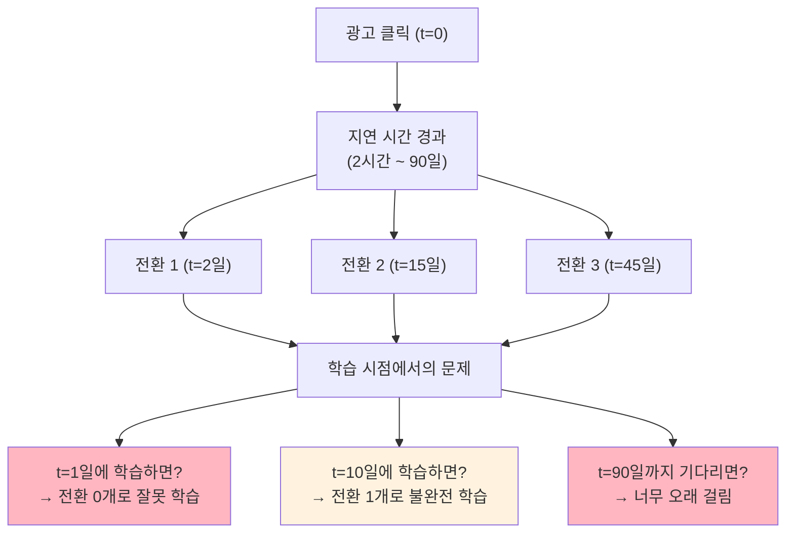
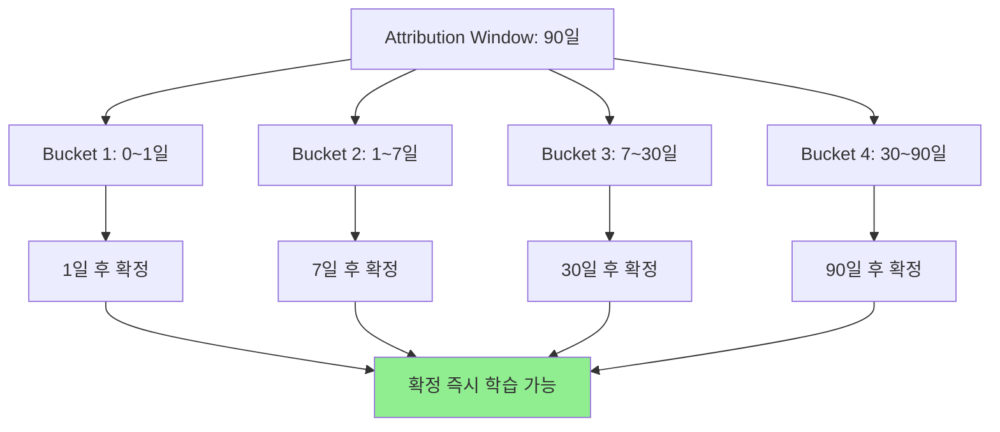
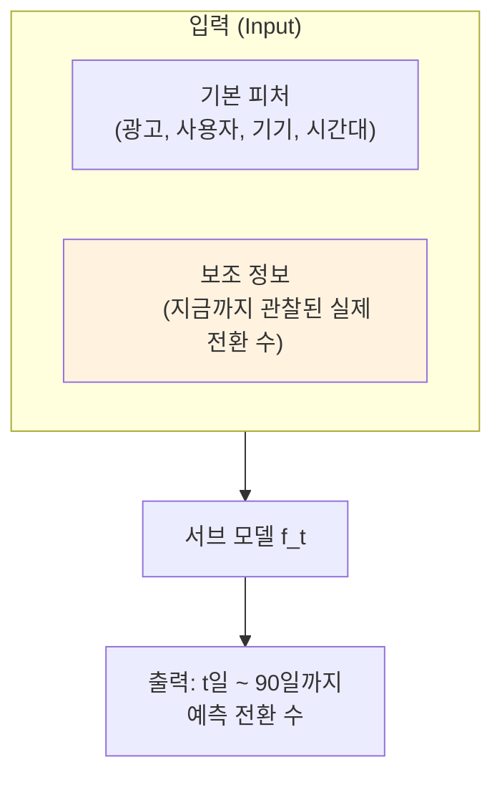
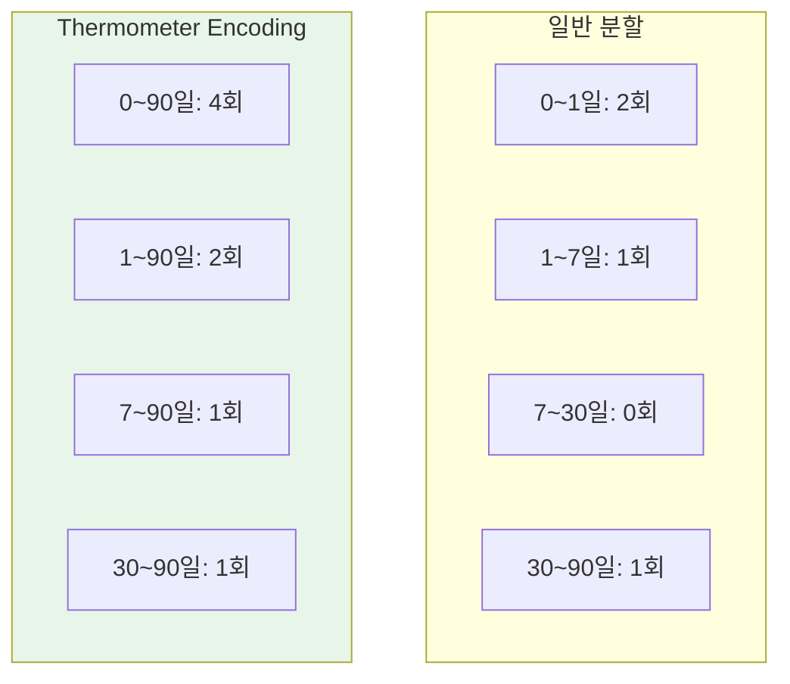
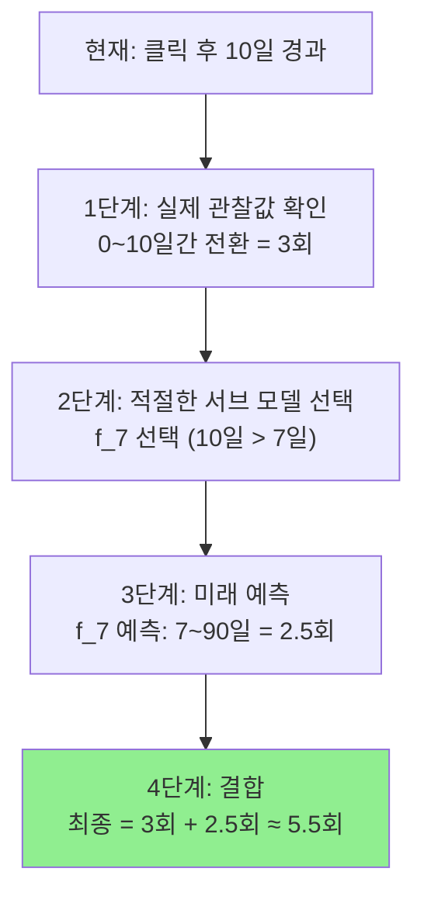

# A) 핵심 요약

광고 클릭 후 전환(구매, 앱 설치)까지 **시간 지연**이 발생하고, 하나의 클릭이 **여러 번의 전환**으로 이어질 수 있는 문제를 해결하는 모델. 전환 추적 기간을 여러 구간으로 나누어 각각 **서브 모델**을 학습하고, **이미 관찰된 전환 정보**를 입력으로 활용하여 미래 전환을 예측한다.

# B) 문제 정의

## B.1) Delayed Feedback 문제



## B.2) 온라인 학습에서의 문제

실시간에 가까운 데이터로 모델을 학습하는 환경에서:
- 아직 전환이 발생하지 않은 클릭을 **Negative로 잘못 학습**할 위험
- 모델 성능 저하

## B.3) Attribution Window (전환 추적 기간)

광고주가 설정하는 **"클릭 후 얼마 동안의 전환을 인정할 것인가"** 기간

| 항목 | 설명 |
|------|------|
| 범위 | 2시간 ~ 90일 |
| 의미 | 이 기간 내 발생한 전환만 해당 광고의 성과로 인정 |
| 완전히 확인된 데이터 | Attribution Window가 모두 지난 데이터 |

**예시:**
```python
클릭 발생: 10월 1일
Attribution Window: 30일
→ 전환 집계 마감: 10월 31일
→ 완전히 확인된 데이터: 11월 1일부터
```

# C) 제안 방법

## C.1) 핵심 아이디어 3가지

| 아이디어 | 설명 | 효과 |
|----------|------|------|
| **지연 시간별 레이블 분할** | 전체 기간을 여러 구간(bucket)으로 나눔 | 확정된 데이터만으로 학습 가능 |
| **Thermometer Encoding** | 레이블을 겹치는 구간으로 표현 | 데이터 효율성, 추론 비용 감소 |
| **보조 정보 활용** | 관찰된 전환을 입력으로 사용 | 예측 정확도, 안정성 향상 |

## C.2) 지연 버킷 (Delay Buckets) 분할

전체 Attribution Window를 작은 구간으로 나누어 점진적으로 학습:



**장점**: 전체 기간(90일)을 기다리지 않고, 각 구간이 확정될 때마다 점진적으로 학습

## C.3) 서브 모델 구조

각 지연 시점마다 별도의 서브 모델 생성:

| 서브 모델 | 입력 시점 | 예측 대상 |
|-----------|----------|----------|
| **f_1** | 클릭 후 1일 | 1일 ~ 90일 전환 |
| **f_7** | 클릭 후 7일 | 7일 ~ 90일 전환 |
| **f_30** | 클릭 후 30일 | 30일 ~ 90일 전환 |

각 서브 모델은 해당 시점까지의 정보로 **남은 기간의 전환**을 예측하는 "전문가"

## C.4) 서브 모델의 입력과 출력



**보조 정보가 핵심!**
- f_7 모델의 입력: `[기본 피처] + [0~7일간 실제 전환 수]`
- "초반에 전환이 많았으면, 앞으로도 더 일어날 가능성 높다" 학습 가능

## C.5) Thermometer Encoding

일반적인 구간 분할 vs Thermometer Encoding:



**장점**:
- 각 서브 모델이 **누적 전환**을 예측 → 데이터 희소성 문제 완화
- 특정 짧은 구간에 전환이 없어도 안정적으로 학습

## C.6) 최종 예측 방법

**실제 관찰값 + 가장 적절한 서브 모델의 예측값**



**예시 시나리오:**

| 단계 | 내용 |
|------|------|
| 상황 | 클릭 후 10일 경과, 90일까지 총 전환 예측 필요 |
| 실제 관찰 | 0~10일간 3회 전환 발생 |
| 모델 선택 | f_7 (10일 > 7일이므로 사용 가능한 최신 모델) |
| 모델 입력 | [기본 피처] + [0~7일간 실제 전환] |
| 모델 예측 | 7~90일간 2.5회 추가 전환 예상 |
| **최종 예측** | **3회 (실제) + 2.5회 (예측) = 5.5회** |

**핵심 원리:**
- 이미 일어난 사실은 그대로 인정
- 모르는 미래만 서브 모델에게 질문
- 시간이 지날수록 예측이 점점 정확해짐

# D) 실험 결과

## D.1) 실험 환경

| 항목 | 내용 |
|------|------|
| 데이터 | 상업용 모바일 앱 스토어의 앱 설치 광고 |
| 평가 지표 | 예측 정확도, 편향성 |

## D.2) 결과 요약

| 상황 | 성능 |
|------|------|
| 전반적 | 기존 모델 대비 정확도, 편향성 모두 우수 |
| **전환 지연이 긴 캠페인** | 특히 뛰어난 성능 |
| **데이터가 적은 새 캠페인** | 특히 뛰어난 성능 |

# E) 실무적 시사점

## E.1) 적용 가능 분야

| 분야 | 예시 |
|------|------|
| 온라인 광고 | 전환 가치 예측, 예산 최적화 |
| 추천 시스템 | 지연된 피드백이 있는 모든 경우 |
| 구독 서비스 | 가입 후 결제 전환 예측 |

## E.2) 핵심 설계 원칙

1. **점진적 학습**: 전체 기간 대기 X → 확정된 구간부터 즉시 학습
2. **보조 정보 활용**: 과거 관찰값을 입력으로 → 예측 정확도 향상
3. **누적 레이블 (Thermometer)**: 희소 데이터 문제 완화
4. **실제 + 예측 결합**: 확정된 부분은 실제값, 미래만 예측

# F) Related

- [[delayed feedback]]
- [[attribution modeling]]
- [[online learning]]

# G) References

- 논문 원문 링크 필요
