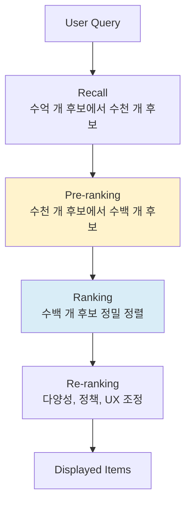
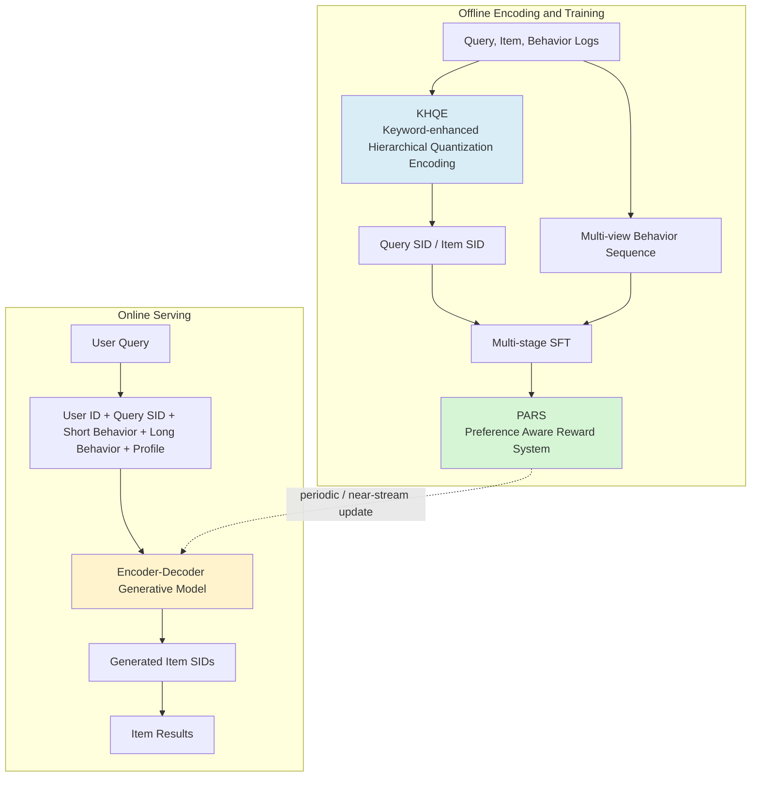

# A) 한줄 요약

**OneSearch** 는 Kuaishou가 제안한 e-commerce search용 end-to-end generative retrieval framework이다. 기존 [[retrieval/ranking/Cascade Ranking System]] 처럼 recall, pre-ranking, ranking을 따로 쌓는 대신, user, query, behavior sequence를 넣고 item의 discrete semantic ID를 직접 생성한다.

핵심은 "LLM으로 자연어 답변을 생성한다"가 아니다. 검색 결과로 보여줄 **item ID sequence를 생성** 하고, 이 ID 체계를 상품 속성, 사용자 행동, 비즈니스 feedback에 맞게 설계한다. 그래서 이 논문은 generative retrieval을 실제 대규모 e-commerce serving에 넣어 본 꽤 중요한 산업 논문에 가깝다.

- **논문**: OneSearch: A Preliminary Exploration of the Unified End-to-End Generative Framework for E-commerce Search
- **저자/소속**: Ben Chen, Xian Guo, Siyuan Wang 등, Kuaishou Technology
- **학회**: ICML 2026
- **arXiv**: 2509.03236, v5 기준 2025-10-22
- **도메인**: Kuaishou e-commerce search
- **핵심 키워드**: generative retrieval, semantic ID, RQ-OPQ, user behavior sequence, preference-aware reward system

# B) 왜 이 논문이 흥미로운가

대규모 e-commerce search는 보통 **MCA(Multi-stage Cascading Architecture)** 로 운영된다. 말 그대로 후보를 한 번에 정렬하지 않고, 여러 stage를 거치며 점점 줄이는 funnel 구조다.



이 구조는 빠르고 검증된 방식이다. 수억 개 상품 전체에 무거운 ranking model을 바로 태울 수 없으므로, recall은 넓게 후보를 모으고, pre-ranking은 가볍게 줄이고, ranking은 좁혀진 후보만 정밀하게 본다.

하지만 단계별 목표가 조금씩 다르다. recall과 pre-ranking은 좋은 후보를 놓치지 않는 것이 중요하고, ranking은 이미 좁혀진 후보 사이에서 정확한 순서를 만드는 것이 중요하다. 이 차이 때문에 [[retrieval/ranking/Seesaw Effect]] 와 비슷한 문제가 생긴다.

OneSearch의 문제의식은 단순하다.

> 앞단에서 진짜 좋은 상품이 잘려 나가면, 뒤의 ranking model이 아무리 좋아도 복구할 수 없다.

논문은 이를 "fragmented compute"와 "objective collision"으로 설명한다. compute는 모델 계산보다 stage 간 통신, 저장, feature serving에 많이 쓰이고, objective는 stage마다 달라 최종 business metric과 일관되게 최적화되기 어렵다.

# C) 전체 구조

OneSearch는 검색을 "query와 user context를 보고 item semantic ID를 생성하는 문제"로 바꾼다.



구성 요소는 네 가지다.

1. **KHQE**: query와 item을 keyword-enhanced semantic ID로 바꾼다.
2. **Multi-view Behavior Sequence Injection**: 사용자의 최근 행동과 장기 행동을 서로 다른 방식으로 모델에 넣는다.
3. **Unified Encoder-Decoder Architecture**: user, query, behavior를 encode하고 item SID를 decode한다.
4. **PARS**: SFT와 reward 기반 preference alignment로 relevance와 personalization을 함께 맞춘다.

# D) 핵심 아이디어

## D.1) KHQE: 상품 ID를 그냥 숫자로 만들지 않는다

Generative retrieval에서 가장 중요한 질문은 "문서나 상품을 어떤 token으로 표현할 것인가"이다. 단순한 semantic ID는 비슷한 상품을 같은 cluster로 묶을 수 있지만, e-commerce search에서는 이게 위험하다. 사용자는 "검정 나이키 운동화", "여성용 실버 반지", "아이폰 15 케이스"처럼 짧고 속성 중심의 query를 넣는다. 색상, 브랜드, 모델, 용도 하나만 틀려도 relevance 문제가 된다.

OneSearch의 KHQE는 세 단계를 섞는다.

| 단계 | 역할 |
| --- | --- |
| semantic and collaborative alignment | query-item interaction log와 content embedding을 맞춰 검색 행동을 반영한 표현을 만든다 |
| core keyword enhancement | 브랜드, 색상, 모델, 가격대, 계절, 소재 같은 핵심 속성이 semantic ID에 더 강하게 들어가도록 한다 |
| RQ-OPQ tokenization | RQ-Kmeans로 계층적 의미를 잡고, OPQ로 residual unique feature를 보존한다 |

논문은 18개 structured attribute를 사용한다. 예를 들면 brand, material, style, function, audience, color, season, price, model 같은 속성이다. item 쪽은 Qwen-VL로 keyword를 식별하고, query 쪽은 Aho-Corasick automaton으로 실시간 matching을 수행한다.

### D.1.1) Aho-Corasick는 query keyword를 빠르게 찾는 장치다

**Aho-Corasick automaton** 은 여러 keyword를 한 번에 찾는 string matching 알고리즘이다. 하나의 keyword를 찾을 때는 단순 검색으로 충분하지만, e-commerce search에서는 "나이키", "아디다스", "검정", "아이폰 15", "실버", "여성용" 같은 keyword dictionary가 매우 크다.

이때 query를 keyword마다 따로 훑으면 느리다. Aho-Corasick는 keyword dictionary를 trie와 failure link 형태로 미리 컴파일해 두고, query 문자열을 한 번만 왼쪽에서 오른쪽으로 읽으면서 매칭되는 모든 keyword를 찾는다.

예를 들면 dictionary가 다음과 같다고 하자.

```text
brand:  나이키, 아디다스, 애플
color:  검정, 흰색, 실버
model:  아이폰 15, 갤럭시 S24
category: 운동화, 케이스, 반지
```

사용자가 `검정 나이키 운동화`를 입력하면 Aho-Corasick는 한 번의 scan으로 다음 keyword를 찾는다.

```text
query = "검정 나이키 운동화"
matches = {
  color: "검정",
  brand: "나이키",
  category: "운동화"
}
```

즉 Aho-Corasick 자체가 semantic model은 아니다. **query 안에 어떤 구조화 속성 keyword가 들어 있는지 빠르게 찾는 deterministic matcher** 에 가깝다. OneSearch에서는 이 keyword들이 query embedding과 SID 생성에 들어가서, 짧은 query의 핵심 속성이 semantic ID에서 희석되지 않게 돕는다.

### D.1.2) RQ-Kmeans는 embedding을 여러 단계 cluster ID로 바꾼다

`RQ-Kmeans`는 Residual Quantization K-means로 이해하면 된다. 기본 [[machine_learning/K-means|K-means]] 는 vector를 가장 가까운 centroid ID 하나로 바꾼다. RQ-Kmeans는 여기서 끝내지 않고, 첫 centroid로 설명하지 못한 residual을 다시 다음 K-means로 보낸다.

흐름은 이렇다.

```text
v = keyword-enhanced item embedding

1단계: v와 가장 가까운 coarse centroid 선택
      token_1 = 1832
      residual_1 = v - centroid_1832

2단계: residual_1과 가장 가까운 centroid 선택
      token_2 = 77
      residual_2 = residual_1 - centroid_77

3단계: residual_2와 가장 가까운 centroid 선택
      token_3 = 401
      residual_3 = residual_2 - centroid_401
```

논문에서 RQ codebook 크기는 `4096 -> 1024 -> 512`다. 그래서 첫 token은 4096개 cluster 중 하나, 두 번째 token은 1024개 residual cluster 중 하나, 세 번째 token은 512개 residual cluster 중 하나를 고른다.

직관적으로는 앞 token일수록 큰 의미 단위에 가깝고, 뒤 token일수록 더 세밀한 차이를 담는다. 다만 `token_1 = 운동화`, `token_2 = 러닝화`처럼 사람이 읽을 수 있는 label이 붙어 있는 것은 아니다. 실제로는 embedding space의 centroid 번호다.

### D.1.3) item SID sequence는 RQ token과 OPQ token을 이어 붙인 것이다

최종 tokenization은 대략 다음처럼 이해하면 된다. 아래 숫자는 논문에 공개된 실제 상품 ID가 아니라, 구조를 설명하기 위한 가상 예시다.

```text
item:
  title: "나이키 에어 줌 검정 남성 러닝화"
  structured keywords:
    brand: "나이키"
    color: "검정"
    audience: "남성"
    category: "러닝화"

keyword-enhanced embedding
  -> RQ-Kmeans level 1, codebook 4096: 1832
  -> RQ-Kmeans level 2, codebook 1024: 77
  -> RQ-Kmeans level 3, codebook 512: 401
  -> OPQ residual level 1, codebook 256: 23
  -> OPQ residual level 2, codebook 256: 198

item SID sequence:
  [RQ1_1832, RQ2_77, RQ3_401, OPQ1_23, OPQ2_198]
```

즉 앞의 RQ token은 coarse-to-fine semantic cluster를 담고, 뒤의 OPQ token은 비슷한 상품 사이의 residual unique feature를 보존한다. OPQ는 [[retrieval/indexing/faiss|Product Quantization]] 계열의 아이디어로, vector를 더 작은 코드 조합으로 표현해 세부 차이를 남기는 방식이라고 보면 된다.

e-commerce에서는 이 residual 구분이 중요하다. 같은 "나이키 운동화"라도 모델, 색상, 성별, 사이즈, 가격대가 다르면 검색 품질이 바로 흔들리기 때문이다.

온라인 생성 단계에서 decoder는 자연어 문장을 만드는 대신 이런 SID sequence를 만든다.

```text
input:
  user profile + query("검정 나이키 운동화") + short/long behavior

decoder output:
  [RQ1_1832, RQ2_77, RQ3_401, OPQ1_23, OPQ2_198]
  [RQ1_1832, RQ2_91, RQ3_12,  OPQ1_88, OPQ2_7]
  ...
```

이 SID sequence를 catalog의 실제 item ID로 다시 매핑하면 사용자에게 보여줄 상품 목록이 된다. 그래서 OneSearch의 생성은 "답변 문장 생성"이 아니라 **상품을 가리키는 압축된 주소 sequence 생성** 에 가깝다.

## D.2) User behavior를 세 가지 관점으로 넣는다

검색은 query만 보면 부족하다. 같은 "silver ring"이라는 query라도 사용자가 최근에 커플 신발과 발렌타인 선물을 봤다면 커플링을 원할 수 있고, 다른 사용자는 단순 액세서리를 원할 수 있다.

OneSearch는 user behavior를 세 가지로 넣는다.

| 구성 | 의미 |
| --- | --- |
| behavior sequence constructed user ID | 사용자의 행동 sequence로 user ID를 구성한다 |
| explicit short behavior sequence | 최근 query와 최근 click item SID를 prompt에 직접 넣는다 |
| implicit long behavior sequence | click, order, RSU sequence를 centroid vector로 aggregation해서 장기 취향을 넣는다 |

짧은 행동은 최근 intent를 잡고, 긴 행동은 사용자의 안정적인 profile을 잡는다. 논문은 cold-start user에 대해서는 query-item occurrence와 PV를 기반으로 default behavior sequence를 구성한다.

## D.3) Encoder-decoder가 item list를 직접 생성한다

입력은 다음과 비슷하다.

```text
[user distinctive ID]
[entered query + query SID]
[short query behavior sequence]
[short clicked item sequence]
[implicit long behavior representation]
[user profile]
```

출력은 자연어가 아니라 item SID list다. 논문은 encoder-decoder model을 실제 online deployment에 사용했다고 설명한다. constrained beam search를 쓰면 valid SID로 출력을 제한할 수 있지만 latency가 늘고, unconstrained decoding은 더 자유롭지만 invalid SID나 relevance 문제가 생길 수 있다. 그래서 serving에서는 beam size, SID 체계, reward model이 모두 같이 설계되어야 한다.

## D.4) PARS: relevance와 preference를 같이 맞춘다

OneSearch의 training은 단순히 query에서 item ID를 맞히는 supervised learning으로 끝나지 않는다. 논문은 **Preference Aware Reward System (PARS)** 를 둔다.

먼저 multi-stage SFT를 한다.

1. **Semantic Content Alignment**: text에서 SID를 만들고, SID에서 text를 복원하며, category를 예측한다.
2. **Co-occurrence Synchronization**: query와 item, query SID와 item SID 사이의 상호 예측을 학습한다.
3. **User Personalization Modeling**: online inference와 같은 입력 형식으로 user-aware item SID generation을 학습한다.

그 다음 adaptive reward system을 쓴다. 사용자 행동을 여섯 단계로 나눠 reward를 만든다.

| Feedback level | 직관 |
| --- | --- |
| search scenario purchase | 가장 강한 positive |
| same-category purchase in recommendation | 검색 밖에서도 관련 있는 강한 signal |
| click | 약한 positive |
| exposed but not clicked | 약한 negative |
| unshown item in same category | hard negative에 가까운 후보 |
| random item from other category | 쉬운 negative |

CTR과 CVR도 쓰지만 그대로 믿지는 않는다. 신규 item의 CTR은 노출 한 번에 클릭 한 번만 있어도 100%가 될 수 있고, 인기 item은 여러 부정확한 query에 노출되어 오히려 CTR이 낮아질 수 있다. 그래서 논문은 calibrated reward를 만들고, CTR, CVR, CTCVR을 학습하는 three-tower reward model과 query-item relevance score를 함께 사용한다.

마지막 alignment는 list-wise DPO에 가깝다. reward model로 OneSearch의 출력을 재정렬한 뒤, position이 올라가거나 click된 item을 positive로, 밀려난 item을 negative로 삼는다. 이후에는 실제 user interaction 기반 preference learning을 near-stream에 가깝게 업데이트한다.

# E) 실험 결과

## E.1) Offline

데이터는 2025년 5월부터 8월까지 Kuaishou mall search platform에서 추출한 약 1B PV 규모의 user interaction log다. 91일 중 90일은 학습, 마지막 1일은 테스트로 썼다.

가장 눈에 띄는 결과는 recall과 ranking 사이의 차이다. 여기서 `Online MCA`는 Kuaishou가 실제 운영하던 기존 multi-stage search system이고, `MCA without ranking`은 그중 마지막 ranking stage를 뺀 baseline이다.

| Method | Order HR@350 | Order MRR@350 | Click HR@350 | Click MRR@350 |
| --- | ---: | ---: | ---: | ---: |
| Online MCA | 51.74% | 19.26% | 64.40% | 16.89% |
| MCA without ranking | 75.75% | 4.19% | 80.23% | 3.00% |
| OneSearch final | 66.46% | 18.38% | 71.06% | 16.33% |

`MCA without ranking`은 hitrate는 높지만 MRR이 크게 낮다. 이는 pre-ranking이 "좋은 후보를 많이 모으는" 데는 강하지만, 의도에 맞는 item을 상단에 놓는 능력은 약하다는 뜻이다. 반대로 full MCA는 ranking이 강하지만 앞단에서 버린 item은 복구하지 못한다.

OneSearch final은 Online MCA보다 HR@350이 높고, MRR은 거의 비슷한 수준까지 따라온다. 논문은 이를 "candidate coverage를 넓히면서 ranking capability를 유지했다"는 근거로 본다.

## E.2) Online A/B Test

온라인 실험은 더 중요하다. 논문이 주장하는 주요 수치는 다음과 같다.

| 설정 | 결과 |
| --- | --- |
| RQ-OPQ와 long behavior sequence를 넣은 pure OneSearch | item CTR +1.45%, PV CTR +1.40% |
| reward model selection까지 포함 | item CTR +1.67%, PV CTR +3.14%, PV CVR +1.78%, buyers +2.40%, order volume +3.22% |
| MCA에서 ranking stage 제거 | item CTR -9.97%, order volume -39.14% |

즉 OneSearch가 단순히 recall source 하나를 추가한 것이 아니라, 전체 ranking 품질과 business conversion에 영향을 줬다는 주장이다.

Serving 효율도 꽤 강하게 주장한다.

| Metric | Online MCA | OneSearch |
| --- | ---: | ---: |
| MFU | 3.26% | 27.32% |
| OPEX | 100% 기준 | 24.60% |

OPEX는 기존 online search pipeline 대비 75.40% 줄었다고 보고한다. 논문은 multi-stage system에서 통신과 feature serving overhead가 컸고, OneSearch가 이를 줄여 GPU 연산 활용률을 높였다고 해석한다.

## E.3) Deployment 범위

논문 기준 OneSearch는 Kuaishou에서 다음 범위로 배포되었다.

- detail page search: 전체 traffic
- mall search: 50% traffic
- homepage e-commerce search: 20% traffic

또한 수백만 user와 하루 수천만 PV를 처리한다고 보고한다. 이 부분 때문에 이 논문은 toy generative retrieval 논문보다 실무적 가치가 크다.

# F) 실무적으로 읽을 포인트

## F.1) "LLM search"가 아니라 "ID generation serving"이다

OneSearch를 RAG처럼 생각하면 헷갈린다. 모델은 상품 설명을 생성하지 않는다. 상품을 가리키는 SID를 생성한다. 따라서 hallucination 문제도 일반 LLM 답변 생성과 다르게 나타난다.

문제는 "문장을 그럴듯하게 지어내는가"가 아니라 다음 쪽이다.

- valid item SID를 생성하는가
- query의 핵심 속성과 item 속성이 맞는가
- cold-start item을 과하게 죽이지 않는가
- user behavior를 personalization으로 쓰되 relevance를 깨지 않는가
- beam search와 reward selection을 latency budget 안에 넣을 수 있는가

그래서 이 논문은 [[retrieval/rag/Retrieval-Augmented Generation]]보다 generative retrieval, recommendation, ranking system 설계 쪽에 더 가깝다.

## F.2) 생성 모델로 cascade를 없애려면 ID 체계가 거의 전부다

OneSearch의 진짜 contribution은 transformer를 썼다는 점이 아니다. 핵심은 e-commerce search에 맞는 ID 체계를 만든 것이다.

`RQ-Kmeans`만 쓰면 비슷한 item이 같은 SID로 뭉쳐 fine-grained attribute를 잃기 쉽다. `OPQ`만 쓰면 hierarchy가 약해진다. OneSearch는 RQ로 semantic hierarchy를 만들고 OPQ로 residual uniqueness를 남긴다. 여기에 core keyword enhancement를 넣어 brand, color, model 같은 핵심 속성이 사라지지 않게 한다.

이 구조는 [[retrieval/e-commerce/GRAM - Generative Retrieval and Alignment Model]]과도 연결된다. GRAM이 query와 product의 shared text identifier를 만들려는 시도라면, OneSearch는 더 serving-oriented하게 SID를 hierarchical quantization과 user behavior로 확장한 형태로 볼 수 있다.

## F.3) 기존 ranking model을 완전히 버린 것은 아니다

논문이 "end-to-end"라고 말하지만, 기존 MCA의 지식을 완전히 버리지는 않는다. reward model은 기존 online MCA ranking model의 ranking order를 distill할 수 있고, relevance score도 별도로 강하게 반영한다.

이게 실무적으로는 자연스럽다. 기존 system은 수년 동안 수많은 edge case를 품고 있다. generative model이 처음부터 그것을 모두 이기기는 어렵다. OneSearch는 처음에는 기존 system의 분포와 ranking 지식을 흡수하고, 이후 실제 user interaction으로 더 가까운 streaming update를 시도한다.

## F.4) cold-start와 long-tail에서 장점이 나온다

논문은 cold-start item과 user에서 개선폭이 더 크다고 보고한다.

| Object | Warm | Cold | Average |
| --- | ---: | ---: | ---: |
| Item CTR gain | +2.34% | +3.31% | +2.52% |
| User CTR gain | +1.11% | +2.50% | +2.41% |

전통적 cascade는 interaction이 적은 item이나 user에 약하다. OneSearch는 text, structured attributes, semantic ID, behavior default를 같이 쓰기 때문에 [[recommendation_system/cold-start]]에서 조금 더 버틸 수 있다는 해석이 가능하다.

# G) 한계와 의심할 점

## G.1) 산업 데이터와 인프라가 전제다

이 논문은 좋은 아이디어지만, 작은 서비스에서 그대로 구현하기는 어렵다.

- 1B PV 수준의 log
- query-item interaction graph
- item attribute extraction
- Qwen-VL 기반 keyword identification
- near-stream preference update
- beam search serving infra
- reward model과 relevance model

이 정도가 있어야 논문의 구조가 의미 있게 돌아간다. generative retrieval 논문을 보고 "우리도 LLM으로 상품 ID를 생성하자"로 바로 가면 위험하다.

## G.2) 평가가 기존 MCA feedback loop에 묶여 있다

reward model은 기존 MCA의 user interaction과 ranking order를 많이 사용한다. 이는 안정적인 출발점이지만, 기존 system의 bias도 같이 배울 수 있다. 논문도 reward model만으로는 MCA의 ceiling을 넘기 어렵다고 보고, 실제 user interaction 기반 preference learning을 추가한다.

실무에서는 다음 질문을 계속 봐야 한다.

- 기존 ranking model이 노출하지 못한 item을 어떻게 평가할 것인가
- 신규 item의 CTR/CVR 추정 bias를 어떻게 낮출 것인가
- reward model이 business metric만 좇다가 relevance를 깨지 않는가
- long-tail query에서 사람이 보기에 이상한 item이 생성되지 않는가

## G.3) invalid SID와 catalog freshness

e-commerce catalog는 계속 바뀐다. 품절, 신규 등록, 프로모션, 11.11이나 6.18 같은 쇼핑 이벤트가 SID 분포를 흔든다. 논문은 RQ-OPQ가 새 item 추가에도 CUR/ICR 감소가 작다고 보고하지만, 장기적으로는 online real-time encoding을 future work로 남긴다.

즉 OneSearch의 핵심 운영 리스크는 "모델이 똑똑한가"보다 "SID space가 fresh catalog를 계속 잘 표현하는가"에 있다.

# H) 내 해석

이 논문은 "검색 시스템을 LLM으로 바꾸자"가 아니라, **검색 시스템의 cascade boundary를 생성 모델 안으로 밀어 넣자** 는 주장에 가깝다.

기존 system에서는 retrieval과 ranking 사이에 딱딱한 stage boundary가 있다. 앞단은 recall을 넓히고, 뒷단은 ranking을 정밀하게 한다. OneSearch는 이 boundary를 하나의 sequence generation 문제로 바꾸면서, item ID 설계와 preference alignment로 relevance와 personalization을 동시에 맞추려 한다.

그래서 실무적으로 가장 배울 점은 모델 구조보다 다음 세 가지다.

1. end-to-end generative retrieval의 병목은 decoder보다 **identifier design** 이다.
2. e-commerce search에서는 semantic similarity보다 **attribute-level relevance constraint** 가 더 중요하다.
3. 기존 ranking stack을 버리는 것이 아니라, 처음에는 distill하고 이후 user interaction으로 천천히 벗어나는 전략이 현실적이다.

개인적으로는 이 방향이 모든 검색 시스템을 대체한다고 보지는 않는다. 하지만 item catalog가 크고, user behavior가 풍부하고, cascade stage 간 objective collision이 큰 e-commerce search에서는 충분히 설득력 있는 흐름이다. 특히 cold-start, long-tail query, multi-scenario traffic처럼 기존 cascade가 feature와 rule로 복잡해지는 영역에서 generative retrieval이 새로운 serving primitive가 될 수 있다는 점이 중요하다.

# References

- [arXiv:2509.03236 - OneSearch](https://arxiv.org/abs/2509.03236)
- [ICML 2026 poster - OneSearch](https://icml.cc/virtual/2026/poster/64836)
