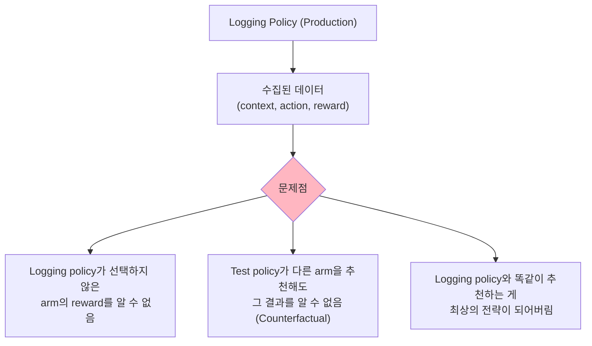
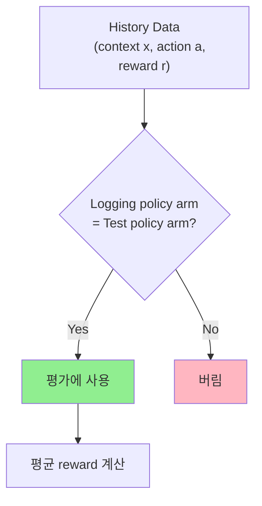
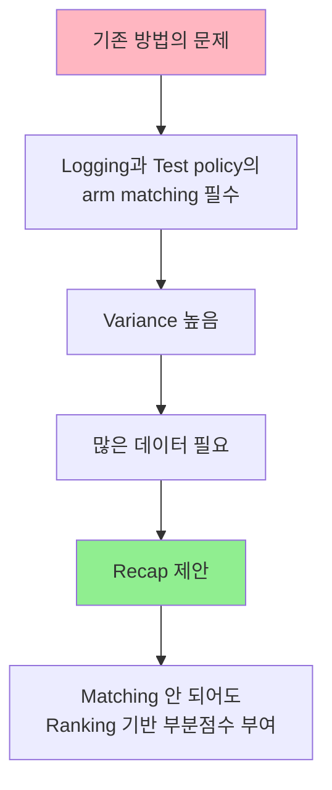
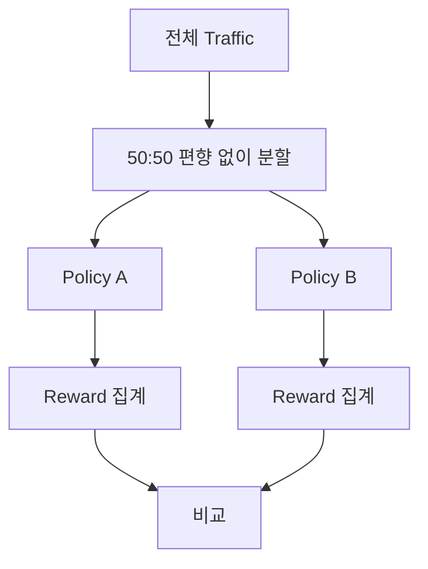
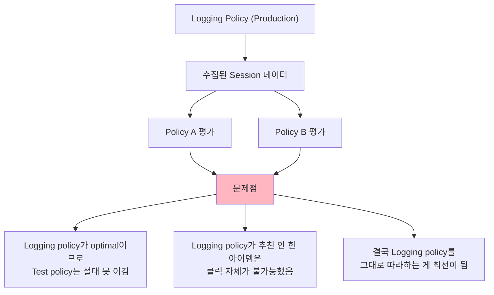
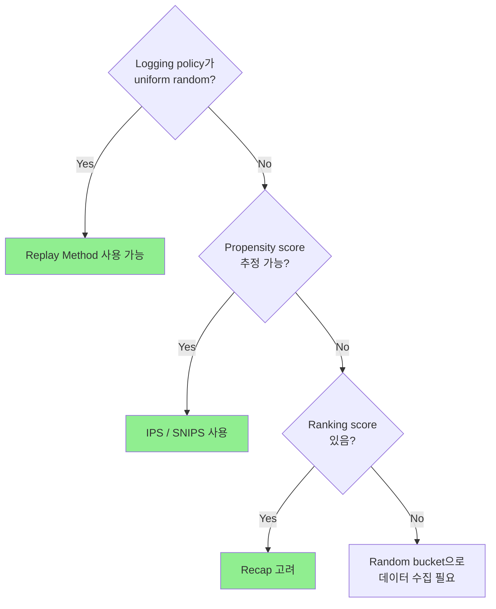

# A) 핵심 요약

추천 시스템을 **온라인 A/B 테스트 없이** 오프라인에서 평가하는 방법론. Logging policy로 수집된 편향된 데이터에서 새로운 policy의 성능을 **unbiased하게** 추정하는 것이 핵심 과제다.

# B) 문제 정의

## B.1) 왜 Offline Evaluation이 필요한가?

| 평가 방식 | 장점 | 단점 |
|----------|------|------|
| **Online A/B Test** | 실제 성능 측정 | 비용 높음, 시간 오래 걸림 |
| **Offline Evaluation** | 빠르고 저렴 | Bias 문제 발생 |

> "Measurement is the first step that leads to control and eventually to improvement."

## B.2) Offline Evaluation의 핵심 문제

**핵심 딜레마**: Logging policy가 추천하지 않은 아이템은 사용자가 클릭할 기회조차 없었음 → 해당 아이템의 진짜 reward를 모름

# C) 평가 방법론

## C.1) 방법론 비교 요약

| 방법 | 핵심 아이디어 | 장점 | 단점 |
|------|-------------|------|------|
| **Replay Method** | Logging과 Test policy가 같은 arm 선택시만 평가 | 단순함 | Uniform random 필요, 데이터 많이 필요 |
| **IPS** | Propensity score로 bias 보정 | Non-uniform도 가능 | Variance 높음 |
| **SNIPS** | IPS + Self-normalizing | Variance 감소 | - |
| **Recap** | 부분 점수 부여 (Ranking 기반) | 데이터 효율적 | Unclick 처리 논란 |

## C.2) Replay Method

가장 단순한 방법: Logging policy와 Test policy가 **같은 arm을 선택한 경우**만 평가에 사용.

**필요 데이터량**: 평균적으로 $L = KT$ 개 (K: arm 개수, T: match 횟수)

**한계점**:
- **Uniform random logging policy 필요**: Context를 고려하지 않고 arm을 임의로 추천해야 함
- **데이터 낭비**: Match되지 않은 데이터는 모두 버림
- **Variance 높음**

### C.2.1) Non-uniform Exploration의 경우

Logging policy가 uniform이 아닌 경우, **Rejection Sampling**으로 subset 획득:

$$D = \{(x, a, r_a, p_a)\} \text{ where } p_a \neq \frac{1}{K}$$

- $p_a$: 해당 arm $a$가 뽑힐 확률
- $p_i / p_{max}$ 확률로 데이터 포함 여부 결정
- $p_i$가 자주 변하면 비효율적

## C.3) Inverse Propensity Score (IPS)

Replay Method의 개선: **Non-uniform logging policy에서도 사용 가능**

$$\hat{V}_{\text{IPS}}^{\pi} = \frac{1}{|S|} \sum_{(x,h,a,r_a) \in S} \frac{r_a \cdot \mathbf{I}(\pi(x) = a)}{\hat{p}(a \mid x, h)}$$

**각 항목 설명**:

| 기호 | 의미 |
|------|------|
| $\mathbf{I}(\pi(x) = a)$ | Logging policy와 Test policy의 arm 일치 여부 (0 or 1) |
| $\hat{p}(a \mid x, h)$ | Propensity Score: 모델이 해당 arm을 추천할 확률 |
| $r_a$ | 관측된 reward |

**왜 Propensity Score로 나누나?**

Logging policy가 uniform이 아니면 특정 arm이 더 자주 선택됨 → **event 분포에 bias 발생**. Propensity score로 나눠서 이 bias를 보정.

> Propensity score가 없으면 ($\hat{p} = 1/K$), IPS는 Replay Method와 동일해짐.

## C.4) Self-Normalizing IPS (SNIPS)

IPS의 $\frac{1}{|S|}$ 때문에 **variance가 클 수 있음** → Self-normalizing으로 해결

$$\hat{V}_{\text{SNIPS}}^{\tau} = \frac{\sum_{t=0}^{n} r_{a_\pi} \frac{\mathbf{I}(a_\tau = a_\pi)}{\pi(x_t, a_\pi)}}{\sum_{t=0}^{n} \frac{\mathbf{I}(a_\tau = a_\pi)}{\pi(x_t, a_\pi)}}$$

**구조**:
- **분자**: IPS와 동일
- **분모**: $\frac{1}{|S|}$ 대신 propensity score 합으로 정규화

## C.5) Recap (RecSys 2019)

**핵심 아이디어**: Arm이 정확히 match되지 않아도 **부분 점수** 부여

$$\hat{V}_{\text{Recap}}^{\tau} = \frac{\sum_{t=0}^{n} r_{a_\pi} \frac{RR}{\pi(x_t, a_\pi)}}{\sum_{t=0}^{n} \frac{RR}{\pi(x_t, a_\pi)}}$$

where $RR = \frac{1}{\sum_{a \in \mathcal{A}} \mathbf{I}(s(x,a) \geq s(x, a_\pi))}$

**RR (Reciprocal Rank)**:
- MAB 알고리즘이 context를 통해 계산한 score의 rank
- 높은 ranking → 높은 credit

**논란점**: Matching되지 않은 case에서 **unclick도 고려해야 하지 않나?**

# D) Online Vs Offline Evaluation 비교

## D.1) Online Evaluation Setting

## D.2) Naive Offline Evaluation의 문제 (High Bias)

# E) Unbiased Data Collection

## E.1) Random Bucket 방식

Bias 없는 데이터 수집을 위해 **일부 트래픽에서 uniform random 추천**:

- Context를 고려하지 않고 arm을 임의로 추천
- 사용자 경험 희생 vs 평가 정확도 trade-off

# F) 실무적 고려사항

## F.1) Offline 지표의 한계

| 고려사항 | 설명 |
|---------|------|
| **지표 신뢰도** | 높은 offline 지표 ≠ 높은 online 성능 (검증 필요) |
| **nDCG 한계** | nDCG만으로 추천 로직의 우열 판단 어려움 |
| **표준화 필요** | 데이터 split 방식, hyperparameter tuning 수준 명확히 |

## F.2) 방법론 선택 가이드

# G) Related

- [[replay method]]
- [[inverse propensity score]]
- [[MAB]]

# H) References

- [Unbiased offline evaluation (Liam)](https://youtu.be/qTdLGMO7KIw)
- [Offline Policy Evaluation for Bandit Problem (hee.yoon)](https://youtu.be/bi-JBWx3sBc)
- [Offline A/B testing for Recommender System (nick)](https://youtu.be/_yaHqovRJ78)
- [Offline evaluation 고민들 (nick)](https://youtu.be/klFnmTP989k)
- [Offline A/B testing 논문](https://arxiv.org/pdf/1801.07030.pdf)
