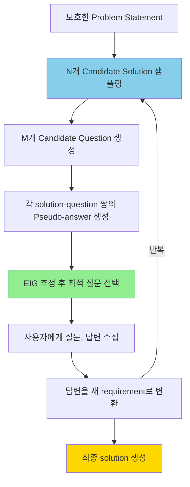
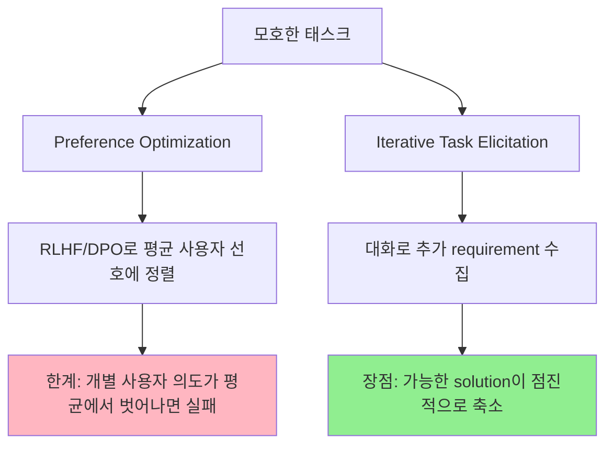

# A) 한줄 요약

LLM이 모호한 태스크를 받았을 때, **Bayesian Experimental Design (BED)** 을 활용해 **정보 이득(EIG)이 최대인 clarifying question** 을 생성하여 모호성을 능동적으로 해소하는 프레임워크. 핵심 아이디어는 LLM에게 "좋은 질문을 해라"고 직접 지시하는 대신, **먼저 다수의 solution을 샘플링한 뒤** 그 solution들을 가장 잘 구분하는 질문을 선택하는 것이다. Kobalczyk, Astorga, Liu & van der Schaar (2025), Cambridge / van der Schaar Lab. **ICLR 2025**.

# B) 전체 구조



**핵심 파이프라인 (논문 Figure 3):**
1. 모호한 problem statement가 주어짐 — requirements $\mathcal{R}$ + context $\mathcal{C}$
2. LLM이 현재 명세와 호환되는 $N$개의 **candidate solution** 을 샘플링
3. $M$개의 **candidate question** 을 생성
4. 각 질문에 대해 모든 solution의 **pseudo-answer** 를 생성하고, **EIG** 를 추정
5. EIG가 최대인 질문을 사용자에게 제시
6. 답변을 새로운 requirement로 변환하여 명세 확장
7. 반복 → 가능한 solution의 범위가 점진적으로 좁아짐

# C) 배경 지식

## C.1) Task Ambiguity란?

자연어로 기술된 태스크는 본질적으로 모호하다. 논문은 이를 수학적으로 정의한다:

- **가능한 solution 집합** $\mathcal{H}$: requirements를 만족하는 모든 solution
- **실제 원하는 solution 집합** $\mathcal{H}^*$: 사용자가 진짜로 원하는 답
- **Task ambiguity:** $\mathcal{H}$ 가 $\mathcal{H}^*$ 보다 클 때 — 즉, 조건을 만족하는 답이 너무 많은 상태

**예시:** "리스트에서 아이템을 검색하는 함수를 작성하라"
- index를 반환? boolean을 반환?
- 중복 아이템 처리는?
- 아이템이 없을 때 행동은?

→ 이런 미명세 사항들이 쌓이면, 가능한 답($\mathcal{H}$)은 엄청 넓지만 사용자가 실제로 원하는 답($\mathcal{H}^*$)은 그 중 일부에 불과하다.

## C.2) Model Uncertainty vs Task Ambiguity

논문이 명시적으로 구분하는 중요한 개념:

| | **Model Uncertainty** | **Task Ambiguity** |
|---|---|---|
| **정의** | LLM이 답을 잘 모르는 것 | 문제 자체가 여러 해석이 가능한 것 |
| **원인** | LLM의 능력 한계, hallucination | problem statement의 underspecification |
| **해결** | 더 좋은 모델, fine-tuning | 추가 requirement 수집 (이 논문의 방법) |

**말로 풀어서:** 문제가 완벽히 명세되어 있어도 LLM이 못 풀 수 있고 (model uncertainty), 반대로 LLM이 자신 있게 답해도 문제 자체가 모호할 수 있다 (task ambiguity). 흥미롭게도 논문은, **비모호한 문제에서도** iterative task elicitation이 solution 품질을 개선한다고 보고한다 — 추가 requirement가 LLM을 올바른 방향으로 가이드하기 때문.

## C.3) Ambiguity 해결: Preference Optimization vs Iterative Task Elicitation



- **Preference Optimization (RLHF/DPO):** 전체 사용자 평균 선호에 모델을 정렬. **개별 사용자** 의 의도가 평균에서 벗어나면 엉뚱한 답을 생성할 위험
- **Iterative Task Elicitation (이 논문):** clarifying question으로 requirement를 하나씩 추가하여 가능한 solution 범위를 축소. 모델 fine-tuning 없이 **개인화된 정렬** 가능

## C.4) 좋은 질문이란? — EIG의 직관

Bayesian Experimental Design에서 가져온 핵심 개념.

**Expected Information Gain (EIG):**
$$\text{EIG}(q) = \mathbb{H}[S_{\text{before}}] - \mathbb{E}_a[\mathbb{H}[S_{\text{after}} \mid a]]$$

여기서 $S_{\text{before}}$ 는 질문 전 solution 분포, $S_{\text{after}}$ 는 답변 후 solution 분포를 뜻한다.

- 질문 전 엔트로피 (불확실성) 에서 답변 후 엔트로피를 뺀 값
- 즉, **이 질문을 하면 불확실성이 얼마나 줄어드는가?** 의 기댓값

**스무고개 비유로 이해하기:**
- 동물 맞추기에서 "그 동물은 포유류인가요?"는 좋은 질문 → 동물들을 대략 **반반** 으로 나눔
- "그 동물은 파란색인가요?"는 나쁜 질문 → 거의 모든 동물이 "아니오" → 정보 이득이 낮음
- **최적의 질문 = 어떤 답이 오든 후보를 가장 균등하게 나누는 질문**

**핵심 결론 (Corollary 1):** Yes/No 질문의 경우, 최적 질문은 candidate solution들을 정확히 **반반** 으로 나누는 질문이다. 더 일반적으로, $n$개 답변이 가능한 질문 중 EIG가 최대인 것은 후보들을 **균등한 $n$등분** 으로 나누는 질문이다. 이로부터 **open-ended 질문이 이론적으로 더 높은 정보 이득** 을 제공할 수 있다 (더 많은 파티션 가능).

## C.5) Meta-Cognitive Reasoning의 한계

좋은 질문을 하려면 "내가 생성할 수 있는 solution들이 어떤 차이를 가지는가?"를 추론하는 **메타 인지** 능력이 필요하다. 논문은 LLM이 이런 능력이 부족하다고 주장 — training corpus에 clarifying question이 상대적으로 적기 때문. 이를 **명시적 solution 샘플링 후 그 solution들에 기반해 추론** 하는 방식으로 우회하는 것이 핵심 아이디어.

비유하면: "어떤 시험 문제가 학생들을 잘 변별할까?"를 추상적으로 고민하는 것(implicit)보다, **먼저 학생들의 답안을 여러 개 모아본 뒤** 답안 차이가 큰 문제를 고르는 것(explicit)이 더 효과적.

# D) 기존 방법의 한계

| 접근 방식 | 방법 | 한계 |
|---|---|---|
| **Single-shot 생성** | 모호성 무시하고 바로 답 생성 | 사용자 의도와 불일치 위험 |
| **Implicit** | LLM에게 "가장 정보적인 질문을 생성하라" 직접 지시 | Meta-cognitive 능력 부족 → 비효율적 질문 |
| **Implicit-ToT** | M개 질문 생성 후 LLM이 "가장 좋은 질문" 선택 | 여전히 question space 내에서만 암묵적 추론 |
| **RLHF/DPO** | 평균 선호에 모델 정렬 | 개별 사용자 의도가 평균에서 벗어나면 실패 |

**핵심 문제:** 기존 LLM은 "이 질문이 후보 답안들을 얼마나 잘 구분하는가?"를 **암묵적으로만** 추론한다 (question space에서의 reasoning). 논문은 이를 **먼저 solution을 샘플링하고, 그 solution들에 기반해** 질문을 평가하는 explicit reasoning으로 전환.

# E) 제안 방법: Active Task Disambiguation

## E.1) 핵심 구조

논문의 접근법은 크게 3개 모듈로 구성:

1. **Solution Generator:** 현재 problem statement에서 $N$개의 다양한 solution을 샘플링
2. **Question Generator:** $M$개의 candidate question을 생성
3. **Question Evaluator:** 각 질문의 EIG를 추정하여 최적 질문을 선택

**Utility 함수:** $\mathcal{U}(q) = \text{EIG}(q) - c(q)$
- $c(q)$: 질문에 답하는 비용 (논문에서는 상수로 단순화)
- 실제로는 질문 길이, 답변 난이도 등을 반영할 수 있음

## E.2) 알고리즘 (논문 Appendix C, Algorithm 2)

```
Input: 모호한 문제 S⁰, 반복 횟수 T, solution 수 N, question 수 M

for t in {1, ..., T}:
    1. 현재 문제에서 N개 candidate solution 샘플링
    2. M개 candidate question 생성

    if M > 1:
        for 각 question q_j:
            for 각 solution h_i:
                h_i에 대해 q_j의 pseudo-answer 생성
            EIG(q_j) 추정
        q* ← EIG가 가장 높은 질문

    3. 사용자에게 q* 제시, 답변 a* 수집
    4. (q*, a*)를 새 requirement로 변환
    5. problem statement에 추가 → 다음 iteration
```

## E.3) EIG 추정: Uniform vs Logprob

EIG를 실제로 계산하려면 "사용자가 각 solution을 얼마나 선호하는가?"의 분포가 필요한데, 이건 모른다. 논문은 두 가지 근사법을 제안:

### E.3.1) EIG-Uniform

**아이디어:** 모든 compatible solution이 동일한 확률을 가진다고 가정 (uniform).

**계산법:** 각 질문에 대해 N개 solution의 pseudo-answer를 모으고, **답변 분포의 엔트로피** 를 EIG로 사용.

예시 (20개 solution, binary question):
- 질문 A: Yes 10개, No 10개 → 엔트로피 높음 → **EIG 높음** (균등 분할!)
- 질문 B: Yes 18개, No 2개 → 엔트로피 낮음 → EIG 낮음 (한쪽으로 치우침)

### E.3.2) EIG-Logprob

**아이디어:** Uniform 대신 LLM이 각 solution에 부여한 **생성 확률(log-prob)** 로 가중.

**결과: EIG-uniform보다 일관되게 성능이 낮았다.** 이유는 LLM이 높은 확률을 부여하는 solution이 반드시 사용자가 원하는 답에 가깝지 않기 때문. 오히려 **편향 없는 uniform 가정이 더 robust** 하다는 것을 보여준다.

## E.4) 실용적 설계 전략

### E.4.1) 다양한 Solution 샘플링

EIG 추정이 정확하려면 샘플된 solution들이 **가능한 solution space를 골고루 커버** 해야 한다. 두 가지 전략:
1. **높은 sampling temperature** 사용
2. **Diversity prompt:** "Generate a carefully selected, **diverse, and representative** set of [solutions]" 추가 → MI score 개선 확인 (N=20: diverse 0.58 vs vanilla 0.54)

### E.4.2) Self-Critic Filtering (LLM Noise 완화)

Requirement가 누적되면 LLM이 모든 조건을 동시에 만족하는 solution을 생성하기 어려워져 **hallucination이 증가** 한다. 이를 완화하기 위한 self-reflection 필터링:
1. Solution 생성 후, 각 requirement에 대해 호환성을 LLM에게 재확인
2. 호환되지 않으면 제거하고 재샘플링
3. 이 과정을 **2회 반복** 하면 효과적 (논문 Study 3)

## E.5) 질문 유형 (코드 생성 실험)

| 유형 | 형식 | 예시 | 답변 수 |
|---|---|---|---|
| **Binary (B)** | 생성된 test case (assertion) | `assert search([1,2,3], 2) == 1` → True/False | 2 |
| **Open (O)** | 생성된 input → 기대 output | `search([1,2,3], 4)` → 기대 결과? | 사실상 무한 |

- Open 질문이 이론적으로 더 높은 EIG (더 세밀한 분할 가능)
- 단, 사용자 mental load가 높음 (binary는 True/False만 판단)

# F) 벤치마크 / 데이터셋

## F.1) 실험 1: 20 Questions Game

스무고개 게임을 LLM 2명이서 플레이하는 실험. 동물 맞추기로 한정.

**진행 방식:**
1. **Player A (출제자, GPT-4o-mini):** 정답 동물 하나를 알고 있음 (예: "Platypus")
2. **Player B (추측자, GPT-3.5-turbo 등):** Player A에게 Yes/No 질문을 해서 동물을 맞춰야 함
3. 매 라운드마다 Player B가 **질문 전략에 따라** 질문을 하나 선택 → Player A가 답변
4. 답변은 "The animal [질문을 긍정문으로 변환]" 형태의 requirement로 변환되어 축적됨
5. 10라운드 반복

**여기서 비교하는 것:** Player B가 **어떤 전략으로 질문을 고르느냐** (implicit vs EIG-uniform 등)에 따라 정답을 얼마나 빨리/정확히 맞추는가

**평가 방법:** 매 iteration마다 현재까지 모은 requirement를 바탕으로 동물 10개를 샘플링하고, 가장 가능성 높은 순서로 정렬. 정답 동물이 리스트에서 몇 번째인지(Rank)를 측정. Rank 10=1등(정답이 맨 위), Rank 0=리스트에 아예 없음.

**EIG 추정 과정 (EIG-uniform 전략의 경우):**
1. 현재 requirement에 맞는 동물 N=20마리를 LLM에게 생성시킴 (예: 코브라, 독수리, 천산갑...)
2. M=5개의 Yes/No 질문 후보를 생성 (예: "포유류인가?", "바다에 사나?", ...)
3. 20마리 각각에 대해 5개 질문의 답을 시뮬레이션 → 총 100개의 pseudo-answer
4. 각 질문이 20마리를 **얼마나 균등하게 Yes/No로 나누는지** (엔트로피) 계산 → EIG 추정
5. EIG가 가장 높은 질문을 Player A에게 실제로 물어봄

| 항목 | 설정 |
|---|---|
| **대상 동물** | 15종: Pangolin, African Grey Parrot, Manta Ray, King Cobra, Platypus 등 |
| **반복 횟수** | T=10 |
| **하이퍼파라미터** | N=20 solutions, M=5 questions |
| **Seeds** | 5 run x 25 evaluation |

## F.2) 실험 2: Active Code Generation

코딩 문제에서 **LLM이 스스로 테스트 케이스를 생성하여** 문제의 모호성을 해소하는 실험.

**진행 방식 — 구체적 예시로 설명:**
1. 코딩 문제가 주어짐: "리스트에서 아이템을 검색하는 함수를 작성하라" (모호한 상태)
2. LLM이 이 문제에 대해 여러 가지 코드 solution을 샘플링 (어떤 건 index 반환, 어떤 건 boolean 반환...)
3. LLM이 **clarifying "question"을 생성** — 여기서 질문은 두 가지 형태:
    - **Binary (B):** test case assertion 생성 → 예: `assert search([1,2,3], 2) == 1`
    - **Open (O):** input 생성 → 예: `search([1,2,3], 4)` → "이때 결과가 뭐여야 해?"
4. **Oracle = Python 인터프리터.** 생성된 test case를 ground-truth 코드에 실제로 실행하여 정답 획득. 사람이 답하는 게 아님!
5. 얻어진 (input, output) 쌍이 **새로운 unit test** 가 되어 requirement에 추가됨
6. 다음 라운드에서는 이 unit test를 통과하는 solution만 샘플링 → 모호성 축소
7. 4라운드 반복

**말로 풀어서:** LLM이 "이 경우에는 결과가 뭐여야 하지?"라는 테스트 케이스를 스스로 만들어서, 실제 정답 코드에 돌려보고, 그 결과를 추가 조건으로 축적하는 과정. 매 라운드마다 "아, 이 경우에는 이렇게 동작해야 하는구나"라는 정보가 하나씩 추가되어 LLM이 생성하는 코드가 점점 정확해진다.

**20Q 실험과의 핵심 차이:** Oracle 답변이 코드 실행으로 얻어지므로 **noise가 없다** (20Q에서는 LLM이 답변을 시뮬레이션하므로 noise 있음).

| 항목 | 설정 |
|---|---|
| **벤치마크** | HumanEval + APPS에서 48개 non-trivial 문제 |
| **반복 횟수** | T=4 |
| **하이퍼파라미터** | M=5 questions |
| **평가** | 20개 solution 샘플링 후 hidden test case pass rate |
| **모델** | GPT-3.5-turbo, GPT-4o-mini, Llama-3-8B, Llama-3-70B |

# G) 실험 결과 및 시사점

## G.1) 20 Questions Game 결과

**비교 전략 4가지:**
- **implicit:** LLM에게 직접 "가장 정보적인 질문을 하라" (M=1)
- **implicit-ToT:** M=5개 질문 생성 후 LLM이 가장 좋은 것 선택 (Tree of Thought 스타일)
- **EIG-uniform:** M=5개 질문 + N=20 solution 샘플링, uniform EIG 추정
- **EIG-logprob:** 위와 동일하나 LLM log-probability로 가중

**주요 결과 (Figure 4):**
- **EIG-uniform이 모든 전략을 일관되게 능가** — implicit, implicit-ToT 대비 큰 차이
- **EIG-logprob는 EIG-uniform보다 성능 낮음** → LLM의 생성 확률이 ground-truth와 잘 정렬되지 않음을 입증
- GPT-4o-mini에서는 갭이 줄어듦 → 더 capable한 모델은 meta-cognitive reasoning도 상대적으로 나음

### G.1.1) Ablation Studies (GPT-3.5-turbo)

**Study 1 — Questions' Utility (Figure 5):**
- 500마리 동물 리스트 대상으로 partitioning 품질 평가
- EIG-uniform 질문이 매 iteration마다 valid solution 수를 가장 빠르게 감소시킴
- N=20 샘플로 추정한 EIG가 500마리 전체의 ground-truth EIG에 대한 좋은 proxy임을 확인

**Study 2 — Diversity of Samples (Table 1):**

| N | diverse | vanilla |
|---|---|---|
| 10 | **0.57** | 0.46 |
| 20 | **0.58** | 0.54 |
| 30 | **0.60** | 0.58 |

- "diverse and representative" prompt 추가만으로 MI score(샘플 다양성) 일관되게 향상

**Study 3 — Self-Reflection Filtering (Figure 6):**
- Filtering 0회 vs 1회 vs 2회 비교
- Requirements가 누적될수록 필터링 없이는 폐기되는 solution 급증 (iteration 9에서 평균 12.5개)
- 2회 필터링이 최적, Rank 성능도 개선

## G.2) Code Generation 결과

**주요 결과 (Figure 7, 4 iteration 후):**

| 모델          | 벤치마크      | base (B) | EIG (B) | base (O) | EIG (O) |
| ----------- | --------- | -------- | ------- | -------- | ------- |
| Llama-3-8B  | HumanEval | ~45%     | ~50%    | ~55%     | ~60%    |
| GPT-3.5     | HumanEval | ~60%     | ~65%    | ~68%     | ~72%    |
| Llama-3-70B | HumanEval | ~65%     | ~68%    | ~72%     | ~75%    |
| GPT-4o-mini | HumanEval | ~72%     | ~75%    | ~78%     | ~80%    |

(수치는 Figure 7에서 근사적으로 읽은 값)

**관찰:**
1. **EIG 전략이 모든 모델/벤치마크에서 base를 능가** — 일관된 개선
2. **Open (O) > Binary (B)** — 이론과 일치 (더 많은 답변 수 → 더 세밀한 분할 → 더 높은 EIG)
3. **더 capable한 모델일수록 base-EIG 갭 축소** — implicit strategy 자체가 나아지기 때문
4. **APPS에서도 동일 패턴** — GPT-4o-mini zero-shot ~35% (vs HumanEval ~70%)인 어려운 문제에서도 유효
5. **비모호한 문제에서도 개선** — 추가 test case가 LLM을 올바른 방향으로 가이드

## G.3) 실무적 시사점

1. **Solution 먼저, 질문은 나중에:** "좋은 질문을 해라"보다, 먼저 여러 solution을 생성하고 그 차이에 기반해 질문을 선택하는 것이 일관되게 우월. LLM의 **solution-generating 능력을 question selection에 bootstrapping** 하는 것
2. **Uniform 가정이 의외로 robust:** LLM의 자체 확률(log-prob)에 의존하는 것보다 단순한 "모든 후보가 동등" 가정이 더 안정적
3. **Self-reflection 필터링 필수:** Requirements가 누적되면 hallucination 증가 → 생성 후 호환성 재검증 단계 필요
4. **Diversity prompt 효과:** "diverse and representative" 한마디 추가가 샘플 다양성을 유의미하게 개선
5. **더 강한 모델에서도 여전히 유효:** GPT-4o-mini에서 갭이 줄어들긴 하나, EIG가 여전히 우위

## G.4) 한계점

- **Computational cost:** EIG 계산을 위해 N x M개의 추가 LLM 호출 필요 (20Q: 20x5=100회/iteration). 실시간 시스템에서는 latency 이슈
- **Ambiguity detection 미해결:** "언제 질문을 멈출 것인가?"는 다루지 않음 — 문제가 모호한지 판단하는 것, 충분한 requirement가 수집되었는지 판단하는 것은 별도 문제
- **Solution 샘플 품질 의존:** LLM의 generation 다양성이 낮으면 EIG 추정이 부정확. 복잡한 requirements가 누적될 때 valid solution 생성 자체가 어려워짐
- **Interaction cost:** 사용자가 매 라운드 답변해야 하는 부담. Open 질문은 더 정보적이지만 mental load 높음

# H) Related

- [[Bayesian Experimental Design]]
- [[Active Learning]]

# I) References

- [Active Task Disambiguation with LLMs (arXiv)](https://arxiv.org/abs/2502.04485)
- [GitHub: kasia-kobalczyk/active-task-disambiguation](https://github.com/kasia-kobalczyk/active-task-disambiguation)
- [OpenReview (ICLR 2025)](https://openreview.net/forum?id=JAMxRSXLFz)
