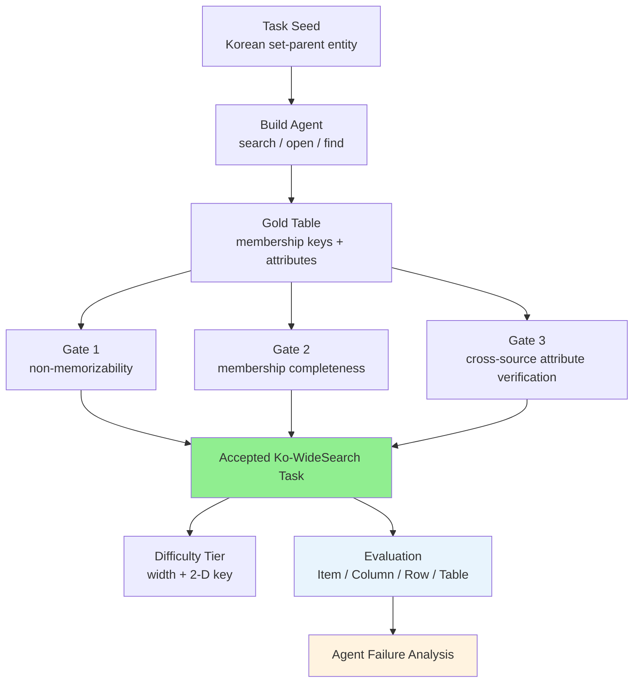

# A) 한줄 요약

**Ko-WideSearch** 는 한국어 웹 에이전트가 "정답 하나"가 아니라 **닫힌 집합 전체와 각 item의 속성 테이블** 을 얼마나 빠짐없이 찾는지 평가하는 benchmark다. 기존 browsing benchmark가 깊은 추론 경로를 따라 하나의 obscure answer를 찾는 **depth search** 에 치우쳤다면, 이 논문은 여러 Korean web source를 훑어 완전한 row set과 cell value를 채우는 **breadth search** 를 본다.

Minbyul Jeong은 190개 set-parent entity에서 228개 table, 4,262개 gold row, 14,560개 attribute cell을 만들고, 이를 `Item-F1`, `Column-F1`, `Row-F1`, `Table Success` 로 평가한다. 결과는 꽤 명확하다. frontier web agent도 set membership은 잘 찾지만, full row를 완성하는 데 크게 실패한다. GPT-5.5도 `Item-F1 92.8`에 비해 `Row-F1 53.7`, `Table Success 19.3`에 그친다.

- **저자**: Minbyul Jeong
- **발표**: arXiv 2606.27595, 2026-06-25
- **핵심 대상**: Korean web browsing agent evaluation
- **핵심 키워드**: Ko-WideSearch, Breadth Search, Web Agent, Set Enumeration, Table Completion, Korean Benchmark

# B) 전체 구조

논문이 보는 문제는 간단히 말하면 "검색해서 표를 완성하라"다.

예를 들어 이런 task를 생각하면 된다.

```text
2026년 6월 기준 한국에서 운항 중인 모든 저비용항공사를 나열하고,
각 항공사별 모회사, 운항 시작 연도, 주요 허브, 보유 항공기 수를 채워라.
```

여기서 agent는 두 가지를 동시에 해야 한다.

1. **membership 찾기**: 한국 저비용항공사 전체 set을 빠짐없이 찾는다.
2. **attribute 채우기**: 각 항공사 row마다 모회사, 연도, 허브, 항공기 수를 채운다.

정답이 "Aero K" 같은 item 하나가 아니라, 여러 row와 여러 column으로 된 table이라는 점이 핵심이다. 하나의 item을 빠뜨리거나, fleet size 한 칸을 잘못 채우면 full row는 틀린다.


논문의 pipeline은 아래처럼 볼 수 있다.



이 benchmark는 [[Qwen-AgentWorld - Language World Models for General Agents]]에서 언급된 WideSearch 계열과도 잘 이어진다. Agent가 web search를 많이 한다고 끝나는 문제가 아니라, 여러 source에서 찾은 정보를 **row 단위로 정렬하고 검증하는 능력** 이 병목이라는 점을 보여준다.

# C) 배경 지식

## C.1) Depth Search와 Breadth Search

기존 web-agent benchmark는 대체로 **depth search** 를 본다. BrowseComp, K-BrowseComp류 task는 여러 조건을 따라가며 하나의 어려운 답을 찾는 문제에 가깝다.

```text
depth search:
  복잡한 단서 여러 개 -> 여러 단계 검색 -> 최종 정답 하나

breadth search:
  닫힌 집합 정의 -> 모든 item 찾기 -> item별 속성 table 완성
```

둘은 요구 능력이 다르다.

Depth search에서는 agent가 한 줄의 정답에 도달하면 된다. 반면 breadth search에서는 "여기서 더 찾아야 할 item이 남았는가?", "이 row의 attribute는 어느 source에서 확인해야 하는가?", "동명이인이나 행정구역 표기가 섞이지 않았는가?"를 계속 관리해야 한다.

그래서 breadth search는 검색 능력만 보는 문제가 아니다. 실제로는 다음 능력을 함께 본다.

- set boundary를 정하는 능력
- 여러 page에서 evidence를 수집하는 능력
- row key와 attribute를 정확히 매칭하는 능력
- 같은 entity의 표기 차이를 처리하는 능력
- 최종 출력을 parse 가능한 table로 만드는 능력

## C.2) 왜 한국어 benchmark인가

한국어 web search는 영어 web search와 다르다. 로컬 entity, 행정구역 표기, 선거/스포츠/방송 정보의 출처 구조, 검색어 관습이 다르다. 따라서 영어 browsing benchmark에서 잘하던 agent가 한국어 source에서도 같은 방식으로 잘한다고 보기 어렵다.

논문은 기존 한국어 평가가 주로 static benchmark였다고 본다. KorQuAD, KLUE, KMMLU처럼 유용한 평가가 있지만, live web을 검색하고, source를 넘나들며, 최신 정보를 row 단위로 정리하는 agent 능력은 잘 보지 못한다.

[[Architecting and Evaluating an AI-First Search API]]처럼 search API 자체의 품질을 보는 관점도 중요하지만, Ko-WideSearch는 그보다 한 단계 위에서 **검색 결과를 사용한 agent의 end-to-end table completion** 을 본다.

# D) 기존 benchmark의 한계

## D.1) 단일 정답 benchmark는 set 누락을 잘 드러내지 못한다

agent가 하나의 obscure answer를 맞히는 능력과, 전체 item set을 빠짐없이 채우는 능력은 다르다. 단일 정답 benchmark에서는 한두 개 row를 빼먹는 문제가 잘 드러나지 않는다.

하지만 실무에서는 breadth task가 많다.

- 특정 조건을 만족하는 모든 상품/업체/기관 찾기
- 각 item별 가격, 날짜, 담당자, URL 채우기
- 여러 지역/기간 조합의 지표 table 만들기
- source마다 흩어진 attribute를 하나의 spreadsheet로 정리하기

이런 task에서는 "대충 많이 찾았다"가 부족하다. 마지막 몇 row, 틀린 cell, parse 실패가 실제 품질을 좌우한다.

## D.2) gold table을 손으로 만들기 어렵다

Breadth benchmark를 만들기 어려운 이유는 gold construction 비용이다.

정답 하나를 검증하는 것보다, 전체 set이 complete한지와 각 cell이 맞는지를 검증하는 비용이 훨씬 크다. 기존 WideSearch는 사람이 손으로 200개 table을 만들었는데, 논문은 이 방식을 한국어로 그대로 확장하기에는 비싸고 느리다고 본다.

Ko-WideSearch의 핵심 contribution은 그래서 benchmark 자체뿐 아니라, **synthesize-and-verify pipeline** 이다. 모델이 gold를 만들되, 다른 model family와 live search 기반 gate로 다시 검증해 pipeline-verified benchmark를 만든다.

# E) 제안 방법: Ko-WideSearch

## E.1) Task Definition

Ko-WideSearch task는 닫힌 finite set을 정의하는 질문이다. Gold answer는 table이다.

```text
question:
  predicate Y를 만족하는 모든 member를 찾고,
  각 member마다 requested attributes를 채워라.

gold answer:
  n개 row
  m개 column
  key column k개
  attribute column m-k개
```

`k=1`이면 일반적인 primary key다. 예를 들어 `carrier`가 key다.

`k=2`이면 2-D composite key다. 예를 들어 `(province, election round)`처럼 두 차원의 cross-product가 membership을 만든다. 논문의 hard example은 한국의 17개 광역자치단체와 7회/8회 지방선거 조합이다. 즉 `17 x 2 = 34`개 row가 생긴다.

## E.2) Metric

Ko-WideSearch는 WideSearch 계열의 네 metric을 쓴다.

| Metric | 의미 | 무엇을 놓치면 떨어지나 |
|---|---|---|
| `Item-F1` | row key 기준 membership precision/recall | item 누락, 잘못된 item 추가 |
| `Column-F1` | matched row에서 attribute cell correctness | 특정 column 값 오류 |
| `Row-F1` | key와 모든 attribute cell이 맞은 row 비율 | row 안의 cell 하나만 틀려도 실패 |
| `Table Success` | table 전체가 완전히 맞은 비율 | row 하나, cell 하나라도 틀리면 실패 |

이 중 논문이 실질적인 ranking metric으로 보는 것은 `Row-F1`이다. `Table Success`가 가장 엄격한 end-to-end outcome이지만, 너무 낮은 값에 몰려 모델 간 차이를 덜 보여주기 때문이다.

## E.3) Construction Pipeline

Gold table은 frontier model 기반 build agent와 verification gate로 만든다. Build agent는 Korean web에서 `search`, `open`, `find` tool을 사용해 complete set과 attribute를 채운다.

그 뒤 세 gate를 통과해야 한다.

| Gate | 목적 | 조건 |
|---|---|---|
| Non-memorizability | model memory만으로 풀리는 task 제거 | closed-book cell recall이 0.5 이상이면 reject |
| Completeness | membership이 빠지지 않았는지 확인 | 다른 model family가 재열거한 set과 `set-F1 >= 0.7` |
| Cross-source verification | attribute cell이 source로 확인되는지 검증 | 독립 fact-check에서 column agreement가 0.6 미만이면 drop |

Column을 drop하면 질문도 다시 쓴다. 즉 질문이 gold에 없는 cell을 요구하지 않도록 맞춘다. 또 중복 task를 제거하고, 5,744개 질문으로 된 8개 기존 evaluation set과 contamination check를 수행한다. 논문은 shingle Jaccard, n-gram containment, answer overlap을 사용했고, 0.6 threshold에서 걸린 질문이 없었다고 보고한다.

## E.4) Difficulty Tier

난이도는 두 structural knob으로 만든다.

1. **Table width**: 채워야 할 column 수가 많아질수록 어려워진다.
2. **2-D composite key**: 단순 list가 아니라 cross-product grid가 되면 membership 관리가 어려워진다.

| Tier | Tables | Median Cols | 2-D Share | Median Rows | Cells |
|---|---:|---:|---:|---:|---:|
| Easy | 116 | 3 | 0% | 14 | 3,901 |
| Medium | 67 | 5 | 30% | 16 | 5,102 |
| Hard | 45 | 7 | 100% | 21 | 5,557 |
| Total | 228 | - | - | - | 14,560 |

Hard tier는 모두 2-D key다. 다만 논문도 이 tier가 sports-season 쪽으로 치우쳐 있다고 밝힌다. 따라서 "Hard에서 낮은 점수"를 오직 2-D 구조 때문이라고만 해석하면 안 된다.

## E.5) Normalization-Aware Comparator

Table benchmark에서 의외로 중요한 부분은 scorer다. 같은 날짜, 같은 숫자, 같은 이름도 표기 형식이 조금씩 다를 수 있기 때문이다.

Ko-WideSearch는 gold construction과 grading에 같은 type-aware comparator를 사용한다.

| Cell Type | 비교 방식 |
|---|---|
| Date | common granularity 기준 비교. 예를 들어 연도만 같아도 맞는 경우 처리 |
| Number | comma, unit 제거 후 5% relative tolerance |
| URL | host와 path 기준 비교 |
| Name / Location | normalized text, substring, token overlap |
| Free-text | headline score에서는 LLM judge가 아니라 deterministic normalized-text match |

이 설계가 중요한 이유는 둘이다.

첫째, gold를 만들 때 안정적인 column을 formatting 차이 때문에 과하게 drop하지 않는다. 둘째, agent output을 평가할 때도 같은 기준을 쓰므로 construction과 grading이 서로 어긋나지 않는다.

논문은 LLM semantic judge로 재채점한 결과도 별도로 본다. Row-F1이 0.8-4.9 point 정도 오르지만, 전체 결론은 바뀌지 않는다. 즉 `Item-F1 >> Row-F1` gap은 주로 formatting 문제가 아니라 실제 factual cell error에서 온다.

## E.6) Sourcing Label

각 table은 sourcing 관점에서도 나뉜다.

| Label | 의미 |
|---|---|
| `exhaustive-only` | 한 page나 한 authoritative list에서 membership과 attributes를 대부분 확인 가능 |
| `cross-source` | membership은 찾더라도 attribute는 item별 page나 여러 source를 더 봐야 함 |

전체 split은 `27:201`이다. Medium과 Hard는 모두 cross-source다. 따라서 sourcing difficulty와 tier difficulty가 완전히 독립적이지는 않다.

# F) 벤치마크/데이터셋

Ko-WideSearch는 16개 category와 190개 distinct set-parent entity를 포함한다. 전체 228개 task 중 83%가 unique set을 enumerate한다. Sports/Games category가 크지만, 대부분 다른 league, season, tournament를 다룬다.

대표 task는 아래처럼 나뉜다.

| Tier | 예시 | 구조 |
|---|---|---|
| Easy | 태양계 8개 행성과 발견 연도/발견자 | 8 rows, 3 columns, 1-D key |
| Medium | 2026-06 기준 한국 저비용항공사와 모회사/허브/fleet size | 9 rows, 5 columns, 1-D key |
| Hard | 17개 광역자치단체 x 7/8회 지방선거 당선자와 투표율/나이/득표율 | 34 rows, 7 columns, 2-D key |

평가 harness는 모든 model을 web-search agent로 돌린다. Tool은 `search`, `open`, `find`로 통일하고, 답변 마지막에는 정확히 하나의 JSON block을 내도록 요구한다. 최종 answer가 JSON, Markdown table, CSV로 parse되지 않으면 free-text fallback은 recall만 제한적으로 보고 table score는 0이 된다.

평가한 model은 총 20개다.

- Proprietary frontier: GPT-5.5, Claude-Opus-4.8/4.7/4.6, Gemini-3.1-Pro, Gemini-3.1-Flash-Lite, Gemini-3.5-Flash, Claude-Sonnet-4.6, GPT-5.4, GPT-5.4-mini/nano, Claude-Haiku-4.5
- Open-weight: DeepSeek-V4-Pro, GLM-5.1, Gemma-4-31B, DeepSeek-Chat, Qwen3.6-35B
- Korean-specialized: Solar-Open-2-preview, A.X-4.0, K-EXAONE-236B

# G) 실험 결과와 실무적 시사점

## G.1) Main Results

핵심 결과는 "membership은 찾지만 full row는 못 채운다"다.

| Model | Item-F1 | Column-F1 | Row-F1 | Table Success | Parse |
|---|---:|---:|---:|---:|---:|
| GPT-5.5 | 92.8 | 74.3 | 53.7 | 19.3 | 98.2 |
| Claude-Opus-4.8 | 94.1 | 75.5 | 52.9 | 16.2 | 99.6 |
| Claude-Opus-4.7 | 94.6 | 75.6 | 51.6 | 15.8 | 100.0 |
| Claude-Opus-4.6 | 92.0 | 72.7 | 48.9 | 14.9 | 100.0 |
| Gemini-3.1-Pro | 88.2 | 65.6 | 45.9 | 14.5 | 93.0 |
| Gemini-3.1-Flash-Lite | 89.0 | 69.7 | 45.9 | 7.0 | 99.1 |
| DeepSeek-V4-Pro | 80.4 | 63.9 | 45.0 | 12.3 | 87.3 |
| Claude-Sonnet-4.6 | 90.2 | 67.7 | 43.6 | 11.8 | 100.0 |
| GPT-5.4 | 89.0 | 61.5 | 41.6 | 10.5 | 100.0 |
| GLM-5.1 | 61.7 | 45.6 | 34.0 | 12.3 | 66.2 |
| GPT-5.4-mini | 82.3 | 55.9 | 33.3 | 5.7 | 98.2 |
| Claude-Haiku-4.5 | 66.7 | 43.5 | 28.8 | 7.0 | 75.9 |
| Solar-Open-2-preview | 44.0 | 33.3 | 24.4 | 9.7 | 62.7 |
| A.X-4.0 | 71.7 | 46.2 | 24.2 | 4.4 | 93.4 |
| Gemma-4-31B | 76.4 | 43.9 | 23.0 | 2.6 | 93.4 |
| DeepSeek-Chat | 65.4 | 39.4 | 21.3 | 4.0 | 87.3 |
| K-EXAONE-236B | 61.9 | 32.3 | 17.5 | 3.1 | 82.9 |
| Qwen3.6-35B | 32.4 | 22.2 | 16.2 | 4.0 | 38.6 |
| GPT-5.4-nano | 66.6 | 26.6 | 15.9 | 5.7 | 93.4 |

GPT-5.5는 `Item-F1 92.8`까지 가지만 `Row-F1 53.7`이다. Table Success는 19.3으로, 대략 5개 table 중 1개만 완전히 맞춘다는 뜻이다. Claude-Opus-4.8/4.7도 거의 같은 수준이고, DeepSeek-V4-Pro는 open-weight model 중에서 상당히 강한 편이다.

반대로 Qwen3.6-35B는 검색을 많이 하지만 parse 가능한 table을 잘 못 내고, `Parse 38.6`, `Row-F1 16.2`에 그친다. 여기서는 search depth보다 **structured output과 row-wise completion** 이 더 큰 병목으로 보인다.

## G.2) Difficulty가 올라가면 Row-F1이 급격히 떨어진다

Pooled score는 난이도별로 이렇게 떨어진다.

| Split | Item-F1 | Column-F1 | Row-F1 | Table Success |
|---|---:|---:|---:|---:|
| Easy | 79.3 | 56.6 | 43.5 | 11.3 |
| Medium | 72.2 | 51.3 | 30.2 | 9.1 |
| Hard | 73.1 | 51.0 | 23.4 | 6.4 |
| Exhaustive-only | 86.9 | 68.7 | 60.4 | 25.0 |
| Cross-source | 74.5 | 51.9 | 32.3 | 7.6 |

흥미로운 점은 `Item-F1`은 생각보다 버틴다는 것이다. agent가 "무엇을 찾아야 하는지"는 어느 정도 잡는다. 하지만 column 수가 늘고 2-D key가 들어가면 full row 완성률이 무너진다.

즉 문제는 단순히 "더 많은 item을 찾아야 해서" 생기는 것이 아니다. 논문은 set size별 Row-F1도 거의 flat하다고 보고한다. 8-15 row에서는 35.4, 16-30 row에서는 31.2, 30 row 초과에서도 35.0이다. 더 큰 set 자체보다, **row마다 정확한 attribute를 찾아 붙이는 과정** 이 어렵다.

## G.3) 더 많이 검색하거나 더 많이 쓰면 해결되는가

논문의 답은 "아직은 아니다"에 가깝다.

가장 검색을 많이 한 Qwen3.6-35B와 Solar-Open-2-preview는 각각 평균 66회, 57회 tool call을 썼지만 하위권이다. 반면 GPT-5.5와 Claude-Opus-4.8은 각각 평균 33회, 26회 정도의 moderate search로 최상위권이다.

비용도 비슷하다. GPT-5.5는 table당 약 $0.87을 쓰고 Row-F1 53.7을 얻지만, DeepSeek-V4-Pro는 훨씬 낮은 비용으로 Row-F1 45.0까지 간다. 비용을 더 쓰거나 tool call을 늘린다고 completeness가 자동으로 오르지는 않는다.

실무적으로는 search budget보다 아래 요소가 더 중요해 보인다.

- row key를 먼저 고정하고 attribute를 채우는 planning
- per-row evidence tracking
- attribute별 source verification
- parse 가능한 structured output 강제
- missing cell을 추측하지 않고 blank로 두는 정책
- 마지막에 row completeness를 self-check하는 verifier

## G.4) 어떤 cell이 어려운가

논문 분석에 따르면 format이 정해진 cell은 상대적으로 쉽다. 날짜, 숫자, 표준 이름처럼 comparator가 안정적으로 처리할 수 있는 값은 잘 맞는 편이다.

가장 어려운 것은 open-ended free-text cell이다. 예를 들어 주소, 발견자, 설명형 속성, 출처마다 표기가 다른 이름은 agent가 그럴듯한 값을 만들거나, 너무 coarse하게 쓰거나, 다른 entity의 값을 가져오기 쉽다.

LLM semantic judge로 재채점하면 일부 surface variant가 구제된다. 예를 들어 행정구역 granularity나 transliteration 차이 같은 것은 strict scorer에서는 틀렸지만 semantic judge는 맞다고 볼 수 있다. 그래도 Row-F1 개선 폭은 0.8-4.9 point 정도라서, 큰 gap은 사라지지 않는다.

따라서 이 benchmark가 보여주는 실패는 "채점기가 너무 빡빡해서"가 아니라, 실제로 cell value를 잘못 찾거나, row에 잘못 붙이거나, table을 못 만든 실패에 가깝다.

## G.5) Failure Taxonomy

논문이 보여준 실패는 대략 다섯 가지로 나눌 수 있다.

| Failure | 설명 |
|---|---|
| Under-recall | valid item을 빠뜨림 |
| Boundary error | scope 밖 item을 추가하거나 boundary를 잘못 잡음 |
| Blank attribute | item은 찾았지만 attribute cell을 비워 둠 |
| Wrong value | 다른 source나 다른 entity의 값을 가져옴 |
| Parse failure | prose list를 내고 table/JSON으로 parse되지 않음 |

강한 model은 set boundary는 대체로 맞히고 cell-level factual error를 낸다. 약한 model은 그 이전 단계에서 membership recall이나 structured output부터 깨진다.

## G.6) 실무적 시사점

Ko-WideSearch는 agent evaluation을 설계할 때 "최종 답이 맞았는가"만으로는 부족하다는 점을 잘 보여준다. 특히 business workflow에서 web agent가 spreadsheet나 report table을 만들어야 한다면, `Item-F1`처럼 membership만 보는 metric은 낙관적일 수 있다.

실무 eval을 만든다면 최소한 아래를 따로 봐야 한다.

1. **Membership recall**: 찾아야 할 item을 빠뜨리지 않았는가.
2. **Per-cell accuracy**: item별 attribute가 맞는가.
3. **Row completeness**: 한 row를 업무에 쓸 수 있을 만큼 완성했는가.
4. **Parse success**: downstream system이 읽을 수 있는 구조로 냈는가.
5. **Evidence coverage**: 각 cell이 어떤 source로 확인됐는가.

또 하나 중요한 점은 Korean/local benchmark다. 영어 web에서 잘하던 agent도 한국어 page 구조와 local entity에는 다르게 실패할 수 있다. 따라서 한국어 서비스에서 web agent를 쓴다면, global benchmark score만 보지 말고 자기 도메인의 Korean breadth task로 따로 재야 한다.

## G.7) 한계

Ko-WideSearch는 pipeline-verified benchmark다. native speaker spot-check가 있지만, 외부 paid annotator 기반의 formal inter-annotator agreement study는 아니다. Gold construction에 model이 들어가기 때문에 verification gate를 믿어야 하고, web source가 바뀌면 gold도 낡을 수 있다.

데이터 release도 leakage를 막기 위해 request-based다. pipeline과 scorer는 공개하지만 evaluation data를 검색 가능한 web에 그대로 올리지 않는다. benchmark contamination을 줄이는 데는 좋지만, 완전히 open dataset처럼 즉시 재현하기는 어렵다.

또한 Hard tier가 sports-season 쪽으로 치우쳐 있고, `cross-source` split이 difficulty tier와 강하게 얽혀 있다. 따라서 "2-D key", "cross-source", "sports-heavy category" 효과를 완전히 분리해서 해석하기는 어렵다.

그래도 논문의 메시지는 충분히 강하다. 현재 web agent의 병목은 "검색을 안 해서"만이 아니라, 찾은 정보를 **complete table로 정렬하고 검증하는 능력** 에 있다.

# H) References

- [Ko-WideSearch: A Korean Breadth-Search Benchmark for Exhaustive Set Enumeration by Web Agents](https://arxiv.org/abs/2606.27595)
- [arXiv HTML](https://arxiv.org/html/2606.27595v1)
- [arXiv PDF](https://arxiv.org/pdf/2606.27595)
