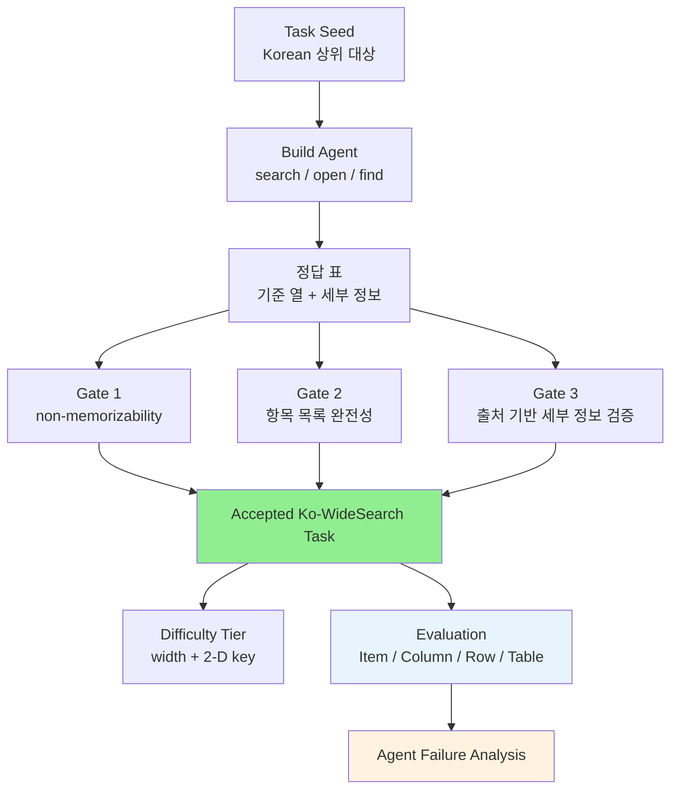

# A) 한줄 요약

**Ko-WideSearch** 는 한국어 웹 에이전트가 "정답 하나"를 찾는 데 그치지 않고, **조건에 맞는 항목을 빠짐없이 찾고 각 항목의 세부 정보를 표로 채울 수 있는지** 평가하는 벤치마크다. 기존 browsing benchmark가 여러 단서를 따라가며 숨은 정답 하나를 찾는 **depth search** 에 치우쳤다면, 이 논문은 여러 한국어 웹 출처를 훑어 **목록 전체와 항목별 정보 표를 완성하는 breadth search** 를 본다.

Minbyul Jeong은 190개 상위 대상에서 228개 표, 4,262개 정답 행, 14,560개 정보 칸을 만들고, 이를 `Item-F1`, `Column-F1`, `Row-F1`, `Table Success` 로 평가한다. 결과는 명확하다. 최신 웹 에이전트도 "무엇을 찾아야 하는지"는 꽤 잘 잡지만, 각 항목의 세부 정보를 끝까지 정확히 채워 완전한 행으로 만드는 데 실패한다. GPT-5.5도 `Item-F1 92.8`에 비해 `Row-F1 53.7`, `Table Success 19.3`에 그친다.

- **저자**: Minbyul Jeong
- **발표**: arXiv 2606.27595, 2026-06-25
- **핵심 대상**: 한국어 웹 browsing agent 평가
- **핵심 키워드**: Ko-WideSearch, Breadth Search, Web Agent, Set Enumeration, Table Completion, Korean Benchmark

# B) 전체 구조

논문이 보는 문제는 한 문장으로 줄이면 "검색해서 표를 완성하라"다. 다만 여기서 중요한 것은 표의 크기가 아니라 **완전성** 이다. 몇 개를 많이 찾는 것이 아니라, 조건에 맞는 항목을 빠짐없이 찾고 각 행의 세부 정보까지 맞춰야 한다.

예를 들어 이런 문제를 생각하면 된다.

```text
2026년 6월 기준 한국에서 운항 중인 모든 저비용항공사를 나열하고,
각 항공사별 모회사, 운항 시작 연도, 주요 허브, 보유 항공기 수를 채워라.
```

이 문제에서 agent는 두 가지를 동시에 해야 한다.

1. **항목 목록 찾기**: 한국 저비용항공사 전체를 빠짐없이 찾는다.
2. **세부 정보 채우기**: 각 항공사 행마다 모회사, 연도, 허브, 항공기 수를 채운다.

정답이 "Aero K" 같은 항목 하나가 아니라, 여러 행과 여러 열로 된 표라는 점이 핵심이다. 항공사 하나를 빠뜨려도 틀리고, 항공사 목록은 맞았더라도 보유 항공기 수 한 칸을 잘못 채우면 그 행은 완성되지 않는다.

![[img-0e91a1a61a.png|Ko-WideSearch benchmark overview]]

그래서 벤치마크를 만들 때도 단순히 질문만 만들 수는 없다. 정답 표가 정말 빠짐없는지, 각 칸의 값이 출처로 확인되는지, 모델이 외워서 풀 수 있는 문제는 아닌지까지 검증해야 한다. 논문의 pipeline은 이 과정을 아래처럼 구성한다.



이 벤치마크는 [[Qwen-AgentWorld - Language World Models for General Agents]]에서 언급된 WideSearch 계열과도 잘 이어진다. Agent가 web search를 많이 한다고 끝나는 문제가 아니라, 여러 출처에서 찾은 정보를 **행 단위로 정렬하고 검증하는 능력** 이 병목이라는 점을 보여주기 때문이다.

# C) 배경 지식

## C.1) Depth Search와 Breadth Search

Ko-WideSearch를 이해하려면 먼저 "search가 어렵다"는 말을 둘로 나눠야 한다. 기존 web-agent benchmark는 대체로 **depth search** 를 본다. BrowseComp, K-BrowseComp류 task는 여러 조건을 따라가며 하나의 어려운 답을 찾는 문제에 가깝다.

```text
depth search:
  복잡한 단서 여러 개 -> 여러 단계 검색 -> 최종 정답 하나

breadth search:
  범위가 정해진 항목 목록 정의 -> 모든 항목 찾기 -> 항목별 정보 표 완성
```

둘은 비슷해 보이지만 요구 능력이 다르다.

Depth search에서는 agent가 한 줄의 정답에 도달하면 된다. 반면 breadth search에서는 "여기서 더 찾아야 할 항목이 남았는가?", "이 행의 세부 정보는 어느 출처에서 확인해야 하는가?", "동명이인이나 행정구역 표기가 섞이지 않았는가?"를 계속 관리해야 한다. 정답을 찾는 문제라기보다, 검색으로 작은 데이터베이스를 만드는 문제에 가깝다.

그래서 breadth search는 검색 능력만 보는 문제가 아니다. 실제로는 다음 능력을 함께 본다.

- 목록의 경계를 정하는 능력
- 여러 page에서 근거를 수집하는 능력
- 행의 기준값과 세부 정보를 정확히 매칭하는 능력
- 같은 대상의 표기 차이를 처리하는 능력
- 최종 출력을 parse 가능한 표로 만드는 능력

## C.2) 왜 한국어 benchmark인가

여기에 한국어라는 축이 더해진다. 한국어 web search는 영어 web search와 다르다. 로컬 entity, 행정구역 표기, 선거/스포츠/방송 정보의 출처 구조, 검색어 관습이 다르다. 따라서 영어 browsing benchmark에서 잘하던 agent가 한국어 source에서도 같은 방식으로 잘한다고 보기 어렵다.

논문은 기존 한국어 평가가 주로 static benchmark였다고 본다. KorQuAD, KLUE, KMMLU처럼 유용한 평가가 있지만, live web을 검색하고, 출처를 넘나들며, 최신 정보를 행 단위로 정리하는 agent 능력은 잘 보지 못한다.

[[Architecting and Evaluating an AI-First Search API]]처럼 search API 자체의 품질을 보는 관점도 중요하지만, Ko-WideSearch는 그보다 한 단계 위에서 **검색 결과를 사용해 agent가 표를 끝까지 완성하는 능력** 을 본다.

# D) 기존 benchmark의 한계

## D.1) 단일 정답 benchmark는 항목 누락을 잘 드러내지 못한다

앞의 구분을 놓고 보면 기존 benchmark의 빈틈이 보인다. Agent가 하나의 어려운 정답을 맞히는 능력과, 조건에 맞는 항목 전체를 빠짐없이 채우는 능력은 다르다. 단일 정답 benchmark에서는 한두 개 행을 빼먹는 문제가 잘 드러나지 않는다.

하지만 실무에서는 breadth task가 많다.

- 특정 조건을 만족하는 모든 상품/업체/기관 찾기
- 각 항목별 가격, 날짜, 담당자, URL 채우기
- 여러 지역/기간 조합의 지표 표 만들기
- 출처마다 흩어진 세부 정보를 하나의 spreadsheet로 정리하기

이런 문제에서는 "대충 많이 찾았다"가 부족하다. 마지막 몇 행을 빠뜨리는지, 값을 다른 행에 잘못 붙이는지, 최종 결과가 parse 가능한 표인지가 실제 품질을 좌우한다.

## D.2) 정답 표를 손으로 만들기 어렵다

그렇다고 breadth benchmark를 만들기 쉬운 것도 아니다. 가장 큰 문제는 정답 표를 만드는 비용이다.

정답 하나를 검증하는 것보다, 항목 목록이 빠짐없는지와 각 칸의 값이 맞는지를 검증하는 비용이 훨씬 크다. 기존 WideSearch는 사람이 손으로 200개 표를 만들었는데, 논문은 이 방식을 한국어로 그대로 확장하기에는 비싸고 느리다고 본다.

그래서 Ko-WideSearch의 핵심 contribution은 benchmark 자체뿐 아니라 **synthesize-and-verify pipeline** 에 있다. 모델이 gold를 만들되, 다른 model family와 live search 기반 gate로 다시 검증해 pipeline-verified benchmark를 만든다.

# E) 제안 방법: Ko-WideSearch

## E.1) Task 정의

이제 논문이 task를 어떻게 정의하는지 보자. Ko-WideSearch task는 범위가 정해진 항목 목록을 묻는 질문이고, 정답은 표 형태다.

```text
question:
  조건 Y를 만족하는 모든 항목을 찾고,
  각 항목마다 요구된 세부 정보를 채워라.

정답:
  n개 행
  m개 열
  기준 열 k개
  세부 정보 열 m-k개
```

`k=1`이면 일반적인 primary key다. 예를 들어 `carrier`가 기준 열이다.

`k=2`이면 2-D composite key다. 예를 들어 `(province, election round)`처럼 두 차원을 조합해 행을 만든다. 논문의 hard example은 한국의 17개 광역자치단체와 7회/8회 지방선거 조합이다. 즉 `17 x 2 = 34`개 행이 생긴다.

## E.2) 평가 Metric

Task가 표 형태이므로, 평가도 한 점수로 끝내지 않는다. Ko-WideSearch는 WideSearch 계열의 네 metric을 쓴다.

| Metric | 의미 | 무엇을 놓치면 떨어지나 |
|---|---|---|
| `Item-F1` | 행의 기준값을 얼마나 빠짐없이 찾았는지 | 항목 누락, 잘못된 항목 추가 |
| `Column-F1` | 맞춰진 행에서 세부 정보 칸이 얼마나 맞는지 | 특정 열의 값 오류 |
| `Row-F1` | 기준값과 모든 세부 정보가 맞은 행의 비율 | 행 안의 칸 하나만 틀려도 실패 |
| `Table Success` | 표 전체가 완전히 맞은 비율 | 행 하나, 칸 하나라도 틀리면 실패 |

이 중 논문이 실질적인 ranking metric으로 보는 것은 `Row-F1`이다. `Table Success`가 가장 엄격한 end-to-end outcome이기는 하지만, 대부분의 모델이 낮은 값에 몰려 모델 간 차이를 덜 보여주기 때문이다.

## E.3) 정답 표 생성 Pipeline

이제 문제는 정답 표를 어떻게 믿을 수 있느냐다. 논문은 frontier model 기반 build agent와 verification gate를 조합한다. Build agent는 Korean web에서 `search`, `open`, `find` tool을 사용해 항목 목록과 세부 정보를 채운다.

그 뒤 세 gate를 통과해야 한다.

| Gate | 목적 | 조건 |
|---|---|---|
| Non-memorizability | model memory만으로 풀리는 task 제거 | closed-book에서 칸 단위 recall이 0.5 이상이면 reject |
| Completeness | 항목 목록이 빠지지 않았는지 확인 | 다른 model family가 다시 찾은 목록과 `set-F1 >= 0.7` |
| Cross-source verification | 세부 정보가 출처로 확인되는지 검증 | 독립 fact-check에서 열 단위 agreement가 0.6 미만이면 drop |

검증 중 세부 정보 열이 불안정하다고 판단되면 열만 빼는 데서 끝내지 않는다. 질문도 다시 써서, 정답 표에 없는 칸을 agent에게 요구하지 않도록 맞춘다. 또 중복 task를 제거하고, 5,744개 질문으로 된 8개 기존 evaluation set과 contamination check를 수행한다. 논문은 shingle Jaccard, n-gram containment, answer overlap을 사용했고, 0.6 threshold에서 걸린 질문이 없었다고 보고한다.

## E.4) Difficulty Tier

정답 표가 만들어졌다면 다음은 난이도다. Ko-WideSearch는 난이도를 감으로 나누지 않고, 두 structural knob으로 조절한다.

1. **Table width**: 채워야 할 열 수가 많아질수록 어려워진다.
2. **2-D composite key**: 단순 목록이 아니라 두 차원의 조합으로 행을 만들어야 하면 목록 관리가 어려워진다.

| Tier | Tables | Median Cols | 2-D Share | Median Rows | Cells |
|---|---:|---:|---:|---:|---:|
| Easy | 116 | 3 | 0% | 14 | 3,901 |
| Medium | 67 | 5 | 30% | 16 | 5,102 |
| Hard | 45 | 7 | 100% | 21 | 5,557 |
| Total | 228 | - | - | - | 14,560 |

Hard tier는 모두 2-D key다. 다만 논문도 이 tier가 sports-season 쪽으로 치우쳐 있다고 밝힌다. 따라서 "Hard에서 낮은 점수"를 오직 2-D 구조 때문이라고만 해석하면 안 된다.

## E.5) Normalization-Aware Comparator

표를 채점하는 benchmark에서는 scorer도 중요하다. 같은 날짜, 같은 숫자, 같은 이름도 출처마다 표기 형식이 조금씩 다를 수 있기 때문이다.

Ko-WideSearch는 정답 표를 만들 때와 모델 답변을 채점할 때 같은 type-aware comparator를 사용한다.

| 값의 종류 | 비교 방식 |
|---|---|
| Date | common granularity 기준 비교. 예를 들어 연도만 같아도 맞는 경우 처리 |
| Number | comma, unit 제거 후 5% relative tolerance |
| URL | host와 path 기준 비교 |
| Name / Location | normalized text, substring, token overlap |
| Free-text | 주요 점수에서는 LLM judge가 아니라 deterministic normalized-text match |

이 설계가 중요한 이유는 두 가지다.

첫째, 정답 표를 만들 때 안정적인 열을 formatting 차이 때문에 과하게 drop하지 않는다. 둘째, agent output을 평가할 때도 같은 기준을 쓰므로 construction과 grading이 서로 어긋나지 않는다.

논문은 LLM semantic judge로 재채점한 결과도 별도로 본다. Row-F1이 0.8-4.9 point 정도 오르지만, 전체 결론은 바뀌지 않는다. 즉 `Item-F1 >> Row-F1` gap은 주로 formatting 문제가 아니라 실제로 값을 잘못 찾은 데서 온다.

## E.6) Sourcing Label

마지막으로, 논문은 표가 어디서 완성되는지도 따로 본다. 같은 목록 페이지에서 대부분의 값을 확인할 수 있는 문제와, 항목별 페이지를 다시 열어야 하는 문제는 성격이 다르기 때문이다.

| Label | 의미 |
|---|---|
| `exhaustive-only` | 한 페이지나 한 authoritative list에서 항목 목록과 세부 정보를 대부분 확인 가능 |
| `cross-source` | 항목 목록은 찾더라도 세부 정보는 항목별 페이지나 여러 출처를 더 봐야 함 |

전체 split은 `27:201`이다. Medium과 Hard는 모두 cross-source다. 따라서 출처 구조의 난이도와 tier 난이도가 완전히 독립적이지는 않다.

# F) 벤치마크/데이터셋

이렇게 만든 Ko-WideSearch는 16개 category와 190개 상위 대상을 포함한다. 전체 228개 task 중 83%가 서로 다른 항목 목록을 다룬다. Sports/Games category가 크지만, 대부분 다른 league, season, tournament를 다룬다.

대표 task는 아래처럼 나뉜다.

| Tier | 예시 | 구조 |
|---|---|---|
| Easy | 태양계 8개 행성과 발견 연도/발견자 | 8행, 3열, 1-D key |
| Medium | 2026-06 기준 한국 저비용항공사와 모회사/허브/fleet size | 9행, 5열, 1-D key |
| Hard | 17개 광역자치단체 x 7/8회 지방선거 당선자와 투표율/나이/득표율 | 34행, 7열, 2-D key |

평가할 때는 모든 model을 같은 web-search agent harness에 넣는다. Tool은 `search`, `open`, `find`로 통일하고, 답변 마지막에는 정확히 하나의 JSON block을 내도록 요구한다. 최종 answer가 JSON, Markdown table, CSV로 parse되지 않으면 free-text fallback은 recall만 제한적으로 보고 표 점수는 0이 된다.

평가한 model은 총 20개다.

- Proprietary frontier: GPT-5.5, Claude-Opus-4.8/4.7/4.6, Gemini-3.1-Pro, Gemini-3.1-Flash-Lite, Gemini-3.5-Flash, Claude-Sonnet-4.6, GPT-5.4, GPT-5.4-mini/nano, Claude-Haiku-4.5
- Open-weight: DeepSeek-V4-Pro, GLM-5.1, Gemma-4-31B, DeepSeek-Chat, Qwen3.6-35B
- Korean-specialized: Solar-Open-2-preview, A.X-4.0, K-EXAONE-236B

# G) 실험 결과와 실무적 시사점

## G.1) Main Results

결과를 한 문장으로 요약하면 "항목 목록은 꽤 찾지만, 완성된 행은 많이 만들지 못한다"다. 즉 agent가 검색을 전혀 못하는 것은 아니다. 다만 찾은 항목마다 필요한 세부 정보를 끝까지 맞춰 넣지 못한다.

| Model | Item-F1 | Column-F1 | Row-F1 | Table Success | Parse |
|---|---:|---:|---:|---:|---:|
| GPT-5.5 | 92.8 | 74.3 | 53.7 | 19.3 | 98.2 |
| Claude-Opus-4.8 | 94.1 | 75.5 | 52.9 | 16.2 | 99.6 |
| Claude-Opus-4.7 | 94.6 | 75.6 | 51.6 | 15.8 | 100.0 |
| Claude-Opus-4.6 | 92.0 | 72.7 | 48.9 | 14.9 | 100.0 |
| Gemini-3.1-Pro | 88.2 | 65.6 | 45.9 | 14.5 | 93.0 |
| Gemini-3.1-Flash-Lite | 89.0 | 69.7 | 45.9 | 7.0 | 99.1 |
| Gemini-3.5-Flash | 79.9 | 63.3 | 44.1 | 12.7 | 86.8 |
| DeepSeek-V4-Pro | 80.4 | 63.9 | 45.0 | 12.3 | 87.3 |
| Claude-Sonnet-4.6 | 90.2 | 67.7 | 43.6 | 11.8 | 100.0 |
| GPT-5.4 | 89.0 | 61.5 | 41.6 | 10.5 | 100.0 |
| GLM-5.1 | 61.7 | 45.6 | 34.0 | 12.3 | 66.2 |
| GPT-5.4-mini | 82.3 | 55.9 | 33.3 | 5.7 | 98.2 |
| Claude-Haiku-4.5 | 66.7 | 43.5 | 28.8 | 7.0 | 75.9 |
| Solar-Open-2-preview | 44.0 | 33.3 | 24.4 | 9.7 | 62.7 |
| A.X-4.0 | 71.7 | 46.2 | 24.2 | 4.4 | 93.4 |
| Gemma-4-31B | 76.4 | 43.9 | 23.0 | 2.6 | 93.4 |
| DeepSeek-Chat | 65.4 | 39.4 | 21.3 | 4.0 | 87.3 |
| K-EXAONE-236B | 61.9 | 32.3 | 17.5 | 3.1 | 82.9 |
| Qwen3.6-35B | 32.4 | 22.2 | 16.2 | 4.0 | 38.6 |
| GPT-5.4-nano | 66.6 | 26.6 | 15.9 | 5.7 | 93.4 |

GPT-5.5는 `Item-F1 92.8`까지 가지만 `Row-F1 53.7`이다. Table Success는 19.3으로, 대략 5개 표 중 1개만 완전히 맞춘다는 뜻이다. Claude-Opus-4.8/4.7도 거의 같은 수준이고, DeepSeek-V4-Pro는 open-weight model 중에서 상당히 강한 편이다.

반대로 Qwen3.6-35B는 검색을 많이 하지만 parse 가능한 표를 잘 못 내고, `Parse 38.6`, `Row-F1 16.2`에 그친다. 여기서는 search depth보다 **구조화된 출력과 행 단위 완성도** 가 더 큰 병목으로 보인다.

## G.2) Difficulty가 올라가면 Row-F1이 급격히 떨어진다

Pooled score는 난이도별로 이렇게 떨어진다.

| Split | Item-F1 | Column-F1 | Row-F1 | Table Success |
|---|---:|---:|---:|---:|
| Easy | 79.3 | 56.6 | 43.5 | 11.3 |
| Medium | 72.2 | 51.3 | 30.2 | 9.1 |
| Hard | 73.1 | 51.0 | 23.4 | 6.4 |
| Exhaustive-only | 86.9 | 68.7 | 60.4 | 25.0 |
| Cross-source | 74.5 | 51.9 | 32.3 | 7.6 |

여기서 중요한 점은 `Item-F1`은 생각보다 버틴다는 것이다. Agent가 "무엇을 찾아야 하는지"는 어느 정도 잡는다. 하지만 열 수가 늘고 2-D key가 들어가면 완성된 행의 비율이 무너진다.

즉 문제는 단순히 "더 많은 항목을 찾아야 해서" 생기는 것이 아니다. 논문은 항목 수별 Row-F1도 거의 flat하다고 보고한다. 8-15행에서는 35.4, 16-30행에서는 31.2, 30행 초과에서도 35.0이다. 더 큰 목록 자체보다, **각 행에 맞는 세부 정보를 찾아 붙이는 과정** 이 어렵다.

## G.3) 더 많이 검색하거나 더 많이 쓰면 해결되는가

그렇다면 검색을 더 많이 하거나 더 비싼 모델을 쓰면 해결될까? 논문의 답은 "아직은 아니다"에 가깝다.

가장 검색을 많이 한 Qwen3.6-35B와 Solar-Open-2-preview는 각각 평균 66회, 57회 tool call을 썼지만 하위권이다. 반면 GPT-5.5와 Claude-Opus-4.8은 각각 평균 33회, 26회 정도의 moderate search로 최상위권이다.

비용도 비슷하다. GPT-5.5는 표 하나당 약 $0.87을 쓰고 Row-F1 53.7을 얻지만, DeepSeek-V4-Pro는 훨씬 낮은 비용으로 Row-F1 45.0까지 간다. 비용을 더 쓰거나 tool call을 늘린다고 완성도가 자동으로 오르지는 않는다.

실무적으로는 search budget보다 아래 요소가 더 중요해 보인다.

- 행의 기준값을 먼저 고정하고 세부 정보를 채우는 planning
- 행별 근거 추적
- 세부 정보별 출처 검증
- parse 가능한 structured output 강제
- 모르는 칸을 추측하지 않고 blank로 두는 정책
- 마지막에 행 완성도를 self-check하는 verifier

## G.4) 어떤 값이 어려운가

Row-F1이 낮다면 어떤 칸에서 깨지는지도 봐야 한다. 논문 분석에 따르면 형식이 정해진 칸은 상대적으로 쉽다. 날짜, 숫자, 표준 이름처럼 comparator가 안정적으로 처리할 수 있는 값은 잘 맞는 편이다.

가장 어려운 것은 자유 서술형 값이다. 예를 들어 주소, 발견자, 설명형 세부 정보, 출처마다 표기가 다른 이름은 agent가 그럴듯한 값을 만들거나, 너무 뭉뚱그려 쓰거나, 다른 대상의 값을 가져오기 쉽다.

LLM semantic judge로 재채점하면 일부 표기 차이는 구제된다. 예를 들어 행정구역 granularity나 transliteration 차이 같은 것은 strict scorer에서는 틀렸지만 semantic judge는 맞다고 볼 수 있다. 그래도 Row-F1 개선 폭은 0.8-4.9 point 정도라서, 큰 gap은 사라지지 않는다.

따라서 이 benchmark가 보여주는 실패는 "채점기가 너무 빡빡해서"가 아니라, 실제로 값을 잘못 찾거나, 행에 잘못 붙이거나, 표를 못 만든 실패에 가깝다.

## G.5) 실패 유형

앞의 결과를 failure type으로 나누면 원인이 더 잘 보인다. 논문이 보여준 실패는 대략 다섯 가지다.

| Failure | 설명 |
|---|---|
| Under-recall | 찾아야 할 항목을 빠뜨림 |
| Boundary error | 범위 밖 항목을 추가하거나 목록의 경계를 잘못 잡음 |
| Blank value | 항목은 찾았지만 세부 정보 칸을 비워 둠 |
| Wrong value | 다른 출처나 다른 대상의 값을 가져옴 |
| Parse failure | prose list를 내고 표/JSON으로 parse되지 않음 |

강한 model은 목록의 경계는 대체로 맞히고 세부 정보에서 factual error를 낸다. 약한 model은 그 이전 단계에서 항목 recall이나 structured output부터 깨진다.

## G.6) 실무적 시사점

실무 관점에서 이 논문의 메시지는 단순하다. Agent evaluation을 설계할 때 "최종 답이 맞았는가"만 보면 부족하다. 특히 business workflow에서 web agent가 spreadsheet나 report table을 만들어야 한다면, `Item-F1`처럼 항목 목록만 보는 metric은 낙관적일 수 있다.

실무 eval을 만든다면 최소한 아래를 따로 봐야 한다.

1. **Membership recall**: 찾아야 할 항목을 빠뜨리지 않았는가.
2. **Per-cell accuracy**: 항목별 세부 정보가 맞는가.
3. **Row completeness**: 한 행을 업무에 쓸 수 있을 만큼 완성했는가.
4. **Parse success**: downstream system이 읽을 수 있는 구조로 냈는가.
5. **Evidence coverage**: 각 칸이 어떤 출처로 확인됐는가.

또 하나 중요한 점은 한국어/로컬 벤치마크다. 영어 web에서 잘하던 agent도 한국어 페이지 구조와 local entity에는 다르게 실패할 수 있다. 따라서 한국어 서비스에서 web agent를 쓴다면, 글로벌 벤치마크 점수만 보지 말고 자기 도메인의 Korean breadth task로 따로 재야 한다.

## G.7) 한계

마지막으로 한계도 분명하다. Ko-WideSearch는 pipeline-verified benchmark다. Native speaker spot-check가 있지만, 외부 paid annotator 기반의 formal inter-annotator agreement study는 아니다. 정답 표를 만드는 과정에 model이 들어가기 때문에 verification gate를 믿어야 하고, 웹 출처가 바뀌면 정답도 낡을 수 있다.

데이터 release도 leakage를 막기 위해 request-based다. pipeline과 scorer는 공개하지만 평가 데이터를 검색 가능한 web에 그대로 올리지 않는다. benchmark contamination을 줄이는 데는 좋지만, 완전히 open dataset처럼 즉시 재현하기는 어렵다.

또한 Hard tier가 sports-season 쪽으로 치우쳐 있고, `cross-source` split이 difficulty tier와 강하게 얽혀 있다. 따라서 "2-D key", "cross-source", "sports-heavy category" 효과를 완전히 분리해서 해석하기는 어렵다.

그래도 논문의 메시지는 충분히 강하다. 현재 web agent의 병목은 "검색을 안 해서"만이 아니라, 찾은 정보를 **완성된 표로 정렬하고 검증하는 능력** 에 있다.

# H) References

- [Ko-WideSearch: A Korean Breadth-Search Benchmark for Exhaustive Set Enumeration by Web Agents](https://arxiv.org/abs/2606.27595)
- [arXiv HTML](https://arxiv.org/html/2606.27595v1)
- [arXiv PDF](https://arxiv.org/pdf/2606.27595)
