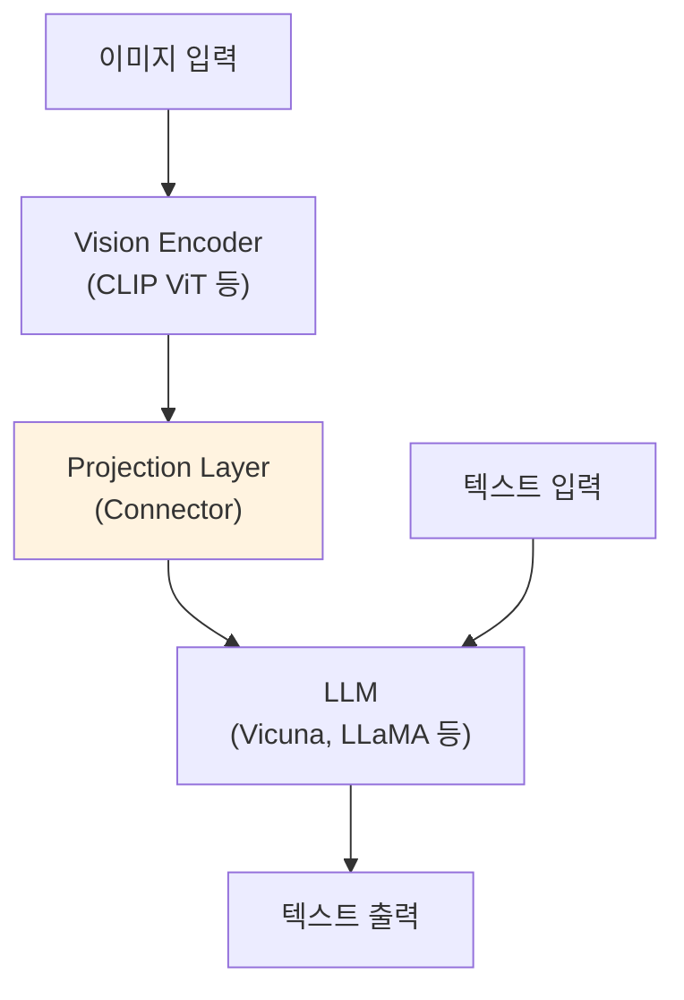
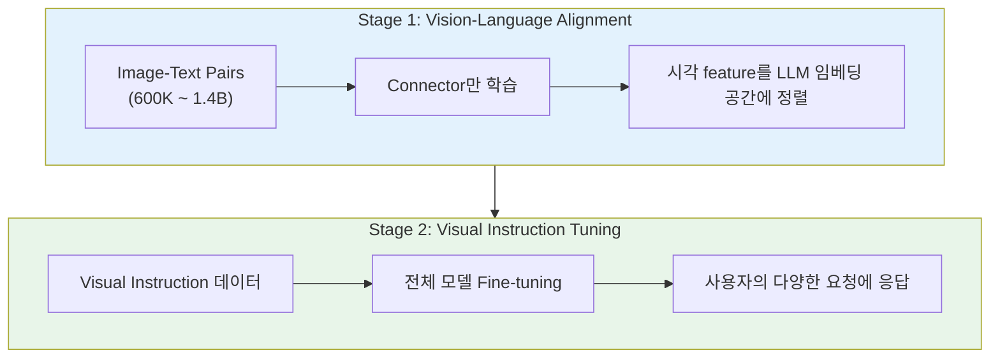
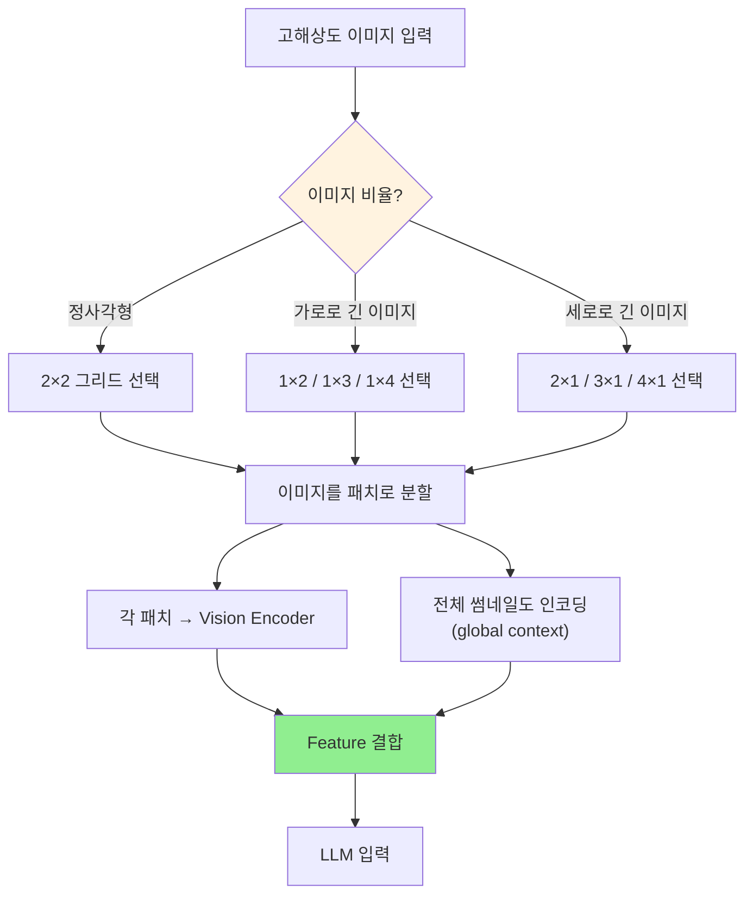

# A) 핵심 요약

**LLaVA (Large Language and Vision Assistant)**: Vision Encoder + LLM을 연결하여 이미지를 이해하고 자연어로 대화할 수 있는 **멀티모달 LLM**. GPT-4를 활용해 COCO 데이터셋을 instruction-following 형태로 확장하여 학습.

# B) 배경: Multimodal LLM 구조

## B.1) 핵심 구성 요소

| 구성 요소 | 역할 | 크기 (예시) |
|----------|------|------------|
| **Vision Encoder** | 이미지 → 시각적 feature 추출 | ~300M |
| **Connector (Projection)** | 시각 feature를 LLM 임베딩 공간에 정렬 | ~50M |
| **LLM** | 언어 이해 및 생성 | 7B ~ 34B |

## B.2) 2단계 학습 프로토콜

| Stage | 데이터 | 학습 대상 | 목표 |
|-------|--------|----------|------|
| **1. Alignment** | Image-Text Pairs (600K~1.4B) | Connector만 | 시각-언어 공간 정렬 |
| **2. Instruction Tuning** | Visual Instructions | 전체 모델 | 사용자 요청 수행 |

# C) LLaVA (v1)

## C.1) 데이터 생성 방식

GPT-4 (text-only)를 활용하여 COCO 데이터셋 확장:

| 데이터 타입 | 설명 |
|------------|------|
| **Conversational QA** | 대화형 질의응답 |
| **Detailed Description** | 이미지 상세 설명 |
| **Complex Reasoning** | 복잡한 추론 |

## C.2) 아키텍처

## C.3) Response Formatting 문제

InstructBLIP 등 기존 모델이 짧은/긴 답변 밸런스를 못 맞추는 이유:

| 문제 | 설명 |
|------|------|
| **프롬프트 모호성** | 응답 포맷 프롬프트가 모호하면 짧은 답변에 과적합 |
| **제한된 튜닝** | InstructBLIP은 Q-Former만 튜닝, LLM은 동결 |

# D) LLaVA-NeXT (v1.5+)

**개선 목표**: Reasoning, OCR, World Knowledge 향상

## D.1) Dynamic High Resolution (AnyRes)

**왜 필요한가?**
- 해상도 높을수록 → 복잡한 디테일 감지 능력 향상
- 저해상도일 때 모델이 "상상"으로 채우는 **hallucination 감소**

**그리드 구성:**

$$\{2 \times 2, 1 \times \{2,3,4\}, \{2,3,4\} \times 1\}$$

이미지 비율에 따라 동적으로 그리드 선택 (가로로 긴 이미지 → 1×3 등)

## D.2) Data Mixture 개선

### D.2.1) 고품질 User Instruction 데이터

**고품질 기준:**
1. 실제 사용자 시나리오 대응 가능한 **다양한 응답**
2. **사용자 선호 피드백**이 있는 응답

**사용 데이터:**

| 데이터소스                                                              | 설명                                  |
| ------------------------------------------------------------------ | ----------------------------------- |
| [LAION-GPT-V](https://huggingface.co/datasets/laion/gpt4v-dataset) | GPT-4V 기반 데이터                       |
| [ShareGPT-4V](https://sharegpt4v.github.io/)                       | GPT-4V 기반 데이터                       |
| LLaVA Demo 수집                                                      | 실제 사용자 요청 15K (필터링 후 GPT-4V로 응답 생성) |

### D.2.2) OCR/문서 이해 데이터

| 변경 사항 | 이유 |
|----------|------|
| TextCaps **제거** | TextVQA와 학습 이미지 겹침 → Zero-shot OCR 성능 향상 |
| DocVQA, SynDog-EN **추가** | OCR 능력 강화 |
| ChartQA, DVQA, AI2D **추가** | 차트/다이어그램 이해 강화 (Qwen-VL 영감) |

## D.3) LLM Backbone 확장

| LLM | 크기 | 특징 |
|-----|------|------|
| Vicuna-1.5 | 7B, 13B | 기본 |
| Nous-Hermes-2-Yi | 34B | 최대 크기 |
| Mistral | 7B | 효율적 |

# E) Model Card

## E.1) 모델 스펙 (2024년 2월 기준)

| 항목 | 규모 |
|------|------|
| LLM 라인업 | 7B, 13B, 34B |
| Vision Encoder | ~300M |
| Connector | ~50M |

## E.2) 학습 데이터

| Stage | 데이터 크기 | 용도 |
|-------|-----------|------|
| Stage 1 | 558K | Connector 학습 |
| Stage 2 | 760K | 전체 모델 학습 |
| **총합** | **1,318K** | - |

## E.3) 학습 비용

| 항목 | 스펙 |
|------|------|
| 하드웨어 | A100 × 32 |
| 시간 | ~30시간 (34B 기준) |

# F) Related

- [[CLIP]]
- [[Vicuna]]
- [[InstructBLIP]]
- [[GPT-4V]]

# G) References

- [LLaVA Paper (v1)](https://arxiv.org/pdf/2304.08485.pdf)
- [LLaVA-NeXT Technical Report](https://static.hliu.cc/files/llava/improved_llava.pdf)
- [LLaVA GitHub](https://github.com/haotian-liu/LLaVA)
