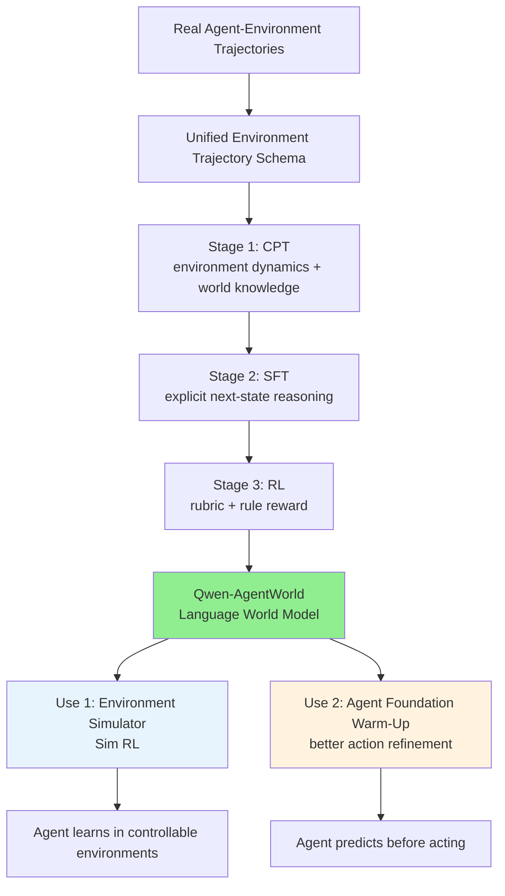

# A) 한줄 요약

**Qwen-AgentWorld** 는 agent가 action을 실행한 뒤 환경이 어떤 관측값을 돌려줄지 예측하는 **Language World Model (LWM)** 을 다룬다. 일반 LLM을 나중에 simulator처럼 부르는 방식이 아니라, 처음부터 `history + action -> next observation`을 학습 목표로 둔다.

Qwen Team은 `MCP`, `Search`, `Terminal`, `SWE`, `Android`, `Web`, `OS`까지 7개 agent 환경을 하나의 모델로 시뮬레이션한다. 논문은 `Qwen-AgentWorld-35B-A3B`와 `Qwen-AgentWorld-397B-A17B` 두 규모를 보고했고, 공개 release는 35B-A3B weight와 AgentWorldBench benchmark가 중심이다.

한마디로, 이 논문은 **agent를 더 많이 실행시키는 법** 보다 **agent가 실행될 세계를 어떻게 예측하고 통제할지** 에 초점을 둔다. 실제 환경에만 의존해 RL을 돌리면 비용과 위험, 관측 가능한 실패 사례가 모두 제한된다. Qwen-AgentWorld는 world model로 환경 분포를 넓히고, edge case와 failure mode를 의도적으로 조절해 agent를 훈련하려는 시도다.

- **저자**: Qwen Team, Yuxin Zuo et al.
- **발표**: arXiv 2606.24597, 2026-06-23
- **핵심 모델**: Qwen-AgentWorld-35B-A3B, Qwen-AgentWorld-397B-A17B
- **공개물**: 35B-A3B model weights, AgentWorldBench
- **핵심 키워드**: Language World Model, Agentic RL, Environment Simulation, Next-State Prediction, Agent Foundation Model

# B) 전체 구조


전체 구조는 두 층이다.

첫 번째는 **world model 자체를 학습하는 단계** 다. 실제 agent가 환경과 상호작용한 trajectory를 모아, action 뒤에 이어질 environment observation을 예측하도록 모델을 훈련한다. terminal, web, search, Android UI처럼 환경은 서로 달라도 모두 텍스트 형태의 `action -> observation` 문제로 맞춘다.

두 번째는 **학습된 world model을 agent 학습에 쓰는 방법** 이다. 논문은 두 가지 사용법을 제시한다.

1. **Decoupled simulator**: agent는 따로 두고, Qwen-AgentWorld를 environment simulator로 사용한다. 실제 MCP server, 검색 엔진, terminal sandbox를 매번 띄우지 않고도 Sim RL을 돌릴 수 있다.
2. **Unified agent foundation model**: world model training을 agent model의 warm-up처럼 사용한다. agent가 행동하기 전에 "이 행동을 하면 다음에 어떤 observation이 나올까?"를 예측하게 만든다.



Qwen-AgentWorld의 world model은 **답변 생성기** 가 아니라 **환경 반응 생성기** 역할을 한다. Search domain에서는 검색 결과 snippet, Terminal domain에서는 command output과 shell prompt, MCP domain에서는 JSON tool response를 예측한다.

# C) 배경 지식

## C.1) World Model이란?

World model은 현재 상태와 행동을 보고 다음 상태를 예측하는 모델이다. RL이나 planning에서 오래전부터 쓰인 개념이고, visual world model이나 robotics world model에서는 주로 이미지/비디오의 다음 상태를 예측한다.

LLM agent의 상태는 꼭 픽셀일 필요가 없다. terminal output, API response, browser accessibility tree, search result snippet처럼 **텍스트로 표현되는 환경 상태** 가 많다. Qwen-AgentWorld는 이 상황을 다음 문제로 정리한다.

```text
입력: system prompt + 이전 interaction history + 현재 agent action
출력: 다음 environment observation
```

예를 들어 agent가 terminal에서 `pip install torch`를 실행했다면, world model은 단순히 "설치 완료"를 출력하면 안 된다. 현재 disk 용량, package 상태, 이전 command history를 보고 실제 terminal처럼 stdout/stderr와 prompt를 예측해야 한다.

## C.2) Environment Trajectory와 Agentic Trajectory

논문은 trajectory를 두 종류로 나눈다.

| 용어 | 의미 | 학습에서 쓰는 부분 |
|---|---|---|
| Environment trajectory | agent의 action과 environment observation만 남긴 상호작용 기록 | world model의 핵심 학습 데이터 |
| Agentic trajectory | agent의 reasoning, action 선택, tool call, observation까지 포함한 전체 실행 trace | 이 trace에서 reasoning을 제거하거나 변환해 environment trajectory를 만든다 |

이 구분이 논문의 의도를 선명하게 만든다. Qwen-AgentWorld는 "agent가 어떻게 생각했는가"를 흉내 내는 모델이 아니다. 더 좁게는 **환경이 action에 어떻게 반응했는가** 를 학습한다.

## C.3) 7개 도메인

Qwen-AgentWorld는 7개 agent interaction domain을 하나의 schema로 묶는다.

| Domain | Action | Observation | 주로 필요한 능력 |
|---|---|---|---|
| MCP | JSON tool call | tool response, file, DB 결과 | factual world knowledge |
| Search | web search, web extractor | query와 search results가 쌓인 history | factual world knowledge |
| SWE | read, edit, bash 등 | file content, diff, command output | code execution reasoning |
| Terminal | bash command, keystrokes | stdout, stderr, shell prompt | long-context causal reasoning |
| Android | touch, swipe, type | UI view hierarchy, app state | visual state reasoning |
| Web | click, type, navigate | accessibility tree, browser state | visual state reasoning |
| OS | mouse, keyboard | accessibility tree, window/app state | visual state reasoning |

GUI domain도 pixel을 직접 다루지는 않는다. Android, Web, OS는 accessibility tree나 UI view hierarchy처럼 텍스트화된 state representation을 쓴다. "language world model"이라는 이름도 이 텍스트 기반 state representation에서 나온다.

# D) 기존 방법의 한계

## D.1) Agent 연구가 policy 쪽에 치우쳐 있었다

LLM agent 연구는 보통 `state -> action`을 잘 고르는 데 집중한다. 어떤 tool을 부를지, 어떤 검색어를 넣을지, 어떤 file을 수정할지 정하는 policy 문제로 본다.

그런데 agent가 실제로 강해지려면 반대 방향도 필요하다.

```text
policy:      state -> action
world model: state + action -> next state
```

행동을 잘 고르는 agent라면 "이 action을 실행하면 무슨 일이 벌어질지"도 예측해야 한다. Qwen-AgentWorld는 그 빠진 절반을 직접 학습 대상으로 만든다.

## D.2) 실제 환경만으로는 scaling과 control이 어렵다

실제 환경에서 agent를 훈련시키면 fidelity, 즉 **환경 재현도** 는 높다. fidelity는 agent의 action에 환경이 실제 서비스나 tool처럼 정확하고 일관되게 반응하는 정도다. 문제는 운영 비용과 통제 가능성이다.

1. **비용과 인프라**: terminal sandbox, browser, Android VM, MCP server를 대규모로 유지해야 한다.
2. **위험한 action**: 실제 DB 변경, 외부 API 호출, irreversible operation은 마음껏 시도하기 어렵다.
3. **edge case 부족**: real environment에서는 흔치 않은 partial failure, pagination, intermittent API error를 충분히 자주 만날 수 없다.
4. **controllability 부족**: agent가 특정 약점을 드러내도록 환경을 의도적으로 조절하기 어렵다.

Qwen-AgentWorld의 목표는 "world model로 실제 환경을 싸게 대체하자"가 아니다. 더 정확히는 **실제 환경만으로 만들기 어려운 분포를 통제해서 만든다** 는 데 있다.

## D.3) 일반 LLM을 simulator로 쓰면 환경 재현도가 부족하다

일반 instruction model도 "terminal output을 예측해봐"라고 시키면 그럴듯한 답을 낼 수 있다. 하지만 agent training에는 부족하다. 필요한 것은 말투의 자연스러움이 아니라, 실제 환경의 반응을 얼마나 정확히 재현하느냐다.

Terminal에서는 byte count, file-system mutation, shell prompt가 맞아야 한다. MCP에서는 API schema와 cross-turn object ID가 유지되어야 한다. Search에서는 simulator가 내부적으로 reference answer를 알고 있더라도, agent의 query가 아직 그 답에 닿지 못했다면 snippet에 정답을 몰래 흘리면 안 된다.

검색 예시로 보면 더 직관적이다. agent가 아직 애매한 query만 던졌는데 검색 snippet에 최종 정답이 바로 들어 있으면, agent는 query를 좁히거나 결과를 비교하는 법을 배우지 않는다. 아무 검색이나 한 뒤 simulator가 흘린 정답을 줍는 shortcut을 배운다. 그래서 Search world model은 "진짜 검색 엔진이라면 이 query에 무엇을 보여줬을까?"와 "agent가 이 시점에 알아도 되는 정보는 어디까지인가?"를 함께 지켜야 한다.

language simulator에는 다음 조건이 동시에 필요하다.

- **format fidelity**: 응답 schema와 출력 형식을 실제 환경처럼 맞추는 정도
- **factual fidelity**: file content, search result, tool return value 같은 사실 내용이 실제 결과와 맞는 정도
- **cross-turn consistency**: 이전 turn의 상태, ID, object reference가 뒤에서 깨지지 않는 정도
- **domain-specific realism**: 각 domain의 response pattern과 관례를 따르는 정도
- **enough information, but not too much leakage**: agent가 관찰할 수 있는 정보는 주되 정답을 과하게 흘리지 않는 정도

Qwen-AgentWorld는 이 조건을 맞추기 위해 training objective, prompt construction, benchmark, RL reward를 모두 world-modeling 중심으로 설계한다.

# E) 제안 방법: Qwen-AgentWorld


## E.1) Unified Environment Trajectory Schema

모든 도메인은 아래 구조로 정규화된다.

```text
System prompt:
  - task description
  - action space
  - initial state
  - demonstrations
  - simulation instruction

Turn 1:
  user: agent action
  assistant: environment observation

Turn 2:
  user: agent action
  assistant: environment observation
```

`initial state`는 domain마다 다르다. Terminal에서는 OS, package, working directory, file-system snapshot이 될 수 있고, Web에서는 browser state나 page tree가 될 수 있다.

`simulation instruction`은 simulation 통제에 쓰인다. 예를 들어 Search domain에서는 reference answer를 model이 내부적으로 알고 있더라도, agent의 현재 query가 그 정보를 아직 찾지 못했다면 snippet에 답을 흘리지 말라는 제약을 줄 수 있다. simulator에게는 정답지가 필요하지만, agent에게 그 정답지가 바로 보이면 안 된다.

## E.2) Training Data

논문은 1,000만 개 이상의 real-world interaction trajectory를 활용했다고 설명한다. 데이터는 크게 세 경로로 모은다.

1. **Dedicated agent infrastructure**: container sandbox, MCP server, persistent terminal session, Android/browser/desktop environment를 직접 운영하며 agent interaction을 수집한다.
2. **Open environment interaction traces**: public terminal recording, open-source tool-call log, code repository execution trace 등을 multi-agent cleaning pipeline으로 정제한다.
3. **In-house agentic trajectories**: Qwen 내부 foundation model 개발 과정에서 축적된 agent trajectory를 environment trajectory로 변환한다.

SFT와 RL에 사용된 downstream pool의 규모는 아래와 같다.

| Domain | SFT | RL train | Avg tokens | Avg turns |
|---|---:|---:|---:|---:|
| MCP | 179 | 4,156 | 62,702 | 28.9 |
| Search | 1,042 | 20,004 | 18,873 | 6.2 |
| Terminal | 1,580 | 34,125 | 5,805 | 12.0 |
| SWE | 249 | 8,181 | 36,734 | 24.7 |
| Android | 1,337 | 11,498 | 30,064 | 19.3 |
| Web | 1,605 | 8,716 | 19,417 | 10.2 |
| OS | 1,102 | 5,628 | 25,439 | 12.4 |
| **Total** | **7,094** | **92,308** | **19,443** | **13.4** |

눈에 띄는 부분은 MCP와 SWE의 평균 context다. MCP는 평균 62K tokens, SWE도 36K tokens 수준이다. 이 모델의 256K context window는 단순한 스펙 과시가 아니라, multi-turn environment simulation에 실제로 필요하다.

## E.3) Stage 1: CPT

CPT는 environment trajectory를 일반 language modeling 형식으로 학습한다. 다만 일반 문서 next-token prediction이 아니라, prompt와 interaction history를 보고 다음 environment observation을 맞히는 문제다.

논문은 여기에 domain world knowledge corpus도 함께 넣는다. 예를 들어 법률 시스템을 시뮬레이션하려면 법률 지식이 필요하고, 병원 시스템을 시뮬레이션하려면 의료 도메인 지식이 필요하다. 환경 trajectory만으로는 이런 배경 지식을 충분히 담기 어렵다.

Stage 1에서 눈에 띄는 기법은 **turn-level information-theoretic loss masking** 이다. 이름은 복잡하지만 직관은 단순하다. **모든 observation token을 똑같이 시험 문제로 내지 말고, 환경에 대한 새 정보를 담은 turn만 세게 채점하자** 는 뜻이다.

Tool-use trajectory에는 학습 가치가 낮은 turn이 많다. API가 입력을 그대로 echo하거나, tool이 단순 status만 돌려주는 경우가 대표적이다. 이런 token까지 같은 비중으로 loss를 걸면 모델은 환경 dynamics보다 boilerplate를 더 많이 배운다.

예를 들어 `create_issue(title="bug", body="...")` 같은 action 뒤에 observation이 `{"title":"bug", "body":"...", "status":"created"}`처럼 대부분 입력을 되풀이한다면, 이 turn에서 배울 대상은 긴 title/body 복사가 아니다. 새로 생긴 `status`, `id`, permission 변화, 다음 turn에서 참조할 object state가 중요하다. 반대로 `read_file`이나 search result처럼 observation 안에 action에는 없던 새 내용이 많으면, 그 turn은 world model이 제대로 배워야 할 정보가 많다.

그래서 논문은 action과 observation 사이의 overlap, novelty, Jaccard, length ratio를 계산해 turn을 분류한다. 학습 가치가 낮은 turn은 context에는 남기되, loss 비중은 낮춘다.

`context에는 남긴다`는 조건도 필요하다. echo성 turn도 뒤 turn의 원인이 될 수 있기 때문이다. API가 단순히 `created`만 돌려줬더라도, 그 결과로 생성된 object ID나 상태는 다음 tool call의 전제가 된다. 그래서 기록에서는 지우지 않고, 그 token을 맞히는 학습 신호만 약하게 만든다.

네 가지 통계량은 이렇게 보면 된다.

| Statistic | 직관 |
|---|---|
| Overlap | observation이 action 단어를 얼마나 반복하는가 |
| Novelty | observation에 action에는 없던 새 단어가 얼마나 많은가 |
| Jaccard | action과 observation의 단어 집합이 전반적으로 얼마나 비슷한가 |
| Length ratio | observation 길이가 action 대비 얼마나 길거나 짧은가 |

| Turn category | 직관 | Loss keep ratio |
|---|---|---:|
| retrieval | file content처럼 새 정보가 많음 | 100% |
| expansion | page fetch + metadata처럼 정보 확장 | 100% |
| action | 짧지만 action 결과가 중요함 | 100% |
| transform | 긴 입력을 짧게 변환한 결과 | 50% |
| boilerplate | API echo 성격이 강함 | 10% |
| echo | 거의 그대로 반복 | 5% |
| other | 그 외 | 100% |

tool 이름별 rule을 박아두지 않고 표면 통계로 판단하므로, domain을 바꿔도 어느 정도 재사용할 수 있다.

## E.4) Stage 2: SFT

CPT가 "환경이 어떻게 반응하는지"를 암묵적으로 학습한다면, SFT는 이 능력을 **명시적 next-state prediction reasoning** 으로 끌어낸다.

SFT 데이터는 reasoning trace가 포함된 trajectory로 구성된다. 논문은 prompt template을 다양화하고, 여러 rollout 후보를 만든 뒤 judge score로 rejection sampling을 한다. 시작 후보 10,250개 중 최종 SFT 데이터 7,094개가 남았고, retention rate는 69.2%다.

| Domain | Candidates | Retain rate | Final SFT | Avg turns |
|---|---:|---:|---:|---:|
| MCP | 261 | 68.6% | 179 | 24.3 |
| Search | 1,466 | 71.1% | 1,042 | 3.3 |
| Terminal | 1,826 | 86.5% | 1,580 | 5.9 |
| SWE | 402 | 61.9% | 249 | 26.9 |
| Android | 1,975 | 67.7% | 1,337 | 15.9 |
| Web | 2,697 | 59.5% | 1,605 | 3.0 |
| OS | 1,623 | 67.9% | 1,102 | 5.4 |
| **Total** | **10,250** | **69.2%** | **7,094** | **8.5** |

SFT의 목표는 "더 친절한 답변"이 아니다. 모델이 observation을 생성하기 전에 action의 요청, 이전 state, 필요한 response format을 따져보게 만드는 데 있다.

## E.5) Stage 3: RL

RL stage는 `GSPO`를 사용한다. LWM RL은 일반 answer RL과 조금 다르다.

일반 answer RL에서는 질문과 답변 길이가 비교적 비슷하다. 예를 들어 1K token prompt를 보고 1K token 답변을 만들고, 그 답변 전체에 reward가 걸린다. 하지만 LWM RL에서는 prompt가 수만 token의 interaction history다. 지금까지의 terminal 출력, file state, tool response, agent action이 모두 들어간다. 반면 모델이 새로 생성해야 하는 output은 방금 action에 대한 **다음 observation 하나** 뿐이다.

이 불균형이 **prompt-output asymmetry** 다. 모델은 긴 history를 읽어야 하지만, 학습 신호는 짧은 observation에서만 나온다. 두꺼운 사건 기록을 다 읽고 다음 한 줄짜리 판결 메모를 맞히는 훈련과 비슷하다. context가 길어질수록 계산 비용은 커지지만, output 쪽 reward와 gradient는 상대적으로 작다.

그래서 논문은 RL pool에서 prompt를 128K tokens로 제한한다. history를 무한히 길게 넣으면 realism은 조금 올라갈 수 있지만, 학습은 비싸지고 불안정해진다. 충분한 과거 state를 보존하되, 다음 observation 예측에 필요한 범위 안에서 prompt를 잘라야 한다.

Reward는 두 신호를 섞는다.

| Reward signal | 역할 |
|---|---|
| Five-dimensional rubric | Format, Factuality, Consistency, Realism, Quality를 LLM judge가 1-5로 평가 |
| Rule-based verifier | executable check가 가능한 샘플에서 0/1 correctness anchor 제공 |

두 reward는 `rubric:rule = 9:1`로 결합된다. LLM judge만 쓰면 그럴듯한 자기칭찬 문구나 prompt echo로 reward hacking이 생길 수 있다. rule-based verifier는 그때 anchor 역할을 한다.

논문이 보고한 안정화 포인트도 실전적이다.

1. **Shared prefix collapse 방지**: multi-turn trajectory를 여러 sample로 확장하면 긴 공통 prefix 때문에 reward variance가 무너질 수 있다. RL pool에서는 trajectory당 정확히 한 turn만 사용한다.
2. **Reward shaping**: binary pairwise reward보다 5개 rubric dimension이 더 안정적으로 수렴한다.
3. **Self-praise 차단**: thinking trace와 final prediction을 tag extraction으로 분리해, judge가 prediction content만 보도록 한다.

# F) AgentWorldBench


AgentWorldBench는 language world model의 simulation fidelity, 즉 시뮬레이션이 실제 환경을 얼마나 잘 재현하는지 평가하는 benchmark다. 총 2,170개 turn-level sample로 구성되며, 7개 domain, 9개 source benchmark, 5개 frontier model trajectory를 포함한다.

설계 원칙은 네 가지다.

1. **Widely-used queries**: 자체 제작 문제만 쓰지 않고 기존 agent benchmark의 query를 사용한다.
2. **Frontier-agent trajectories**: 강한 frontier model agent가 만든 복잡한 action sequence를 평가 대상으로 삼는다.
3. **Real observations**: 모든 sample은 실제 환경 실행에서 얻은 ground-truth observation을 갖는다.
4. **Out-of-distribution split**: training data와 benchmark query를 source level에서 분리해 memorization을 줄인다.

평가는 open-ended rubric judge가 수행한다. 다만 judge에게 정답 없이 "이게 괜찮아 보여?"라고 묻지는 않는다. predicted observation과 실제 ground-truth observation을 함께 보여주고 비교하게 한다.

| Dimension | 평가 내용 |
|---|---|
| Format | domain별 output schema와 structural convention 준수 |
| Factuality | file content, search result, tool return value 같은 사실 정확성 |
| Consistency | 이전 turn과 내부 state가 모순 없이 이어지는지 |
| Realism | 실제 환경의 response pattern과 style을 따르는지 |
| Quality | reference 대비 필요한 정보가 빠지지 않고 과하게 장황하지 않은지 |

reference-grounded judging을 쓰는 이유가 여기에 있다. world model 평가는 그럴듯함이 아니라 **실제 환경과의 차이** 를 봐야 한다.

# G) 실험 결과와 실무적 시사점

## G.1) AgentWorldBench 결과


주요 결과는 Qwen-AgentWorld가 일반 frontier model보다 environment simulation에 강하다는 점이다.

| Model | MCP | Search | Terminal | SWE | Android | Web | OS | Overall |
|---|---:|---:|---:|---:|---:|---:|---:|---:|
| GPT-5.4 | 70.10 | 37.26 | 53.69 | 66.29 | 60.00 | 51.80 | 68.58 | 58.25 |
| Claude Opus 4.8 | 54.93 | 35.14 | 59.18 | 64.10 | 61.50 | 54.66 | 66.62 | 56.59 |
| Claude Opus 4.6 | 69.90 | 29.30 | 57.51 | 64.55 | 61.74 | 51.42 | 70.20 | 57.80 |
| Qwen3.5-397B-A17B | 68.31 | 30.81 | 55.30 | 64.44 | 54.90 | 48.55 | 60.85 | 54.74 |
| Qwen-AgentWorld-35B-A3B | 64.79 | 36.69 | 53.96 | 65.63 | 58.17 | 49.55 | 65.92 | 56.39 |
| Qwen-AgentWorld-397B-A17B | 68.24 | 37.82 | 57.73 | 68.49 | 60.20 | 50.98 | 67.89 | **58.71** |

397B-A17B는 overall 58.71로 가장 높다. 35B-A3B도 같은 규모의 Qwen3.5-35B-A3B 대비 +8.66점 개선된다. 이 차이는 "Qwen 계열이라서 좋다"보다 **world-modeling objective가 들어가면 같은 계열 base보다 환경 예측이 좋아진다** 는 쪽으로 읽는 편이 맞다.

## G.2) Decoupled Simulator: Sim RL

Qwen-AgentWorld를 simulator로 쓰면 agent가 실제 환경 대신 simulated environment에서 RL을 할 수 있다. 논문은 이 효과를 세 실험으로 보여준다.

### G.2.1) OpenClaw 환경 scaling

Qwen-AgentWorld-397B-A17B로 4K out-of-distribution OpenClaw 환경을 시뮬레이션해 Sim RL을 수행했다.

| Model | Claw-Eval | QwenClawBench |
|---|---:|---:|
| Qwen3.5-35B-A3B | 65.4 | 47.9 |
| Sim RL with Qwen3.6-Plus | 66.7 | 47.8 |
| Sim RL with Qwen-AgentWorld-397B-A17B | **69.7** | **55.0** |
| Gain | +4.3 | +7.1 |

일반 LLM simulator보다 Qwen-AgentWorld simulator가 더 잘 작동한다. world model의 환경 재현도가 낮으면 Sim RL signal 자체가 노이즈가 된다.

### G.2.2) MCP controllable simulation

MCP는 tool call이 많고, 중간 결과를 조심스럽게 다뤄야 한다. 논문은 control instruction으로 pagination, partial result, API error 같은 상황을 주입한다.

| Model | Tool Decathlon | MCPMark |
|---|---:|---:|
| Qwen3.5-35B-A3B-SFT | 32.4 | 21.5 |
| Sim RL without control | 31.5 | 24.6 |
| Sim RL with controlled Qwen-AgentWorld | **36.1** | **33.8** |
| Gain | +3.7 | +12.3 |

실무에서 봐야 할 대목은 uncontrolled simulation이 별 효과가 없거나 오히려 성능을 떨어뜨릴 수 있다는 점이다. simulator를 붙이는 것만으로는 부족하고, **무엇을 숨길지, 어디서 실패시킬지, 어떤 정보만 단계적으로 줄지** 를 따로 설계해야 한다.

### G.2.3) Search fictional-world construction

Search domain에서는 더 과감하게 **실제로는 존재하지 않지만, 검색 문제처럼 작동하는 세계** 를 만든다. 이 fictional world는 가짜 문서 몇 개를 생성한다는 뜻이 아니다. 논문은 300-500 row 규모의 relational database를 먼저 만들고, 그 안의 사실을 바탕으로 검색 결과, 웹페이지, 자연어 query, 정답 table을 구성한다.

예를 들어 "2029년 스마트폰 시장"이라는 가상 세계를 만든다고 하자. 브랜드 이름은 Apple, Samsung처럼 현실적인 이름을 쓸 수 있다. 대신 모델명, 가격, 순위, 출시일, regional availability는 실제 세계에 없는 값으로 채운다. 그다음 이 가상 DB에서 SQL로 ground-truth answer를 뽑고, 그 답을 찾도록 natural-language search query를 역생성한다.

검색 조직에서 봐야 할 점은 **사실은 가짜지만, 검색 행위는 진짜처럼 만든다** 는 설계다. agent는 한 번의 search snippet만 보고 답을 끝낼 수 없다. query를 바꾸고, 여러 source를 비교하고, 필요하면 page extraction으로 상세 페이지를 열어 본 뒤, 마지막에 row/item 단위로 answer table을 조립해야 한다.

fictional-world construction의 장점은 세 가지다.

1. agent가 parametric memory로 답을 맞힐 수 없다. 답은 모델이 사전학습에서 본 적 없는 가상 세계 안에만 있다.
2. 실제 검색 index나 private data 없이도 long-tail, sparse result, conflicting source, partial snippet 같은 검색 실패 상황을 마음대로 만들 수 있다.
3. fabricated fact가 실제 세계 지식처럼 모델 안에 섞일 위험이 줄어든다. 가짜 사실은 처음부터 "가상 세계 안의 사실"로 닫혀 있다.

이 실험은 검색 ranking 자체보다 **검색 agent의 정보 수집 행동** 을 훈련한다. 검색 조직에서 보면 query reformulation, source triangulation, snippet 의존도 제어, structured answer aggregation 같은 능력을 simulator로 따로 훈련하는 아이디어다.

| Model | WideSearch F1 Item | WideSearch F1 Row |
|---|---:|---:|
| Qwen3.5-35B-A3B-SFT | 34.02 | 13.72 |
| 35B + controlled Sim RL | **50.31** | **24.21** |
| Gain | +16.29 | +10.49 |
| Qwen3.5-397B-A17B-SFT | 70.11 | 45.69 |
| 397B + controlled Sim RL | **73.98** | **51.74** |
| Gain | +3.87 | +6.05 |

35B 모델의 gain이 특히 크다. F1 Item이 34.02에서 50.31로 +16.29 오르고, 397B 모델에서도 70.11에서 73.98로 +3.87 오른다. 실제 검색 환경을 쓰지 않고, 완전히 가상으로 만든 검색 세계에서 훈련했는데도 real WideSearch task로 transfer됐다.

### G.2.4) 실제 검색 환경 대비 효과는 어디를 보면 되나

"world model이 실제 환경 대비 얼마나 효과적인가?"를 보려면 논문의 **6.1.2 Controllable Simulation의 Real RL vs. Sim RL** 을 보면 된다. 특히 Search에서는 WideSearch에서 live search engine으로 훈련한 Real RL과, fictional-world simulator로 훈련한 controllable Sim RL을 직접 비교한다.

비교 숫자는 아래와 같다.

| Training setup | WideSearch F1 Item | 관찰 |
|---|---:|---|
| Real RL with live search engine | 45.6 | 실제 search snippet이 충분한 정보를 주는 경우가 많아 page extraction 사용이 줄어듦 |
| Controllable Sim RL with Qwen-AgentWorld | **50.3** | snippet이 일부 정보만 주도록 설계되어, agent가 page extraction과 cross-checking을 더 많이 학습 |

이 비교에서 주의할 해석은 "simulator가 실제 검색 엔진보다 항상 더 정확하다"가 아니다. 실제 검색 엔진은 fidelity가 높지만, 훈련 분포를 마음대로 어렵게 만들기 어렵다. 반대로 world model은 완벽한 현실 복제는 아니어도, snippet에 정답을 덜 주거나, 여러 source를 보게 만들거나, long-tail query를 많이 만드는 식으로 **학습시키고 싶은 행동을 유도할 수 있다**.

논문이 보여주는 포인트는 두 가지다.

1. **성능 비교**: WideSearch F1 Item에서 controllable Sim RL이 Real RL보다 높게 나온다. 논문 수치로는 50.3 대 45.6이다.
2. **행동 비교**: Sim RL agent는 `web_extractor` 사용이 2.5회에서 4.0회로 늘고, Real RL agent는 2.5회에서 1.5회로 줄어든다. simulator가 snippet에 완성 답을 덜 주도록 설계되어 있어, Sim RL agent가 상세 페이지를 열어 보고 근거를 모으는 습관을 더 강하게 배운다.

검색 조직 관점에서는 행동 비교 결과가 더 의미 있다. 실제 검색 로그만 붙잡고 RL을 돌리면 agent가 "snippet만 보고 빨리 답하기" 같은 shortcut을 배울 수 있다. 반면 fictional-world simulator는 의도적으로 snippet을 불완전하게 만들 수 있어, agent에게 더 깊은 retrieval 행동을 강제한다.

## G.3) Unified Agent Foundation Model

두 번째 사용법은 world model training을 agent model의 pre-training처럼 쓰는 방식이다. 논문은 LWM RL warm-up 이후 agentic RL을 수행하면 여러 benchmark에서 성능이 오른다고 보고한다.

| Benchmark | Baseline | With LWM RL | Gain |
|---|---:|---:|---:|
| Terminal-Bench 2.0 | 33.25 | 39.55 | +6.30 |
| SWE-Bench Verified | 64.47 | 67.86 | +3.39 |
| SWE-Bench Pro | 42.18 | 47.42 | +5.24 |
| WideSearch F1 Item | 33.38 | 46.17 | +12.79 |
| Claw-Eval | 53.60 | 64.88 | +11.28 |
| QwenClawBench | 39.76 | 49.43 | +9.67 |
| BFCL v4 | 62.29 | 71.25 | +8.96 |

이 성능 향상은 단순히 "simulator가 agent를 대신 훈련했다"는 뜻이 아니다. agent 모델 내부에 **행동 전 예측** 능력이 생겼다는 해석이 더 자연스럽다.

논문은 Terminal-Bench 2.0의 Mailman/Postfix 예시를 든다. LWM RL 전 모델은 `transport_maps`만 수정하면 메일이 LMTP로 갈 것이라고 잘못 예측한다. 반면 LWM RL 후 모델은 Postfix가 transport routing보다 먼저 local recipient validation을 한다는 점을 예측하고, `local_recipient_maps`를 고쳐야 한다고 행동을 수정한다.

실행하기 전에 "이거 해도 실패할 것 같은데?"를 떠올릴 수 있으면, agent는 실제 tool call budget을 덜 낭비한다.

## G.4) RL은 작은 단위의 환경 재현도도 올린다


논문 후반부의 분석도 재미있다. RL은 큰 rubric score만 올리는 게 아니라, 아주 작은 단위의 환경 재현도까지 개선한다.

- Search: URL identifier, source ranking, snippet specificity가 ground truth에 가까워진다.
- Terminal: 이전 `cat` 출력에 포함된 invisible newline까지 세어 `wc -c` byte count를 맞힌다.
- MCP: Notion API를 9번 연속 호출하는 동안 user ID, parent page ID, UUID format, nested schema를 유지한다.

URL identifier나 byte count 같은 디테일은 output token 중 극히 일부다. 그런데도 RL reward의 영향은 이런 작은 token까지 닿는다. agent 환경에서는 작은 schema mismatch 하나가 전체 task failure로 이어질 수 있다.

# H) 구현 디테일

## H.1) 공개 모델 스펙

Hugging Face에 공개된 `Qwen-AgentWorld-35B-A3B` 기준 스펙은 아래와 같다.

| 항목 | 값 |
|---|---|
| Type | Causal Language Model, Language World Model |
| Base model | Qwen3.5-35B-A3B-Base |
| Training stage | CPT -> SFT -> RL with GSPO |
| Parameters | 35B total, 3B activated |
| Context length | 262,144 tokens |
| Hidden dimension | 2048 |
| Layers | 40 |
| Experts | 256 experts, 8 routed + 1 shared activated |
| Serving | Transformers, vLLM, SGLang |

논문 결과에는 397B-A17B도 포함되지만, 공개 weight는 35B-A3B가 중심이다. 직접 실험할 때는 35B-A3B를 기준으로 보고, 397B 결과는 large-scale reference로 두는 게 자연스럽다.

## H.2) 실무 적용 관점

이 논문을 agent 시스템에 가져온다면 먼저 세 가지를 봐야 한다.

1. **Tool simulator를 만들 때 정답을 모두 알려주지 말 것**: Search나 MCP simulation에서 answer leakage가 생기면 agent는 search나 tool use를 배우지 않고 shortcut을 배운다.
2. **실제 환경 + controlled simulation을 섞을 것**: simulator 단독보다 실제 환경에서 보기 어려운 edge case를 보강하는 축으로 쓰는 게 더 안전하다.
3. **world model 평가에는 reference가 필요하다**: "그럴듯한 observation"이 아니라 실제 tool/server/browser가 반환한 observation과 비교해야 한다.

특히 사내 agent training에서는 MCP나 internal API가 먼저 떠오른다. 실제 production API를 계속 호출하는 대신, schema와 hidden state를 가진 simulator를 만들고 partial failure, permission error, pagination을 의도적으로 주입할 수 있다.

## H.3) 한계와 주의점

이 논문은 유용한 방향을 보여주지만, 주의할 점도 있다.

첫째, world model이 틀리면 agent는 틀린 세계에서 학습한다. Sim RL은 environment fidelity, 즉 환경 재현도가 낮을 때 독이 될 수 있다. 논문에서도 uncontrolled simulation은 MCP에서 큰 이득을 주지 못했다.

둘째, benchmark judge가 reference-grounded라고 해도 LLM judge를 포함한다. ranking consistency를 확인했지만, 실제 deployment에서 중요한 domain-specific failure가 rubric에 충분히 반영되는지는 별도 검증이 필요하다.

셋째, GUI domain은 accessibility tree 중심이다. 실제 pixel-level UI reasoning이나 visual grounding까지 완전히 해결했다고 보기는 어렵다. 논문도 future work에서 multimodal extension을 언급한다.

넷째, 256K context와 MoE serving 비용이 만만하지 않다. 공개 모델이 3B active라고 해도 35B total model이고, long-context simulation을 살리려면 vLLM/SGLang serving 설정과 GPU memory 계획이 필요하다.

# I) References

- [Qwen-AgentWorld: Language World Models for General Agents (arXiv)](https://arxiv.org/abs/2606.24597)
- [Qwen-AgentWorld HTML version](https://arxiv.org/html/2606.24597)
- [QwenLM/Qwen-AgentWorld (GitHub)](https://github.com/QwenLM/Qwen-AgentWorld)
- [Qwen/Qwen-AgentWorld-35B-A3B (Hugging Face)](https://huggingface.co/Qwen/Qwen-AgentWorld-35B-A3B)
