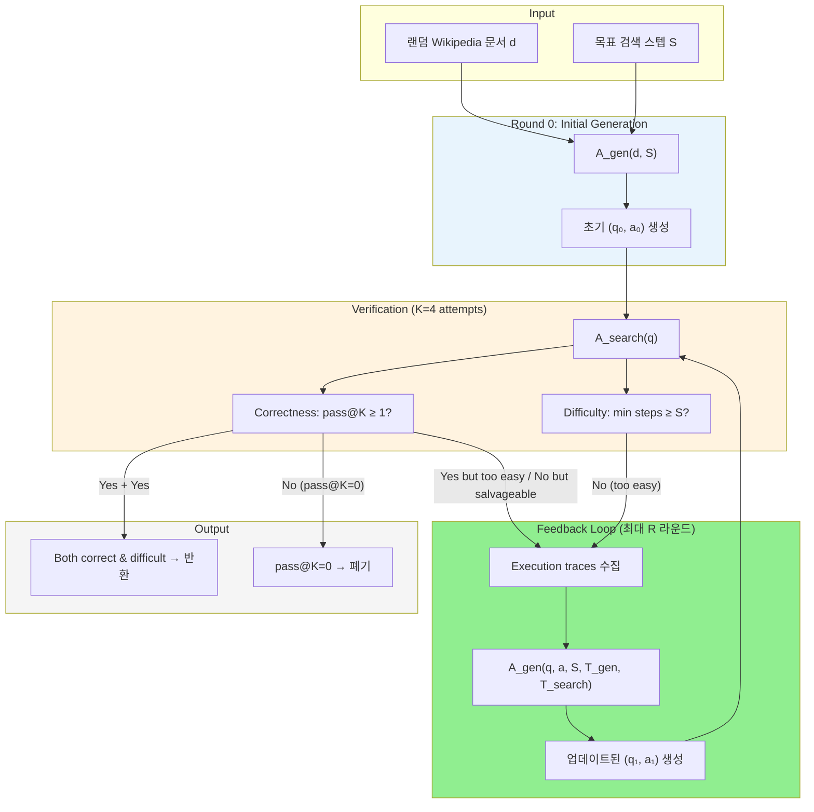

# A) 한줄 요약

Deep search agent 학습을 위한 고품질 합성 데이터를 **난이도 제어 가능하게** 자동 생성하는 agentic 파이프라인 **SAGE** (**S** teerable **A** gentic **G** eneration with **E** xecution Feedback)를 제안한다. Data generator가 **reverse formulation** (문서 → 질문) 방식으로 QA pair를 생성하고, search agent가 이를 검증한 뒤 **execution trace를 피드백** 으로 돌려주어 반복 정제한다. Fangyuan Xu et al. (2026), **Google Cloud AI Research + NYU**. In-domain 최대 +27%, out-of-domain 최대 +23% 상대 성능 향상, Wikipedia 학습만으로 Google Search 전이 시 +50% 향상 달성.

# B) 전체 구조

**핵심 흐름:**
1. **Initial Generation:** 랜덤 Wikipedia 문서 `d`와 목표 검색 스텝 `S`를 입력받아, data generator `A_gen`이 검색을 수행하며 QA pair `(q, a)`를 생성 (**reverse formulation**: 문서에서 출발하여 질문을 만드는 방식)
2. **Verification:** Search agent `A_search`가 질문 `q`만 받아 K=4번 독립적으로 검색하여 답변 시도. Correctness (pass@K)와 Difficulty (최소 검색 스텝)를 측정
3. **Execution Feedback:** 두 기준을 모두 만족하지 못하면, generator와 search agent의 **execution trace 전체** 를 data generator에게 전달하여 QA pair를 재생성
4. **반복:** 최대 R 라운드까지 반복. 두 기준 모두 만족하면 조기 종료, pass@K=0이면 폐기

# C) 배경 지식

## C.1) Deep Search란?

단순한 단일 쿼리 RAG가 아닌, **복수의 검색 + 추론 단계를 반복적으로 수행** 하며 복잡한 질문에 답하는 방식이다. ReACT (Yao et al., 2023) 프레임워크를 따라, agent가 reasoning trace `r_i`와 search query `s_i`를 번갈아 출력하는 multi-turn 구조를 사용한다.

출력 시퀀스: `{r₀, s₀, r₁, s₁, ... r_i, s_i, a}` (검색 결과 `d_i`는 `s_i` 이후 자동 append)

예시 (4-step 질문):
> "방글라데시 해방전쟁 기간에 콜카타에 출판사를 설립한 인물이 개척한, 이후 전국 도서 박람회로 발전한 최초 이벤트의 정확한 날짜는?"

## C.2) 기존 Multi-hop QA 데이터셋의 한계

| 데이터셋 | Annotation | 평균 검색 스텝 | Avg@8 ↓ |
|---|---|---|---|
| NQ | Human | 1.3 | 83.1 |
| HotpotQA | Automatic | 2.1 | 82.9 |
| Musique | Automatic + human | 2.7 | 64.4 |
| FRAMES | Human (소규모 평가용) | 3.2 | 74.3 |
| **SAGE** | **Automatic** | **4.9** | **79.5** |

- **Avg@8:** gemini-2.5-flash를 search agent로 사용하여 8개 샘플의 평균 성능. 낮을수록 어려운 데이터셋
- 기존 대규모 학습 데이터(NQ, HotpotQA, Musique)는 평균 1~3 스텝의 비교적 얕은 검색만 요구
- FRAMES는 어렵지만 소규모 평가 전용. **대규모 + 높은 난이도의 학습 데이터** 가 부재

## C.3) Reverse Formulation

기존 방식은 **질문 → 검색 → 답변** 순서로 데이터를 구축한다 (forward). SAGE는 반대로 **문서 → 검색으로 정보 수집 → 질문 생성** 하는 reverse formulation을 채택한다. 이렇게 하면 답변이 실제 문서에 **grounded** 되어 faithfulness가 보장된다.

## C.4) Search Agent 학습 방식

Search agent 학습에는 두 가지 접근이 있다:

| 방식 | 필요 데이터 | 특징 |
|---|---|---|
| **SFT** | `(q*, a*, gold trajectory)` | Gold trajectory 수집 비용이 매우 높음 |
| **RL (outcome-based)** | `(q, a)` pair만 | 최종 답변의 정확도만으로 보상 → trajectory 불필요 |

SAGE는 RL 학습용 `(q, a)` pair 생성에 초점을 맞춘다. Gold trajectory 없이도 학습 가능하기 때문이다.

# D) 기존 방법의 한계

| 접근 방식                           | 한계                                                       |
| ------------------------------- | -------------------------------------------------------- |
| **Human annotation**            | Deep search trajectory의 탐색 경로가 길고 복잡하여 비용이 극도로 높음        |
| **LLM 직접 생성 (verification 없이)** | 3-7 step 질문 기준 correctness + difficulty 통과율 **18%** 에 불과 |
| **난이도 프롬프트 없는 생성**              | 평균 검색 스텝 3.2로 난이도 제어 불가                                  |
| **Execution trace를 필터로만 사용**    | 정보 낭비—"왜 쉬웠는지"를 generator에게 전달하지 않음                    |

**핵심 문제:** Data generator가 계획한 검색 경로와 search agent가 실제로 필요로 하는 검색 경로 사이에 **mismatch** 가 발생한다. Generator가 2단계로 기획한 질문을 search agent가 1단계로 풀어버리는 경우가 빈번하다. 이 mismatch는 외부 환경(retrieval 시스템)의 영향을 받기 때문에 generator 혼자서는 발견할 수 없고, **실제 실행을 통해서만** 드러난다.

# E) 제안 방법: SAGE

## E.1) Initial Data Generation with Difficulty Prompt

**Algorithm 1 (Line 7-8):**
1. Corpus `D`에서 랜덤 문서 `d`를 샘플링
2. 목표 검색 스텝 `S`를 입력 프롬프트에 포함하여 generator에게 전달
3. Generator가 `S`번 검색을 수행하며 정보를 수집하고, 수집된 증거에 기반한 `(q, a)` 생성

**Difficulty prompt의 역할:** 프롬프트에 `target_search_step = S`를 명시하여 generator가 해당 스텝 수만큼의 검색이 필요한 질문을 만들도록 유도. 단, 프롬프트만으로는 실제 난이도를 보장할 수 없음 → verification 필요.

**강제 출력:** Generator가 최대 검색 횟수(20)를 소진해도 QA pair를 생성하지 않으면, `"<think>I have used up all the search budget and I will use the existing information to formulate a new plan and generate the question, answer, and answering plans."` 를 append하여 강제 생성.

**구현 디테일:**
- 모델: Gemini-2.5-Flash (temperature=1, thinking 비활성화)
- 검색 시스템: E5 retriever (Wang et al., 2022), 2018 Wikipedia dump
- 검색 당 반환 passage 수: 3
- 최대 검색 스텝: 20 (generator와 search agent 모두)
- 질문 유형: answer-type, 짧은 답변. How/Why 질문 회피

## E.2) Verification with Search Agent

**Algorithm 2:**
1. 생성된 질문 `q`만 search agent에게 전달 (원본 문서 `d` 접근 불가)
2. K=4번 독립적으로 검색 및 답변 시도: 각 시도마다 `(a'_k, S'_k, t'_k)` 수집
3. 두 가지 기준으로 평가:

### E.2.1) Correctness

- **Pass@K:** K번 시도 중 **하나라도** 정답 `a`와 일치하면 correct
- 정답 매칭은 **LLM-as-a-judge** (Gemini-2.0-Flash, temperature=0)로 평가
- **Pass@K=0이면 `(q, a)` 폐기:** 현재 agent 능력으로 도달 불가능한 질문으로 판단

### E.2.2) Difficulty

- 정답을 맞춘 시도들 중 **최소 검색 스텝 수** `|S*|`로 난이도 측정
- `|S*| ≥ S`(목표 스텝) 이면 충분히 어려운 것으로 판정
- 정답 시도가 없으면 random trace를 선택하여 피드백에 사용

## E.3) Generation with Execution Feedback

**Algorithm 1 (Line 9-10):**

단순 pass/fail이 아닌, **양쪽의 execution trace 전체** 를 data generator에게 피드백한다:
- `T_gen`: 기존 data generator의 검색 trajectory (누적)
- `T_search`: search agent의 검색 trajectory (누적)

Generator는 이 두 trajectory를 비교하여 **"왜 쉬웠는지"** (search agent가 shortcut을 찾은 경우) 또는 **"왜 틀렸는지"** (정보가 부족한 경우)를 이해하고, QA pair를 수정한다.

**Update vs Resample 비교:**

| 전략 | 방식 | % pass (3 rounds) |
|---|---|---|
| Resample | 처음부터 질문을 다시 생성 (best-of-K sampling) | 47 |
| **Update (SAGE)** | Execution trace 피드백으로 기존 질문 수정 | **50** |

- 두 전략 모두 라운드가 늘수록 개선되지만, **목표 스텝이 높을수록 Update의 이점이 더 커진다** (Figure 2)
- Resample은 "왜 실패했는지" 정보 없이 blind retry하는 반면, Update는 trace에서 문제점을 직접 진단

## E.4) Intrinsic Evaluation: 반복 정제 효과

| System | % corr ↑ | % pass ↑ | Avg@4 ↓ | # search ↑ |
|---|---|---|---|---|
| *Baseline* | | | | |
| A_gen w/o S | 84 | - | 86.3 | 3.2 |
| A_gen | 71 | 18 | 87.4 | 3.3 |
| +1 resample | 77 | 27 | 84.5 | 3.8 |
| +2 resample | 81 | 38 | 80.3 | 4.3 |
| +3 resample | 84 | 47 | 80.1 | 4.8 |
| *SAGE* | | | | |
| +1 feedback | 77 | 31 | 83.2 | 4.1 |
| +2 feedback | 83 | 42 | 80.4 | 4.6 |
| **+3 feedback** | **87** | **50** | **79.5** | **4.9** |

- **% corr:** pass@K≥1 (K=4)인 비율. **% pass:** correct이면서 최소 스텝 ≥ S인 비율
- **Avg@4:** correct 데이터에서 4번 시도의 평균 정답률. 낮을수록 어려움
- 난이도 프롬프트 없이(w/o S) 생성하면 correctness는 84%로 높지만 난이도 제어 불가
- 피드백 없이는 **18%** 만 통과하던 것이 3라운드 피드백으로 **50%** 까지 상승 (2.8배)

## E.5) Error Analysis: 실패 패턴

논문은 초기 generator의 실패를 **Easy data** (검증은 통과하나 난이도 미달)와 **Incorrect data** (정답 불일치)로 분류한다.

### E.5.1) Easy Data (난이도 미달)

| 실패 유형 | 비율 | 설명 |
|---|---|---|
| Information co-location | 35% | 답에 필요한 정보가 **같은 문서** 에 존재 → 1번 검색으로 해결 |
| Overly specific question | 31% | 질문이 너무 구체적이라 **질문 자체로 직접 검색** 가능 |
| Multi-query collapse | 21% | **서로 다른 문서** 의 정보이지만 단일 쿼리로 retriever가 모두 찾음 |
| Superficial complexity | 13% | 표면적으로만 복잡하고 실제로는 단순 |

이 분석이 execution feedback의 필요성을 뒷받침한다: information co-location이나 multi-query collapse 같은 현상은 **실제 검색을 실행해봐야만** 발견 가능하다.

### E.5.2) Incorrect Data (정답 불일치)

| 실패 유형 | 비율 | 설명 |
|---|---|---|
| Search agent retrieval failure | 54% | Search agent의 검색 실패 또는 추론 오류 |
| Search agent error | 20% | Search agent가 검색은 했지만 잘못된 답변 도출 |
| Data generator error | 19% | Generator가 hallucination 등으로 잘못된 QA 생성 |
| Ambiguous question | 7% | 질문이 모호하여 다른 정답이 유효 |

대부분(54%+20%=74%)이 search agent 측 문제이므로, pass@K=0 데이터를 단순 폐기하는 현재 방식은 잠재적 가치를 손실할 수 있다.

## E.6) RL 학습 구성

Search-R1 (Jin et al., 2025) 프레임워크를 채택하여 downstream 학습을 수행한다.

| 항목 | 설정 |
|---|---|
| 학습 데이터 | **20,000 QA pairs** (2 스텝 미만 필터링, 2 라운드 피드백 적용) |
| 알고리즘 | **PPO** (Schulman et al., 2017) with outcome-based reward |
| 보상 | LLM-as-a-judge (Gemini-2.0-Flash): 최종 답변 `a`가 정답 `a*`와 일치하면 reward |
| Loss masking | **검색된 문서 내용에는 loss 미적용** → 추론/쿼리 생성에만 최적화 |
| 학습 모델 | Qwen-2.5-3B-Instruct, Qwen-2.5-7B-Instruct |
| Retrieval | E5, 2018 Wikipedia dump, passage 3개/검색 |
| 최대 search turns | 10 |
| Baseline (NQ+HotpotQA) | Search-R1 체크포인트 직접 사용 (150K 데이터로 학습된 것) |
| Baseline (Musique) | 20K 데이터로 동일 조건 RL 학습 |

**Loss masking의 의미:** 검색 결과 문서 자체를 memorize하지 않고, **"어떤 쿼리를 발행하고 어떻게 추론하는가"** 에만 gradient를 적용한다. 이것이 도메인 전이의 핵심—Wikipedia에서 학습했지만 Google Search로 전이 가능.

# F) 벤치마크 / 데이터셋

| 벤치마크 | 유형 | 규모 | 용도 |
|---|---|---|---|
| **In-domain 평가셋** | 2-7 step 질문 | 스텝당 300개 | SAGE 데이터와 같은 분포 평가 |
| **Musique** | Multi-hop QA (2-4 hop) | hop당 300개 랜덤 샘플 | Out-of-domain 전이 평가 |
| **FRAMES** | Multi-hop QA (human annotated) | 300개 랜덤 샘플 | Out-of-domain 전이 평가 |
| **GAIA** | Web search QA | text-only 103개 | Google Search 전이 평가 |
| **Browsecomp** | Web browsing QA | 200개 랜덤 샘플 | Google Search 전이 평가 |
| **HLE-search** | Scientific search QA | 검색 필요 subset | Google Search 전이 평가 |

# G) 실험 결과 및 시사점

## G.1) Downstream Evaluation: Wikipedia Retrieval

### G.1.1) In-Domain 성능

| Training Data | Backbone | 3-hop | 4-hop | 5-hop | 6-hop | 7-hop | **AVG** |
|---|---|---|---|---|---|---|---|
| - | gemini-2.0-flash | 68.7 | 55.7 | 50.3 | 43.3 | 41.3 | 51.9 |
| - | gemini-2.5-flash | 80.0 | 67.0 | 57.3 | 48.7 | 37.3 | 58.1 |
| NQ+HotpotQA | QWEN-3B | 25.3 | 12.0 | 15.3 | 11.7 | 15.0 | 15.9 |
| Musique | QWEN-3B | 37.3 | 20.0 | 18.3 | 19.0 | 17.1 | 22.4 |
| **Ours** | **QWEN-3B** | **42.3** | **26.7** | **25.3** | **23.3** | **25.0** | **28.5** |
| NQ+HotpotQA | QWEN-7B | 45.0 | 26.3 | 25.7 | 24.7 | 23.6 | 29.1 |
| Musique | QWEN-7B | 48.3 | 28.7 | 24.7 | 25.0 | 21.2 | 29.6 |
| **Ours** | **QWEN-7B** | **55.7** | **38.0** | **35.7** | **37.3** | **24.0** | **38.1** |

- **QWEN-3B:** NQ+HotpotQA 대비 15.9→28.5 (+79% 상대), Musique 대비 22.4→28.5 (**+27% 상대**)
- **QWEN-7B:** NQ+HotpotQA 대비 29.1→38.1 (+31% 상대), Musique 대비 29.6→38.1 (**+29% 상대**)
- 특히 **5-hop 이상의 어려운 질문** 에서 개선폭이 크다

### G.1.2) Out-of-Domain 전이

| Training Data | Backbone | Musique | FRAMES |
|---|---|---|---|
| NQ+HotpotQA | QWEN-3B | 11.4 | 13.3 |
| Musique | QWEN-3B | 19.4 | 21.5 |
| **Ours** | **QWEN-3B** | **19.9** | **23.8** |
| NQ+HotpotQA | QWEN-7B | 18.9 | 26.2 |
| Musique | QWEN-7B | 21.6 | 25.0 |
| **Ours** | **QWEN-7B** | **22.3** | **32.3** |

- **Musique에서 주목할 점:** SAGE 데이터(Wikipedia 기반)로 학습한 7B 모델(22.3%)이 **Musique 자체 학습 데이터** 로 학습한 모델(21.6%)보다 높은 성능. 합성 데이터가 도메인 내 데이터를 능가
- **FRAMES:** 7B에서 26.2→32.3 (**+23% 상대 향상**)

## G.2) Google Search 전이

추론 시 Wikipedia retrieval을 **Serper API (Google Search)** 로 교체하여 평가. 추가 학습 없이 검색 도구만 교체.

| Training Data | Backbone | GAIA | Browsecomp | HLE-Search |
|---|---|---|---|---|
| NQ+HotpotQA | QWEN-3B | 12.5 | 1.0 | 5.0 |
| Musique | QWEN-3B | 13.5 | 1.0 | 4.0 |
| **Ours** | **QWEN-3B** | **18.8** | **1.0** | **5.5** |
| NQ+HotpotQA | QWEN-7B | 14.6 | 1.6 | 4.5 |
| Musique | QWEN-7B | 15.6 | 2.1 | **8.0** |
| **Ours** | **QWEN-7B** | **24.0** | **2.6** | 7.0 |

- **GAIA (7B):** 15.6→24.0 (**+54% 상대 향상**). Wikipedia에서만 학습했음에도 live web search로 강하게 전이
- **Browsecomp:** multi-step search가 필요한 벤치마크에서도 7B 모델은 일관된 개선
- **HLE-Search:** 과학 도메인 특화 질문으로 도메인 shift가 크기 때문에 개선이 제한적

## G.3) Ablation: Feedback 라운드 수의 영향

| Round | In-domain | Musique | FRAMES | Difficulty (Avg@4 ↓) |
|---|---|---|---|---|
| 0 (generator only) | 33.6 | 18.7 | 29.0 | 86.3 |
| 1 | 33.6 | 19.5 | 29.3 | 83.2 |
| **2** | **38.1** | **22.3** | **32.3** | 80.4 |
| 3 | 34.1 | 20.9 | 28.1 | 79.5 |

- **2라운드가 최적:** 0→2라운드에서 in-domain, out-of-domain 모두 일관된 개선
- **3라운드는 오히려 하락:** 데이터 난이도는 더 높아지지만(Avg@4: 80.4→79.5) downstream 성능은 감소. **난이도만 높이는 것은 불충분** 하며, 난이도와 learnability 사이의 균형이 필요

## G.4) Reasoning Strategy 다양성

100개 trajectory를 gemini-2.5-flash로 분석하여 추론 전략 분포를 비교 (한 질문에 복수 전략 가능):

| 추론 전략 | Musique | SAGE |
|---|---|---|
| Inference | 77% | 81% |
| Conflict Resolution | 35% | 29% |
| Hypothesis Generation | 40% | 35% |
| Self-correction | 55% | 31% |
| **Calculation** | **5%** | **35%** |
| **Temporal reasoning** | **8%** | **32%** |

- SAGE 데이터는 Musique 대비 **calculation과 temporal reasoning** 이 7배, 4배 더 빈번
- 더 **balanced** 한 분포 → 다양한 인지 전략을 학습하게 하여 일반화 능력 향상에 기여

## G.5) 실무적 시사점

1. **Execution feedback >> 단순 필터링:** Trace를 피드백으로 활용하면 resample 대비 일관되게 높은 데이터 품질. 특히 **목표 난이도가 높을수록** 격차가 벌어진다 (Figure 2)
2. **난이도 제어 가능:** 목표 검색 스텝 수 `S`를 지정하여 원하는 난이도의 데이터를 생성. Curriculum learning 등에 활용 가능
3. **도메인 전이성:** Wikipedia로 학습했지만 Google Search까지 전이되는 robust한 검색 능력 학습. 핵심은 **loss masking**—문서 내용이 아닌 검색/추론 전략만 학습
4. **합성 데이터 > in-domain 데이터:** Musique 자체 학습 데이터보다 SAGE 합성 데이터가 Musique에서도 더 높은 성능
5. **난이도-learnability 트레이드오프:** 3라운드 피드백은 데이터를 더 어렵게 만들지만 downstream 성능은 오히려 하락. 최적 난이도가 존재하며, 무조건 어려운 데이터가 좋은 것은 아님
6. **Fixed corpus의 비용 이점:** WebDancer, WebSailor 등 concurrent work은 상용 검색 API를 사용하지만, SAGE는 fixed Wikipedia corpus + E5 retriever로 데이터 생성 → 비용 효율적

## G.6) 한계점

**방법론:**
- **Fixed search agent:** Generator와 search agent가 **co-evolve하지 않음**. Iterative training으로 양쪽을 함께 발전시키면 품질이 더 올라갈 수 있음
- **Pass@K=1 기준:** Hallucination이나 incorrect content를 허용할 수 있음. 더 robust한 verification 방법 탐색 필요
- **Pass@K=0 폐기:** Agent 능력 초과 질문의 잠재적 가치 손실. 미래에 더 강한 agent로 검증하면 활용 가능
- **QA pair만 생성:** 중간 추론 단계를 포함한 SFT trajectory는 미생성. SFT용 고품질 trajectory 생성은 별도 연구 필요

**실험 범위:**
- GRPO 등 **대안 RL 알고리즘** 미실험 (PPO만 사용)
- **7B까지만** 실험—더 큰 모델에서의 효과 미검증
- **Wikipedia corpus만** 사용—법률, 과학 등 도메인 특화 corpus에서의 검증 필요

# H) Related

- [[Deep Search]]
- [[Reinforcement Learning]]

# I) References

- [SAGE: Steerable Agentic Data Generation for Deep Search with Execution Feedback (arXiv)](https://arxiv.org/abs/2601.18202)
- [GitHub: carriex/sage](https://github.com/carriex/sage)
