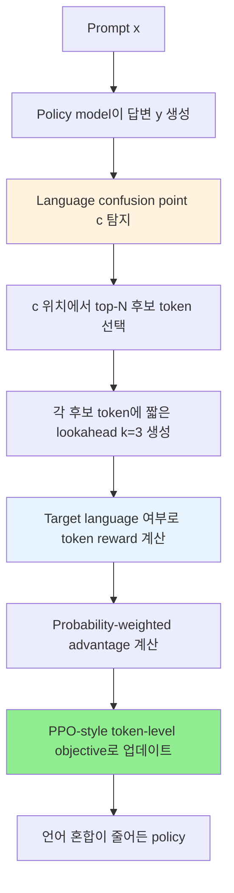

# A) 한줄 요약

**TLPO(Token-Level Policy Optimization)** 는 LLM이 의도한 언어가 아닌 다른 언어를 섞어 내는 **language confusion** 을 줄이기 위해, 답변 전체가 아니라 **처음 언어가 틀어지는 token 위치** 를 찾아 그 지점의 후보 token들만 policy optimization하는 방법이다.

Jinho Choo, JunSeung Lee, Jimyeong Kim, Yeeho Song, S. K. Hong, Yeong-Dae Kwon의 ACL 2026 논문이다. 핵심 문제의식은 단순하다. [[DPO]], ORPO, [[GRPO]]처럼 답변 전체를 하나의 단위로 보는 sequence-level 방법은 언어 혼합을 줄일 수는 있지만, 주변의 멀쩡한 문맥까지 같이 밀어버려 일반 성능을 떨어뜨릴 수 있다. TLPO는 그 대신 "어느 token에서 언어가 틀어졌는가?"를 먼저 찾고, 그 위치의 top-N 후보 token에만 보상을 준다.

실무적으로는 `chosen = 한국어`, `rejected = 중국어` pair를 만들어 [[DPO]]를 돌렸는데 효과가 약했던 사례와 바로 이어진다. DPO는 답변 전체의 선호 순서를 학습하지만, TLPO는 "중국어가 시작된 첫 token"에 credit assignment를 건다.

# B) 왜 나온 논문인가

Multilingual LLM은 여러 언어를 꽤 잘 다루지만, 실제 서비스에서는 생각보다 자주 언어가 흔들린다. 한국어로 답하라고 했는데 답변 중간에 영어, 중국어, 일본어, 우크라이나어 같은 단어가 섞이는 식이다. 논문에서는 이런 현상을 **language confusion** 이라고 부른다.

이 문제는 겉으로 보면 단순한 style 문제처럼 보인다. 그래서 처음에는 다음 방법들이 자연스럽다.

1. 한국어 instruction data로 [[supervised fine-tuning|SFT]]를 더 한다.
2. 정상 답변과 언어 혼합 답변을 pair로 만들어 [[DPO]]나 ORPO를 돌린다.
3. 언어 일관성 reward를 두고 [[GRPO]] 같은 RL을 시도한다.
4. decoding 단계에서 특정 언어 문자나 token을 막는다.

다만 논문이 짚는 핵심은, language confusion이 항상 답변 전체의 문제가 아니라는 점이다. 답변 대부분은 맞는데 한 지점에서만 다른 언어 token이 끼어들 수 있다. 이때 sequence-level objective는 너무 거칠다. `rejected` 전체를 낮추면 틀린 token만 줄이는 것이 아니라, 그 주변의 올바른 내용까지 함께 눌릴 수 있다.

TLPO의 출발점은 여기다.

> 언어 혼합이 특정 token에서 시작된다면, 답변 전체를 벌주지 말고 그 token 위치만 고치면 되지 않을까?

# C) 전체 구조



흐름은 짧다.

1. 현재 policy model이 prompt에 대한 답변을 생성한다.
2. 답변 안에서 처음으로 target language가 아닌 token이 나온 위치를 `confusion point c`로 잡는다.
3. 그 위치에서 모델이 가장 높게 보고 있던 top-N 후보 token을 뽑는다.
4. 후보 token마다 짧은 lookahead를 붙여 실제로 어떤 문자가 되는지 확인한다.
5. target language로 이어지는 token은 올리고, language confusion을 만드는 token은 내린다.
6. 이 token-level 보상을 PPO 스타일 objective로 최적화한다.

중요한 점은 전체 답변을 다시 쓰는 게 아니라는 것이다. TLPO는 모델이 이미 잘 만들고 있던 문맥은 최대한 유지하고, 언어가 처음 틀어지는 위치만 국소적으로 수정하려고 한다.

# D) 배경 지식

## D.1) Language Confusion

논문에서 말하는 language confusion은 "모델이 사용자가 원한 target language와 다른 언어를 섞거나, 아예 다른 언어로 넘어가는 현상"이다.

한국어 서비스에서는 이런 식으로 나타난다.

```text
prompt:
  "다음 고객 문의에 한국어로 답변해줘."

response:
  "문의 주셔서 감사합니다. 您的订单目前正在处理中..."
```

이 답변은 내용이 아주 틀렸다고 보기는 어렵다. 하지만 제품 관점에서는 치명적이다. 사용자는 "한국어로 답하라"는 기본 지시를 어긴 것으로 느끼고, 모델 신뢰도도 떨어진다.

## D.2) Sequence-Level Objective의 한계

[[DPO]]는 `chosen/rejected` 답변 전체의 상대적 log probability를 조정한다. 그래서 다음 pair를 만들면 방향은 맞다.

```text
chosen:
  한국어로 자연스럽게 고친 답변

rejected:
  모델이 실제로 생성한 중국어/혼합언어 답변
```

하지만 이 pair 안에는 언어 말고도 여러 차이가 섞인다. 길이, 문체, 정보량, 포맷, 첫 문장 스타일이 조금만 달라도 모델은 "중국어라서 나쁘다"가 아니라 "짧아서 좋다", "더 친절해서 좋다" 같은 엉뚱한 신호를 배울 수 있다.

TLPO는 이 문제를 더 좁게 본다. 전체 답변을 `chosen/rejected`로 나누는 대신, 언어가 처음 틀어지는 위치에서 후보 token들을 비교한다. 이렇게 하면 credit assignment가 훨씬 명확해진다.

## D.3) Token-Level Credit Assignment

Credit assignment는 "어떤 행동 때문에 reward가 좋아졌거나 나빠졌는지"를 찾는 문제다. Language confusion에서는 답이 비교적 명확할 때가 있다. 첫 번째 중국어 token, 첫 번째 일본어 token, 첫 번째 target language 밖 token이 바로 그 후보가 된다.

이 성질 때문에 TLPO는 일반적인 helpfulness나 correctness 평가보다 language confusion에 더 잘 맞는다. Helpfulness는 답변 전체의 구조와 추론이 얽혀 있지만, language confusion은 비교적 "문제가 시작된 token 위치"를 찾기 쉽기 때문이다.

# E) 제안 방법

## E.1) Confusion Point 찾기

모델 $\pi_\theta$가 prompt $x$에 대해 답변 $y = [y_1, y_2, ..., y_T]$를 생성한다고 하자.

TLPO는 먼저 답변을 검사해서 처음 target language가 아닌 token이 나오는 위치를 찾는다. 이 위치를 논문에서는 `confusion point c`라고 둔다.

언어 혼합이 없는 답변은 학습 신호가 없으므로 버린다. TLPO는 "이미 잘 된 샘플"을 복습하기보다, 실제로 언어가 틀어진 샘플만 사용한다.

## E.2) Probability-Ranked Token Exploration

`confusion point c`를 찾으면, TLPO는 그 지점에서 가능한 전체 vocabulary를 다 보지 않는다. 현재 policy가 가장 높게 보고 있는 top-N 후보 token만 선택한다.

$$
T(x, y_{<c}) = \{ t_i \mid i \in I_N(x, y_{<c}) \}
$$

여기서 $I_N$은 $\pi_\theta(\cdot \mid x, y_{<c})$에서 확률이 높은 상위 N개 token의 index다. 논문 실험에서는 기본값으로 `N = 16`을 쓴다.

이 설계는 실용적이다. 실제 generation에서 나올 가능성이 거의 없는 token까지 모두 평가할 필요가 없다. 모델이 정말 선택할 법한 후보들만 보고, 그중 confusion을 만드는 후보를 낮추면 된다.

## E.3) Reward는 token 단위로 준다

후보 token $t_i$ 하나만 보고는 이 token이 어느 언어에 속하는지 애매할 수 있다. BPE나 SentencePiece token은 문자 하나와 정확히 대응하지 않기 때문이다.

그래서 TLPO는 각 후보 token 뒤에 짧은 lookahead를 붙인다. 논문 실험에서는 `k = 3` token을 추가 생성한다. 그런 다음 `t_i + lookahead`를 decode해서 language confusion 여부를 판정한다.

직관적으로는 다음과 같다.

```text
prefix:
  "문의 주셔서 감사합니다. "

candidate token:
  "您"

lookahead:
  "的 订 单"

decoded span:
  "您的订单"

reward:
  target language가 아니므로 negative
```

반대로 후보 token이 한국어 답변으로 자연스럽게 이어지면 positive reward를 받는다. 논문에서는 valid target-language token의 reward를 원래 token probability에 비례하도록 설계하고, confusion-inducing token에는 negative reward를 준다.

## E.4) PPO-Style Token-Level Objective

TLPO는 후보 token 집합 $T$에 대해 PPO 스타일 objective를 사용한다. 큰 형태는 다음과 같다.

$$
J_{\text{TLPO}}(\theta)
= \mathbb{E}
\left[
\frac{1}{N}
\sum_{t_i \in T}
\left(
\min(r_i(\theta) A_i, \text{clip}(r_i(\theta), 1-\epsilon, 1+\epsilon) A_i)
- \beta D_{\text{KL}}(\pi_\theta || \pi_{\theta_{\text{ref}}})
\right)
\right]
$$

여기서:

| 기호 | 의미 |
| --- | --- |
| $T$ | confusion point에서 뽑은 top-N 후보 token 집합 |
| $r_i(\theta)$ | 현재 policy와 old policy 사이의 token 확률 ratio |
| $A_i$ | 후보 token $t_i$의 advantage |
| $\pi_{\theta_{\text{ref}}}$ | TLPO 적용 전 초기 policy |
| $\beta$ | reference policy에서 너무 멀어지지 않게 잡는 KL 계수 |

수식의 느낌은 PPO와 비슷하지만, optimize하는 단위가 답변 전체가 아니라 `confusion point`의 후보 token이라는 점이 다르다.

## E.5) Advantage를 왜 probability-weighted로 잡나

논문에서 재미있는 부분은 advantage 설계다. TLPO는 단순히 `reward - mean reward`만 쓰지 않고, 후보 token의 기존 확률을 함께 반영한다.

$$
A_i =
\frac{1}{Z}
\cdot
\pi_{\theta_{\text{old}}}(t_i \mid x, y_{<c})
\left(R(t_i) - \mu\right)
$$

이 설계의 의도는 valid token들 사이의 기존 상대 순서를 최대한 보존하는 것이다.

예를 들어 한국어로 이어지는 후보가 세 개 있고, 그중 원래 모델이 가장 자연스럽다고 보던 token이 있다면, TLPO는 그 token들의 순서를 완전히 뒤집지 않으려 한다. 잘못된 언어 token은 낮추되, target language 안에서 모델이 이미 갖고 있던 자연스러운 분포는 최대한 유지하려는 것이다.

# F) 데이터셋과 평가

## F.1) 학습 데이터

논문은 Bactrian-X의 training split을 사용한다. target language는 중국어, 아랍어, 한국어, 일본어 네 가지다. 다른 언어 생성을 명시적으로 유도하는 prompt를 걸러내기 위해, target language 밖 문자가 들어간 prompt를 filtering한다.

| Language | Original Training Instances | Filtered Training Instances |
| --- | ---: | ---: |
| Chinese | 67,017 | 65,676 |
| Arabic | 67,017 | 65,907 |
| Korean | 67,017 | 62,679 |
| Japanese | 67,017 | 65,296 |

SFT는 filtered prompt와 answer를 그대로 사용한다. DPO와 ORPO는 각 prompt마다 16개 candidate response를 생성한 뒤, language confusion이 없는 답변을 preferred response로, confusion이 있는 답변을 dispreferred response로 골라 pair를 만든다.

TLPO는 조금 다르다. prompt에서 online으로 답변을 하나 생성하고, 그 답변 안에서 confusion point를 찾은 뒤 top-N token을 평가한다.

## F.2) 모델과 벤치마크

실험 모델은 네 가지다.

| Model |
| --- |
| Llama-3.1-8B-Instruct |
| Qwen3-8B |
| Ministral-8B-Instruct |
| Gemma-3-4B-IT |

평가는 두 축으로 나뉜다.

| 평가 축 | 사용한 벤치마크 |
| --- | --- |
| Language confusion | MIF, MMMLU, LCB-crosslingual, LCB-monolingual, GSM8K-cross |
| General accuracy | MIF, MMLU, MMMLU, GPQA, GPQA-diamond, ARC-Challenge, BBH, MATH, GSM8K |

언어 혼합 평가는 `WPR`과 `RPR`을 쓴다.

| Metric | 의미 |
| --- | --- |
| WPR | 생성된 word 중 target language 기준을 통과한 word 비율 |
| RPR | 답변 전체가 language confusion 없이 통과한 response 비율 |

`WPR`은 "단어 단위로 얼마나 깨끗한가"를 보고, `RPR`은 "답변 하나가 통째로 통과했는가"를 본다. 서비스 관점에서는 `RPR`이 더 빡빡한 지표에 가깝다. 단어 하나만 다른 언어로 섞여도 response는 실패로 잡힐 수 있기 때문이다.

# G) 실험 결과

## G.1) English를 Neutral로 볼 때

현실적인 multilingual 환경에서는 영어 약어, 기술 용어, section marker가 자연스럽게 섞인다. 그래서 논문은 먼저 English token을 confusion으로 보지 않는 neutral setting을 평가한다.

| Method | Mean RPR/WPR | Mean Accuracy | 해석 |
| --- | ---: | ---: | --- |
| Baseline | 96.68 / 99.92 | 58.35 | 원래 모델도 평균적으로는 높은 편이지만 response 단위 실패가 남아 있음 |
| SFT | 99.14 / 99.92 | 50.71 | 언어 일관성은 오르지만 일반 성능 하락이 큼 |
| DPO | 98.31 / 99.72 | 55.94 | confusion은 줄지만 accuracy 손실이 남음 |
| ORPO | 97.27 / 99.88 | 55.12 | DPO와 비슷하게 trade-off 존재 |
| TLPO | 99.19 / 99.98 | 58.08 | RPR을 가장 높이면서 baseline accuracy를 거의 유지 |

핵심은 TLPO가 언어 일관성만 높인 게 아니라는 점이다. SFT는 평균 accuracy가 58.35에서 50.71로 크게 떨어졌고, DPO와 ORPO도 55점대까지 내려갔다. 반면 TLPO는 58.08로 baseline에 거의 붙어 있다.

논문의 메시지는 여기서 분명하다. Language confusion은 국소 오류라서, 국소적으로 고치면 일반 능력을 덜 건드릴 수 있다.

## G.2) English도 Confusion으로 엄격하게 볼 때

더 엄격한 setting에서는 English token도 target language 밖 언어로 보고 penalty를 준다. 이 조건은 현실 서비스보다 빡빡하다. 특히 수학, 코딩, 과학 지식처럼 영어 표현이 자연스럽게 섞이는 task에서는 accuracy가 떨어지기 쉽다.

| Method | Mean RPR/WPR | Mean Accuracy |
| --- | ---: | ---: |
| Baseline | 63.27 / 82.31 | 58.24 |
| SFT | 47.20 / 73.01 | 50.71 |
| DPO | 72.73 / 84.02 | 54.60 |
| ORPO | 69.75 / 86.51 | 54.61 |
| TLPO | 77.59 / 85.64 | 56.17 |

이 조건에서도 TLPO는 평균 RPR이 가장 높고, accuracy도 fine-tuning 방법 중 가장 높다. 다만 English까지 강하게 억제하면 baseline 대비 accuracy 손실은 피하기 어렵다. 논문도 이 부분을 인정한다. 영어는 reasoning과 knowledge 표현의 중심 언어라서, 무작정 suppress하면 내부 지식 표현이 왜곡될 수 있다.

## G.3) 구현 설정

| 항목 | 값 |
| --- | --- |
| Epoch | 1 |
| Prompt batch size | 8 |
| Top-N candidate tokens | 16 |
| Effective token updates per step | 8 x 16 = 128 |
| Initial learning rate | 5e-7 |
| Scheduler | cosine decay, final lr 10% |
| Warmup | first 10% steps |
| TLPO policy iterations | 2 |
| Lookahead length | 3 tokens |
| Hardware | 8 x NVIDIA H100, single node |
| Training time | 약 6-10시간 |

논문 기준으로 `N = 16`, `k = 3`이 기본값이다. `N`은 너무 작으면 후보 탐색이 부족하고, 너무 크면 낮은 확률의 token까지 건드려 노이즈가 늘 수 있다. `k = 3`은 token을 문자로 detokenize해 언어 판정을 하기 위한 짧은 lookahead다.

# H) DPO 노트와 어떻게 이어지나

[[DPO]] 노트에서 정리한 "한국어 chosen / 중국어 rejected DPO가 생각보다 잘 안 먹는 경우"와 TLPO는 같은 문제를 다른 해상도로 본다.

| 구분 | DPO | TLPO |
| --- | --- | --- |
| 학습 단위 | 답변 전체 pair | confusion point의 후보 token |
| 데이터 형태 | prompt, chosen, rejected | prompt, generated response, confusion point, top-N token reward |
| 장점 | 구현이 쉽고 offline pair만 있으면 됨 | 언어 혼합이 시작된 지점에 직접 credit assignment 가능 |
| 약점 | 언어 외 차이가 pair에 섞이면 신호가 흐려짐 | confusion point detector와 token-level reward 구현이 필요 |
| 잘 맞는 상황 | 문체, 안전성, 선호도처럼 전체 답변 비교가 자연스러운 문제 | 특정 token에서 오류가 시작되는 국소적 실패 |

여기서 "DPO pair는 실제 실패 로그에서 만든다"는 말도 더 분명해진다. 단순히 사람이 중국어 답변을 하나 만들어 `rejected`로 넣는다는 뜻이 아니다. 모델이 실제 평가나 운영에서 어떤 prompt에 대해 중국어/혼합언어 답변을 냈다면, 그 출력 자체를 실패 로그로 저장한다. 그 실패 로그를 `rejected`로 쓰거나, TLPO처럼 그 안에서 confusion point를 찾아 token-level 학습 신호로 바꾼다.

즉 실무 흐름은 이렇게 잡는 편이 자연스럽다.

1. 한국어로 답해야 하는 prompt 세트를 준비한다.
2. 현재 모델로 rollout을 돌려 실제 language confusion 사례를 모은다.
3. DPO/ORPO를 쓸 거라면, 실패 답변을 `rejected`로 두고 같은 내용을 한국어로 고친 답변을 `chosen`으로 만든다.
4. TLPO식으로 갈 거라면, 실패 답변에서 첫 confusion point를 찾고 그 위치의 top-N token을 평가한다.
5. 학습 후에는 `RPR/WPR`과 일반 task accuracy를 같이 본다.

이렇게 보면 TLPO는 DPO의 대체재라기보다, DPO가 놓치기 쉬운 국소 오류를 더 정밀하게 다루는 방법이다. DPO가 "이 답변보다 저 답변이 낫다"를 알려준다면, TLPO는 "바로 이 token부터 언어가 틀어졌다"를 알려준다.

# I) 실무적 시사점

## I.1) 한국어 고정 문제에는 "언어 reward만 세게"가 답이 아닐 수 있다

한국어만 나오게 만들고 싶다고 해서 언어 reward를 너무 강하게 걸면, 모델이 영어 기술 용어, 수식 설명, 코드 토큰까지 회피할 수 있다. 논문이 English strict setting을 따로 본 이유도 여기에 있다. 실제 제품에서는 영어를 항상 confusion으로 볼지, 기술 용어와 약어는 neutral로 볼지부터 정해야 한다.

한국어 서비스라면 보통은 이렇게 나누는 편이 안전하다.

| 항목 | 처리 |
| --- | --- |
| 영어 약어, 모델명, API 이름 | neutral |
| 코드, 파일명, 옵션명 | neutral |
| 답변 본문이 중국어/일본어로 전환 | confusion |
| 한국어 문장 안의 한자어 일부 | 별도 rule 필요 |
| 번역 요청처럼 다른 언어 출력이 task 자체인 경우 | training/eval에서 제외 |

## I.2) Confusion Detector가 품질을 좌우한다

TLPO는 confusion point를 잘 찾아야 한다. detector가 너무 민감하면 정상적인 영어 기술 용어까지 벌주고, 너무 둔하면 실제 언어 혼합을 놓친다.

특히 한국어에서는 다음 케이스가 애매하다.

1. 영어 약어: `API`, `GPU`, `DPO`
2. 코드나 shell command: `pip install`, `--target_language ko`
3. 한자어와 중국어 문자 구분
4. 일본어/중국어와 공유되는 문자
5. 사용자가 명시적으로 번역을 요청한 prompt

그래서 TLPO를 제품 학습에 쓰려면, token-level objective보다 먼저 language ID rule을 정교하게 만들어야 한다.

## I.3) DPO와 TLPO를 같이 쓸 수도 있다

DPO는 여전히 유용하다. 예를 들어 답변의 친절함, 포맷, 정책 준수, 자연스러운 한국어 문체는 token 하나로 판단하기 어렵다. 이런 건 sequence-level pair가 더 자연스럽다.

반면 "중국어가 끼어드는 첫 위치", "일본어 조사로 넘어가는 위치", "영어 문장으로 답변이 전환되는 위치"는 TLPO가 더 잘 맞는다.

실무적으로는 다음처럼 역할을 나눌 수 있다.

| 목적 | 우선순위 |
| --- | --- |
| 기본 한국어 답변 형식 학습 | SFT |
| 자연스러운 문체, 친절함, 정책 준수 | DPO/ORPO |
| 특정 언어로 튀는 국소 오류 억제 | TLPO |
| 추론 정답률, tool use, 코딩 성능 | RL with verifiable reward |
| 즉각적인 제품 방어 | decoding guardrail, retry, language ID filter |

# J) 한계와 주의점

TLPO가 모든 alignment 문제에 맞는 것은 아니다. 논문도 이 점을 명확히 말한다. TLPO는 오류 경계가 비교적 선명한 문제, 특히 language confusion처럼 "여기서부터 잘못된 언어가 시작됐다"를 찾을 수 있는 문제에 잘 맞는다.

반대로 다음 문제에는 약하다.

1. 답변 전체의 helpfulness가 낮은 경우
2. reasoning plan 자체가 틀어진 경우
3. hidden state가 이미 다른 언어 생성을 강하게 encode한 경우
4. safety나 factuality처럼 token 하나로 보상을 주기 어려운 경우
5. target language와 confused language가 문자를 공유해서 detector가 흔들리는 경우

또 TLPO는 언어 일관성을 고치는 방법이지, 안전성이나 사실성을 자동으로 고치는 방법이 아니다. base model이나 fine-tuning data에 bias, toxicity, factual error가 있으면 target language 안에서도 그대로 남거나 더 강해질 수 있다.

# K) 구현 체크리스트

실제로 비슷한 실험을 한다면 아래를 먼저 정해야 한다.

1. Target language를 어떻게 정의할 것인가?
2. 영어 기술 용어를 neutral로 볼 것인가, confusion으로 볼 것인가?
3. 실제 failure log를 어떤 prompt set에서 모을 것인가?
4. Confusion point detector가 token boundary와 잘 맞는가?
5. Top-N을 몇으로 둘 것인가? 논문 기본값은 `N = 16`이다.
6. Lookahead는 몇 token으로 둘 것인가? 논문 기본값은 `k = 3`이다.
7. KL coefficient와 clipping range는 어느 정도로 둘 것인가?
8. RPR/WPR만 볼 것인가, downstream accuracy도 같이 볼 것인가?
9. DPO/ORPO pair와 TLPO token reward를 함께 쓸지 분리할지 정했는가?
10. 학습 후 decoding guardrail을 별도로 둘 것인가?

가장 중요한 것은 마지막 평가다. 언어 혼합이 줄었다고 끝내면 안 된다. 한국어 고정이 강해지면서 수학, 코드, 기술 용어 설명, 영어 고유명사 처리 능력이 같이 떨어졌는지 확인해야 한다.

# L) References

- Choo et al., [TLPO: Token-Level Policy Optimization for Mitigating Language Confusion in Large Language Models](https://arxiv.org/abs/2604.26553)
- Choo et al., [TLPO PDF](https://arxiv.org/pdf/2604.26553)
- Samsung SDS Research Papers, [TLPO Official Implementation](https://github.com/samsungsds-research-papers/TLPO)
- Marchisio et al., [Understanding and Mitigating Language Confusion in LLMs](https://arxiv.org/abs/2406.20052)
- Lee et al., [Controlling Language Confusion in Multilingual LLMs](https://arxiv.org/abs/2505.19116)
- Rafailov et al., [Direct Preference Optimization: Your Language Model is Secretly a Reward Model](https://arxiv.org/abs/2305.18290)
- [[DPO]]
- [[GRPO]]
- [[Proximal Policy Optimization]]
- [[LLM Post-Training for Natural Korean]]
