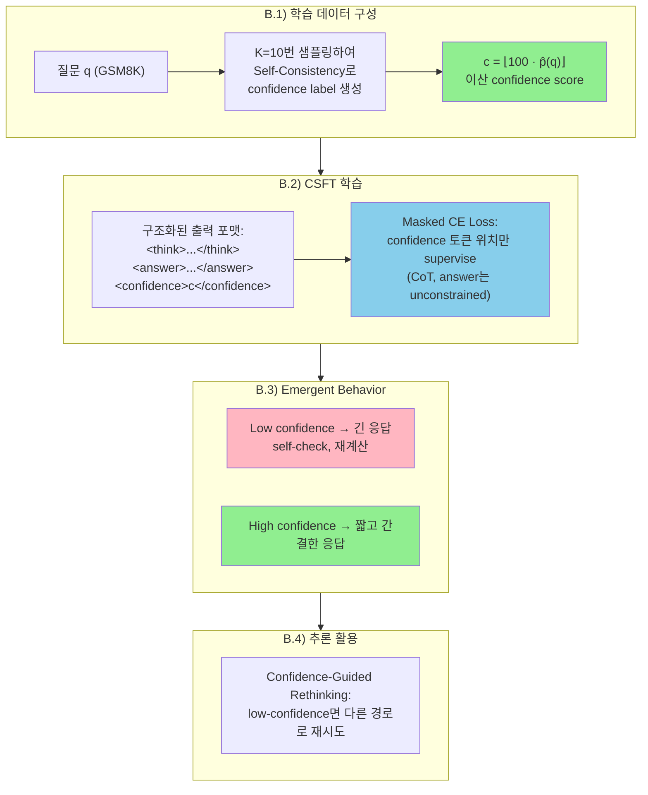
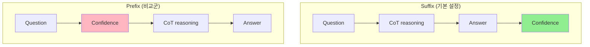

# A) 한줄 요약

모델에게 "너 방금 답변에 얼마나 확신해?" 라는 confidence 점수만 학습시켰더니, **자신 없는 문제에서는 스스로 답을 재검토하고, 확신 있는 문제에서는 간결하게 답하는 행동** 이 알아서 나타났다. 추론 과정(CoT)을 어떻게 하라고 가르친 적이 없는데도. KAIST Juho Lee 그룹 (Chaeyun Jang 외). 베이스 모델: `LLaMA3.2-3B-Instruct`, `Qwen2.5-1.5B-Instruct`. (arXiv 2506.03723, Jun 2025)

# B) 전체 구조



말로 풀어서 설명하면:

1. **데이터 준비**: GSM8K 학습 세트의 각 질문에 대해 K=10번 CoT 응답을 샘플링하고, 정답과 일치하는 비율을 confidence label로 사용 (Self-Consistency 기반)
2. **학습**: 모델은 `<think>`, `<answer>`, `<confidence>` 태그로 구조화된 출력을 생성하도록 학습. **핵심은 confidence 토큰 위치에만 loss를 적용** 하고, CoT와 answer는 자유롭게 생성
3. **결과**: 명시적 reasoning supervision 없이도, confidence가 낮을 때 길고 신중한 응답 (self-verification 포함), 높을 때 짧고 확신 있는 응답이라는 **emergent behavior** 발현
4. **활용**: 낮은 confidence 시 rethinking prompt로 다른 추론 경로 유도 → 정확도 대폭 향상

# C) 배경 지식

## C.1) Verbalized Confidence

LLM이 자신의 확신 정도를 **자연어 또는 숫자로 직접 표현** 하는 것. Token-level entropy나 sequence probability 같은 내부 지표와 달리, 사용자가 직접 해석할 수 있는 형태.

- 기존 접근: 대부분 short-form QA에 초점, RL이나 classifier 기반 tuning 필요
- 이 논문: CoT reasoning 맥락에서 verbalized confidence를 다루며, **단순 SFT만으로** 달성

## C.2) Self-Consistency (Wang Et Al., 2023)

같은 질문에 대해 여러 번 샘플링한 후, **다수결(majority voting)** 로 최종 답을 결정하는 방법. 이 논문에서는 다수결 대신, 정답과 일치하는 샘플 비율을 confidence label로 활용.

$$\hat{p}(q) = \frac{1}{K}\sum_{i=1}^{K}\mathbb{1}[a^{(i)} = a^*]$$

- $K$: 샘플 수 (논문에서 K=10)
- $a^{(i)}$: i번째 샘플의 답
- $a^*$: gold answer

## C.3) Calibration Metrics

| 메트릭 | 수식 | 의미 |
|--------|------|------|
| **ECE** (Expected Calibration Error) | $\sum_{m=1}^{M}\frac{\|B_m\|}{n}\|acc(B_m) - conf(B_m)\|$ | 예측 confidence와 실제 정확도 간 차이. 낮을수록 좋음 |
| **Brier Score** | $\frac{1}{N}\sum_{i=1}^{N}(f_i - y_i)^2$ | Confidence와 정확도를 함께 고려. 낮을수록 좋음 |
| **AUROC** | - | Confidence 기반으로 맞은/틀린 답을 구분하는 능력. 높을수록 좋음 |

## C.4) Reliability Curve (Calibration Curve)

모델이 말한 confidence가 실제 정답률과 얼마나 일치하는지를 시각화하는 그래프.

- **X축**: 모델이 예측한 confidence (구간별 binning, 예: 0-10, 10-20, ...)
- **Y축**: 해당 구간에서의 실제 정답률 (empirical accuracy)
- **이상적인 경우**: 대각선 — "confidence 70인 문제들"의 실제 정답률이 70%
- **대각선 위**: 모델이 과소평가 (underconfident) — 실제로는 더 잘 맞추는데 자신감이 낮음
- **대각선 아래**: 모델이 과대평가 (overconfident) — 자신감은 높은데 실제로는 많이 틀림

이 논문 Figure 4에서는 CoT 전/후에 confidence를 뽑아도 reliability curve가 거의 동일 → 모델의 confidence가 CoT 내용이 아니라 **내부 uncertainty** 에 기반한다는 근거로 사용됨.

# D) 기존 방법의 한계

1. **Likelihood 기반 방법** (token entropy, sequence probability): 모델 내부 진단용으로는 유용하나, 사용자에게 **해석 가능한 confidence statement** 를 제공하지 못함
2. **기존 verbalized confidence 연구**: 대부분 short-form QA에 국한, RL이나 classifier tuning 필요 → 복잡하고 일반화 어려움
3. **CoT reasoning에서의 calibration**: 거의 미개척 영역. Instruction-tuned 모델이 zero-shot에서 더 나은 calibration을 보인다는 관찰적 연구는 있으나, **체계적으로 유도하거나 제어하는 방법** 은 없었음
4. **RL 기반 접근** (reward shaping): 복잡한 reward 설계, large-scale tuning 필요 → 이 논문은 **단 한 번의 SFT로** 동등 이상의 효과 달성

# E) 제안 방법: CSFT (Confidence-Supervised Fine-Tuning)

## E.1) 학습 데이터 구성

GSM8K training set에서:
1. 각 질문 $q$에 대해 $K=10$개 CoT 응답 샘플링: $\{(r^{(i)}, a^{(i)})\}_{i=1}^{K} \sim f_{\theta}(\cdot \mid q)$
2. `<answer>...</answer>` 태그에서 답 추출 후 gold answer와 비교
3. Self-confidence label 생성: $c = \lfloor 100 \cdot \hat{p}(q) \rfloor$ → `{0, 10, 20, ..., 100}` 이산값

**왜 self-consistency를 사용하나?** 모델 자신의 생성 분포에서 나온 일관성을 측정하므로, 외부 annotator 없이 모델의 **내부 불확실성** 을 반영할 수 있다.

## E.2) 학습 시퀀스 구성과 Loss Masking

**오해하기 쉬운 포인트**: `<think>`, `<answer>` 태그 사용법을 CSFT가 가르치는 게 **아니다**. 베이스 모델이 이미 instruction-tuned 모델이라 프롬프트(Figure 7)에서 "이 포맷으로 답해" 라고 지시하면 알아서 따른다.

CSFT가 실제로 하는 것은, 베이스 모델이 샘플링한 CoT 응답 뒤에 confidence label을 붙여서 학습 시퀀스를 만들고, **confidence 토큰에만 loss를 적용** 하는 것이다.

학습 시퀀스 예시:

```python
[질문 q]
<think>모델이 K번 샘플링 중 생성한 CoT</think>      ← loss 없음 (unconstrained)
<answer>최종 답</answer>                              ← loss 없음 (unconstrained)
"How confident are you in your previous answer?"
<confidence>70</confidence>                           ← 여기에만 loss 적용!
```

- `<think>`, `<answer>` 부분: 베이스 모델이 샘플링한 그대로 사용, gradient가 흐르지 않음
- `<confidence>` 부분: self-consistency로 계산한 label $c$와 비교하여 CE loss 적용

**왜 이렇게 하나?** CoT에 loss를 걸면 모델이 특정 추론 패턴에 고정된다. Loss를 안 걸어야 모델이 confidence에 따라 **자유롭게 추론 전략을 바꿀 여지** 가 생기고, 이것이 emergent self-verification의 근본 원인이 된다.

출력 포맷 (Suffix 방식, 기본 설정):

```python
<think>{step-by-step reasoning}</think>
<answer>{final answer}</answer>
<confidence>{c}</confidence>
```

- Suffix 방식: confidence는 CoT와 answer **이후에** 생성
- Prefix 방식 (ablation): confidence를 먼저 생성 → reasoning에 영향을 줌 (Section E.5 참고)

## E.3) Training Objective

$T_c$: `<confidence>...</confidence>` 태그에 해당하는 토큰 위치

$$\mathcal{L}_{\text{CSFT}} = -\sum_{t \in T_c} \log p_\theta(y_t \mid y_{<t}, q)$$

**핵심**: CoT 와 answer 위치에는 loss를 적용하지 않음. 위의 E.2 설명 참고.

선택적으로 KL regularization 추가 가능:

$$\mathcal{L}_{\text{total}} = \mathcal{L}_{\text{CSFT}} + \lambda \sum_{t \in T_{\text{KL}}} \text{KL}(p_\theta \| p_{\theta_0})$$

- $T_{\text{KL}}$: CoT + answer 토큰 위치
- $p_{\theta_0}$: pretrained 모델의 분포 (학습 전 원본)
- $\lambda$: KL weight (기본값 $\lambda = 0$)

**KL regularization의 목적**: CSFT는 confidence 토큰에만 loss가 걸리므로, CoT/answer 토큰은 아무 제약 없이 drift할 수 있다. 최악의 경우, 모델이 "추론은 엉망이어도 confidence 점수만 정확히 맞추면 됨" 이라는 방향으로 학습할 위험이 있다. KL term은 CoT/answer 생성을 pretrained 모델과 가깝게 유지하여 이런 drift를 방지한다.

**그런데 suffix 설정에서는 $\lambda = 0$으로도 안정적이다.** 왜냐하면 confidence가 reasoning 이후에 생성되므로, confidence loss의 gradient가 이미 생성된 CoT에 역방향으로 영향을 주기 어렵기 때문. 반면 **prefix 설정에서는 KL이 필수**—confidence가 먼저 나와서 뒤따르는 reasoning을 직접 조건화하므로, KL 없이는 모델이 "잘 calibrated되지만 실제로는 틀리는" 방향으로 붕괴한다 (Figure 3).

## E.4) 프롬프트 구성 (Appendix C)

논문에서 사용하는 프롬프트는 3단계로 구성된다:

### E.4.1) Base Reasoning Prompt (Figure 7)

모델에게 CoT + 답변 포맷을 지시하는 시스템 프롬프트:

```python
This is a conversation between User and Assistant.
The User asks a question, and the Assistant provides a solution.
Before answering, the Assistant reasons through the problem step-by-step.
The reasoning is enclosed within <think> ... </think>,
and the final answer within <answer> ... </answer>.

Example:
{question}
<think>{step-by-step reasoning}</think>
<answer>{final answer}</answer>

Now, respond to the following using the exact same format:
<question>
```

### E.4.2) Suffix Confidence Prompt (Figure 8) - 기본 설정

답변 생성이 **끝난 후** 별도 턴으로 confidence를 요청:

```python
Please respond with a score from 0 to 100 in <confidence> </confidence> tags.
How confident are you in your previous answer?
```

이렇게 하면 confidence 생성이 reasoning에 간섭하지 않는다.

### E.4.3) Prefix Confidence Prompt (Figure 9) - Ablation용

답변 생성 **전에** confidence를 먼저 요청하는 변형:

```python
This is a conversation between User and Assistant.
...
A confidence score is then provided in <confidence> ... </confidence> tags,
representing the Assistant's certainty as a continuous value between 0 and 100.

Example:
{question}
<think>{step-by-step reasoning}</think>
<answer>{final answer}</answer>
<confidence>{confidence}</confidence>

Now, answer the following in exactly the same format:
<question>
```

### E.4.4) Low Confidence Rethinking Prompt (Figure 14) - 추론 시 활용

Prefix로 뽑은 confidence가 낮으면, 이 프롬프트로 재시도를 trigger:

```python
Your confidence score is low. Rather than following your current reasoning path,
pause and explore an alternative approach that is likely to raise your confidence.
Think step-by-step and provide a revised answer.
```

**전체 흐름 요약**: Base Reasoning Prompt로 CoT 답변 유도 → Suffix Prompt로 confidence 추출 → (선택) 낮으면 Rethinking Prompt로 재시도

## E.5) LoRA 기반 Fine-tuning

| 하이퍼파라미터 | 값 |
|---------------|-----|
| Batch size | 1 |
| Gradient accumulation | 16 |
| Learning rate | [1e-5, 1e-4] |
| Optimizer | AdamW |
| Max sequence length | 1024 |
| Training steps | 2500 |
| LoRA rank ($r$) | 128 |
| LoRA alpha | 32 |
| LoRA dropout | 0.1 |
| LoRA target modules | `q_proj`, `v_proj` |
| Checkpoint selection | Best dev loss |

## E.6) Ablation: Suffix Vs Prefix



| 설정         | 특징                                            | KL 없을 때                              |
| ---------- | --------------------------------------------- | ------------------------------------ |
| **Suffix** | Confidence가 reasoning 이후 생성 → reasoning에 간섭 X | 안정적, 성능 유지/향상                        |
| **Prefix** | Confidence가 먼저 → reasoning을 조건부로 생성           | KL 없으면 성능 급락 (잘 calibrate되지만 틀리는 모델) |

**왜 prefix가 위험한가?** Confidence를 먼저 뱉으면, 모델이 "확신 없음"을 표현하는 것에 최적화되어 **실제 정확한 추론보다 ECE 최소화** 에 집중할 수 있다. 즉, "자신있게 틀리는" 것보다 "불확실하게 맞추는" 쪽으로 치우침.

# F) 벤치마크/데이터셋

| 데이터셋 | 유형 | 규모 | CSFT 학습에 사용 |
|---------|------|------|----------------|
| **GSM8K** | 초등 수학 문제 | 7.47K (train 0.75K + val 1.49K + test 1.32K) | O (in-distribution) |
| **MATH-500** | 고등 수학 (대수, 기하, 미적분) | 500 | X (held-out) |
| **ARC-Challenge** | 과학 상식 다지선다 | 1.17K | X (held-out) |

# G) 실험 결과

## G.1) Main Results (Table 1)

### G.1.1) GSM8K (In-distribution)

| 모델 | Method | AUROC↑ | ACC↑ | ECE↓ | BS↓ | Avg. Len. |
|------|--------|--------|------|------|-----|-----------|
| LLaMA3.2-3B-Instruct | Pre-trained | 50.57 | 68.68 | 0.2065 | 0.2549 | 226.66 |
| | **CSFT** | **81.25** | **71.34** | **0.0568** | **0.1450** | 288.71 |
| Qwen2.5-1.5B-Instruct | Pre-trained | 49.59 | 67.85 | 0.1928 | 0.2915 | 250.21 |
| | **CSFT** | **67.67** | **69.63** | **0.0552** | **0.2285** | 291.70 |

### G.1.2) MATH-500 (Held-out)

| 모델 | Method | AUROC↑ | ACC↑ | ECE↓ | BS↓ |
|------|--------|--------|------|------|-----|
| LLaMA3.2-3B | Pre-trained | 49.57 | 41.20 | 0.4730 | 0.4800 |
| | **CSFT** | **62.97** | **56.60** | **0.1776** | **0.3059** |
| Qwen2.5-1.5B | Pre-trained | 59.91 | 55.00 | 0.3786 | 0.2978 |
| | **CSFT** | **60.27** | **56.40** | **0.2590** | **0.2629** |

### G.1.3) ARC-Challenge (Held-out)

| 모델 | Method | AUROC↑ | ACC↑ | ECE↓ | BS↓ |
|------|--------|--------|------|------|-----|
| LLaMA3.2-3B | Pre-trained | 53.89 | 65.36 | 0.2251 | 0.2738 |
| | **CSFT** | **72.58** | **69.45** | **0.0647** | **0.1853** |
| Qwen2.5-1.5B | Pre-trained | 54.08 | 52.07 | 0.1660 | 0.2680 |
| | **CSFT** | **61.63** | **56.82** | **0.1107** | **0.2584** |

**실무적 시사점**:
- GSM8K로만 학습했는데 MATH-500, ARC-Challenge에서도 일관된 개선 → **cross-domain generalization** 확인
- LLaMA3.2-3B에서 MATH-500 정확도 +37%, ECE -63% 는 인상적
- 단순히 calibration만 좋아진 게 아니라 **accuracy도 함께 향상** → confidence awareness가 reasoning 품질 자체를 끌어올림

## G.2) Self-Verification Behavior (Emergent)

CSFT 학습 후 나타나는 핵심 현상:

| Confidence 수준 | 응답 길이                      | 행동 패턴                                                                                      |
| ------------- | -------------------------- | ------------------------------------------------------------------------------------------ |
| Low (0-10)    | Pre-trained 대비 **~5배** 길어짐 | "However, this is not the correct answer", "let me double-check" 등 self-verification 문구 출현 |
| High (90-100) | Pre-trained 대비 짧아짐         | 간결하고 확신 있는 직접적 답변                                                                          |

**왜 이것이 놀라운가?** 학습 데이터에는 self-verification 예시가 **전혀 없었다**. 모델은 오직 scalar confidence label만 학습했을 뿐인데, CoT 토큰에 대한 loss가 없으므로 모델이 스스로 "불확실할 때 더 신중하게 추론하는" 전략을 **자발적으로** 습득한 것.

전체 생성의 약 20%에서 self-verification이 관찰됨 (GPT-4.1로 측정), zero-shot에서는 1.5%에 불과.

## G.3) CoT Visibility 실험 (Figure 4)


Confidence를 CoT **이전** 에 뽑든 **이후** 에 뽑든 reliability curve가 유사 → 모델의 confidence는 CoT 내용이 아니라 **내부 uncertainty** 에 기반.

## G.4) Ablation Results

### G.4.1) Label Quality (Table 2)

| Variant                      | ΔACC               | ΔECE  | ΔAvg. Len. |
| ---------------------------- | ------------------ | ----- | ---------- |
| w/o Correct label (랜덤 label) | -2.14              | +0.05 | -49.36     |
| w/o Conf question            | Training collapsed | -     | -          |
|                              |                    |       |            |

- 랜덤 label → 정확도 하락, calibration 악화 → **정확한 label이 핵심**
- Confidence prompt 제거 (답 바로 뒤에 숫자) → 학습 자체가 붕괴 → **명시적 confidence question이 grounding에 필수**

**"모델이 10 < 100 이라는 confidence 스케일을 어떻게 이해하는가?"** CE loss는 단지 "이 문제에 70이라는 토큰을 출력해라"를 학습할 뿐, 70이 10보다 확신이 높다는 ordinal 관계를 명시적으로 가르치지 않는다. 모델이 이를 이해하는 이유는 3가지가 합쳐진 결과:

1. **Pretrained 모델의 숫자 이해**: LLaMA/Qwen은 사전학습에서 "0-100 스케일", "점수가 높을수록 좋다" 같은 맥락을 이미 학습했으므로 숫자의 ordinal 관계를 알고 있음
2. **자연어 프롬프트의 grounding**: "How confident are you? Score from 0 to 100" 이라는 프롬프트가 숫자를 confidence 스케일로 맥락화
3. **학습 데이터의 체계적 상관관계**: 어려운 문제(모델이 자주 틀리는) → 낮은 숫자, 쉬운 문제 → 높은 숫자가 일관되게 대응

위 ablation이 이를 뒷받침: 프롬프트를 제거하면 (2번이 사라짐) 학습 붕괴, 랜덤 label이면 (3번이 사라짐) 성능 하락.

## G.5) Confidence-Guided Rethinking (Table 3)

Low-confidence 응답에 대해 prefix 방식으로 confidence를 먼저 뽑고, 낮으면 rethinking prompt로 재시도:

| Confidence Bin | 0 | 10 | 20 | 30 |
|---------------|----|----|----|----|
| ΔACC | **+56.25%** | **+55.24%** | +31.58% | +20.69% |
| Count | 16 | 143 | 38 | 29 |

**실무적 시사점**: Confidence를 test-time scaling 신호로 활용 가능. Low-confidence 샘플에만 추가 compute를 할당하는 **선택적 rethinking** → 비용 효율적 정확도 향상.

# H) 정리 및 실무적 시사점

1. **놀랍도록 단순한 방법**: Self-consistency로 confidence label 만들고, confidence 토큰에만 loss 적용 → RL 불필요, 표준 SFT 파이프라인으로 충분
2. **Emergent self-verification**: CoT에 supervision을 주지 않았기 때문에 오히려 모델이 자유롭게 추론 전략을 조절 → low-confidence에서 자발적 self-check
3. **Inference-time 활용**: Well-calibrated confidence는 단순 post-hoc 지표가 아니라, rethinking trigger로 활용 가능 → **adaptive compute allocation**
4. **한계**: 3B 이하 소형 모델에서만 검증, 더 큰 모델이나 다양한 도메인에서의 확장성은 미확인. Low-confidence에서 간혹 redundant reasoning loop에 빠질 수 있음

# I) Related

- [[Self-Consistency Improves Chain of Thought Reasoning in Language Models]]
- [[Chain of Hindsight Aligns Language Models with Feedback]]

# J) References

- [arXiv 2506.03723](https://arxiv.org/abs/2506.03723)
