# A) 한줄 요약

MOON은 e-commerce 상품 검색을 위한 MLLM 기반 임베딩 모델이다. 핵심은 **배경 제거 + Guided MoE + 시공간 네거티브 확장**.

**저자:** 알리바바 그룹 (Daoze Zhang 외, 2025)
**베이스 모델:** Qwen2.5-VL-3B
**학습 환경:** 64x NVIDIA H20 GPU, 약 16시간

# B) 전체 구조

## B.1) 학습 파이프라인

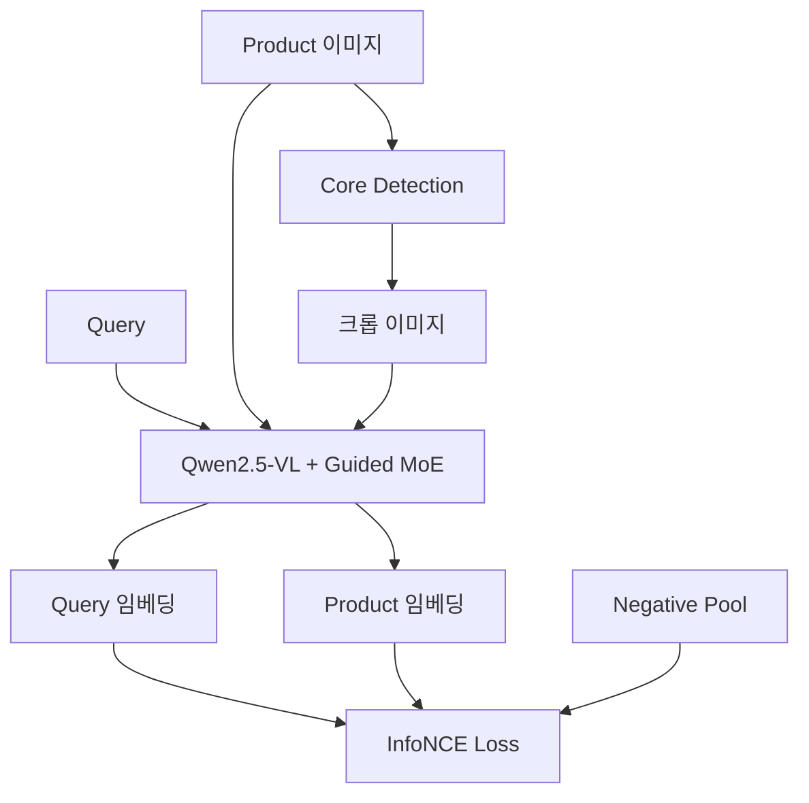

## B.2) 학습 데이터 구성

| 구성요소 | 내용 | 출처 |
|---------|------|------|
| Query | 유저 검색어 또는 이미지 | 검색 로그 |
| Positive | **실제 구매한** 상품 | 구매 로그 |
| Negative | 구매 안 한 상품들 | 같은 배치 + 같은 카테고리 + 과거 배치 |

## B.3) 학습 목표

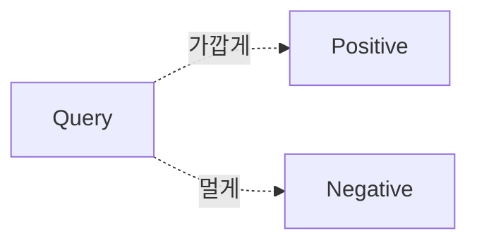

- Query ↔ Positive (구매한 상품): 임베딩 거리 **가깝게**
- Query ↔ Negative (안 산 상품): 임베딩 거리 **멀게**

## B.4) 상품 임베딩 구성

상품 임베딩은 이미지만이 아닌 **멀티모달** 정보로 구성:

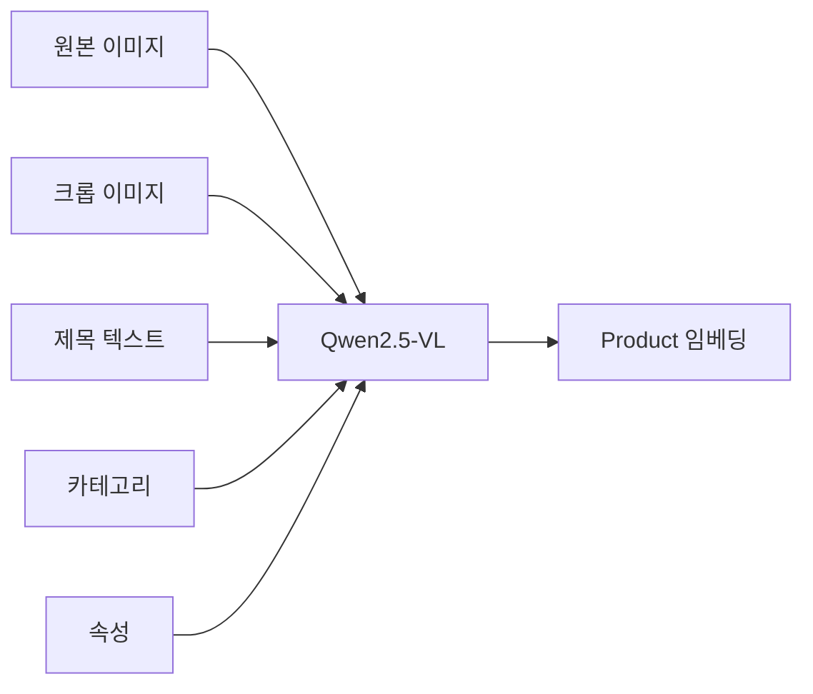

| 입력 | 예시 |
|------|------|
| 원본 이미지 | 상품 사진들 (정면, 측면, 착용샷 등) |
| 크롭 이미지 | Core Detection으로 추출한 핵심 영역 |
| 제목 텍스트 | "나이키 에어맥스 90 화이트" |
| 카테고리 | 신발 > 운동화 > 러닝화 |
| 속성 | 색상: 흰색, 브랜드: 나이키, 사이즈: 270 |

→ MLLM이 모든 정보를 함께 처리하여 **하나의 통합된 임베딩** 생성

### B.4.1) 입력 템플릿

텍스트는 단순 연결 방식:
```python
t = Concat(title, category, attribute)
```

예시: `"나이키 에어맥스 90 화이트 신발>운동화>러닝화 색상:흰색 브랜드:나이키"`

### B.4.2) 임베딩 차원

- **벡터 크기:** Qwen2.5-VL의 hidden dimension (D) 사용
- Qwen2.5-VL-3B 기준 **2048차원** (논문에서 최종 차원 미명시)

| 모델 | Hidden Dim | 비고 |
|------|-----------|------|
| CLIP | 512~768 | 가벼움 |
| Qwen2.5-VL-3B | 2048 | MOON 베이스 |
| Qwen2.5-VL-7B | 3584 | - |

→ 실제 배포 시 projection layer로 차원 축소하는 것이 일반적

### B.4.3) Aggregation 방식

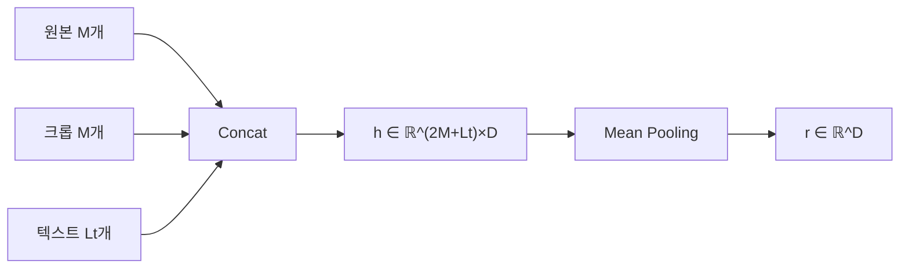

| 단계 | 연산 | 차원 |
|-----|------|-----|
| 1. Concat | 토큰들 시퀀스로 연결 | `(2M+Lt) × D` |
| 2. Mean Pooling | 토큰 축으로 평균 | `D` |

→ `[EOS]` 토큰만 쓰는 방식이 아닌 **전체 토큰 평균**

## B.5) 추론 시 활용

### B.5.1) 오프라인 Vs 온라인

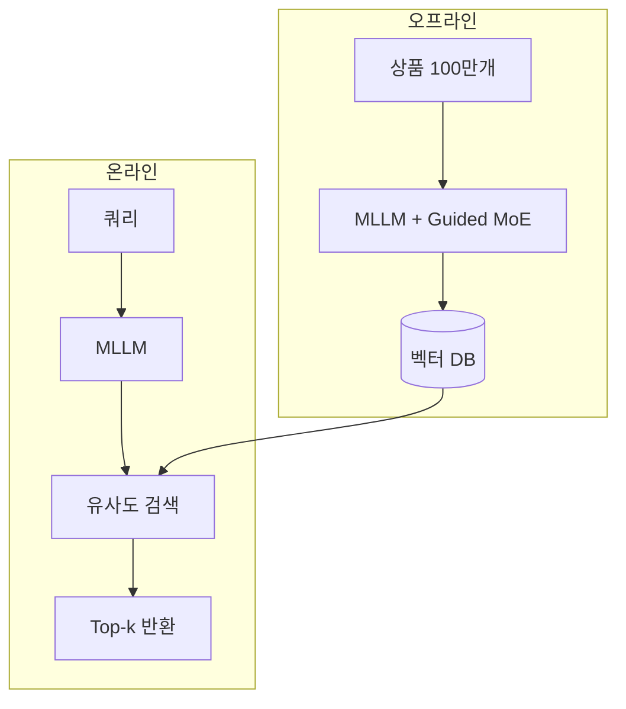

| 단계 | 처리 대상 | MoE 사용 | 시점 |
|-----|----------|---------|------|
| 오프라인 | 상품 임베딩 | O (카테고리/속성 Expert) | 서빙 전 미리 계산 |
| 온라인 | 쿼리 임베딩 | X (해당 정보 없음) | 실시간 |

→ Guided MoE는 **상품 임베딩 품질 향상용**, 쿼리 처리에는 불필요

### B.5.2) 태스크별 활용

학습된 임베딩으로 다양한 태스크 수행 (fine-tuning 없이 zero-shot):

**검색:**
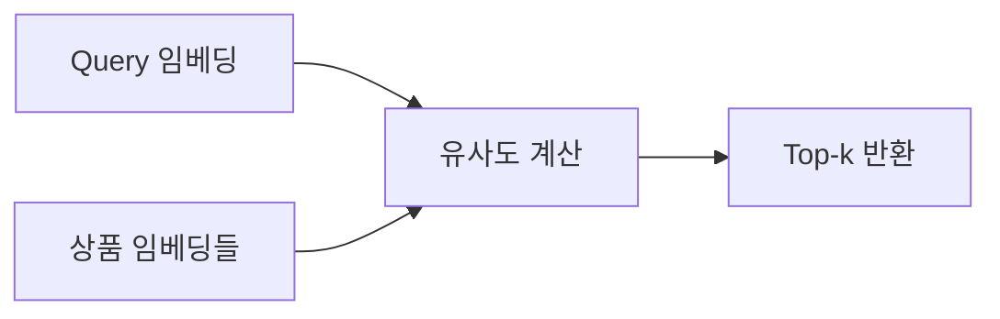

**분류/속성 예측:**
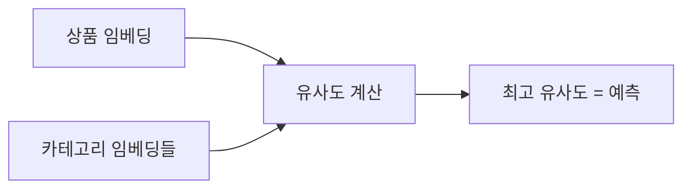

| 태스크 | 방법 |
|--------|------|
| 이미지→상품 검색 | 이미지 임베딩 vs 상품 임베딩 → top-k |
| 텍스트→상품 검색 | 텍스트 임베딩 vs 상품 임베딩 → top-k |
| 상품 분류 | 상품 임베딩 vs 카테고리 임베딩 → 최고 유사도 |
| 속성 예측 | 상품 임베딩 vs 속성값 임베딩 → 최고 유사도 |

# C) 배경 지식

## C.1) MLLM (Multimodal LLM)

텍스트뿐 아니라 이미지, 오디오 등 여러 모달리티를 함께 처리하는 LLM. 예: GPT-4V, Qwen-VL, LLaVA

## C.2) 이중 인코더 (Dual Encoder)

이미지와 텍스트를 **각각 별도의 인코더**로 처리하는 구조. CLIP이 대표적.

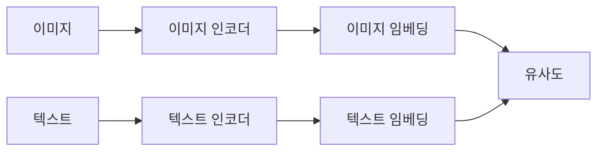

- **장점:** 임베딩을 미리 계산해두면 검색이 빠름
- **단점:** 모달리티 간 깊은 상호작용이 어려움

## C.3) MoE (Mixture of Experts)

Transformer의 FFN을 여러 Expert로 분리하고, Router가 토큰별로 어떤 Expert를 사용할지 결정.

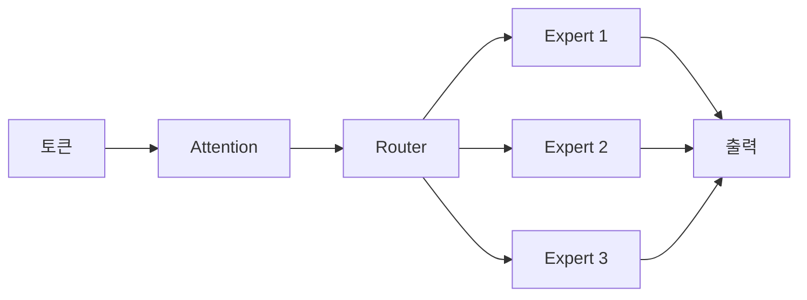

- **입출력:** 토큰 임베딩 → 변환된 임베딩 (FFN과 동일)
- **차이점:** 모든 토큰이 같은 FFN을 쓰는 게 아니라, 토큰마다 다른 Expert 사용

# D) 기존 방법의 한계

![[img-c5f4ca12fd.png|Dual Encoder vs MLLM]]
*Figure 2: (a) 이중 인코더는 1:1 매칭만 가능 (b) MLLM은 여러 이미지를 한번에 처리*

## D.1) 문제 1: 다대일 관계

e-commerce 상품은 **여러 이미지 → 하나의 제목** 구조인데, 이중 인코더는 1:1 매칭만 가능.

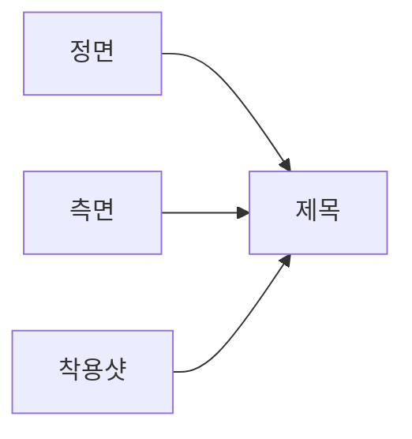

## D.2) 문제 2: 배경 잡음

![[img-2b67fea2f4.png|배경 잡음]]
*Figure 3: (a) 배경/광고 포함 (b) 핵심 영역만 추출*

상품 이미지에 배경, 모델, 광고 문구, 워터마크 등이 섞여 있으면 임베딩 품질이 떨어짐.

## D.3) 문제 3: 벤치마크 부재

기존 벤치마크는 카테고리 매칭 기반. **실제 유저가 뭘 검색하고 뭘 샀는지** 기반이 아님.

# E) 제안 방법

![[img-98eaed0795.jpg|MOON 아키텍처]]
*Figure 4: MOON 전체 구조*

### E.1.1) Figure 4 상세 설명

그림을 왼쪽에서 오른쪽으로 따라가면:

**1단계: 입력 준비 (왼쪽)**
- 상품 이미지들 → Core Detection → 원본 + 크롭 이미지
- 텍스트 (title + category + attribute) 연결

**2단계: MLLM 처리 (중앙)**
- Vision Encoder: 이미지들을 visual token으로 변환
- LLM Backbone: Qwen2.5-VL (Guided MoE 적용)
- 카테고리/속성 토큰은 전용 Expert로 라우팅

**3단계: 임베딩 추출**
- 모든 토큰의 hidden state를 **mean pooling** → 최종 임베딩
- Query와 Product 각각 임베딩 생성

**4단계: 대조 학습 (오른쪽)**
- Query 임베딩 ↔ Product 임베딩 유사도 계산
- InfoNCE Loss로 positive는 가깝게, negative는 멀게

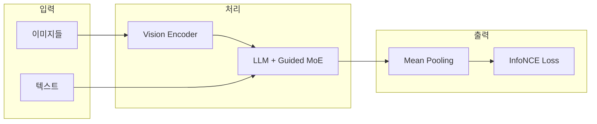

## E.2) Core Product Detection

Qwen2.5-VL로 상품의 **핵심 영역(바운딩박스)** 을 자동 감지.

### E.2.1) VLM의 Visual Grounding

VLM은 텍스트로 질문하면 이미지 내 위치를 좌표로 반환하는 **Visual Grounding** 능력이 있음:

```python
입력: 이미지 + "이 이미지에서 판매 중인 핵심 상품의 위치는?"
출력: (x1, y1, x2, y2)  # 바운딩박스 좌표
```

별도의 object detection 모델 없이 VLM 하나로 처리 가능.

### E.2.2) 학습 시 활용

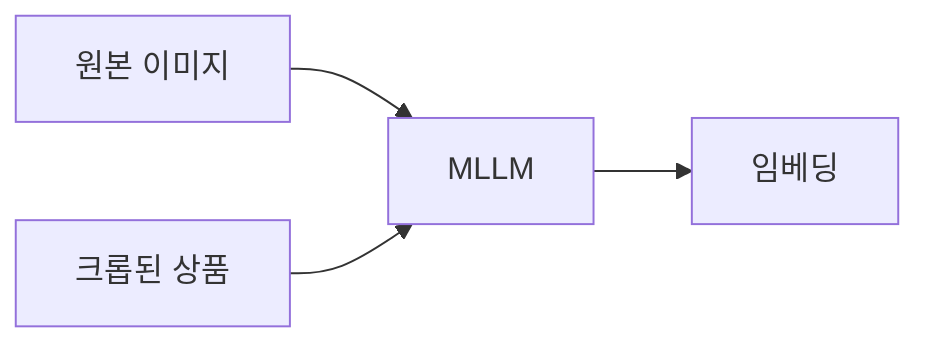

원본 + 크롭 둘 다 입력해서 모델이 "어디가 진짜 상품인지" 학습.

## E.3) Guided MoE

![[img-fdb36a2075.png|Guided MoE]]
*Figure 5: 카테고리/속성 토큰을 전담 Expert에게 라우팅*

일반 MoE는 Router가 알아서 라우팅하지만, **Guided MoE는 명시적으로 지정:**

| 토큰 타입 | 라우팅 대상 |
|----------|------------|
| 카테고리 | 카테고리 전문가 (E') |
| 속성 (색상, 브랜드 등) | 속성 전문가 (E'') |
| 그 외 | 일반 Expert들 |

→ 카테고리/속성 정보가 전담 Expert에서 더 잘 학습됨

## E.4) Spatio-Temporal Negative Sampling

![[img-b459be2363.png|네거티브 샘플링]]
*Figure 6: (a) in-batch (b) + hard negative (c) + 시공간 확장*

### E.4.1) 기존 방식의 문제

[[contrastive learning]]에서 보통 **배치 내 다른 샘플을 negative로** 사용:

```python
배치 = [신발A, 가방B, 티셔츠C]
신발A 학습 시 negative = 가방B, 티셔츠C
```

**문제:** 카테고리가 다른 쉬운 샘플들만 negative가 됨. 진짜 어려운 건 **비슷한 신발끼리 구분하기**.

### E.4.2) MOON의 해결책

In-batch를 **버리지 않고**, 그 위에 확장:

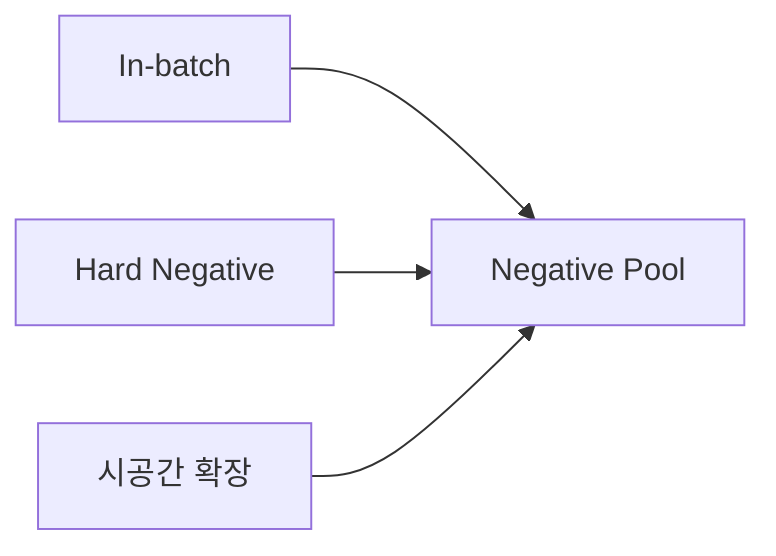

| 단계 | 예시 (신발A 학습 시) |
|------|---------------------|
| 1. In-batch | 가방B, 티셔츠C |
| 2. + Hard Negative | 신발B, 신발C |
| 3. + 시간 확장 | 과거 배치들 |
| 4. + 공간 확장 | 다른 GPU 배치들 |

→ **200배 더 많은 negative** 확보

# F) MBE 벤치마크

**Multimodal Benchmark for E-commerce** - 논문에서 새로 제안한 벤치마크

| 항목 | 내용 |
|------|------|
| 규모 | 훈련 2.69M + 평가 416K |
| 출처 | 타오바오 (추정) |
| 기간 | 2024년 1~12월 |
| 특징 | **실제 유저 구매 행동** 기반 |

- 카테고리: 1단계 24개 → 5단계 87,518개
- 속성: 색상, 브랜드, 크기, 재질 등 10종

# G) 실험 결과

| 작업 | MOON | 비교 모델 |
|------|------|----------|
| 이미지→상품 검색 | **26.71%** | SigLIP2: 15.57% |
| 텍스트→상품 검색 | 16.84% | GME: 16.92% |
| 상품 분류 | **66.57%** | MM-Embed: 57.56% |
| 속성 예측 | **75.49%** | InternVL3: 69.58% |
| 상품→상품 검색 | **26.76%** | MM-Embed: 17.89% |

## G.1) Ablation Study

> "이거 빼면 얼마나 나빠지나?" → 하락폭 클수록 중요한 컴포넌트

| 순위 | 컴포넌트 | 제거 시 영향 |
|------|----------|-------------|
| 1위 | **Core Product Detection** | 이미지 검색 성능 크게 하락 |
| 2위 | Guided MoE | 분류/속성 예측 성능 하락 |
| 3위 | 시공간 네거티브 | 전반적으로 소폭 하락 |

## G.2) 실무적 시사점

Ablation 결과에서 얻을 수 있는 교훈:

| 우선순위 | 할 일 | 근거 |
|---------|-------|------|
| **1순위** | 이미지 전처리 | Core Detection 효과가 가장 큼 |
| 2순위 | 메타데이터 정리 | Guided MoE가 카테고리/속성 활용 |
| 3순위 | 네거티브 확장 | 효과는 있지만 상대적으로 작음 |

**결론:** 모델 아키텍처 고민하기 전에 **데이터 품질**부터 챙기자

| 항목 | 할 일 | 이유 |
|-----|-------|------|
| 이미지 | 배경/워터마크/모델 제거 | Core Detection 입력 품질 ↑ |
| 카테고리 | `신발 > 운동화 > 러닝화` 계층 채우기 | Guided MoE 입력으로 사용 |
| 속성 | `색상:흰색, 브랜드:나이키` 빠짐없이 | Guided MoE 입력으로 사용 |

→ 상품 DB 메타데이터가 비어있으면 Guided MoE 효과 ↓

## G.3) 비교 모델: MM-Embed

[MM-Embed](https://arxiv.org/abs/2411.02571) - NVIDIA, ICLR 2025
- LLaVA 기반 8B 모델
- Modality-aware hard negative mining 사용
- M-BEIR 벤치마크 SOTA

# H) Related

- [[Qwen-VL]]
- [[contrastive learning]]
- [[Mixture of Experts]]
- [[CLIP]]

# I) References

- Paper: https://arxiv.org/abs/2508.11999
- MM-Embed: https://arxiv.org/abs/2411.02571
