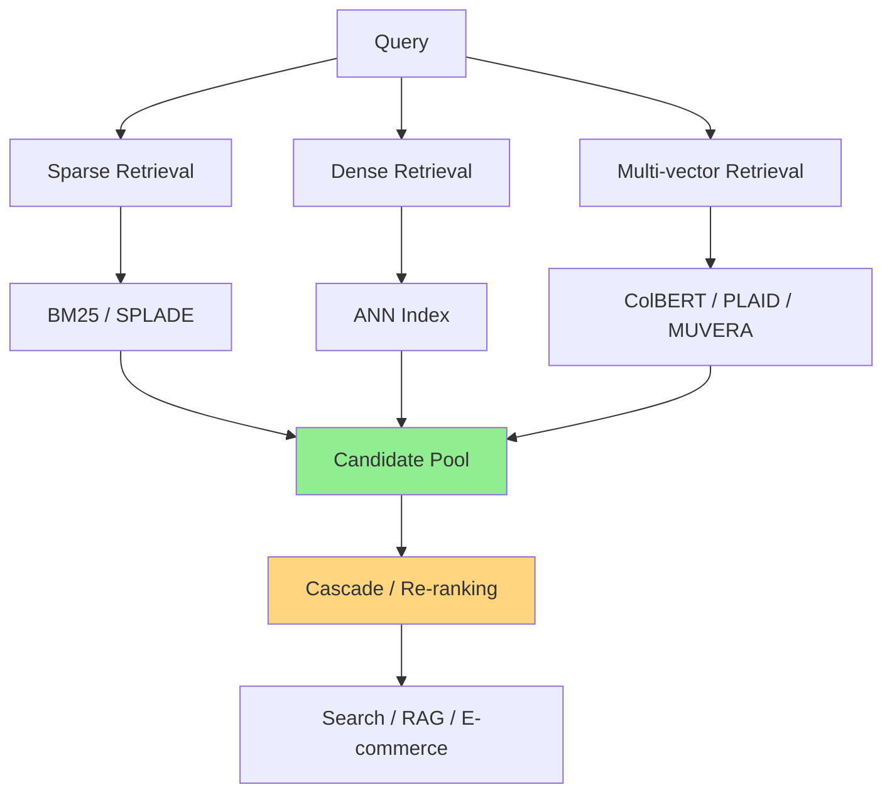

# A) Retrieval

Retrieval은 사용자의 query에 대해 큰 corpus에서 후보 문서나 item을 빠르게 가져오는 단계다. 전통적인 lexical retrieval은 [[BM25]]와 [[Inverted Index]]를 중심으로 동작하고, semantic retrieval은 [[DPR]] 같은 dense retriever와 [[HNSW]], [[faiss]], [[Vamana]] 같은 ANN index를 함께 사용한다.

# B) 큰 지도

# C) Retrieval Families

[[BM25]]는 lexical baseline으로 가장 먼저 잡기 좋고, learned sparse 쪽은 [[SPLADE]], [[SPLADE on Elasticsearch]], [[Sparse Retrieval Serving]]으로 이어진다. Sparse retrieval은 token 또는 vocabulary dimension이 그대로 posting list와 연결되기 때문에 [[Active Dimensions]]와 index size를 같이 봐야 한다.

Dense retrieval은 [[DPR]]에서 출발해 [[sentence transformers]], [[m3-embedding]], [[Qwen3 Embedding]], [[LLM2Vec]], [[Gemini Embedding - Generalizable Embeddings from Gemini]] 같은 embedding model로 확장된다. 실제 serving에서는 [[HNSW]], [[IVF]], [[faiss]], [[scann]], [[Vamana]] 같은 indexing 전략이 품질과 latency를 좌우한다.

Multi-vector retrieval은 single-vector embedding의 정보 손실을 줄이려는 흐름이다. [[ColBERT]]의 late interaction을 기준점으로 두고, serving 최적화는 [[PLAID]], [[WARP - An Efficient Engine for Multi-Vector Retrieval]], [[MUVERA]], [[Jina-ColBERT-v2]]를 함께 보면 좋다.

# D) Ranking And Applications

Retrieval 이후에는 [[Cascade Ranking System]] 안에서 pre-ranking, ranking, re-ranking이 이어진다. 여러 retrieval branch를 섞을 때는 [[Reciprocal Rank Fusion]]이 단순하고 강한 baseline이며, 최종 re-ranking에서는 [[Re-ranking]], [[Maximal Marginal Relevance]], [[Seesaw Effect]] 같은 노트가 연결된다.

응용 관점에서는 [[Retrieval-Augmented Generation]]과 [[CalibRAG]]가 RAG 쪽 진입점이고, product search 쪽은 [[GRAM - Generative Retrieval and Alignment Model]], [[LREF]], [[Multimodal Semantic Retrieval for Product Search]], [[Towards More Relevant Product Search Ranking Via Large Language Models]] 흐름으로 보면 된다.

# E) Operations

검색 엔진 기반 운영은 [[Lucene]]과 [[Elasticsearch]]가 핵심이다. 특히 sparse retrieval을 Elasticsearch 위에서 운영하려면 [[SPLADE on Elasticsearch]]의 index size, filesystem cache, tail latency 내용을 같이 확인한다. 페이지네이션이나 API 응답 설계는 [[cursor based pagination]]과 [[Architecting and Evaluating an AI-First Search API]]가 이어진다.

# F) Reading Queue

읽을 논문 후보는 [[Retrieval Paper List]]에 모아둔다. 새 논문을 정리할 때는 별도 Related 섹션을 만들기보다, 이 허브 노트나 본문 문장 안에서 필요한 개념으로 바로 링크를 걸어둔다.
