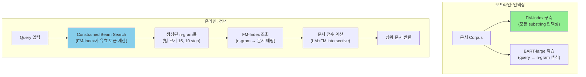

# A) 한줄 요약

Meta AI에서 제안한 **SEAL (Search Engines with Autoregressive LMs)** 은, 문서의 **모든 n-gram을 식별자(identifier)로 사용**하고, FM-Index 기반 constrained decoding으로 문서를 검색하는 generative retrieval 모델이다. DPR 대비 **7배 작은 인덱스** 로 KILT 벤치마크에서 passage-level R-precision 10점 이상 향상.

- **저자**: Michele Bevilacqua, Giuseppe Ottaviano, Patrick Lewis, Wen-tau Yih, Sebastian Riedel, Fabio Petroni
- **소속**: Meta AI, Sapienza University of Rome, UCL
- **발표**: arXiv 2022 (2204.10628)
- **Base Model**: BART-large (406M)

# B) 전체 구조



말로 풀어서 설명하면:

1. **오프라인**: 전체 corpus를 FM-Index로 구축 (모든 substring을 효율적으로 검색 가능하게) + BART 모델을 query→n-gram 생성하도록 학습
2. **온라인**: query가 들어오면 BART가 n-gram을 생성하되, FM-Index가 **실제 corpus에 존재하는 n-gram만** 생성하도록 제약 → 생성된 n-gram으로 FM-Index 조회 → 매칭 문서 점수 매기기

# C) 배경 지식

## C.1) Generative Retrieval이란?

기존 검색이 "query → 인덱스 검색 → 문서 반환" 파이프라인이라면, generative retrieval은 **"query → LLM이 문서 식별자를 직접 생성 → 해당 문서 반환"** 하는 방식이다. 핵심 질문은 "문서를 어떤 식별자로 표현할 것인가?"

| 방식 | 식별자 | 대표 모델 |
|------|--------|----------|
| 제목 기반 | 문서 제목 문자열 | GENRE |
| 숫자 ID | 클러스터링 기반 계층적 숫자 | DSI |
| **N-gram 기반** | **문서 내 모든 substring** | **SEAL** |

## C.2) FM-Index

Ferragina-Manzini Index는 **압축된 suffix array** 로, 다음 기능을 제공:

- 임의 길이 substring의 corpus 내 출현 빈도: $O(|n| \log |V|)$
- 가능한 다음 토큰 목록 생성: $O(|V| \log |V|)$
- substring을 포함하는 모든 문서 식별

비유하자면: 전체 corpus의 모든 단어 조합을 미리 정리해둔 **"초거대 색인"** 이다. 일반 역인덱스(BM25)는 개별 단어만 검색하지만, FM-Index는 "나이키 에어맥스 블랙"처럼 **연속된 여러 단어 조합**도 바로 검색할 수 있다.

장점: DPR 인덱스(64.6GB) 대비 **8.8GB** 로 7배 이상 작음.

## C.3) Constrained Decoding

LLM이 토큰을 생성할 때, FM-Index에 존재하지 않는 토큰의 logit을 $-\infty$로 마스킹하여 **corpus에 실제로 존재하는 n-gram만** 생성하도록 강제하는 기법.

```
Query: "who invented the telephone"
Step 1: LLM이 "Alexander" 생성 → FM-Index에 있음 ✓
Step 2: LLM이 "Graham" 생성 → "Alexander Graham"이 FM-Index에 있음 ✓
Step 3: LLM이 "xyz" 생성 시도 → "Alexander Graham xyz"가 FM-Index에 없음 ✗ → 마스킹
```

# D) 기존 방법의 한계

## D.1) SEAL 이전 Generative Retrieval의 문제

- **제목 기반 (GENRE)**: 문서 제목이 짧거나 모호하면 식별 불가. 제목이 없는 문서(passage)는 아예 처리 불가
- **숫자 ID 기반 (DSI)**: 클러스터링으로 할당한 숫자 ID에 의미가 없어 LLM의 언어 지식 활용 불가. ID 체계를 통째로 암기해야 함

## D.2) SEAL이 해결한 것

- 구조 강제 없음 — n-gram은 자연어 그 자체이므로 LLM의 기존 언어 지식 활용 가능
- passage 단위 검색 가능 — 제목이 없어도 본문 n-gram으로 식별

# E) 제안 방법

## E.1) N-gram을 식별자로 사용

모든 문서의 모든 n-gram이 해당 문서의 식별자가 된다. 예를 들어:

```
문서: "Alexander Graham Bell invented the telephone in 1876"

식별자들:
  - "Alexander"
  - "Graham Bell"
  - "invented the telephone"
  - "Alexander Graham Bell invented"
  - "telephone in 1876"
  - ... (모든 가능한 연속 substring)
```

하나의 문서에 수많은 식별자가 존재하고, 하나의 n-gram이 여러 문서에 걸칠 수도 있다.

## E.2) 학습 방법

BART-large를 두 가지 데이터로 학습:

**지도 학습**: ground truth 문서의 n-gram 예측
- query $q$가 주어지면, 정답 문서에서 길이 $k=10$의 n-gram을 10개 샘플링
- query와 문자 겹침이 높은 n-gram에 편향(bias) 부여

**비지도 학습**: corpus의 임의 span → 다른 span 또는 제목 예측
- 추가 학습 데이터로 모델의 corpus 이해도 강화

## E.3) 추론: Constrained Beam Search

Query가 들어오면:

1. **Beam search** (빔 크기 15, 10 timestep)로 n-gram 후보 생성
2. 각 step에서 FM-Index가 **유효한 다음 토큰만** 허용 (constrained decoding)
3. 생성된 각 n-gram에 대해 FM-Index에서 매칭 문서 조회

## E.4) 문서 점수 계산

3가지 scoring 방식을 제안하며, **LM+FM intersective** 가 가장 성능이 좋음:

### E.4.1) LM+FM 가중치

n-gram의 무조건부 확률:

$$P(n) = \frac{F(n, \mathcal{R})}{\sum |d|}$$

여기서 $F(n, \mathcal{R})$은 corpus 전체에서 n-gram $n$의 출현 빈도.

LM+FM 가중치 (논문 Eq 2):

$$w(n, q) = \max\left(0, \log \frac{P(n|q)(1-P(n))}{P(n)(1-P(n|q))}\right)$$

의미: LM이 높은 확률로 생성하면서($P(n|q)$ 높음) corpus에서 드문($P(n)$ 낮음) n-gram일수록 **식별력이 높다** 고 판단.

### E.4.2) Intersective 점수

문서 $d$의 최종 점수 (논문 Eq 3):

$$W(d, q) = \sum w(n, q)^\alpha \cdot \text{cover}(n, K^{(d)})$$

여기서 cover 함수 (논문 Eq 4):

$$\text{cover}(n, K) = 1 - \beta + \beta \cdot \frac{|set(n) \setminus C(n, K)|}{|set(n)|}$$

- $\alpha = 2.0$: 높은 가중치의 n-gram을 더 강조
- $\beta = 0.8$: 이미 커버된 토큰은 가중치 감소 → 다양한 n-gram이 기여하도록 유도

"왜 intersective인가?" → 같은 문서가 여러 n-gram에 의해 반복 매칭될 때, 이미 커버된 부분은 중복 카운팅하지 않기 위해. 비유하면 퍼즐에서 이미 맞춘 조각은 덜 가치 있고, **새로운 조각을 맞추는 게 더 가치 있다** 는 원리.

# F) 데이터셋 및 실험 환경

## F.1) 데이터셋

| 데이터셋 | 규모 | 용도 |
|---------|------|------|
| Natural Questions (NQ) | ~21M passages (100 tokens) | 주요 QA 벤치마크 |
| NQ320k | 200K 문서 (축소판) | 기존 연구와 비교용 |
| KILT | ~36M passages, 7개 태스크 | 멀티태스크 벤치마크 |

## F.2) 학습 환경

| 항목 | 설정 |
|------|------|
| Base Model | BART-large (406M) |
| N-gram 길이 | k=10 |
| 문서당 샘플 수 | 10개 n-gram |
| Learning Rate | 3e-5 |
| Total Updates | 800K |
| Batch Size | 4096 tokens |
| GPU | 8 GPUs |
| Label Smoothing | 0.1 |
| Beam Size (추론) | 15 |

## F.3) 인덱스 크기 비교

| 시스템 | 인덱스 크기 |
|--------|-----------|
| **SEAL (FM-Index)** | **8.8 GB** |
| BM25 | 18.8 GB |
| DPR | 64.6 GB |
| 원문 텍스트 | 13.4 GB |

# G) 실험 결과

## G.1) KILT Benchmark (Passage-level R-precision)

| 모델 | FEV | zsRE | NQ | HoPo | T-REx | WoW | 평균 |
|------|-----|------|-----|------|-------|-----|------|
| BM25 | 50.1 | 67.6 | 25.4 | 37.6 | 53.0 | 34.9 | 44.8 |
| DPR | 55.3 | 64.2 | 33.1 | 30.1 | 47.6 | 24.3 | 42.5 |
| **SEAL** | **67.8** | **78.8** | **43.6** | 36.2 | 52.2 | 29.1 | **54.5** |

**SEAL이 DPR 대비 평균 +12점, BM25 대비 +9.7점 향상**

## G.2) Natural Questions

| 모델 | Acc@5 | Acc@20 | Acc@100 |
|------|-------|--------|---------|
| DPR | 80.1 | 86.1 | 91.4 |
| **SEAL** | 76.2 | 86.3 | 91.2 |

NQ에서는 DPR과 거의 동등한 수준. Acc@20부터는 SEAL이 근소 우위.

## G.3) 실무적 시사점

- **인덱스 효율**: DPR 대비 7배 작은 인덱스로 비슷한 성능 → 메모리 제약 환경에서 유리
- **속도 트레이드오프**: 추론 ~35분 (1 GPU) vs DPR ~30분 → 약간 느림. GAR ~5분보다는 확실히 느림
- **KILT 멀티태스크에서 강점**: 다양한 태스크에 걸쳐 강건한 성능. 특히 fact verification(FEV), slot filling(zsRE)에서 두드러짐

# H) 한계점

1. **추론 속도**: Constrained beam search가 dense retrieval보다 느림
2. **이커머스 적용 한계**: n-gram이 문서 원문에서 추출되므로, query와 문서의 **어휘 불일치(vocabulary mismatch)** 문제 해결 불가 — 이것이 [[retrieval/e-commerce/GRAM - Generative Retrieval and Alignment Model|GRAM]]이 NER 기반 정규화된 코드를 제안한 이유
3. **동적 corpus 미대응**: FM-Index 업데이트가 비효율적 → 상품이 수시로 추가/삭제되는 이커머스에 부적합
4. **모델 크기 제한**: BART-large(406M)로만 실험 → 더 큰 모델에서의 성능은 미검증

# I) References

- [SEAL Paper (arxiv)](https://arxiv.org/abs/2204.10628)
- [GitHub - facebookresearch/SEAL](https://github.com/facebookresearch/SEAL)
