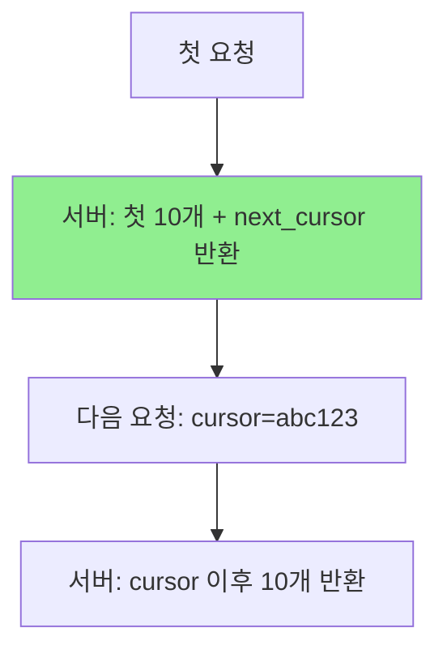
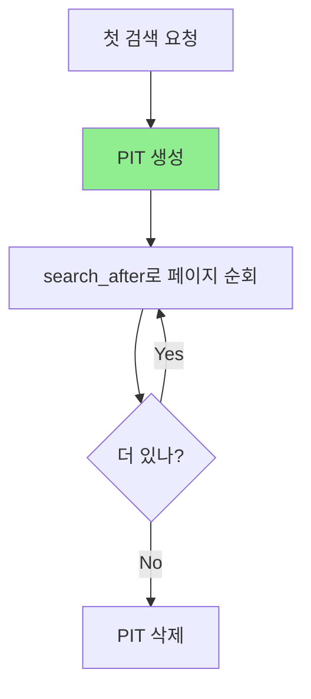

# A) Cursor Based Pagination

데이터셋에서 현재 위치를 가리키는 포인터(cursor)를 사용해 다음 페이지를 가져오는 페이지네이션 방식. **Keyset Pagination**이라고도 불림.

# B) Offset Vs Cursor 비교

| 구분       | Offset Pagination         | Cursor Pagination            |
| -------- | ------------------------- | ---------------------------- |
| 방식       | `LIMIT 10 OFFSET 100`     | `WHERE id > cursor LIMIT 10` |
| 성능       | 깊은 페이지에서 느림 (앞 데이터 모두 스캔) | 일정한 성능 유지                    |
| 데이터 변경 시 | 중복/누락 발생 가능               | 안정적 결과 보장                    |
| 랜덤 접근    | 가능 (페이지 50으로 바로 이동)       | 불가능 (순차 탐색만)                 |
| 구현 복잡도   | 단순                        | 복잡                           |

## B.1) Offset Pagination 동작 방식

"처음부터 N개 건너뛰고 M개 가져와"라는 방식.

```sql
-- 페이지 5 조회 (페이지당 10개)
SELECT * FROM posts ORDER BY id LIMIT 10 OFFSET 40
-- DB가 앞의 40개를 세고 건너뛴 다음, 10개 반환
```

**문제점**: 페이지 1000을 보려면 앞의 9990개를 모두 스캔해야 해서 깊은 페이지일수록 느려짐.

**데이터 변경 시 문제**: 페이지 1을 보는 중에 새 글이 추가되면, 페이지 2로 넘어갈 때 페이지 1에서 봤던 글이 또 나올 수 있음 (중복). 반대로 삭제되면 글이 누락됨.

## B.2) Cursor Pagination 동작 방식

"이 지점 이후로 M개 가져와"라는 방식.

```sql
-- 마지막으로 본 글의 id가 150이라면
SELECT * FROM posts WHERE id > 150 ORDER BY id LIMIT 10
-- id=150 이후 데이터만 바로 조회 (인덱스 활용)
```

**장점**: 페이지 깊이와 상관없이 항상 일정한 성능. `WHERE id > 150` 조건으로 인덱스를 타서 바로 해당 위치로 점프.

**데이터 변경에 안정적**: "id 150 이후"라는 기준점이 명확하므로, 앞에 데이터가 추가/삭제되어도 영향 없음.

# C) 동작 원리



1. 클라이언트가 첫 페이지 요청
2. 서버가 데이터 + `next_cursor` (마지막 아이템의 고유 식별자) 반환
3. 클라이언트가 다음 페이지 요청 시 cursor 값 전달
4. 서버는 `WHERE id > cursor` 형태로 쿼리 실행

# D) Cursor 종류

| 타입 | 설명 | 예시 |
|------|------|------|
| **Sequential ID** | Auto-increment ID 사용 | `cursor=12345` |
| **Timestamp** | 생성/수정 시간 사용 | `cursor=2024-01-01T00:00:00Z` |
| **Encoded Cursor** | 여러 필드를 Base64 인코딩 | `cursor=eyJpZCI6MTIzfQ==` |
| **Opaque Cursor** | 구현 세부사항 숨김 | 임의 토큰 |
| **Composite** | ID + Timestamp 조합 | 정렬 안정성 확보 |

# E) 장점

- **성능**: `COUNT(*)` 불필요, 인덱스 효율적 활용, 데이터 증가해도 쿼리 속도 일정
- **안정성**: 데이터 추가/삭제 시에도 중복/누락 없음
- **확장성**: 수백만 레코드에서도 동일한 성능

# F) 단점

- **랜덤 접근 불가**: 특정 페이지로 바로 이동 불가능
- **정렬 복잡성**: 정렬 조건 변경 시 cursor도 해당 조건 포함 필요
- **북마크 어려움**: 특정 페이지 저장/공유 어려움

# G) 사용 사례

- **무한 스크롤**: 소셜 미디어 피드 (Twitter, Instagram)
- **실시간 피드**: 새 데이터가 자주 추가되는 환경
- **대용량 API**: 성능이 중요한 API 엔드포인트
- **GraphQL**: Relay 스펙의 Connection 패턴

# H) Elasticsearch Pagination

ES에서는 3가지 pagination 방식을 제공.

| 방식 | 특징 | 용도 |
|------|------|------|
| `from + size` | Offset 방식, max 10,000개 제한 | 얕은 페이지 |
| `search_after` | Cursor 방식, sort 값을 cursor로 사용 | 실시간 검색 |
| `Scroll API` | 스냅샷 기반, deprecated 추세 | 대량 export |

## H.1) From + Size (Offset 방식)

```json
{
  "from": 100,
  "size": 10,
  "query": { "match": { "title": "elasticsearch" } }
}
```

기본값 `max_result_window=10,000`으로 제한됨. 깊은 페이지는 허용 안 함.

## H.2) search_after (Cursor 방식)

**sort 값을 cursor로 사용**. 마지막 문서의 sort 값을 다음 요청에 전달.

```json
// 첫 번째 요청
{
  "size": 10,
  "query": { "match": { "title": "elasticsearch" } },
  "sort": [
    { "_score": "desc" },
    { "_id": "asc" }       // tiebreaker: unique 필드 필수
  ]
}
```

응답에서 마지막 문서의 `sort` 값 확인:
```json
{
  "hits": [{
    "_id": "doc_abc",
    "_score": 0.85,
    "sort": [0.85, "doc_abc"]   // 이 값을 cursor로 사용
  }]
}
```

```json
// 다음 페이지 요청
{
  "size": 10,
  "query": { "match": { "title": "elasticsearch" } },
  "sort": [
    { "_score": "desc" },
    { "_id": "asc" }
  ],
  "search_after": [0.85, "doc_abc"]   // 이전 마지막 sort 값
}
```

## H.3) Point in Time (PIT) + search_after

실시간 검색에서 **일관된 결과**를 보장하려면 PIT 사용. 인덱스 스냅샷을 유지해서 pagination 중 데이터 변경 영향 없음.

```json
// 1. PIT 생성 (keep_alive: 스냅샷 유지 시간)
POST /my-index/_pit?keep_alive=5m

// 응답: { "id": "46ToAwMDaWR..." }
```

```json
// 2. PIT + search_after로 검색
{
  "size": 10,
  "query": { "match": { "title": "elasticsearch" } },
  "pit": {
    "id": "46ToAwMDaWR...",
    "keep_alive": "5m"
  },
  "sort": [
    { "_score": "desc" },
    { "_shard_doc": "asc" }   // PIT 사용 시 tiebreaker
  ],
  "search_after": [0.85, 12345]
}
```

```json
// 3. 완료 후 PIT 삭제
DELETE /_pit
{ "id": "46ToAwMDaWR..." }
```

## H.4) 실시간 검색 권장 패턴



- **tiebreaker 필수**: `_score`만으로는 동점 문서 순서 보장 안 됨. `_id` 또는 `_shard_doc` 추가
- **PIT keep_alive**: 사용자 세션 예상 시간보다 약간 길게 (예: 5분)
- **Deep pagination 제한**: 어차피 사용자는 몇 페이지만 봄. 최대 1000개 정도로 제한 권장

# I) 구현 Best Practices

1. **인덱스 컬럼 사용**: cursor로 사용할 컬럼에 인덱스 생성
2. **Immutable 필드 선택**: 변경되지 않는 필드 사용 (예: created_at + id)
3. **에러 처리**: 유효하지 않은 cursor에 400/410 에러 반환
4. **Unique 보장**: timestamp만 사용 시 동일 시간 데이터 처리 위해 ID 조합

```sql
-- 예시: timestamp + id 복합 cursor
SELECT * FROM posts
WHERE (created_at, id) > ('2024-01-01', 100)
ORDER BY created_at, id
LIMIT 10;
```

# J) References

- [Cursor Based Pagination - Medium](https://medium.com/@nimmikrishnab/cursor-based-pagination-37f5fae9f482)
- [Cursor pagination: how it works - Merge](https://www.merge.dev/blog/cursor-pagination)
- [Understanding Cursor Pagination - Milan Jovanovic](https://www.milanjovanovic.tech/blog/understanding-cursor-pagination-and-why-its-so-fast-deep-dive)
- [Evolving API Pagination at Slack](https://slack.engineering/evolving-api-pagination-at-slack/)
