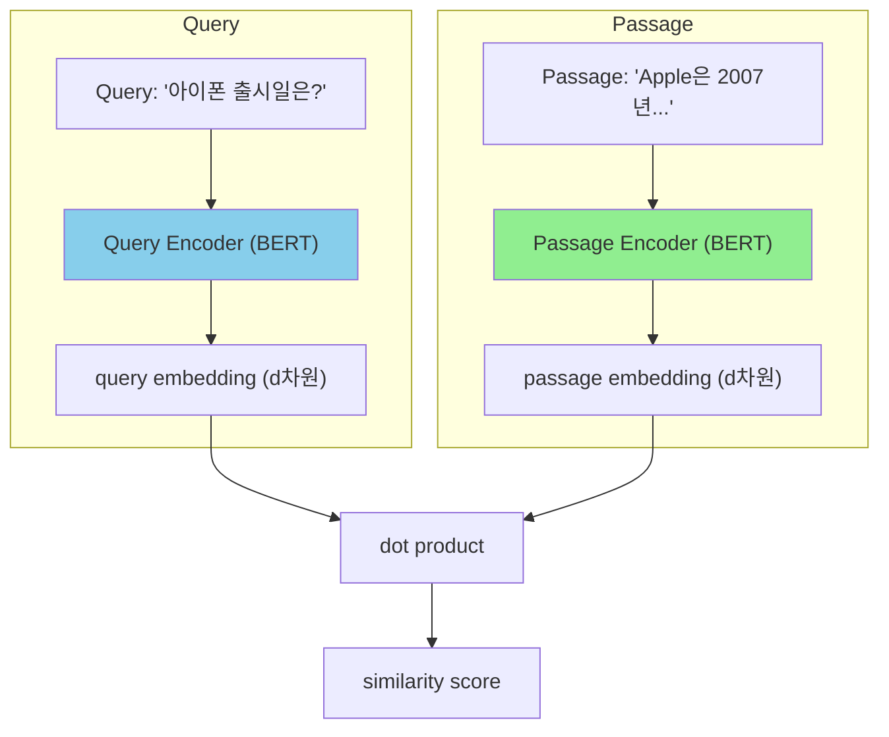

# A) DPR (Dense Passage Retrieval) ?

Facebook AI Research에서 2020년 발표한 **dense retrieval** 의 대표적 방법론. 기존 BM25 같은 sparse retrieval(단어 매칭 기반)과 달리, **dense vector** 를 사용해 질문과 문서의 의미적 유사도를 계산한다.

Open-domain QA에서 관련 passage를 검색하는 것이 목표.

# B) 구조: Dual Encoder



- **Dual Encoder 구조**: Query와 Passage를 **독립적인** BERT 인코더로 임베딩
- `[CLS]` 토큰의 출력을 representation으로 사용
- Inference 시 passage embedding은 **오프라인에서 미리 계산** 가능 → 빠른 검색

## B.1) BERT Vs DPR: 뭐가 다른가?

구조는 BERT와 동일하다. 차이는 **학습 방식**.

| 구분           | BERT (vanilla)            | DPR                                    |
| ------------ | ------------------------- | -------------------------------------- |
| **목적**       | 범용 언어 이해                  | Retrieval 특화                           |
| **[CLS] 의미** | Next Sentence Prediction용 | Query/Passage의 semantic representation |
| **학습 목표**    | MLM + NSP                 | Contrastive Learning ([[InfoNCE]])     |
| **인코더**      | 단일                        | Dual (Query용, Passage용 분리)             |

**왜 Vanilla BERT로는 안 되나?**

BERT의 `[CLS]`는 원래 "두 문장이 연속인가?" (NSP)를 판단하려고 학습됨. 이건 "의미가 비슷한가?"와는 다른 문제.

```python
BERT NSP:  [CLS] 문장A [SEP] 문장B [SEP] → 연속인가? Yes/No
DPR:       [CLS] Query [SEP] → embedding → dot product로 유사도
```

실제로 Vanilla BERT [CLS]로 similarity를 구하면 **BM25보다도 훨씬 못함**:

| 방법 | Top-20 Accuracy (NQ) |
|------|---------------------|
| BM25 | 59.1 |
| BERT (vanilla) | 26.1 |
| **DPR** | **78.4** |

**결론**: DPR = **BERT 구조** + **Retrieval용 학습 방식**. 구조가 새로운 게 아니라, **학습 목표를 바꾼 게 핵심**.

# C) 학습 방법

## C.1) Loss Function

[[InfoNCE]] (Negative Log-Likelihood) 사용:

$$\mathcal{L} = -\log \frac{e^{sim(q, p^+)}}{e^{sim(q, p^+)} + \sum_{j=1}^{n} e^{sim(q, p_j^-)}}$$

- $q$: query embedding
- $p^+$: positive passage embedding
- $p_j^-$: negative passage embeddings
- $sim(\cdot, \cdot)$: dot product

## C.2) Negative Sampling

DPR은 세 가지 종류의 negative를 사용:

| Negative 유형 | 설명 |
|--------------|------|
| **In-batch negatives** | 같은 batch 내 다른 query의 positive passage |
| **BM25 negatives** | BM25로 검색했지만 정답이 아닌 passage (hard negative) |
| **Random negatives** | 전체 corpus에서 무작위 샘플링 |

**핵심 발견**: BM25 hard negative를 포함하면 성능이 크게 향상됨.

# D) Sparse Vs Dense Retrieval 비교

| 구분 | Sparse (BM25) | Dense (DPR) |
|------|---------------|-------------|
| **표현 방식** | term frequency 기반 sparse vector | neural network 기반 dense vector |
| **매칭** | exact term matching | semantic similarity |
| **동의어 처리** | 약함 | 강함 |
| **학습** | 불필요 (unsupervised) | labeled data 필요 |
| **Zero-shot** | 강함 | 약함 (domain adaptation 필요) |
| **저장 공간** | 적음 | 많음 (embedding 저장) |

## D.1) 예시

```python
Query: "애플 창업자가 누구야?"

BM25: "애플", "창업자" 단어 매칭
  → "애플 파이 창업자 레시피" 검색될 수 있음

DPR: 의미적 유사도
  → "스티브 잡스가 1976년 Apple을 설립했다" 검색 가능
```

# E) 실험 결과 (Natural Questions)

| Model | Top-5 | Top-20 | Top-100 |
|-------|-------|--------|---------|
| BM25 | 43.8 | 62.9 | 78.3 |
| **DPR** | **67.5** | **79.8** | **85.9** |

DPR이 BM25 대비 Top-5에서 **+23.7%p** 향상.

# F) 한계점

1. **학습 데이터 의존**: labeled (query, passage) pair 필요
2. **Out-of-domain 일반화**: 학습 도메인 외에서 성능 저하
3. **Lexical matching 약함**: 고유명사, 숫자 등 exact match 필요한 경우 BM25가 나을 수 있음
4. **Embedding 저장 비용**: 대규모 corpus의 경우 저장 공간 이슈

# G) 후속 연구

- **ColBERT**: late interaction으로 더 정밀한 매칭
- **ANCE**: Approximate nearest neighbor Negative Contrastive Estimation
- **RocketQA**: cross-batch negative + denoised hard negative
- **Contriever**: self-supervised dense retrieval (labeled data 불필요)
- [[SPLADE]]: sparse + dense hybrid

# H) References

- [Dense Passage Retrieval for Open-Domain Question Answering](https://arxiv.org/abs/2004.04906) (Karpukhin et al., EMNLP 2020)
- [GitHub - facebookresearch/DPR](https://github.com/facebookresearch/DPR)
