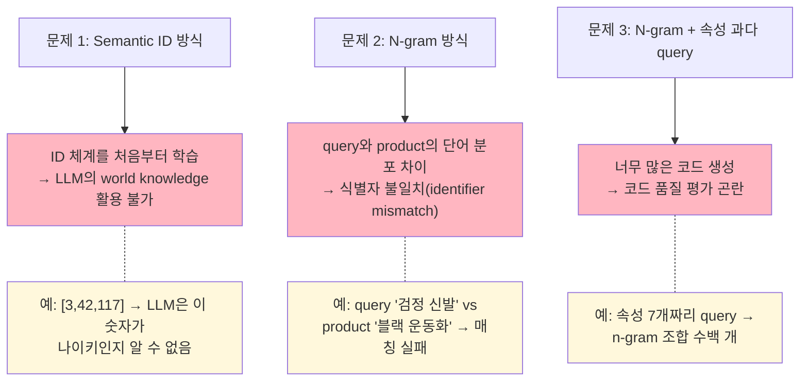
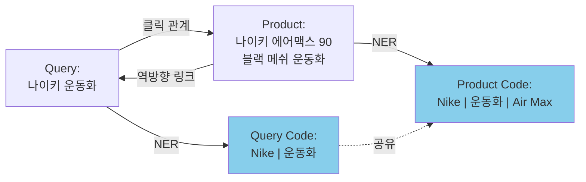

# A) 한줄 요약

JD.com에서 제안한 **Generative Retrieval and Alignment Model (GRAM)** 은, LLM의 world knowledge를 활용해 query와 product 간 **공유 텍스트 식별자(shared text identifier)** 를 생성하고, DPO 기반 co-alignment로 retrieval 효율을 극대화하는 모델이다. WWW 2025 발표, 실제 JD **검색 광고(Sponsored Search)** 시스템에 배포되어 매일 수억 건 서빙 중. 논문 제목은 "E-commerce Retrieval"이지만, 실제 배포 및 온라인 실험은 광고 시스템에서 수행됨 (평가 지표: Ad. Impressions, CTR, CPC, Ad. Revenue).

- **저자**: Ming Pang, Chunyuan Yuan, Xiaoyu He 외 (JD.COM)
- **학회**: ACM Web Conference 2025 (WWW Companion '25)
- **Base Model**: Llama-2 8B

# B) 전체 구조

```mermaid
flowchart TD
    subgraph Offline["오프라인 학습"]
        NER["NER 모델로<br/>핵심 속성 추출"]
        INIT["초기 Code 구성<br/>(query-code, product-code)"]
        SFT["SFT: Joint Training<br/>Query-Code + Product-Code Generator"]
        CA["Co-Alignment (DPO)<br/>코드 정렬 + Query-Product 정렬"]
        NER --> INIT --> SFT --> CA
    end

    subgraph Online["온라인 서빙"]
        Q["사용자 Query"] --> QCG["Query-Code Generator"]
        QCG --> CODES["생성된 Codes"]
        CODES --> INDEX["Product-Code Index<br/>(역인덱스 매칭)"]
        INDEX --> RANK["Query-Product Scoring<br/>(JS Divergence)"]
        RANK --> RESULT["Top-300 광고 반환"]
    end

    subgraph Nearline["Near-line"]
        NEW["신규 상품"] --> PCG["Product-Code Generator"]
        PCG --> UPDATE["Index 업데이트"]
    end

    style CA fill:#90EE90
    style CODES fill:#87CEEB
```



말로 풀어서 설명하면:

1. **오프라인**: NER로 query/product에서 핵심 속성(브랜드, 카테고리, 색상 등)을 추출 → 이걸 조합해서 **텍스트 코드** 생성 → LLM(Llama-2)을 SFT로 학습 → DPO로 코드 품질 정렬
2. **온라인**: query가 들어오면 Query-Code Generator가 코드를 생성 → 미리 구축된 product-code 인덱스에서 매칭 → JS Divergence 기반 scoring으로 최종 랭킹
3. **Near-line**: 신규 상품이 등록되면 Product-Code Generator로 코드 생성 → 인덱스 업데이트

# C) 배경 지식

## C.1) 기존 검색 방식 3가지

| 방식 | 대표 모델 | 장점 | 한계 |
|------|----------|------|------|
| **Sparse Retrieval** | [[BM25]], TF-IDF | 빠름, 역인덱스 활용 | 동의어/문맥 뉘앙스 약함 |
| **Dense Retrieval** | [[DPR]], [[retrieval/multi_vector/ColBERT]] | 의미론적 매칭 | query-product 간 깊은 상호작용 부족, 메모리 多 |
| **Generative Retrieval** | [[retrieval/SEAL]], LC-Rec, TIGER | end-to-end, 유연성 | ID 체계를 처음부터 학습 필요, LLM 지식 미활용 |

## C.2) Generative Retrieval이란?

기존 검색이 "query → 인덱스 검색 → 문서 반환" 이라면, Generative Retrieval은 "query → LLM이 문서 식별자를 직접 생성 → 해당 문서 반환"하는 방식이다.

핵심 질문은 **"문서를 어떤 식별자(identifier)로 표현할 것인가?"** 이다. 상품 **"나이키 에어맥스 90 블랙 메쉬 운동화"** 를 예로 들면:

**1) Semantic ID** (LC-Rec, TIGER): 상품 임베딩을 RQ-VAE로 클러스터링해서 **의미 없는 숫자 코드** 부여
```python
나이키 에어맥스 90 블랙 메쉬 운동화 → [3, 42, 117]
아디다스 울트라부스트 화이트 런닝화 → [3, 42, 85]
```
앞자리 `3`이 같으면 같은 클러스터(신발류)이지만, 숫자 자체에 "나이키"라는 의미가 없음. LLM이 이 번호 체계를 통째로 외워야 하므로 **world knowledge 활용 불가**.

**2) N-gram 기반** (SEAL): 상품 title의 **모든 n-gram 조각**을 식별자로 사용
```python
→ ["나이키", "에어맥스", "나이키 에어맥스", "블랙 메쉬", "메쉬 운동화", ...]
```
LLM의 언어 지식은 활용 가능하지만, query가 "검정 나이키 신발"이면 "검정" ≠ "블랙", "신발" ≠ "운동화"로 **query-product 단어 분포 차이** 때문에 매칭 실패. 속성이 많으면 n-gram 조합이 폭발적으로 증가.

**3) 텍스트 기반 - NER 속성** (**GRAM**): NER로 **정규화된 핵심 속성**을 추출해서 코드로 사용
```python
Query:   "검정 나이키 신발"                    → NER → Nike | 운동화 | 블랙
Product: "나이키 에어맥스 90 블랙 메쉬 운동화"   → NER → Nike | 운동화 | 에어맥스 | 블랙
```
"검정" → "블랙", "신발" → "운동화"로 NER가 정규화 → **같은 코드** 생성. LLM이 이미 "검정=블랙"을 알고 있으므로 world knowledge가 바로 활용됨.

## C.3) DPO (Direct Preference Optimization)

[[RLHF]] 없이 선호도 데이터만으로 LLM을 정렬하는 기법. GRAM에서는 "좋은 코드(양성)"와 "나쁜 코드(음성)" 쌍을 만들어 모델이 좋은 코드를 생성할 확률을 높이는 데 사용한다.

# D) 기존 방법의 한계

## D.1) Sparse/Dense Retrieval의 근본 한계

- **Sparse**: 어휘 불일치(vocabulary mismatch) 문제—사용자 query와 상품 title에 **같은 의미지만 다른 단어**가 쓰이면 매칭 실패. 예: "운동화" ↔ "스니커즈", "노트북" ↔ "랩탑". BM25는 정확히 같은 토큰이 있어야 매칭되므로 동의어/약어/구어체 표현을 처리하지 못함. 이커머스에서 특히 심각한데, 사용자는 구어체로 검색하고 상품 title은 정식 명칭을 쓰는 경우가 많기 때문
- **Dense**: single vector로 압축하면서 세부 속성 정보 손실 + 대규모 인덱스의 메모리 부담

## D.2) 기존 Generative Retrieval의 3가지 문제



비유하자면: Semantic ID 방식은 "모든 상품에 임의의 번호표를 붙이고, LLM에게 이 번호 체계를 외우라"고 하는 것. LLM이 이미 알고 있는 "나이키", "운동화" 같은 지식을 쓸 수 없다. 반면 GRAM은 **자연어 속성을 그대로 코드로 쓰기 때문에** LLM의 기존 지식이 바로 활용된다.

# E) 제안 방법

## E.1) Code 정의 및 구성

### E.1.1) 코드란?

GRAM에서 **코드(code)** 는 [[machine_learning/Named Entity Recognition|NER]]로 추출한 핵심 속성들의 조합이다. 16개 사전 정의 속성 사용:

| #    | 속성                                              | 예시                |
| ---- | ----------------------------------------------- | ----------------- |
| 1    | 브랜드명                                            | Nike, Samsung     |
| 2    | 상품 카테고리                                         | 운동화, 스마트폰         |
| 3    | 시리즈                                             | Air Max, Galaxy S |
| 4    | 모델                                              | 90, S24           |
| 5    | 기능 속성                                           | 방수, 5G            |
| 6    | 재료 속성                                           | 가죽, 메쉬            |
| 7    | 스타일 속성                                          | 캐주얼, 포멀           |
| 8    | 색상 속성                                           | 블랙, 화이트           |
| 9-16 | 판매 규격, 기술 규격, 적용 시간, 대상 고객, 시나리오, 수정어, 마케팅 용어 등 | ...               |

### E.1.2) 코드 세분도 (Granularity)

| 세분도 | 속성 수 | 예시 |
|-------|--------|------|
| **Coarse** (조립) | 1-2개 | `Nike ∣ 운동화` |
| **Medium** (중간) | 3개 | `Nike ∣ 운동화 ∣ Air Max` |
| **Fine** (세밀) | 3개 초과 | `Nike ∣ 운동화 ∣ Air Max ∣ 블랙 ∣ 메쉬` |

"왜 세분도를 나누나?" → Coarse 코드는 재호출(recall)이 높지만 정밀도가 낮고, Fine 코드는 정밀하지만 재호출이 낮다. 둘의 균형이 중요하다.

### E.1.3) 초기 코드 구성 과정

1. 전문가가 300만 개 query에 NER 라벨링 (2인 교차 검증)
2. BERT 기반 NER 모델 학습
3. 클릭 로그에서 고빈도 query-product 쌍 추출
4. query와 product 양쪽에서 NER 추출 → **클릭 관계를 통해 서로의 코드를 공유**



핵심: query에서 추출한 코드 + 클릭된 product에서 추출한 코드를 **모두** query의 코드로 사용하고, 반대도 마찬가지. 이렇게 하면 query와 product 간 단어 분포 차이를 자연스럽게 브릿지한다.

- 최종 규모: **약 6.2M query, 약 8.4M product, 약 7.4M unique codes**

## E.2) Supervised Fine-tuning (SFT)

### E.2.1) Query-Code Generator

Llama-2 8B를 base로, query가 주어지면 코드를 생성하도록 학습:

$$\mathcal{L}^q_{\text{SFT}} = -\mathbb{E}_{(q,c) \sim \mathcal{D}^q_{\text{SFT}}} \sum_{i=1}^{L_c} \log \Pr(c_i | P_{\text{mpt}_q}, q, c_{<i})$$

여기서:
- $c_i$: 코드의 $i$번째 토큰
- $P_{\text{mpt}_q}$: query용 프롬프트 템플릿
- $L_c$: 코드 길이

### E.2.2) Product-Code Generator

동일 구조로 product title → code 생성:

$$\mathcal{L}^t_{\text{SFT}} = -\mathbb{E}_{(t,c) \sim \mathcal{D}^t_{\text{SFT}}} \sum_{i=1}^{L_c} \log \Pr(c_i | P_{\text{mpt}_t}, t, c_{<i})$$

### E.2.3) Joint Training (Co-training)

두 generator를 동시에 학습하는 것이 핵심. 단독 학습 시 **과도하게 fine-grained 코드만 생성**하는 문제 발생 → recall 저하.

해결 과정:
1. 학습된 Product-Code Generator로 600만 활성 상품의 코드 생성
2. 클릭 관계를 통해 연결된 query에 대해 Query-Code Generator로 10개 신규 코드 생성
3. 관련성 모델로 필터링 후 보강 데이터로 추가
4. 두 generator를 **동시** 학습

$$\mathcal{L}_{\text{SFT}} = \mathcal{L}^q_{\text{SFT}} + \lambda \cdot \mathcal{L}^t_{\text{SFT}}$$

여기서 $\lambda$는 두 loss의 가중치 하이퍼파라미터.

## E.3) Co-Alignment (DPO 기반)

### E.3.1) 코드 품질 정렬

"같은 query-product 쌍에 대해, query가 생성한 코드와 product가 생성한 코드가 일치하면 좋은 코드, 불일치하면 나쁜 코드"

- **양성 코드** $c_w$: query-code와 product-code의 **교집합**
- **음성 코드** $c_l$: **차집합**

DPO 손실 함수 (논문 Eq 6):

$$\mathcal{L}_{\text{CA}}(\pi_\theta) = -\mathbb{E}_{(q,t,c_w,c_l) \sim \mathcal{D}_{\text{CA}}} \left[ \log \sigma \left( \beta_w \log \frac{\pi_\theta(c_w|q,t)}{\pi_{\text{SFT}}(c_w|q,t)} - \beta_l \log \frac{\pi_\theta(c_l|q,t)}{\pi_{\text{SFT}}(c_l|q,t)} \right) \right]$$

여기서:
- $\pi_\theta(c|q,t) = \frac{\pi_\theta(c|q) + \pi_\theta(c|t)}{2}$—query와 product 양쪽 확률의 평균
- $\beta_w, \beta_l$: 양성/음성 코드의 상대적 중요도 제어 계수

**세분도 편향 보정**: fine-grained 코드가 음성으로 치우치는 편향 방지를 위해 길이 페널티 적용:

$$\alpha = \frac{\text{code\_length}}{\text{max\_code\_length}}, \quad n = \sqrt{k} \cdot \alpha$$

### E.3.2) Query-Product Scoring (JS Divergence)

코드를 매개로 query-product 관련성 점수를 계산 (논문 Eq 7):

$$S_{\text{rele}}(q,t) = \sum_{i=1}^{n} w_i \cdot \left( P_i^q \ln \frac{2P_i^q}{P_i^q + P_i^t} + P_i^t \ln \frac{2P_i^t}{P_i^q + P_i^t} \right)$$

여기서:
- $P_i^q$: query가 생성한 코드의 $i$번째 토큰 생성 확률
- $P_i^t$: product가 생성한 코드의 $i$번째 토큰 생성 확률
- $w_i$: 코드 세분도에 따른 가중치

"왜 JS Divergence인가?" → query와 product가 같은 코드를 생성할 때, 각 토큰의 생성 확률 분포가 얼마나 유사한지를 측정. 분포가 비슷할수록 관련성이 높다고 판단.

### E.3.3) Query-Product Alignment Loss

최종 정렬 손실 (논문 Eq 8):

$$\mathcal{L}_{\text{rele}} = \max(0, S_{\text{rele}}(q, t_{\text{neg}}|c) - S_{\text{rele}}(q, t_{\text{pos}}|c) + \mu)$$

여기서 $\mu$는 margin. 양성 상품 점수가 음성보다 $\mu$ 이상 높도록 강제.

# F) 데이터셋 및 실험 환경

## F.1) 데이터셋

JD.com 실제 클릭 로그에서 수집한 2개 대규모 데이터셋:

| 항목              | SFT Dataset (Train) | Alignment Dataset (Train) | Test  |
| --------------- | ------------------- | ------------------------- | ----- |
| Query-Code 쌍    | 184.8M              | 67.4M                     | 86K   |
| Product-Code 쌍  | 459.7M              | 134.8M                    | 59.9M |
| Unique Query    | 6.2M                | 1.5M                      | 20K   |
| Unique Product  | 8.4M                | 15.6M                     | 9.7M  |
| Unique Code     | 7.4M                | 452.7K                    | 2.5M  |
| Avg. query 길이   | 8.0자                | 7.0자                      | 8.2자  |
| Avg. product 길이 | 50.3자               | 51.9자                     | 53.9자 |
| Avg. code 길이    | 9.9자                | 7.9자                      | 8.7자  |

## F.2) 학습 환경

| 항목 | 설정 |
|------|------|
| Base Model | Llama-2 8B |
| Framework | PyTorch |
| Optimizer | AdamW |
| Learning Rate | 5e-5 |
| Batch Size | 128 |
| Max Epochs | 3 |
| Dropout | 0.05 |
| Query 최대 길이 | 16 |
| 최대 코드 수 | 10 |
| 코드당 최대 속성 수 | 6 |
| Beam Search Size | 10 (서빙 시) |
| 반환 광고 수 | 300개 |

## F.3) Baseline 모델

| 모델                 | 유형                       | 설명                         |
| ------------------ | ------------------------ | -------------------------- |
| [[BM25]]    | Sparse                   | TF-IDF 기반 용어 가중치           |
| DocT5Query         | Sparse (augmented)       | T5로 pseudo-query 생성 후 BM25 |
| [[DPR]]            | Dense                    | BERT 인코더 + 배치 내 음성 샘플      |
| [[retrieval/SEAL]] | Generative (n-gram)      | 모든 n-gram을 식별자로 사용         |
| LC-Rec             | Generative (semantic ID) | RQ-VAE로 의미론적 ID 생성         |

# G) 실험 결과

## G.1) 오프라인 성능

| 모델 | Recall@10 | Recall@100 | Recall@300 | RelR |
|------|-----------|-----------|-----------|------|
| BM25 | 3.01% | 10.52% | 15.23% | 35.78% |
| DocT5Query | 3.13% | 10.88% | 15.88% | 35.56% |
| DPR | 3.89% | 11.26% | 17.92% | 30.96% |
| SEAL | 3.25% | 11.62% | 16.56% | 27.03% |
| LC-Rec | 4.35% | 7.16% | 7.33% | 23.94% |
| **GRAM** | **2.85%** | **12.54%** | **21.13%** | **40.18%** |

**분석**:
- **Recall@300에서 GRAM이 압도적** (21.13%)—BM25 대비 +38.7%, DPR 대비 +17.9%
- **RelR(관련성 비율) 40.18%** 로 전체 1위—LC-Rec(23.94%) 대비 +67.8%
- Recall@10에서 GRAM이 낮은 이유: coarse 코드도 생성하기 때문에 top-10에는 불리하지만, 전체적인 recall과 relevance에서 우위
- LC-Rec은 Recall@10은 높지만 Recall@300과 RelR이 매우 낮음 → semantic ID 방식의 한계 (일반 지식 미활용)

## G.2) Ablation Study

| 모델 | Recall@10 | Recall@100 | Recall@300 | RelR |
|------|-----------|-----------|-----------|------|
| **GRAM (전체)** | **2.85%** | **12.54%** | **21.13%** | **40.18%** |
| w/o. Co-training | 1.80% | 11.37% | 20.23% | 33.51% |
| w/o. Co-training & Co-alignment | 1.57% | 7.64% | 12.89% | 33.36% |

**해석**:
- **Co-alignment 제거**: Recall@300이 21.13% → 12.89%로 **39% 급감**—코드 정렬이 재호출 효율에 가장 큰 영향
- **Co-training 제거**: RelR이 40.18% → 33.51%로 **16.6% 감소**—joint training이 관련성 품질에 핵심
- 두 모듈 모두 제거 시 성능이 baseline 수준으로 하락

## G.3) 온라인 A/B 테스트

JD.com 검색 광고에 배포. 5% 트래픽, 1주일 이상 테스트:

| 모델 | Ad. Impressions | CTR | CPC | Ad. Revenue |
|------|----------------|-----|-----|-------------|
| **GRAM** | **+0.56%** | **+0.92%** | **+0.68%** | **+2.16%** |
| w/o. CT | +0.37% | +0.21% | +0.79% | +1.37% |
| w/o. CT&CA | +0.19% | +0.71% | -0.11% | +0.79% |

(모든 결과 paired t-test p<0.05 유의)

**실무적 시사점**:
- **광고 수익 +2.16%** 는 JD 규모에서 상당한 금액—기존 retrieval 분기(BM25, DPR 등)에 GRAM을 **추가 분기로 병합**한 결과
- Co-alignment 없으면 CPC가 오히려 감소(-0.11%) → 코드 품질 정렬이 광고 monetization에 직접 영향
- GRAM은 기존 시스템을 **대체**하는 게 아니라 **추가 retrieval 분기**로 투입—실무 도입 장벽 낮음. 앙상블(점수 합산)이 아니라, 각 브랜치(BM25, DPR, GRAM)가 독립적으로 후보 상품을 수집 → Union(합집합 + 중복 제거)으로 후보 풀 구성 → **공통 Ranking 모델**이 최종 순위 결정. GRAM의 가치는 기존 브랜치가 못 찾던 상품을 후보 풀에 추가해주는 것

# H) 한계점

1. **NER 의존성**: 전체 파이프라인이 NER 품질에 종속. 300만 개 수동 라벨링(2인 교차 검증) 필요 → 구축 비용 높음. 새 도메인 확장 시 태그셋 + 라벨링을 처음부터 다시 해야 함
2. **Recall@10 약점**: 2.85%로 LC-Rec(4.35%), DPR(3.89%)보다 낮음. Coarse 코드 생성 때문에 top-k가 작을 때 정밀도 불리
3. **추론 비용**: Llama-2 8B 기반 온라인 inference 필요. 캐시로 완화하나 롱테일 query는 캐시 히트율 낮음. BM25(역인덱스 조회)보다 비용 훨씬 큼
4. **Cold Start**: 초기 코드 구성이 클릭 로그 기반 → 클릭 데이터 없는 신규 상품은 query-product 간 코드 공유 불가
5. **광고 시스템에서만 검증**: 오가닉 검색(일반 상품 검색)에서의 효과 미검증. 광고 시스템에서는 입찰 금액이 최종 노출에 영향을 주므로, 광고 수익 +2.16%가 순수 검색 품질 개선인지, 더 많은 광고 후보가 경매에 참여하면서 입찰 경쟁이 올라간 효과인지 분리 불가
6. **비교 대상 부족**: Generative retrieval 비교가 SEAL, LC-Rec 두 개뿐. DSI, GENRE, TIGER 등과의 비교 없음

# I) References

- [GRAM Paper (arxiv)](https://arxiv.org/abs/2504.01403)
- [GRAM HTML Version](https://arxiv.org/html/2504.01403)
- DOI: 10.1145/3701716.3715228
