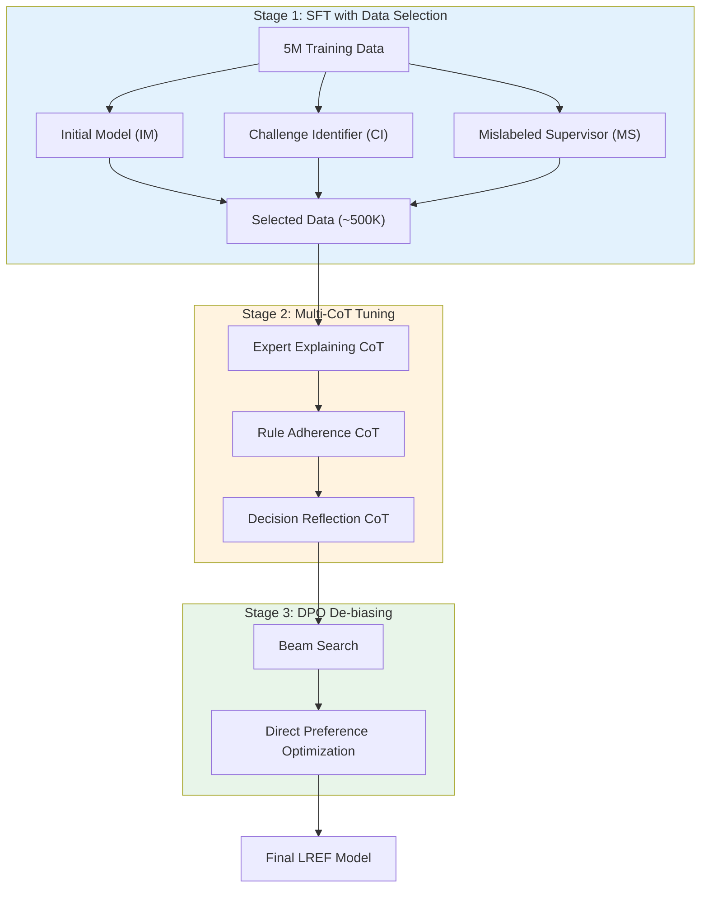

# A) 한줄 요약

**LLM을 이용한 E-commerce Query-Product Relevance 판단 프레임워크**. Data Selection + Multi-CoT + DPO 세 단계로 구성되며, 특히 DPO로 "optimistic bias" (과도한 relevant 판정) 문제를 해결함.

- 저자: Tian Tang et al.
- 출처: arXiv 2503.09223 (2025)

# B) 전체 구조



# C) 배경 지식

## C.1) E-commerce Relevance 문제

Query-Product relevance는 보통 **5단계**로 분류:

| Label | 의미 | 예시 (Query: "나이키 운동화") |
|-------|------|------------------------------|
| **Exact** | 정확히 일치 | 나이키 운동화 |
| **Significant** | 주요 속성 일치 | 나이키 러닝화 |
| **Marginal** | 일부 속성 일치 | 아디다스 운동화 |
| **Trivial** | 카테고리만 일치 | 운동화 액세서리 |
| **Irrelevant** | 무관 | 나이키 티셔츠 |

## C.2) 기존 방법의 한계

| 방법 | 문제점 |
|------|--------|
| **BERT/DeBERTa** | 제한된 world knowledge, 복잡한 reasoning 부족 |
| **LLM 직접 사용** | Data quality 민감, Optimistic bias (과도한 relevant 판정) |

# D) 기존 방법의 한계: Optimistic Bias

LLM을 relevance 판단에 직접 사용하면 **"낙관적 편향"** 발생.

**한마디로**: LLM이 "일단 관련 있다고 하자"는 식으로 **관대하게 판정**하는 경향.

## D.1) 예시

Query: `"나이키 에어맥스 270 흰색"`

| 상품 | 정답 | LLM 판정 | 문제 |
|------|------|----------|------|
| 나이키 에어맥스 270 흰색 | Exact | Exact | ✓ |
| 나이키 에어맥스 270 검정 | Significant | Significant | ✓ |
| **아디다스 운동화** | **Marginal** | **Significant** | ✗ 과대 |
| **운동화 깔창** | **Trivial** | **Significant** | ✗ 과대 |

**패턴**: 애매하면 일단 **"Significant (꽤 관련 있음)"** 으로 판정해버림.

## D.2) 왜 이런 일이 생기나?

1. **학습 데이터 분포**: Significant가 41%로 가장 많음 → "모르겠으면 Significant"
2. **LLM의 성향**: 부정적 판단보다 긍정적 판단을 선호 (helpful하려는 경향)
3. **안전한 선택**: Irrelevant라고 했다가 틀리면 큰 손해, Significant라고 하면 덜 티남

## D.3) 실제 숫자

```
LLM이 틀린 케이스 분석:
├─ 70%가 "Significant"로 잘못 분류
└─ 실제로는 Marginal, Trivial, Irrelevant여야 함
```

## D.4) 비즈니스 영향

```
Optimistic Bias → Over-recall 발생
                → 관련 없는 상품도 "관련 있음"으로 통과
                → 검색 결과에 엉뚱한 상품 노출
                → 사용자 경험 저하
```

# E) 제안 방법: LREF

## E.1) Stage 1: Data Selection

**목표**: 5M 데이터에서 고품질 ~500K 샘플 선별 (10%)

### E.1.1) 보조 모델 구성

**공통점**: 세 모델 모두 **같은 base LLM (LLaMA-2-7B)** 에서 초기화 후 각각 다르게 fine-tuning.

| 모델 | 학습 데이터 | 역할 | 선별 기준 |
|------|------------|------|----------|
| **IM (Initial Model)** | 랜덤 샘플 | 일반적 성능 기준 | IM이 틀린 샘플 = 어려운 샘플 |
| **CI (Challenge Identifier)** | 균형 샘플 (top/mid/tail 균등) | 다양한 분포 학습 | CI가 맞춘 샘플 = 학습 가능한 샘플 |
| **MS (Mislabeled Supervisor)** | GPT 생성 혼동 라벨 데이터 | 노이즈 탐지 | MS ≠ 원본 라벨 = 노이즈 의심 |

### E.1.2) CI의 데이터 구성

```
Query 빈도 기준으로 3분류:
├─ Top (고빈도 쿼리): 많이 검색되는 쿼리
├─ Middle (중빈도): 중간
└─ Long-tail (저빈도): 드물게 검색되는 쿼리

→ 세 그룹에서 균등하게 샘플링
→ Long-tail도 충분히 학습
```

### E.1.3) MS의 학습 데이터 생성

```python
# GPT에게 프롬프트
"이 query-product pair의 라벨이 'Significant'인데,
 가장 혼동될 수 있는 다른 라벨은 뭘까?"

GPT: "Marginal일 수도 있음"

→ 이런 "애매한 케이스"들로 MS 학습
→ MS가 원본 라벨과 다르게 예측하면 = 노이즈 의심
```

### E.1.4) 최종 선별 공식

$$S_{\text{selection}} = \{x \in D \mid \text{CI}(x) \text{ correct}, \text{IM}(x) \neq L(x), \text{MS}(x) = L(x)\}$$

- CI가 맞추고 (학습 가능)
- IM이 틀리고 (challenging)
- MS가 원본 라벨과 일치 (노이즈 아님)

## E.2) Stage 2: Multi-CoT Tuning

세 가지 Chain-of-Thought를 순차적으로 학습:

### E.2.1) Expert Explaining CoT (EE-CoT)

**역할**: Query-Product pair를 여러 차원에서 분석

```
분석 차원:
- Brand 일치 여부
- Category 일치 여부
- Attributes (색상, 사이즈 등)
- Keywords 매칭
```

### E.2.2) Rule Adherence CoT (RA-CoT)

**역할**: 도메인 특화 규칙 적용

```
Product Relevance: 기본 타입/기능 일치
  → "운동화" vs "운동화" = 일치

Modifier Relevance: 브랜드, 모델, 특성 일치
  → "나이키" vs "아디다스" = 불일치
```

### E.2.3) Decision Reflection CoT (DR-CoT)

**역할**: 틀린 예측에서 학습

```
입력: (query, title, 잘못된 예측, 정답)
출력: "왜 틀렸는지" 설명하는 CoT

→ 모델이 자신의 실수를 인식하고 수정하도록 학습
```

**학습 순서**:

```
(query, title, label, EE-CoT)
    ↓
(Rule, query, title, label, RA-CoT)
    ↓
(query, title, wrong_pred, label, DR-CoT)
```

## E.3) Stage 3: DPO De-biasing

### E.3.1) 문제 발견

Beam search 분석 결과:
- **80%의 과대 분류 케이스**가 beam search 2번째 위치에서 수정됨
- → 모델이 "정답을 알지만" 1순위로 선택하지 않음

### E.3.2) DPO 적용

**핵심 아이디어**: 분류 문제를 **preference alignment**로 재정의

$$\mathcal{L}_{\text{DPO}} = -\mathbb{E}_{(x, y^+, y^-)}\left[\log \sigma(f_\theta(x, y^+) - f_\theta(x, y^-))\right]$$

- $y^+$: Beam search top-k에서 정답
- $y^-$: 모델의 초기 (잘못된) 예측

**효과**: "Significant로 과대 판정" → "정확한 레이블 선호"로 학습

# F) 데이터셋

| 구분 | 규모 | 비고 |
|------|------|------|
| Training | 5M | Query-Product pairs |
| Selected | ~500K | Data Selection 후 |
| Test | 330K | Human annotated |

**Test 분포**:

| Label | 비율 |
|-------|------|
| Irrelevant | 0.95% |
| Trivial | 27.29% |
| Marginal | 18.73% |
| Significant | 41.08% |
| Exact | 11.95% |

# G) 실험 결과

## G.1) Offline 성능

| Model | Macro F1 | Weighted F1 | Accuracy |
|-------|----------|-------------|----------|
| BERT | 54.09 | 63.71 | 63.86 |
| DeBERTa | 53.25 | 64.78 | 64.78 |
| LLaMA-2-7B (base) | 44.86 | 59.63 | 62.80 |
| **LREF (Full)** | **55.90** | **66.91** | **67.08** |

Base LLM보다 **Macro F1 +11%p**, BERT 대비 **+3.2%p** 향상.

## G.2) Ablation: Data Selection

| 설정 | Macro F1 | Accuracy |
|------|----------|----------|
| Full Data (5M) | 44.86 | 62.80 |
| + IM 필터 | 46.29 | 60.10 |
| + CI 필터 | 52.81 | 63.88 |
| + MS 필터 (최종) | **53.00** | **65.74** |

**핵심 발견**: 10% 데이터로 Full data보다 **+8%p Macro F1** 향상

## G.3) Ablation: Multi-CoT

| 설정 | Macro F1 | Accuracy |
|------|----------|----------|
| w/o Multi-CoT | 53.00 | 65.74 |
| + EE-CoT | 54.30 | 64.38 |
| + RA-CoT | 55.40 | 65.25 |
| + DR-CoT (최종) | **56.21** | **66.23** |

각 CoT가 누적적으로 기여.

## G.4) DPO 효과: Over-recall 해결

| Class | LLM Base Recall | LREF Recall |
|-------|-----------------|-------------|
| Marginal | 50.13% | **64.12%** |
| Significant (Precision) | 61.39% | **66.91%** |

- Marginal recall **+14%p** 향상
- Significant precision **+5.5%p** 향상
- → Optimistic bias 완화

## G.5) Online A/B Test (7일)

| Metric | 변화 |
|--------|------|
| UV Value | +0.023% |
| UCVR (전환율) | **+0.209%** |
| UCTR (클릭율) | +0.120% |
| Relevance Satisfaction | **+1.016%** |

# H) Implementation Details

| Parameter | Value |
|-----------|-------|
| Base LLM | LLaMA-2-7B |
| Batch size | 16 |
| Learning rate | 2e-5 |
| Max seq length | 500 |
| SFT epochs | 8 |
| DPO epochs | 2 |
| DPO α | 0.65 |
| Warmup ratio | 0.2 |
| Optimizer | AdamW |
| GPU | 8x H800 |

# I) 실무적 시사점

1. **Data Selection의 중요성**: 10% 데이터가 100%보다 나을 수 있음
2. **LLM의 Optimistic Bias**: Relevance 태스크에서 주의 필요
3. **DPO 활용**: 분류 문제도 preference alignment로 접근 가능
4. **Multi-CoT 설계**: 단계별로 다른 관점의 reasoning 유도

# J) 한계점

1. **LLM 추론 비용**: BERT 대비 inference 비용 높음
2. **도메인 의존성**: E-commerce 특화 규칙 (RA-CoT) 필요
3. **라벨 품질 의존**: MS 모델의 노이즈 탐지 성능에 의존

# K) References

- [LREF: A Novel LLM-based Relevance Framework for E-commerce Search](https://arxiv.org/abs/2503.09223) (Tang et al., 2025)
