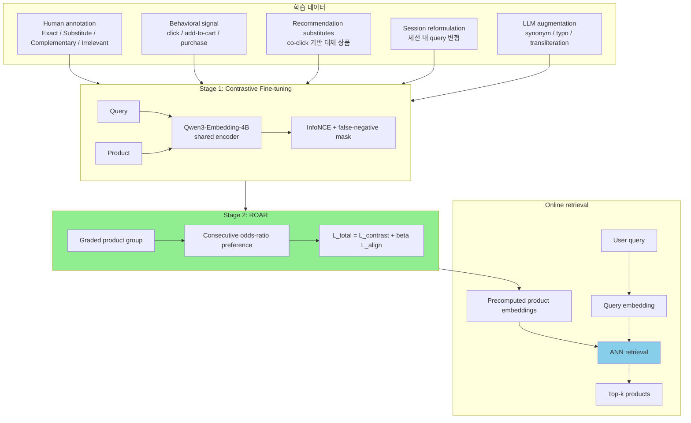

# A) 한줄 요약

Flipkart의 **Semantic Retrieval for Product Search in E-Commerce** 는 [[retrieval/dense/Qwen3 Embedding]] 기반 4B dual encoder를 상품 검색에 맞게 fine-tuning한 production 사례다. 핵심은 단순 binary relevance가 아니라 **Perfect Match > Substitute > Complementary > Irrelevant** 순서의 graded relevance를 직접 학습한다는 점이다.

- **저자**: Nikhil Kothari, Saksham Samdani, Ritam Mallick, Praveen Gupta, Ankit Vijay, Surender Kumar
- **소속**: Flipkart, India
- **연도**: 2026
- **Base model**: Qwen3-Embedding-4B
- **핵심 기법**: Contrastive fine-tuning + Relative Odds Alignment for Retrieval (ROAR)
- **논문 링크**: [arXiv 2606.01504](https://arxiv.org/abs/2606.01504)

한 문장으로 줄이면, 이 논문은 **LLM embedding model을 이커머스 first-stage retrieval에 넣을 때 exact match와 substitute를 어떻게 동시에 다룰 것인가** 에 대한 실무 레시피에 가깝다.

# B) 전체 구조



말로 풀면 구조는 단순하다. query와 product를 같은 encoder로 따로 embedding하는 [[retrieval/dense/Two-tower Model]] 계열이다. product embedding은 미리 만들어 두고, 온라인에서는 query embedding과 nearest-neighbor search로 후보를 찾는다.

다만 학습 목표가 일반적인 dual encoder보다 더 세밀하다. Stage 1에서는 query-product semantic space를 만든다. Stage 2에서는 같은 query 안에서 exact product, substitute product, complementary product, irrelevant product의 순서를 직접 맞춘다.

# C) 배경 지식

## C.1) 상품 검색은 왜 일반 검색보다 어렵나

상품 검색 query는 짧고 지저분하다. 사용자는 "iphne 13", "black nike shoe", "munch", "sofa cover"처럼 오타, 구어체, 브랜드명, 기능 intent를 섞어서 입력한다. 반면 상품 title은 seller가 작성한 정식 명칭이고, category, brand, color, model 같은 세부 속성이 촘촘하게 붙어 있다.

그래서 이커머스 retrieval은 단순 semantic similarity만으로 부족하다.

예를 들어 `Nandini Milk`라는 query가 있을 때 좋은 순서는 다음에 가깝다.

1. Nandini milk exact product
2. 다른 브랜드의 milk
3. Nandini 브랜드의 다른 product
4. milk 기반의 complementary product
5. 완전히 무관한 product

이 순서를 모두 positive로 뭉개면 exact intent가 흐려진다. 반대로 substitute를 negative로 처리하면 사용자가 받아들일 수 있는 대체 상품을 못 찾는다.

## C.2) ESCI relevance

논문은 Amazon Shopping Queries Dataset의 ESCI taxonomy와 비슷한 relevance 구분을 사용한다.

| Label | 의미 | 검색 관점 |
|---|---|---|
| Exact Match | query intent와 정확히 맞는 상품 | 최우선 노출 |
| Substitute | 같은 목적을 만족할 수 있는 대체 상품 | exact 다음 후보 |
| Complementary | 함께 쓰거나 연관된 상품 | 보조적 후보 |
| Irrelevant | 의도와 무관한 상품 | 제거 대상 |

여기서 중요한 점은 Substitute가 무조건 나쁜 결과가 아니라는 것이다. 이커머스 검색에서는 exact가 없거나 품절일 수 있고, 사용자가 브랜드를 강하게 고집하지 않는 경우도 많다. 따라서 retrieval model은 substitute를 찾되, exact보다 위에 올리면 안 된다.

# D) 제안 방법

## D.1) 모델 아키텍처

모델은 query tower와 product tower가 같은 Qwen3-Embedding-4B backbone을 공유하는 Siamese dual encoder다. decoder-only embedding model을 encoder처럼 사용하고, sequence embedding은 마지막 토큰의 hidden state를 pooling해서 만든다.

학습은 [[machine_learning/generative_ai/LLM/LoRA]]로 수행한다.

| 항목 | 설정 |
|---|---|
| Backbone | Qwen3-Embedding-4B |
| Fine-tuning | LoRA |
| LoRA rank | 32 |
| LoRA alpha | 64 |
| Dropout | 0.1 |
| Pooling | last-token pooling |
| Deployment embedding dim | 256D |

논문은 Matryoshka Representation Learning도 사용한다. 큰 embedding을 학습하되, 배포 시에는 256D subspace를 쓸 수 있게 만드는 방식이다. 그래서 2560D variant보다 약간 낮은 MAP/NDCG를 감수하고, 실제 배포는 256D로 선택한다.

## D.2) Stage 1: Contrastive Fine-tuning

Stage 1은 [[retrieval/concepts/InfoNCE]] 계열 objective로 query와 product를 같은 embedding space에 놓는다. 학습 데이터는 약 7M query-product pair다.

상품 검색에서 어려운 점은 in-batch negative가 진짜 negative가 아닐 수 있다는 것이다. 예를 들어 같은 batch 안에 색상만 다른 상품, 사이즈만 다른 상품, 또는 같은 query에 대해 acceptable substitute가 들어올 수 있다. 이를 그대로 negative로 밀어내면 모델이 상품 검색에서 필요한 유연성을 잃는다.

논문은 false-negative margin mask를 둔다.

$$
m_{ij} = 1[\cos(q_i, d_j) \le \cos(q_i, d_i) + \delta]
$$

여기서:
- $q_i$: query embedding
- $d_i$: labeled positive product embedding
- $d_j$: in-batch product embedding
- $\delta$: margin, 논문에서는 0.1

직관적으로는 labeled positive보다 너무 비슷하게 보이는 in-batch product를 negative denominator에서 제외한다. 완벽한 방법은 아니지만, near-duplicate와 substitute가 많은 상품 검색에서는 꽤 실용적인 방어막이다.

## D.3) Stage 2: ROAR

Stage 2의 핵심은 **Relative Odds Alignment for Retrieval (ROAR)** 이다. 이는 graded relevance group을 그대로 학습하기 위한 preference optimization objective다.

각 query에 대해 relevance 순서가 있는 product group을 만든다.

$$
p_{i,1} \succ p_{i,2} \succ \cdots \succ p_{i,g_i}
$$

예를 들면 다음과 같다.

```python
Perfect Match > Substitute > Complementary > Irrelevant
```

모델은 query $q_i$가 product $p_j$를 선택할 확률을 row-wise softmax로 계산한다.

$$
P_\theta(p_j | q_i) = \text{softmax}(S_i / \tau_a)_j
$$

그다음 확률을 odds로 바꾼다.

$$
\text{odds}_\theta(p_j | q_i) = \frac{P_\theta(p_j | q_i)}{1 - P_\theta(p_j | q_i)}
$$

상위 grade product와 바로 아래 grade product의 log odds ratio를 계산한다.

$$
\Delta^{OR}_{i,k} =
\log
\frac{\text{odds}_\theta(p^+_{i,k} | q_i)}
{\text{odds}_\theta(p^-_{i,k} | q_i)}
$$

alignment loss는 이 odds-ratio margin이 커지도록 만든다.

$$
L_{align} =
- \frac{1}{C}
\sum_i
\sum_{k=0}^{g_i - 2}
\log \sigma(\Delta^{OR}_{i,k})
$$

최종 objective는 contrastive loss와 alignment loss를 같이 쓴다.

$$
L_{total} = L_{contrast} + \beta L_{align}
$$

이 설계의 장점은 query마다 relevance grade 수가 달라도 처리할 수 있다는 점이다. 어떤 query는 Exact와 Irrelevant만 있을 수 있고, 어떤 query는 Exact, Substitute, Complementary, Irrelevant가 모두 있을 수 있다.

# E) 데이터 구성

이 논문에서 제일 실무적인 부분은 데이터다. 모델 자체보다 **어떤 신호를 relevance supervision으로 바꾸는가** 가 더 중요해 보인다.

## E.1) 데이터 소스

| 데이터 소스 | 사용 방식 | 의미 |
|---|---|---|
| Human annotation | Exact/Substitute/Complementary/Irrelevant label | alignment stage의 고품질 supervision |
| Behavioral logs | click, add-to-cart, purchase | 대규모 weak relevance signal |
| Recommendation substitutes | co-click 기반 substitute product | text만으로 알기 어려운 대체 관계 |
| Session reformulation | 같은 session 내 query 변형 | 초기 query와 최종 engagement product 연결 |
| LLM augmentation | synonym, typo, phrasing, transliteration | long-tail query와 noise 대응 |

Recommendation substitutes를 쓰는 방식이 특히 좋다. Stage 1에서는 branded query에 대해 recommendation-derived substitute를 positive로 둔다. 이러면 functionally interchangeable product가 query 근처로 온다.

하지만 Stage 2에서는 exact product와 substitute product를 같은 positive로 보지 않는다. exact는 가장 강한 positive, recommendation-derived product는 substitute-level label로 둔다. 이 차이가 이 논문의 핵심 감각이다. **대체 상품은 retrieve해야 하지만, exact보다 앞서면 안 된다.**

## E.2) 왜 추천 신호가 retrieval에 도움이 되나

상품 이름은 일반 언어와 다르게 동작한다. 논문은 `Munch`, `Perk`, `Slurrp` 같은 예시를 든다. 일반 영어에서의 의미와 이커머스 domain에서의 의미가 완전히 다르다.

이때 textual similarity만 믿으면 모델이 일반 언어 의미에 끌려갈 수 있다. 반면 co-click이나 substitute signal은 "사용자가 실제로 같은 목적의 상품으로 비교했다"는 domain-specific semantic signal을 준다. 그래서 추천 시스템의 co-click signal을 retrieval training에 넣는 것은 꽤 자연스럽다.

# F) 실험 설정

## F.1) 학습 설정

| 단계 | 설정 |
|---|---|
| Stage 1 data | 약 7M query-product pairs |
| Stage 1 LR | 2e-5 peak, cosine schedule |
| Stage 1 temperature | 0.02 |
| False-negative margin | 0.1 |
| Stage 2 data | 약 2M graded-preference examples |
| Stage 2 LR | 5e-7 |
| Stage 2 beta | 0.1 |
| Stage 2 alignment temperature | 0.01 |
| GPU | 8 NVIDIA H200 |
| Per-device batch | 1,024 |
| Effective batch | 8,192 |

cross-device in-batch negatives를 쓰기 위해 GPU 간 query/product embedding을 all-gather한다. 대규모 batch를 쓰는 dense retrieval 학습의 전형적인 패턴이다.

## F.2) Baseline

Production baseline은 기존 Flipkart semantic retrieval 모델이다.

| 항목 | Baseline 설정 |
|---|---|
| 구조 | Siamese BERT dual encoder |
| Encoder | 6-layer transformer |
| Hidden size | 256 |
| Pooling | first `[CLS]` token |
| Loss | standard InfoNCE |
| Batch size | 약 50K |

## F.3) 평가 지표

평가는 약 25K query를 frequency tier와 business unit 기준으로 샘플링해 수행한다.

| Metric | 측정 대상 |
|---|---|
| MAP@8 | Perfect match가 top-8 앞쪽에 잘 오는가 |
| NDCG@8 | graded relevance 순서가 잘 맞는가 |
| AUC | perfect match와 non-perfect candidate를 corpus 수준에서 잘 구분하는가 |

MAP@8과 AUC는 Perfect Match만 positive로 두고, 나머지는 negative로 binarize한다. 반면 NDCG@8은 전체 relevance grade를 반영한다. 즉 MAP/AUC는 exact intent, NDCG는 relevance gradation을 보는 지표다.

# G) 실험 결과

## G.1) Ablation

| Configuration | MAP@8 | NDCG@8 | AUC |
|---|---:|---:|---:|
| Qwen3-Embedding-0.6B OOTB | 0.5454 | 0.7801 | 0.6634 |
| Stage 1 contrastive fine-tune | 0.6697 | 0.8571 | 0.7460 |
| LoRA capacity 증가 | 0.6740 | 0.8628 | 0.7669 |
| Qwen3-Embedding-4B scaling | 0.6910 | 0.8732 | 0.7936 |
| False-negative margin mask | 0.6918 | 0.8756 | 0.7972 |
| Hard negatives | 0.6968 | 0.8781 | 0.8044 |
| ROAR | 0.7083 | 0.8838 | 0.8212 |
| Recommendation/session data | 0.7131 | 0.8920 | 0.8350 |
| Data augmentation, final 256D | 0.7163 | 0.8974 | 0.8441 |

가장 큰 도약은 Stage 1 contrastive fine-tuning에서 나온다. OOTB embedding model을 그대로 쓰는 것보다, 도메인 로그와 annotation으로 semantic space를 다시 맞추는 효과가 압도적이다.

그다음으로 눈에 띄는 건 ROAR다. hard negative를 추가한 상태에서 ROAR를 얹으면 MAP@8, NDCG@8, AUC가 모두 오른다. 특히 AUC 상승폭이 크다. 이는 graded preference가 단순 exact/non-exact 구분에도 도움을 준다는 뜻으로 볼 수 있다.

## G.2) Production baseline 대비

| Model | MAP@8 | NDCG@8 | AUC |
|---|---:|---:|---:|
| Production Baseline | 0.6606 | 0.8618 | 0.7128 |
| Proposed Model 256D | 0.7163 | 0.8974 | 0.8441 |
| Proposed Model 2560D | 0.7213 | 0.8999 | 0.8430 |

2560D가 MAP@8과 NDCG@8에서는 조금 더 높지만, AUC는 256D가 근소하게 높다. 무엇보다 serving 비용을 생각하면 256D deployment가 납득된다.

## G.3) Query frequency별 결과

| Segment | Baseline MAP@8 | Proposed MAP@8 | Gain |
|---|---:|---:|---:|
| HEAD | 0.9412 | 0.9420 | +0.08 |
| TORSO HIGH | 0.9435 | 0.9628 | +1.92 |
| TORSO LOW | 0.8552 | 0.8913 | +3.60 |
| TAIL | 0.7767 | 0.8113 | +3.46 |
| ONCE ONLY | 0.4403 | 0.5257 | +8.54 |

head query는 이미 포화되어 있다. 개선은 대부분 torso-low, tail, once-only에서 나온다. 이건 LLM embedding과 augmentation이 어디에 유용한지 잘 보여준다. 자주 들어오는 query는 기존 시스템도 이미 잘 맞추지만, sparse한 query에서는 semantic generalization과 data augmentation의 효과가 커진다.

## G.4) Business unit별 결과

| Business Unit | Baseline MAP@8 | Proposed MAP@8 | Gain |
|---|---:|---:|---:|
| BGM | 0.6710 | 0.7194 | +4.84 |
| Electronics | 0.7111 | 0.7630 | +5.19 |
| Food | 0.7618 | 0.7940 | +3.22 |
| Home | 0.6603 | 0.7282 | +6.79 |
| Large | 0.4934 | 0.5330 | +3.96 |
| Lifestyle | 0.5692 | 0.6742 | +10.50 |
| Mobiles | 0.4301 | 0.5742 | +14.41 |
| Ambiguous | 0.4839 | 0.5486 | +6.46 |

Mobiles와 Lifestyle에서 개선폭이 크다. 이는 brand, specification, style attribute가 중요한 vertical일수록 LLM embedding과 graded relevance alignment가 더 유용하다는 해석과 맞는다.

## G.5) Online A/B

| Online metric | Lift over baseline |
|---|---:|
| CTR | +2.39% |
| Add-to-Cart | +4.58% |
| Orders | +2.62% |

논문에서 가장 중요한 실무 근거는 이 표다. offline MAP/NDCG 개선이 실제 click, cart, order 개선으로 이어졌다는 점에서 production relevance 논문으로서 설득력이 생긴다.

## G.6) Serving 성능

| Serving load | QPS | P50 | P99 |
|---|---:|---:|---:|
| Nominal load | 200 | 40 ms | 135 ms |
| Peak tested load | 680 | 80 ms | 236 ms |

Qwen3-4B를 NVIDIA H200의 1g.18GB MIG partition에서 bfloat16으로 서빙한다. GPU memory footprint는 약 7.5GB이고, vLLM을 사용한다. 4B embedding model도 MRL, 256D deployment, MIG partition, vLLM을 조합하면 first-stage retrieval query encoder로 쓸 수 있다는 사례다.

# H) 실무적 시사점

## H.1) Binary relevance로는 상품 검색을 설명하기 어렵다

상품 검색에서 `relevant / irrelevant`만 쓰면 exact와 substitute가 섞인다. 하지만 실제 검색 품질은 exact를 먼저 보여주고, 그 아래에 acceptable substitute를 배치하는 데서 나온다.

이 논문은 이를 loss 수준에서 다룬다. 단순히 학습 데이터에 substitute를 positive로 추가하는 것이 아니라, Stage 2에서 exact와 substitute의 상대 순서를 다시 학습한다.

## H.2) 추천 신호는 retrieval supervision이 될 수 있다

co-click 기반 substitute는 추천 시스템에서 흔히 쓰는 신호지만, 이 논문은 그것을 retrieval model 학습에 적극적으로 가져온다. 특히 seller title이나 query text만으로 알 수 없는 대체 관계를 학습하는 데 유용하다.

이는 [[retrieval/e-commerce/Multimodal Semantic Retrieval for Product Search]] 와도 연결된다. text만으로 부족한 상품 의미를 image, behavior, recommendation signal 같은 다른 modality나 interaction signal로 보완해야 한다는 흐름이다.

## H.3) Long-tail query가 LLM embedding의 좋은 타깃이다

head query는 대부분 기존 lexical/semantic stack이 이미 잘 처리한다. 반면 once-only query는 데이터가 sparse하고 표현이 다양하다. 이 논문에서 가장 큰 gain이 once-only query에서 나온 것은 꽤 자연스럽다.

따라서 production에서 LLM embedding을 넣을 때는 전체 평균만 보지 말고, head/torso/tail/once-only segment별로 따로 봐야 한다. 평균 개선이 작아 보여도 tail에서 business impact가 클 수 있다.

## H.4) 256D deployment 선택이 현실적이다

2560D embedding이 offline metric을 조금 더 높일 수 있어도, large catalog retrieval에서는 index memory, ANN latency, cache 효율이 중요하다. Matryoshka Representation Learning으로 256D를 선택한 것은 모델 논문이라기보다 production system 논문다운 결정이다.

# I) 한계점

1. **재현성이 낮다**: proprietary Flipkart 데이터, 내부 annotation guideline, label distribution, inter-annotator agreement가 공개되지 않는다.
2. **public benchmark 비교가 없다**: Amazon Shopping Queries Dataset이나 WANDS 같은 공개 상품 검색 benchmark에서 비교하지 않는다.
3. **hybrid retrieval 비교가 부족하다**: [[retrieval/sparse/BM25]], [[retrieval/sparse/SPLADE]], lexical+dense fusion과의 비교가 없다.
4. **baseline이 내부 production baseline 하나다**: strong dense baseline, cross-encoder reranking 결합, late interaction 모델과의 비교가 더 있으면 좋았을 것이다.
5. **장기 online effect는 모른다**: A/B test 기간은 3주다. catalog freshness, seller diversity, substitute 과노출 같은 장기 효과는 별도 검증이 필요하다.
6. **graded annotation 비용이 크다**: ROAR는 좋은 graded group을 전제로 한다. annotation scarce domain에서는 LLM labeling이나 weak supervision 설계가 추가로 필요하다.

# J) GRAM과 비교

[[retrieval/e-commerce/GRAM - Generative Retrieval and Alignment Model]] 과 비교하면 둘 다 이커머스 검색에서 LLM을 쓰지만 문제를 푸는 위치가 다르다.

| 논문 | 검색 방식 | LLM 사용 위치 | 핵심 문제 |
|---|---|---|---|
| GRAM | Generative retrieval | query/product code 생성 | 상품을 어떤 text identifier로 부를 것인가 |
| Semantic Retrieval for Product Search | Dense retrieval | embedding model backbone | exact/substitute/complement 순서를 어떻게 학습할 것인가 |

GRAM은 LLM이 identifier를 생성해서 inverted-index-like retrieval로 후보를 찾는다. 반면 이 논문은 dual encoder embedding space를 유지한다. 그래서 기존 ANN 기반 semantic retrieval stack에 더 자연스럽게 들어간다.

실무적으로는 두 접근이 경쟁이라기보다 보완 관계에 가깝다. GRAM은 기존 retriever가 못 찾는 후보를 추가하는 branch로, 이 논문 방식은 main semantic retriever의 relevance 품질을 올리는 방식으로 볼 수 있다.

# K) References

- [Semantic Retrieval for Product Search in E-Commerce](https://arxiv.org/abs/2606.01504)
- [PDF](https://arxiv.org/pdf/2606.01504)
- [[retrieval/dense/Qwen3 Embedding]]
- [[retrieval/e-commerce/GRAM - Generative Retrieval and Alignment Model]]
- [[retrieval/e-commerce/Multimodal Semantic Retrieval for Product Search]]
