```table-of-contents
```

# A) 핵심 요약

**Vamana**: Microsoft Research에서 개발한 **Graph-based ANN 알고리즘**. DiskANN의 핵심 인덱싱 알고리즘으로, HNSW와 달리 **Flat Graph** 구조를 사용하여 디스크 기반 검색에 최적화됨. Billion-scale 벡터 검색에서 단일 노드로 5000+ QPS, 95%+ recall 달성.

# B) 배경: Graph-based ANN

## B.1) 왜 Graph 기반인가?

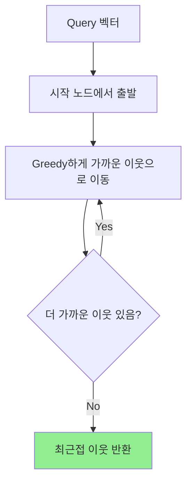

| 방식 | 예시 | 특징 |
|------|------|------|
| **Tree-based** | KD-Tree, Ball Tree | 고차원에서 성능 저하 |
| **Hash-based** | LSH | 파라미터 튜닝 어려움 |
| **Graph-based** | HNSW, NSG, Vamana | 고차원에서도 효율적 |

## B.2) 기존 알고리즘의 한계

| 알고리즘 | 한계 |
|----------|------|
| **HNSW** | 계층 구조 → 디스크 저장 시 랜덤 액세스 많음 |
| **NSG** | 메모리 기반, α 파라미터 없음 |
| **In-memory 방식** | ~10M 벡터가 한계 |

# C) Vamana 알고리즘

## C.1) 핵심 아이디어: Relative Neighborhood Graph (RNG)

### C.1.1) RNG란?

일반적인 KNN 그래프는 각 노드를 **가장 가까운 K개 이웃**에만 연결한다. 하지만 이 방식은 문제가 있다:

```python
문제: A → B → C → D 순서로 가까운 노드들이 있을 때
     KNN 그래프에서 A는 B, C에만 연결됨
     → A에서 D로 가려면 여러 홉을 거쳐야 함
     → 검색 속도 저하
```

**RNG의 해결책**: 가까운 이웃뿐 아니라 **"상대적으로 가까운" 장거리 이웃**도 연결

### C.1.2) RNG 연결 규칙

두 노드 A와 B를 연결할지 결정하는 기준:

```python
A와 B 사이에 "중간 다리" 역할을 하는 노드 C가 있는가?

- C가 A에서도 가깝고, B에서도 가깝다면 → A-B 직접 연결 불필요
- C가 없다면 → A-B 직접 연결 유지
```

**비유로 설명:**
```python
서울(A) ↔ 부산(B) 직통 연결이 필요한가?

- 대전(C)이 중간에 있고, 서울-대전, 대전-부산이 모두 가깝다면
  → 서울-부산 직통은 불필요 (대전 경유하면 됨)

- 하지만 제주도(D)는 중간 경유지가 없음
  → 서울-제주 직통 연결 필요 (장거리 연결)
```

### C.1.3) Vamana에서의 RNG 활용

Vamana는 RNG 개념을 확장하여:

1. **α 파라미터 도입**: 장거리 연결을 얼마나 유지할지 조절
   - α=1: 순수 RNG (중복 연결 적극 제거)
   - α>1: 장거리 연결 더 많이 유지 → 검색 홉 수 감소

2. **핵심 원리**:
   - 가까운 이웃: 정확한 검색 결과 보장
   - 장거리 이웃: 빠른 탐색 (적은 홉으로 목표 도달)

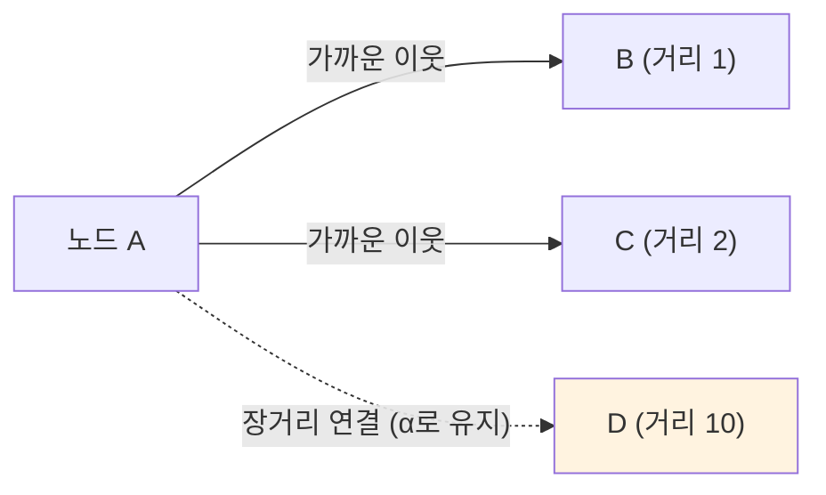

**결과**: 그래프의 **diameter(최대 홉 수)가 줄어들어** 검색 효율 향상

## C.2) 두 가지 핵심 프로시저

### C.2.1) 인덱스 구축 흐름

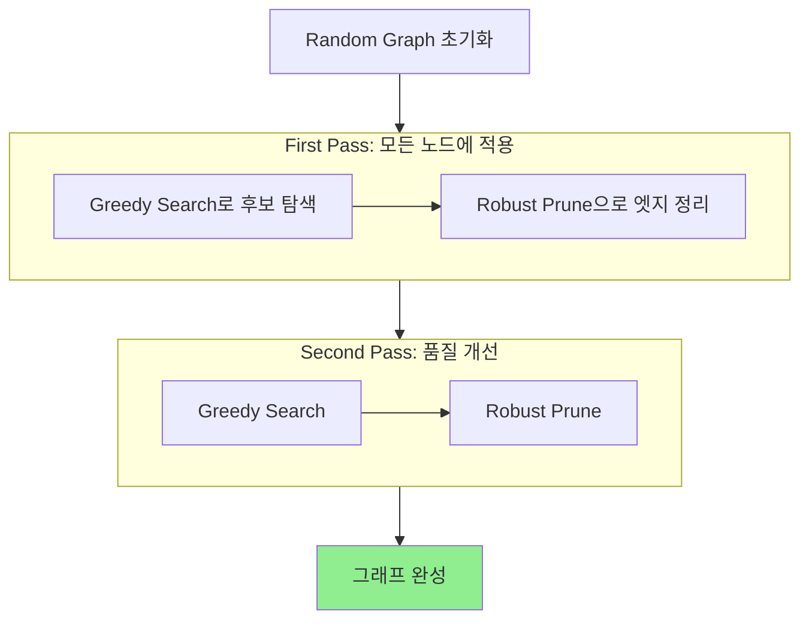

### C.2.2) 검색 흐름

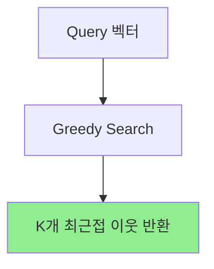

**그래프 구축 과정:**
1. **초기화**: 각 노드에 R개의 랜덤 엣지 연결
2. **첫 번째 Pass**: 모든 노드에 Greedy Search + Robust Prune 적용
3. **두 번째 Pass**: 한 번 더 반복하여 품질 개선

**검색 과정:**
- Query → Greedy Search → K개 최근접 이웃 반환

### C.2.3) Greedy Search Procedure

검색 시 사용하는 알고리즘:

```python
1. 시작 노드 s에서 출발
2. 현재 노드의 이웃들 중 query에 가장 가까운 노드로 이동
3. 후보 집합 L개 유지 (beam search)
4. 더 가까운 이웃이 없을 때까지 반복
5. 최종 k개 반환
```

### C.2.4) Robust Prune Procedure

그래프 구축 시 엣지 가지치기:

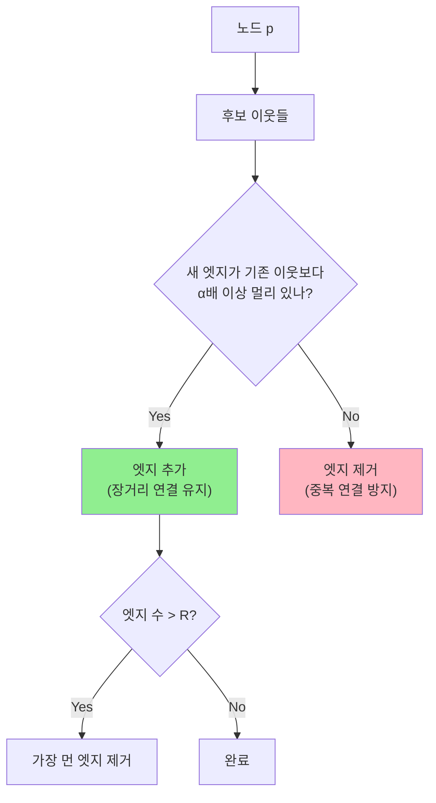

**핵심**: α 파라미터가 장거리 연결 유지를 제어

## C.3) Α (Alpha) 파라미터

| α 값 | 효과 |
|------|------|
| **α = 1** | 순수 RNG, 엄격한 pruning → 엣지 적음, 메모리 효율 ↑ |
| **α > 1** | 느슨한 pruning → 장거리 연결 유지 → 검색 홉 ↓ |
| **α ↑↑** | 엣지 많아짐 → **메모리 ↑**, 검색 효율 ↑ |

**Trade-off**:
- α ↑ → Recall ↑, Latency ↓ (홉 감소) **BUT** 메모리 사용량 ↑
- α ↓ → 메모리 효율 ↑ **BUT** 검색 시 더 많은 홉 필요

## C.4) 주요 파라미터 정리

| 파라미터 | 의미 | 영향 | 일반적 값 |
|---------|------|------|----------|
| **R** | 노드당 최대 엣지 수 | 그래프 밀도, 메모리 | 32~128 |
| **L** | 검색 시 후보 리스트 크기 | Recall vs Latency | 50~200 |
| **α** | 장거리 연결 유지 정도 | 홉 수 vs 메모리 | 1.0~1.5 |
| **L_build** | 구축 시 후보 리스트 크기 | 인덱스 품질 vs 구축 시간 | L × 1.5~2 |

### C.4.1) R (Max Degree)

```python
R ↑: Recall ↑, 메모리 ↑, 검색 시 거리 계산 ↑
R ↓: 메모리 효율 ↑, 연결성 부족 → Recall ↓
```

### C.4.2) L (Search List Size)

```python
L ↑: Recall ↑ (더 넓게 탐색), Latency ↑
L ↓: Latency ↓, 최적 경로 놓칠 수 있음
```

### C.4.3) 튜닝 가이드

| 목표 | R | L | α |
|------|---|---|---|
| **높은 Recall** | 64–128 | 100–200 | 1.2 |
| **낮은 Latency** | 32–64 | 50–100 | 1.0 |
| **메모리 절약** | 32 | - | 1.0 |
| **균형 (권장)** | 64 | 100 | 1.2 |

## C.5) Vamana Vs HNSW Vs NSG

| 항목          | Vamana        | HNSW              | NSG       |
| ----------- | ------------- | ----------------- | --------- |
| **그래프 구조**  | Flat (단일 레이어) | Hierarchical (다층) | Flat      |
| **α 파라미터**  | 튜닝 가능         | 1 고정              | 1 고정      |
| **빌드 패스**   | 2 pass        | 1 pass            | 1 pass    |
| **초기화**     | Random graph  | Empty             | KNN graph |
| **디스크 친화성** | 높음            | 낮음                | 중간        |

**Vamana의 장점**:
1. **2 pass 빌드**: 더 높은 품질의 그래프
2. **Random graph 초기화**: Empty보다 좋은 결과
3. **Flat 구조**: 디스크 저장 시 sequential access 유리

# D) DiskANN 아키텍처

## D.1) 왜 DiskANN인가?

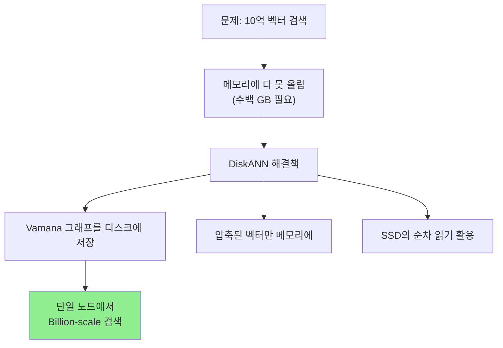

### D.1.1) 압축 벡터가 뭔가?

**문제 상황:**
```python
10억 개 × 128차원 × 4byte (float32) = 512GB
→ 메모리에 전부 올릴 수 없음
```

**DiskANN의 해결책: 2단계 검색**

| 단계 | 사용 데이터 | 위치 | 목적 |
|------|-----------|------|------|
| **1단계: Coarse 검색** | 압축된 벡터 (PQ 등) | Memory | 후보군 빠르게 좁히기 |
| **2단계: 정밀 검색** | 원본 벡터 | Disk | 정확한 거리 계산 |

**압축 벡터란?**
- **Product Quantization (PQ)** 등으로 벡터를 압축
- 128차원 float32 (512byte) → 32byte로 압축 (16배 절약)
- 거리 계산은 부정확하지만, **후보군 필터링에는 충분**

**비유:**
```python
도서관에서 책 찾기:

1단계 (메모리 - 압축 벡터):
   "컴퓨터 관련 책은 3층 A구역에 있어요" (대략적 위치)

2단계 (디스크 - 원본 벡터):
   실제로 3층 A구역 가서 정확한 책 찾기
```

**핵심 아이디어:**
- 압축 벡터로 **대부분의 후보를 빠르게 제거** (메모리에서)
- 소수의 후보만 디스크에서 원본 벡터로 **정밀 검증**
- 디스크 I/O를 최소화하면서 정확도 유지

### D.1.2) 순차 읽기 Vs 랜덤 액세스

**왜 순차 읽기가 중요한가?**

| 읽기 방식 | SSD 속도 | HDD 속도 | 특징 |
|----------|---------|---------|------|
| **Sequential Read** | 약 3GB/s | 약 150MB/s | 연속된 위치 읽기 |
| **Random Access** | 약 50MB/s | 약 1MB/s | 여기저기 점프하며 읽기 |

SSD에서도 **순차 읽기가 랜덤보다 ~60배 빠름!**

**비유:**
```python
책 읽기:
- 순차 읽기: 1페이지 → 2페이지 → 3페이지 (술술 읽힘)
- 랜덤 액세스: 1페이지 → 50페이지 → 23페이지 → 99페이지 (계속 페이지 넘겨야 함)
```

**HNSW vs Vamana 디스크 저장 비교:**

```python
HNSW (Hierarchical):
  Layer 2: [노드 A] -----> [노드 X] (파일 위치 1000)
  Layer 1: [노드 B] -----> [노드 Y] (파일 위치 50000)
  Layer 0: [노드 C] -----> [노드 Z] (파일 위치 200)

  → 레이어 이동할 때마다 디스크의 다른 위치로 점프
  → Random Access 많이 발생

Vamana (Flat):
  [노드 A의 이웃들] → 파일 위치 1000~1100 (연속)
  [노드 B의 이웃들] → 파일 위치 1100~1200 (연속)

  → 한 노드의 이웃들이 연속된 위치에 저장
  → Sequential Read 가능
```

**Vamana가 디스크에 유리한 이유:**
1. **Flat 구조**: 레이어 간 점프 없음
2. **노드별 이웃 정보 연속 저장**: 한 번 읽을 때 이웃 전체를 순차적으로 읽음
3. **예측 가능한 접근 패턴**: 다음에 읽을 위치를 미리 알 수 있음

## D.2) DiskANN 구조

| 구성 요소                    | 위치        | 용도               |
| ------------------------ | --------- | ---------------- |
| **Full Vectors + Graph** | SSD (디스크) | 정확한 검색           |
| **Compressed Vectors**   | Memory    | Coarse 검색, 거리 근사 |
| **Entry Points**         | Memory    | 검색 시작점           |

## D.3) 대용량 인덱스 구축

### D.3.1) 왜 K-means 파티셔닝이 필요한가?

**2단계 검색 (D.1.1)과 다른 문제를 해결:**

| 구분      | 2단계 검색 (D.1.1) | K-means 파티셔닝 (D.3)    |
| ------- | -------------- | --------------------- |
| **언제?** | 검색할 때          | **인덱스 만들 때**          |
| **문제**  | 디스크 I/O 최소화    | 인덱스 구축 자체가 메모리에 안 들어감 |
| **해결**  | 압축 벡터로 후보 좁히기  | 데이터를 쪼개서 각각 인덱스 생성    |

```python
문제: Vamana 그래프 구축 중에는 모든 벡터가 메모리에 있어야 함
      (이웃 찾고, 거리 계산하고, 엣지 연결해야 하니까)

      10억 × 512byte = 500GB → 메모리에 안 들어감!
```

### D.3.2) 분할-병합 과정

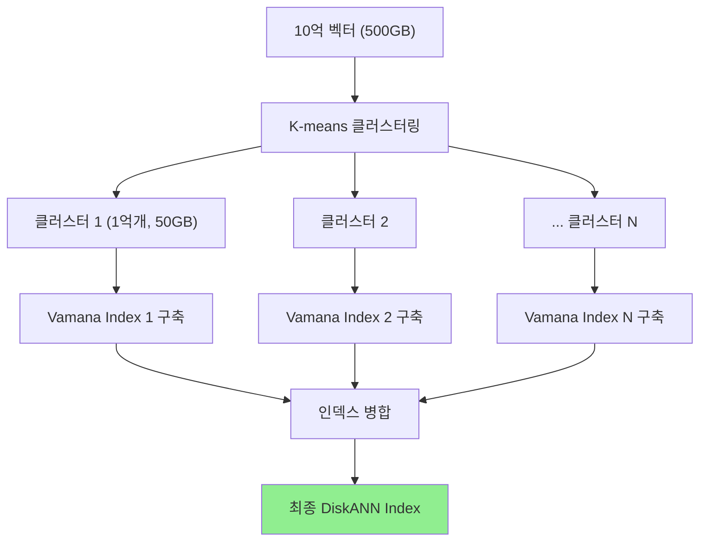

### D.3.3) 파티션 경계 연결: 중복 할당 (Overlapping Assignment)

**핵심 아이디어**: 각 벡터를 1개가 아닌 **가장 가까운 2개 클러스터**에 할당

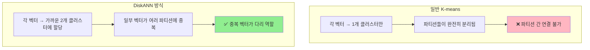

**구체적인 과정:**
```python
1. K-means로 클러스터 중심 10개 생성

2. 각 벡터를 가장 가까운 2개 클러스터에 할당
   - 벡터 A: 클러스터 1, 클러스터 2 (둘 다 소속)
   - 벡터 B: 클러스터 1만
   - 벡터 C: 클러스터 2, 클러스터 3

3. 각 파티션별로 Vamana 구축
   - 파티션 1: 벡터 A, B, ... 로 그래프 구축
   - 파티션 2: 벡터 A, C, ... 로 그래프 구축
   (벡터 A가 양쪽에 존재!)

4. 병합 시
   - 벡터 A는 파티션 1의 이웃들 + 파티션 2의 이웃들 모두 연결
   - A가 파티션 간 "다리" 역할
```

**비유:**
```python
서울-부산 고속도로 (파티션 1)
부산-광주 고속도로 (파티션 2)

부산이 "중복 노드" → 두 고속도로를 자연스럽게 연결
```

**Trade-off**: 중복 벡터가 많을수록 연결이 촘촘해지지만, 인덱스 크기 증가

## D.4) DiskANN 전체 흐름 요약

### D.4.1) 인덱스 구축 (1회성)

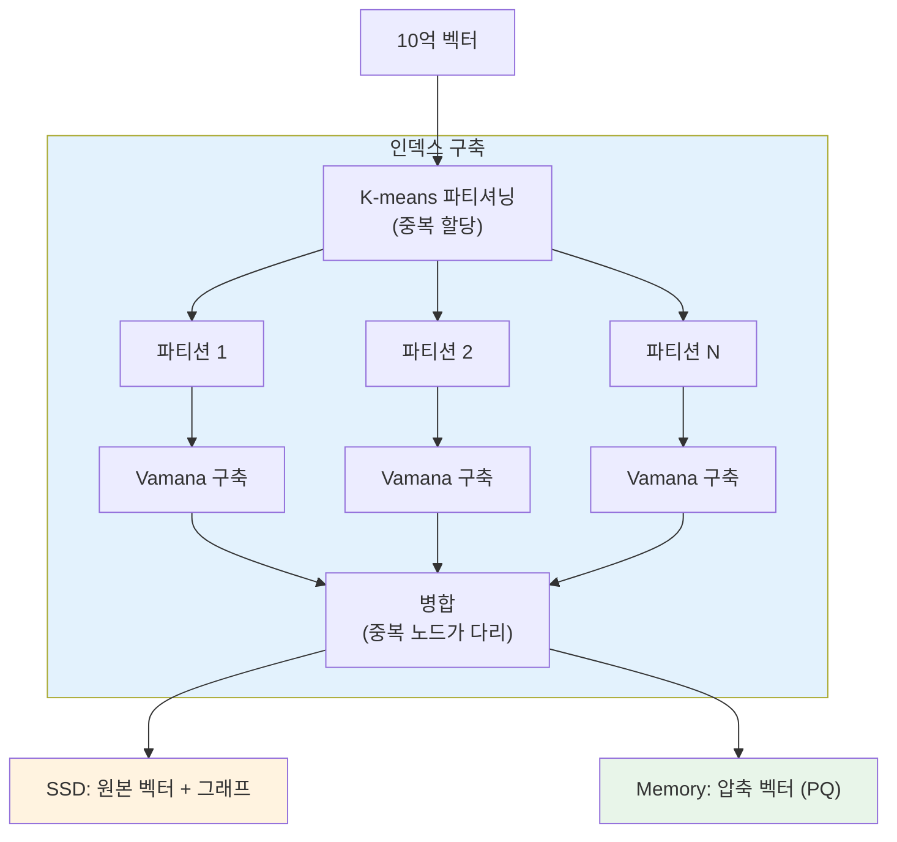

### D.4.2) 검색 (매번)

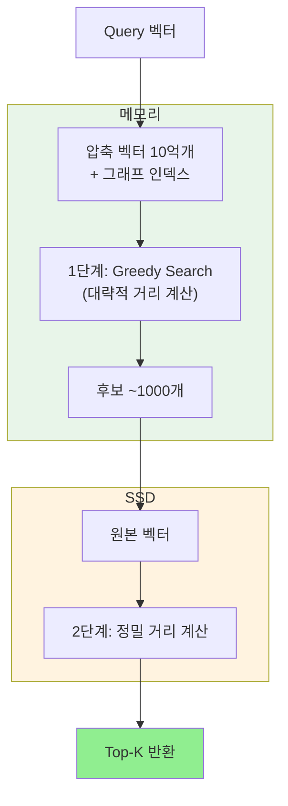

# E) 성능

## E.1) 벤치마크 (SIFT1B - 10억 벡터)

### E.1.1) SIFT1B 데이터셋 스펙

| 항목               | 값                           |
| ---------------- | --------------------------- |
| **벡터 수**         | 1,000,000,000 (10억)         |
| **차원**           | 128                         |
| **데이터 타입**       | uint8 (원본) / float32 (변환 시) |
| **원본 크기**        | ~128GB (uint8)              |
| **float32 변환 시** | ~512GB                      |

### E.1.2) 주요 벤치마크 데이터셋 비교

| 데이터셋 | 벡터 수 | 차원 | 특징 |
|----------|--------|------|------|
| **SIFT1M** | 1M | 128 | 소규모 테스트용 |
| **SIFT1B** | 1B | 128 | 대규모 벤치마크 표준 |
| **DEEP1B** | 1B | 96 | 딥러닝 임베딩 |
| **SPACEV1B** | 1B | 100 | Microsoft Bing 데이터 |
| **Text2Image** | 1B | 200 | CLIP 기반 |

> **참고**: SIFT는 이미지 local feature descriptor라서 128차원 고정. 실제 프로덕션 임베딩 (OpenAI, Cohere 등)은 **768~1536차원**이라 더 큰 메모리/디스크 필요.

### E.1.3) DiskANN 성능

| 지표             | DiskANN | FAISS (동일 메모리) |
| -------------- | ------- | -------------- |
| **QPS**        | 5000+   | ~1000          |
| **Latency**    | <3ms    | 높음             |
| **1-Recall@1** | 95%+    | ~50%           |

## E.2) 언제 Vamana/DiskANN을 쓰나?

| 상황 | 추천 |
|------|------|
| 벡터 수 < 10M, 메모리 여유 | HNSW |
| 벡터 수 > 100M, 비용 중요 | **DiskANN (Vamana)** |
| 디스크 기반 필수 | **DiskANN (Vamana)** |
| 최저 latency 필수 | HNSW (in-memory) |

# F) DiskANN 확장

## F.1) FreshDiskANN: 증분 업데이트 (2021)

원래 DiskANN은 **정적 인덱스** → 업데이트하려면 전체 재구축 필요. FreshDiskANN은 실시간 insert/delete를 지원.

### F.1.1) 작동 방식

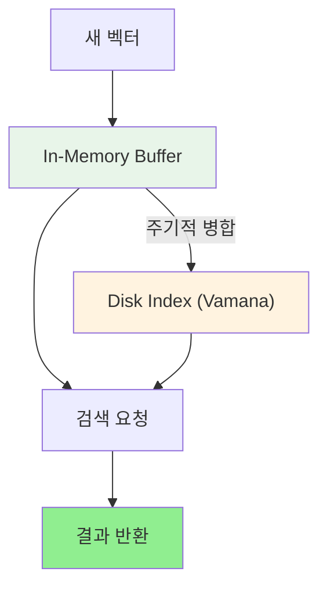

| 항목                   | 내용                                        |
| -------------------- | ----------------------------------------- |
| **In-Memory Buffer** | 신규 벡터 임시 저장, 즉시 검색 가능                     |
| **주기적 병합**           | 버퍼 → 디스크 인덱스로 통합                          |
| **성능**               | 10억 벡터에서 초당 수천 건 insert/delete + 검색 동시 처리 |
| **적용**               | Bing 검색 엔진에 실제 배포                         |

### F.1.2) 삭제 처리

| 버전                    | 방식                                |
| --------------------- | --------------------------------- |
| **FreshDiskANN**      | 삭제 표시 후 주기적 Consolidation (배치 정리) |
| **IP-DiskANN (2025)** | In-place 삭제, 배치 정리 불필요            |

## F.2) Filtered-DiskANN: 메타데이터 필터링 (2023)

"**가격 < 10만원**인 상품 중 비슷한 것" 같은 조건부 검색 지원.

### F.2.1) 일반 방식 Vs Filtered-DiskANN

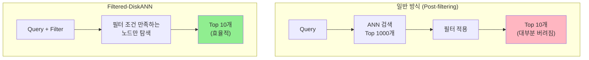

### F.2.2) 핵심 아이디어

그래프 구축 시 **벡터 유사도 + 라벨 정보** 모두 고려:

```python
일반 DiskANN:
  노드 연결 기준 = 벡터 거리만

Filtered-DiskANN:
  노드 연결 기준 = 벡터 거리 + 라벨 공유 여부
  → 같은 라벨끼리 더 잘 연결됨
  → 필터 검색 시 관련 노드만 빠르게 탐색
```

### F.2.3) 지원 필터 종류

| 필터 타입 | 예시 | 지원 |
|----------|------|------|
| **Equality** | `brand = 'Nike'` | ✅ |
| **Range** | `price < 100000` | ✅ (제한적) |
| **Multi-label** | `color IN ('red', 'blue')` | ✅ |

**제약**: 라벨 카디널리티 ~1000개 이하에서 최적

## F.3) 확장 버전 요약

| 기능          | 버전               | 출시   | 핵심              |
| ----------- | ---------------- | ---- | --------------- |
| **증분 업데이트** | FreshDiskANN     | 2021 | 메모리 버퍼 + 주기적 병합 |
| **필터링**     | Filtered-DiskANN | 2023 | 라벨 기반 그래프 구축    |
| **통합**      | Azure Cosmos DB  | -    | 둘 다 지원          |

## F.4) 오픈소스 현황

**모두 MIT 라이선스로 공개:**

| 기능 | GitHub | 비고 |
|------|--------|------|
| **DiskANN (전체)** | [microsoft/DiskANN](https://github.com/microsoft/DiskANN) | C++ |
| **Python 바인딩** | `pip install diskannpy` | 공식 래퍼 |

```python
microsoft/DiskANN
├── src/                       # 핵심 C++ 구현
├── workflows/
│   ├── dynamic_index.md       # FreshDiskANN 사용법
│   └── filtered_in_memory.md  # Filtered-DiskANN 사용법
└── python/                    # Python 바인딩
```

| 다른 구현체              | 언어      | 특징                |
| ------------------- | ------- | ----------------- |
| **Vearch**          | Go      | DiskANN 기반 분산 시스템 |
| **Azure Cosmos DB** | Managed | 완전 관리형 서비스        |

# G) HNSW Vs DiskANN 상세 비교

## G.1) 전체 비교

| 항목 | HNSW | DiskANN (Vamana) |
|------|------|------------------|
| **Latency** | ✅ < 1ms | ❌ ~3ms |
| **비용** | ❌ RAM 비쌈 | ✅ SSD = RAM의 1/10 |
| **확장성** | ❌ ~10M 한계 | ✅ 10억+ |
| **구현 복잡도** | ✅ 단순 | ❌ 복잡 |
| **생태계** | ✅ 거의 모든 VectorDB | ❌ 제한적 |
| **튜닝 난이도** | ✅ 쉬움 | ❌ 파라미터 많음 |

## G.2) 증분 업데이트 비교 (주의!)

| 연산 | HNSW | FreshDiskANN |
|------|------|--------------|
| **Insert** | ⚠️ 가능 | ✅ 지원 |
| **Delete** | ❌ 문제 있음 | ✅ 진짜 삭제 |

### G.2.1) HNSW Delete가 문제인 이유

```python
HNSW 구조:
Layer 2:  [A] -------- [B]
           |            |
Layer 1:  [A] -- [C] -- [B]
           |      |      |
Layer 0:  [A] -- [C] -- [B] -- [D] -- [E]

C를 삭제하면?
→ Layer 1에서 A-B 연결 끊김
→ 검색 시 B 영역 도달 불가
→ Recall 급락
```

### G.2.2) 실제 구현체 대응

| 라이브러리 | Delete 처리 |
|-----------|------------|
| **hnswlib** | Soft delete (표시만) |
| **FAISS HNSW** | Delete 미지원 |
| **Weaviate** | Tombstone + 주기적 재구축 |
| **Qdrant** | Soft delete + Compaction |

**결론**: HNSW도 delete 쌓이면 **주기적 재구축 필요**

## G.3) 언제 뭘 쓰나?

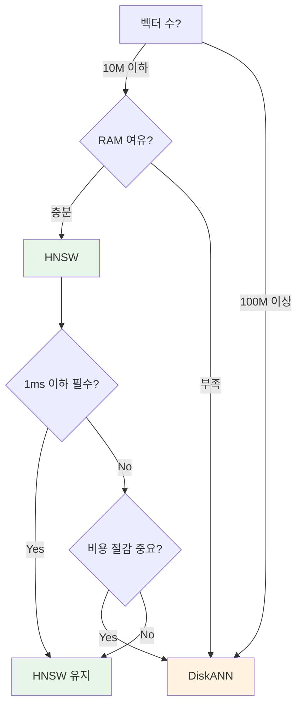

| 상황 | 추천 |
|------|------|
| 소규모 + 최저 latency | **HNSW** |
| 대규모 + 비용 효율 | **DiskANN** |
| 빠른 개발 + 레퍼런스 | **HNSW** (생태계 넓음) |
| 단일 노드로 10억 벡터 | **DiskANN** |

**비유**: HNSW = 스포츠카 (빠르지만 비쌈), DiskANN = 트럭 (느리지만 많이 실음)

# H) References

- [DiskANN 논문 (NeurIPS 2019)](https://proceedings.neurips.cc/paper/2019/file/09853c7fb1d3f8ee67a61b6bf4a7f8e6-Paper.pdf)
- [FreshDiskANN 논문 (arXiv 2021)](https://arxiv.org/abs/2105.09613)
- [Filtered-DiskANN 논문 (ACM WWW 2023)](https://dl.acm.org/doi/10.1145/3543507.3583552)
- [Microsoft DiskANN GitHub](https://github.com/microsoft/DiskANN)
- [DiskANN - Microsoft Research](https://www.microsoft.com/en-us/research/publication/diskann-fast-accurate-billion-point-nearest-neighbor-search-on-a-single-node/)
- [DiskANN and the Vamana Algorithm - Zilliz](https://zilliz.com/learn/DiskANN-and-the-Vamana-Algorithm)
- [Vamana vs. HNSW - Weaviate](https://weaviate.io/blog/ann-algorithms-vamana-vs-hnsw)
- [Azure Cosmos DB with DiskANN](https://devblogs.microsoft.com/cosmosdb/azure-cosmos-db-with-diskann-part-4-stable-vector-search-recall-with-streaming-data/)
