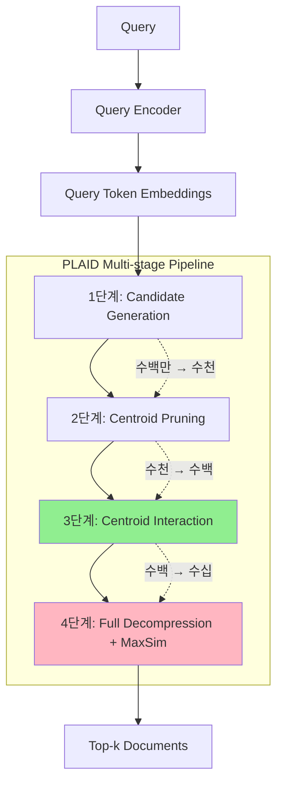

# A) 한줄 요약

ColBERTv2의 **검색 속도를 GPU 7배, CPU 45배 향상**시킨 엔진. Centroid를 활용한 다단계 필터링으로 전체 벡터 복원 비용을 최소화함.

- 저자: Keshav Santhanam et al. (Stanford)
- 베이스: ColBERTv2

# B) 전체 구조



**핵심 아이디어**: 비싼 연산(벡터 복원 + MaxSim)은 최소한의 후보에만 적용하고, 저렴한 연산(centroid 기반)으로 대부분의 후보를 빠르게 제거.

# C) 배경 지식: Late Interaction과 ColBERTv2

## C.1) Late Interaction (ColBERT)

기존 Dual Encoder([[DPR]])는 문서를 **단일 벡터**로 표현 → 정보 손실.

ColBERT는 **토큰 단위 벡터**를 유지하고, MaxSim으로 유사도 계산:

$$\text{Score}(q, d) = \sum_{i} \max_{j} \text{sim}(q_i, d_j)$$

- 각 query 토큰마다 가장 유사한 document 토큰을 찾아 합산
- 더 정밀한 매칭 가능 → 높은 품질

## C.2) ColBERTv2의 압축 방식

저장 공간 절약을 위해 **Residual Compression** 사용:

```
원본 토큰 벡터 = centroid 벡터 + residual 벡터

저장: (centroid_id, quantized_residual)
복원: lookup(centroid_id) + decompress(residual)
```

- K-means로 centroid 학습 (보통 $2^{16}$ = 65,536개)
- 각 토큰을 가장 가까운 centroid에 할당

# D) 기존 방법의 한계

ColBERTv2는 품질은 좋지만 **검색 속도가 느림**:

| 병목 지점 | 문제 |
|----------|------|
| Index Lookup | 수많은 후보 문서의 압축 벡터 로딩 |
| Decompression | residual 복원 연산 비용 |
| MaxSim | 모든 토큰 쌍에 대한 유사도 계산 |

특히 대규모 corpus에서 심각 → **실용성 문제**.

# E) 제안 방법: PLAID

## E.1) 핵심 통찰

ColBERTv2가 압축에 사용하는 **centroid 정보를 검색 가속에도 활용**하자!

각 문서를 "centroid ID들의 집합"으로 근사:
```
Document d = {token_1, token_2, ..., token_n}
           ≈ {centroid_5, centroid_128, centroid_42, ...}  (bag of centroids)
```

## E.2) Centroid Interaction

전체 벡터 복원 없이 **centroid만으로 근사 점수** 계산:

$$\text{Score}_{\text{approx}}(q, d) = \sum_{i} \max_{c \in C_d} \text{sim}(q_i, c)$$

- $C_d$: 문서 $d$에 포함된 centroid 집합
- Centroid 벡터는 메모리에 상주 (65K개 × 128dim = 약 32MB)
- **매우 빠름**: 정수 ID lookup + 작은 행렬 연산

## E.3) Centroid Pruning

Query와 관련 없는 centroid는 아예 무시:

1. Query 토큰들과 모든 centroid 간 유사도 계산
2. 점수가 낮은 centroid는 후보 문서 탐색에서 제외
3. 탐색 공간 대폭 축소

## E.4) Multi-stage Pipeline

```
Stage 1: Candidate Generation
  - Centroid-to-document inverted index로 초기 후보 선정
  - 수백만 → 수천 문서

Stage 2: Centroid Pruning
  - Query와 무관한 centroid 제거
  - 탐색 공간 축소

Stage 3: Centroid Interaction
  - Bag of centroids로 근사 점수 계산
  - 수천 → 수백 문서

Stage 4: Full Decompression + MaxSim
  - 최종 후보에만 전체 벡터 복원
  - 정확한 MaxSim 점수로 최종 랭킹
  - 수백 → Top-k
```

## E.5) Fast Kernels

C++/CUDA로 구현된 최적화 커널:

- **No padding**: 가변 길이 문서 처리 시 불필요한 패딩 제거
- **Table lookup decompression**: 압축 해제를 테이블 조회로 최적화
- **Fused operations**: 여러 연산을 하나의 커널로 통합

# F) 벤치마크

| Dataset | Passages | 특징 |
|---------|----------|------|
| MS MARCO v1 | 8.8M | 주요 벤치마크 |
| MS MARCO v2 | 140M | 대규모 확장성 테스트 |

# G) 실험 결과

## G.1) 속도 향상

MS MARCO v1 기준:

| 설정 | ColBERTv2 | PLAID | 속도 향상 |
|------|-----------|-------|----------|
| CPU | 458ms | 10ms | **45× 빠름** |
| GPU | 28ms | 4ms | **7× 빠름** |

**검색 품질(MRR@10)은 동일하게 유지**.

## G.2) 대규모 확장성

MS MARCO v2 (140M passages):

| 환경 | Latency |
|------|---------|
| GPU | 수십 ms |
| CPU | 수십~수백 ms |

→ 1억 4천만 문서에서도 실시간 검색 가능.

## G.3) Ablation: 어디서 속도가 나오나?

| 기여 요인 | CPU 속도 향상 |
|----------|--------------|
| Centroid Interaction (알고리즘) | 8.6× |
| Fast Kernels (엔지니어링) | 4.9× |
| **총합** | **~45×** |

알고리즘 개선과 시스템 최적화 모두 중요.

## G.4) 실무적 시사점

1. **Late Interaction의 실용화**: PLAID 덕분에 ColBERT 계열이 production에서 사용 가능해짐
2. **Centroid 개수 trade-off**: centroid 많을수록 압축률↑, 하지만 근사 정확도↓
3. **Hybrid 가능성**: Stage 1에서 BM25로 초기 후보 생성해도 됨

# H) References

- [PLAID: An Efficient Engine for Late Interaction Retrieval](https://arxiv.org/abs/2205.09707) (Santhanam et al., CIKM 2022)
