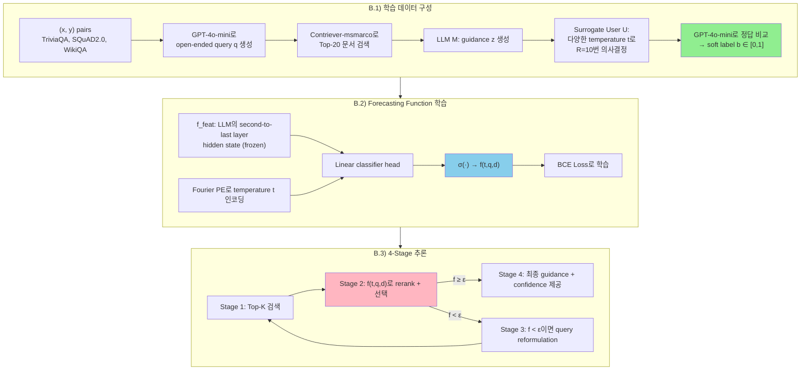
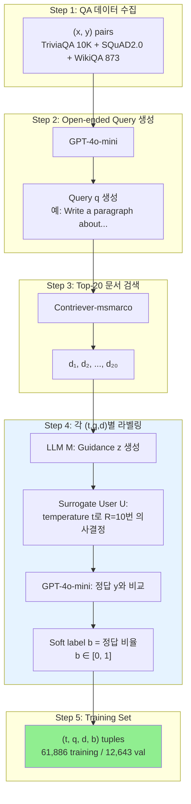

# A) 한줄 요약

RAG에서 검색된 문서로 사용자가 올바른 의사결정을 내릴 확률을 예측하는 **forecasting function** $f(t,q,d)$를 학습하여, 문서 reranking과 confidence calibration을 동시에 달성하는 프레임워크. 기존 reranker는 "relevance"를 최적화하지만, CalibRAG는 **"decision correctness"** 를 직접 최적화한다.

- 저자: Chaeyun Jang, Deukhwan Cho, Seanie Lee, Hyungi Lee, Juho Lee (KAIST)
- NeurIPS 2025 (arXiv: 2411.08891, Oct 2024)
- 같은 그룹의 후속 연구: [[papers/language_model/Verbalized Confidence Triggers Self-Verification|Verbalized Confidence Triggers Self-Verification]] (CSFT)

# B) 전체 구조



# C) 배경 지식

## C.1) Decision Calibration (Band Et Al., 2024)

**일반적인 calibration (uncertainty calibration)** 은 "모델이 80% 확신한다고 했으면, 실제로 80% 맞는가?"를 본다. 즉 모델 자체의 **정답률** 과 confidence가 일치하는지를 측정.

**Decision calibration** 은 한 단계 더 나아간다: "모델의 confidence를 보고 **사용자가 내린 의사결정** 이 올바른가?"를 본다. 핵심은 모델과 사용자 사이에 **사용자의 해석과 행동** 이 끼어있다는 것.

```
[Uncertainty calibration]
모델 답변 → 맞는가?

[Decision calibration]
모델 답변 + confidence → 사용자가 해석 → 사용자가 의사결정 → 그 결정이 맞는가?
```

예를 들어 의료 도메인에서, LLM이 "이 약을 처방하세요, confidence 90%"라고 했을 때, 의사가 그걸 보고 **실제로 처방했다면**, 그 **처방이라는 의사결정 자체가 올바른가?** 를 보는 것이 decision calibration.

사용자마다 risk tolerance가 다르기 때문에 (신중한 의사 vs 과감한 의사), 같은 confidence를 줘도 의사결정 결과가 달라질 수 있다. 그래서 CalibRAG는 사용자 특성을 temperature $t$로 모델링한다.

$$\Pr\big(y = U(x, z, f(t,q,d)) = \beta \mid f(t,q,d) = \beta\big) = \beta, \quad \forall \beta \in [0,1]$$

즉 forecasting function이 "이 문서 기반 의사결정이 맞을 확률 80%"라고 했으면, 실제로 80%가 맞아야 한다.

**기존 Band et al.의 한계**: (1) LLM 3개를 SFT 해야 함, (2) PPO 필요, (3) RAG 맥락에 직접 적용 불가.

## C.2) RAG의 Calibration 문제

| 문제 | 설명 |
|------|------|
| **Retriever-LLM 불일치** | Retriever의 similarity score ≠ downstream decision에 도움되는 정도 |
| **LLM 과신 (Overconfidence)** | 검색된 문서가 틀려도 LLM은 높은 confidence로 답변 (Figure 1c) |
| **RAG → Calibration 악화** | RAG 적용 시 accuracy는 올라가지만 ECE도 함께 증가 (Figure 1b) |
| **Top-1 최적 아님** | Top-1 → Top-9까지 확장하면 11% accuracy 개선 여지 (Figure 1a) |

**왜 중요한가?** Zhou et al. (2024) 연구에 따르면, 사용자는 LLM confidence가 높으면 틀린 답변도 그대로 수용 → 의료/법률 등 high-stakes 도메인에서 치명적.

# D) 기존 방법의 한계

1. **기존 reranker** (Cross-encoder, LLM-rerank): relevance 기준 정렬 → calibrated confidence를 제공하지 못함
2. **Verbalized confidence** (Number-LoRA, Linguistic-LoRA): LLM에게 직접 confidence를 말하게 함 → zero-shot에서 overconfidence 심함
3. **Calibration Tuning** (CT-LoRA, CT-probe): "Is the proposed answer true?" 에 Yes/No 확률을 calibration으로 사용 → top-1 문서 기반이라 문서 선택 자체는 개선 못함
4. **SelfRAG**: Retrieve/IsREL/IsSup/ISUSE 같은 special token으로 문서 유용성 판단 → utility score가 calibration에 최적화되어 있지 않음
5. **Band et al. (2024)**: 3개 LLM + PPO 필요 → 복잡하고 RAG에 직접 적용 불가

**CalibRAG의 차별점**: supervision signal이 relevance가 아니라 **correctness**, objective가 ranking이 아니라 **calibration**. 이 두 가지가 핵심 차이.

# E) 제안 방법: CalibRAG

## E.1) Forecasting Function $f(t,q,d)$

**핵심 아이디어**: query $q$와 document $d$, 그리고 사용자의 행동 특성 $t$ (temperature)만으로 "이 문서로 올바른 의사결정을 내릴 확률"을 예측.

$$f(t, q, d) := \sigma\Big(W_{\text{head}}^\top \big(f_{\text{feat}}(\text{concat}[q, d]; W_{\text{LoRA}}) + W_p \, \text{PE}(t)\big) + b_{\text{head}}\Big)$$

여기서:
- $f_{\text{feat}}$: Pre-trained LLM (`Llama-3.1-8B-Instruct`)의 **second-to-last layer의 last token hidden state** (frozen)
- $W_{\text{LoRA}}$: LoRA adapter (trainable)
- $\text{PE}(t)$: Temperature $t$의 Fourier positional encoding ($N=6$ frequency components)
- $W_p \in \mathbb{R}^{h \times 2N}$: PE projection matrix (trainable)
- $W_{\text{head}}, b_{\text{head}}$: Linear classifier head (trainable)

**왜 second-to-last layer인가?** 마지막 layer보다 second-to-last layer가 경험적으로 더 나은 calibration 성능을 보였다고 함 (Appendix B.4).

**왜 temperature $t$를 모델링하는가?** 사용자마다 risk tolerance가 다르다. 신중한 사용자 (낮은 $t$)와 탐험적 사용자 (높은 $t$)의 의사결정 패턴이 다르므로, 이를 조건부로 모델링해야 정확한 calibration 가능. Ablation (Figure 5a)에서 $t$ 없이 $f(q,d)$만 사용하면 high-temperature에서 ECE가 크게 악화됨.

## E.2) Temperature Encoding

$$\text{PE}(t) = [\sin(\omega_1 t), \cos(\omega_1 t), \ldots, \sin(\omega_N t), \cos(\omega_N t)], \quad \omega_n = 2^n \frac{2\pi}{t_{\max} - t_{\min}}$$

- $N = 6$ frequency components → $\text{PE}(t) \in \mathbb{R}^{12}$
- $t \in [1.0, 2.0]$ 범위
- 학습 시 $t \sim \text{Uniform}[1.0, 2.0]$
- 추론 시 $t \in \{1.0, 1.1, \ldots, 1.5\}$ 6개 값에 대해 marginalize

## E.3) 학습 데이터 구성 (Synthetic Supervision)



**왜 Top-20 문서를 사용하는가?**
1. **Class imbalance 방지**: Top-1만 쓰면 대부분 negative → 편향된 학습
2. **Overfitting 방지**: 같은 $q$에 다양한 $d$를 페어링 → $(q,d)$ 관계를 일반화

**Soft label의 의미**: $b = 0.7$이면 "이 (t,q,d) 조합으로 surrogate user가 10번 중 7번 맞는 의사결정을 함". Hard binary가 아니라 soft label을 쓰는 이유는 BCE loss가 **strictly proper scoring rule** 이라서, 충분한 데이터로 학습하면 $f(t,q,d)$가 true probability에 수렴하기 때문.

## E.4) Training Objective

$$\mathcal{L} = -\frac{1}{|\mathcal{S}|}\sum_{(t,q,d,b) \in \mathcal{S}} \big[b \log f(t,q,d) + (1-b) \log(1 - f(t,q,d))\big]$$

- BCE (Binary Cross Entropy) = logarithmic scoring rule = **strictly proper scoring rule**
- 이것이 CalibRAG의 calibration 보장의 이론적 근거: proper scoring rule의 unique maximizer가 true probability

**CalibRAG-multi**: Correctness distribution을 histogram bin (0-10)으로 이산화하여 multi-class 분류로 확장한 변형. 더 fine-grained calibration 가능.

## E.5) 4-Stage Inference

| Stage | 동작 | 상세 |
|-------|------|------|
| **1. Initial Retrieval** | Top-K 문서 검색 | $\mathcal{D}^* = \{d^*_i\}_{i=1}^K$ |
| **2. Scoring & Selection** | 각 문서에 $f(t, q^*, d^*_i)$ 계산 → rerank → top-1 선택 | 사용자가 $t$ 지정 (없으면 6개 값 marginalize) |
| **3. Query Reformulation** (선택) | $f(q^*, d^*) < \epsilon$이면 query 재작성 후 Stage 1 반복 | 1회만 수행, $\epsilon = 0.5$ (default) |
| **4. Final Decision** | 선택된 문서 기반 guidance $z^*$ 생성 + confidence $f(t,q^*,d^*)$ 제공 | User $U$가 $(x^*, z^*, c)$로 의사결정 |

**Stage 2에서 기존 reranker와의 차이**: Cross-encoder는 relevance score로 정렬하지만, CalibRAG는 **decision correctness probability** 로 정렬. 점수 자체가 calibrated confidence이므로 별도 calibration 불필요.

## E.6) Implementation Details

| 하이퍼파라미터 | 값 |
|---------------|-----|
| Base LLM (M, U) | `Llama-3.1-8B-Instruct` |
| Retriever | `Contriever-msmarco` / BM25 |
| Evaluator (G) | `GPT-4o-mini` |
| Learning rate | {1e-4, 1e-5} |
| Batch size | {1, 4} |
| Max steps | 10,000 |
| Optimizer | AdamW |
| Weight decay | 0.01 |
| Warmup steps | 500 |
| Scheduler | Linear |
| LoRA rank | 8 |
| LoRA alpha | 16 |
| LoRA dropout | 0.1 |
| Feature extraction | Second-to-last layer, last token |
| Fourier PE components (N) | 6 |
| Temperature range | [1.0, 2.0] |
| Inference temps | {1.0, 1.1, ..., 1.5} |
| K (retrieved docs) | 20 |
| Threshold $\epsilon$ | 0.5 |
| GPU | NVIDIA RTX 3090, RTX A6000 |

# F) 벤치마크/데이터셋

## F.1) 학습 데이터

| 데이터셋 | 유형 | 규모 |
|---------|------|------|
| TriviaQA | Trivia QA | 10,000 |
| SQuAD2.0 | Reading comprehension | Non-overlapping from SQuAD1.0 |
| WikiQA | Open-domain QA | 873 |
| **합계** | | **61,886 training / 12,643 val** |

## F.2) 평가 데이터 (All Zero-shot)

| 데이터셋 | 도메인 | 유형 |
|---------|--------|------|
| **NQ** (Natural Questions) | General | Wikipedia 기반 QA |
| **WebQA** | General | Web 문서 기반 QA |
| **HotpotQA** | General | Multi-hop reasoning QA |
| **BioASQ-Y/N** | Medical | Biomedical yes/no QA |
| **MMLU-Med** | Medical | Medical knowledge |
| **PubMedQA** | Medical | PubMed 논문 기반 QA |

# G) 실험 결과

## G.1) Calibration Baselines 비교 (Table 10, 11)

### G.1.1) NQ + Contriever (Table 11)

| Method | AUROC↑ | ACC↑ | ECE↓ | BS↓ |
|--------|--------|------|------|-----|
| CT-LoRA | 69.89 | 39.93 | 0.2800 | 0.3008 |
| CT-probe | 63.84 | 37.92 | 0.3225 | 0.3343 |
| Linguistic-LoRA | 57.05 | 41.50 | 0.4368 | 0.4252 |
| Number-LoRA | 71.16 | 35.99 | 0.1827 | 0.2214 |
| **CalibRAG** | **73.89** | **46.55** | **0.0312** | **0.2074** |
| CalibRAG-multi | 72.73 | 49.42 | 0.1656 | 0.2375 |

### G.1.2) Medical Domain - BioASQ-Y/N (Table 12)

| Method | AUROC↑ | ACC↑ | ECE↓ | BS↓ |
|--------|--------|------|------|-----|
| CT-LoRA | 65.20 | 54.31 | 0.5167 | 0.5099 |
| Number-LoRA | 52.43 | 53.72 | 0.4664 | 0.4659 |
| **CalibRAG** | **66.66** | **70.82** | **0.2414** | **0.2606** |

**실무적 시사점**:
- CalibRAG는 TriviaQA/SQuAD/WikiQA로 학습했는데 **의료 도메인 (BioASQ, MMLU-Med, PubMedQA) + 다른 retriever (MedCPT)** 에서도 일반화 → cross-domain, cross-retriever 전이 확인
- ECE에서 압도적 차이: Number-LoRA 0.18 vs CalibRAG **0.03** (NQ) → calibration이 핵심 강점

## G.2) Reranking Baselines 비교 (Table 1a)

| Method | AUROC↑ | ACC↑ | ECE↓ | BS↓ |
|--------|--------|------|------|-----|
| Cross-encoder | 60.74 | 34.98 | 0.477 | 0.477 |
| LLM-rerank | 60.57 | 38.52 | 0.248 | 0.297 |
| **CalibRAG** | **72.47** | **42.37** | **0.106** | **0.206** |

→ HotpotQA 기준. Cross-encoder 대비 ACC +7.4%, ECE **78% 감소**

## G.3) Robust RAG Baseline 비교 (Table 1b)

| Data | Method | AUROC↑ | ACC↑ | ECE↓ | BS↓ |
|------|--------|--------|------|------|-----|
| NQ | SelfRAG | 48.4 | 36.2 | 0.522 | 0.545 |
| | **CalibRAG** | **63.5** | **37.4** | **0.258** | **0.287** |
| WebQA | SelfRAG | 51.9 | 39.7 | 0.478 | 0.503 |
| | **CalibRAG** | **68.8** | **40.5** | **0.217** | **0.262** |

→ `Llama-2-7B` 기반 비교. SelfRAG의 utility score는 calibration에 최적화되지 않아 ECE가 높음.

## G.4) Ablation Studies

### G.4.1) Temperature Conditioning (Figure 5a)

| 설정 | ECE (t=1.0) | ECE (t=1.5) |
|------|------------|------------|
| $f(q,d)$ (temp 없음) | ~0.07 | ~0.28 |
| $f(t,q,d)$ (temp 있음) | ~0.05 | ~0.05 |

→ Temperature 없으면 high-temperature 사용자에서 overconfidence → ECE 급증. Temperature conditioning이 다양한 사용자 행동에 대한 robust calibration의 핵심.

### G.4.2) Retrieved Documents 수 K (Figure 5b)

- K=20까지 성능 향상, K=40 이후 포화
- 논문 기본값 K=20 사용

### G.4.3) Query Reformulation 효과 (Figure 5c)

CalibRAG†(Stage 3 포함)는 모든 retriever-dataset 조합에서 일관된 개선. 다만 추가 검색 비용 발생.

### G.4.4) Threshold $\epsilon$ 분석 (Table 4, BioASQ)

| $\epsilon$ | AUROC | ACC | ECE | BS |
|------------|-------|-----|-----|----|
| 0.0 | 71.21 | 35.03 | **0.2500** | 0.2900 |
| 0.5 | 76.50 | 35.98 | 0.2667 | **0.2779** |
| 0.6 | **77.20** | **36.50** | 0.2707 | 0.2800 |

→ $\epsilon$ 올리면 accuracy 향상 but ECE 소폭 증가. $\epsilon = 0.5$가 균형점.

### G.4.5) Verbalized Confidence 표현 방식 (Table 6, MMLU)

| 표현 방식 | ACC | ECE |
|---------|-----|-----|
| Continuous-Number (0-100) | 43.63 | 0.3190 |
| Discrete-Number (0-10) | 44.96 | 0.1605 |
| Linguistic (Doubtful/Likely/...) | **45.03** | **0.1585** |

→ LLM은 연속 숫자보다 이산 숫자나 언어적 표현으로 confidence를 더 잘 표현. CalibRAG는 이런 verbalized confidence의 한계를 우회하여 별도 forecasting function으로 calibration 달성.

### G.4.6) CalibRAG Without Reranking (Table 8, WebQA BM25)

| Method | AUROC↑ | ACC↑ | ECE↓ | BS↓ |
|--------|--------|------|------|-----|
| Number | 69.38 | 36.04 | 0.1931 | 0.2293 |
| CalibRAG w/o Rerank | **75.73** | **41.99** | **0.0780** | **0.1981** |

→ Reranking 없이 confidence만 제공해도 baseline 대비 우수 → calibration 자체의 가치 입증.

### G.4.7) Surrogate User 일치율

- LLM surrogate user와 실제 사람의 일치율: **81.33%**
- 다른 user model (Phi-4, DeepSeek-Distill)로 교체해도 CalibRAG 우위 유지 (Figure 6, 7)

## G.5) Qualitative Example (Figure 8)

**Query**: "American Sweetgum을 host plant로 사용하는 벌레는?"

| | Base Retriever | CalibRAG |
|--|---------------|----------|
| **선택 문서** | Parcoblatta divisa (cockroach) 관련 | Gypsy moth 관련 |
| **Confidence** | 10/11 (Confident) | 81.41% |
| **결과** | 오답 (cockroach) | **정답 (moth)** |

→ Base retriever는 "American Sweetgum" 키워드에만 집중, CalibRAG는 "host plant"까지 고려한 문맥 이해.

# H) 핵심 인사이트

## H.1) 왜 $f(t,q,d)$만으로 가능한가?

$q$는 task $x$에서 파생, $d$는 retriever가 $q$에 대해 선택, guidance $z$는 $M(q,d)$로 결정. 따라서 $(q,d)$쌍이 downstream decision에 필요한 정보를 **간접적으로** 포함. LLM의 hidden state가 이를 충분히 인코딩할 수 있다.

## H.2) Reranker vs CalibRAG: 근본적 차이

| | 기존 Reranker | CalibRAG |
|--|-------------|----------|
| **Supervision signal** | Relevance (query-document 유사도) | **Correctness** (의사결정 정답 여부) |
| **Objective** | Ranking (MRR, NDCG) | **Calibration** (ECE, BS) |
| **출력** | Relevance score (calibrated 아님) | **Calibrated probability** |

## H.3) 실무적 시사점

| 시사점                          | 설명                                                                      |
| ---------------------------- | ----------------------------------------------------------------------- |
| **Top-1 맹신 금지**              | Retriever의 top-1이 최선이 아닐 수 있음 (11% 개선 여지)                               |
| **RAG ≠ 신뢰성**                | RAG가 accuracy를 올려도 calibration을 망칠 수 있음                                 |
| **경량 forecasting function**  | LLM hidden state + LoRA + linear head로 충분. Cross-encoder보다 효율적이면서 성능 우수 |
| **Threshold 기반 fallback**    | 확신 없는 문서는 query reformulation으로 재시도                                     |
| **Temperature conditioning** | 사용자 행동 다양성을 모델링해야 robust calibration 가능                                 |

# I) 한계점

- Synthetic data 생성 + forecasting function 학습에 **overhead** 발생 (GPT-4o-mini 호출 비용)
- LLM surrogate user가 실제 사람을 완벽히 대체하지 못함 (일치율 81%)
- Forecasting function이 **학습 시 사용한 LLM $M$에 의존** — 다른 LLM으로 교체 시 약간의 성능 저하 (Mistral-7B 실험)
- $\epsilon$ 올리면 accuracy↑ but ECE도 소폭↑ → accuracy-calibration trade-off 존재

# J) CSFT와의 관계

같은 KAIST Juho Lee 그룹의 연구. CalibRAG (2024 Oct) → CSFT (2025 Jun) 순서.

| | CalibRAG | [[papers/language_model/Verbalized Confidence Triggers Self-Verification|CSFT]] |
|--|----------|------|
| **목표** | RAG 파이프라인의 decision calibration | CoT reasoning의 verbalized confidence |
| **방법** | 별도 forecasting function 학습 | Confidence 토큰에만 masked CE loss |
| **Confidence 소스** | 외부 모델 $f(t,q,d)$ | 모델 자체의 verbalized output |
| **Emergent behavior** | 없음 (명시적 학습) | Self-verification (비명시적) |
| **공통점** | Self-consistency 기반 label, LoRA, calibration 중심 |

# K) References

- [arXiv:2411.08891](https://arxiv.org/abs/2411.08891)
- Band et al. (2024) - "Linguistic Calibration of Long-Form Generations", ICML 2024
- Zhou et al. (2024) - "Relying on the Unreliable" - Human over-reliance on LLM outputs
