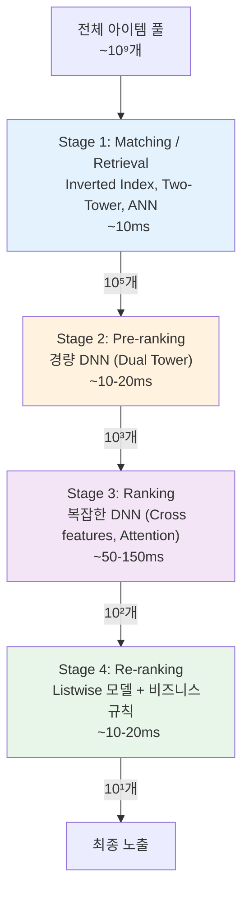
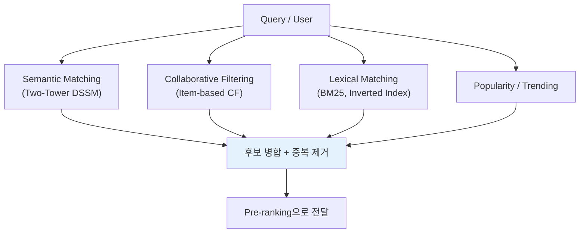
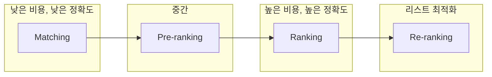
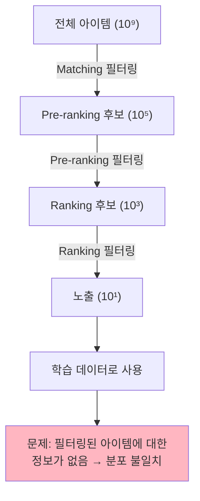

# A) Cascade Ranking System

대규모 검색/추천 시스템에서 사용하는 **단계적 필터링 구조**. 수십억 개의 아이템을 한 번에 정밀하게 평가하는 것은 계산적으로 불가능하므로, 여러 단계를 거치며 **점점 복잡한 모델** 로 후보를 줄여나간다.

Wang et al. (SIGIR 2011)이 IR 분야에서 처음 형식화했고, Google의 [[Deep Neural Networks for YouTube Recommendations|YouTube Recommendations (2016)]] 논문이 딥러닝 기반 2-stage 구조를 산업계에 정착시켰다. 이후 Alibaba의 COLD (2020) 등을 통해 4-stage 구조로 확장되었다.

# B) 전체 구조

**핵심 원리**: 뒤로 갈수록 모델은 복잡해지고, 처리할 아이템 수는 줄어든다. 각 단계가 latency 예산 내에서 후보를 줄여주기 때문에, 최종 단계에서 비싼 모델을 사용할 수 있다.

**전체 latency 목표**: 보통 200ms 이내 (사용자 체감 응답 시간).

# C) 각 단계 상세

## C.1) Stage 1: Matching (Retrieval / Candidate Generation)

| 항목 | 내용 |
|------|------|
| **입출력** | 10⁹ → 10⁵ (수천~수만) |
| **Latency** | ~10-20ms |
| **핵심 목표** | **Recall 극대화** — 좋은 아이템을 놓치지 않기 |
| **모델** | Two-Tower (DSSM), ANN Index (HNSW, IVF), CF, BM25 |
| **특징** | Item embedding 오프라인 사전 계산, 온라인에서는 query embedding만 계산 |

**Multi-channel Matching**: 실제 시스템에서는 여러 retrieval 채널을 병렬로 운영한다:

## C.2) Stage 2: Pre-ranking (Lightweight Scoring)

| 항목 | 내용 |
|------|------|
| **입출력** | 10⁵ → 10³ |
| **Latency** | ~10-20ms |
| **핵심 목표** | **고품질 후보 집합 확보** (Set Quality) |
| **모델** | Enhanced Two-Tower, COLD, IntTower, RankTower |
| **특징** | Cross features 제한적 사용, 비용-성능 trade-off가 핵심 |

**핵심 제약**: 수만 개의 아이템을 10-20ms 내에 스코어링해야 하므로 모델 복잡도에 제한이 있다. Alibaba의 COLD 시스템은 **computing cost를 명시적 최적화 변수** 로 도입하여 이 문제를 해결했다.

Pre-ranking의 역할에 대한 재정의는 [[Seesaw Effect]] 참고 — ranking을 맹목적으로 따라하면 오히려 성과가 떨어진다.

## C.3) Stage 3: Ranking (Main Scoring)

| 항목 | 내용 |
|------|------|
| **입출력** | 10³ → 10² |
| **Latency** | ~50-150ms |
| **핵심 목표** | **정확한 순위 예측** (CTR, CVR, engagement) |
| **모델** | Wide & Deep, DeepFM, DCN-V2, DIN, DIEN, MMoE |
| **특징** | Rich feature interaction, Cross features, Attention over user history |

Cascade 시스템에서 **가장 무거운 모델** 이 위치하는 단계. 후보 수가 충분히 줄어들었기 때문에 비싼 연산이 가능하다.

**주요 모델 계보**:

| 모델 | 출처 | 핵심 아이디어 |
|------|------|-------------|
| **Wide & Deep** | Google 2016 | Memorization(wide) + Generalization(deep) |
| **DeepFM** | Huawei 2017 | FM으로 wide 대체, 자동 feature crossing |
| **DCN / DCN-V2** | Google 2017/2021 | Explicit cross-network for feature interaction |
| **DIN** | Alibaba 2018 | Target item 기반 user history attention |
| **DIEN** | Alibaba 2019 | GRU 기반 user interest 진화 모델링 |
| **MMoE** | Google 2018 | Multi-gate Mixture-of-Experts for multi-task |

**Multi-task Learning**: 실제 시스템에서는 CTR, CVR, watch time, likes 등 여러 목표를 동시에 예측하는 것이 일반적이다.

## C.4) Stage 4: Re-ranking (Post-Processing)

| 항목 | 내용 |
|------|------|
| **입출력** | 10² → 10¹ (최종 노출 리스트) |
| **Latency** | ~10-20ms |
| **핵심 목표** | **리스트 수준 최적화** (다양성, 공정성, 비즈니스 규칙) |
| **모델** | PRM, Transformer-based listwise, 규칙 기반 필터 |
| **특징** | 아이템 간 관계 고려 (inter-item interaction) |

앞선 단계들이 각 아이템을 **독립적으로(point-wise)** 평가했다면, re-ranking은 **리스트 전체를 고려(listwise)** 한다:
- 다양성 주입 ([[Maximal Marginal Relevance|MMR]] 등)
- 중복 제거
- 광고 혼합
- 비즈니스 정책 적용 (성인 콘텐츠 필터링, 판매자 공정성 등)

자세한 내용: [[Re-ranking]]

# D) 설계 원칙

## D.1) 핵심 Trade-off: 정확도 vs 비용

| 단계 | 후보 수 | 모델 복잡도 | 평가 방식 | 핵심 지표 |
|------|---------|-----------|----------|----------|
| Matching | 10⁹ → 10⁵ | 낮음 | Point-wise | Recall |
| Pre-ranking | 10⁵ → 10³ | 중-저 | Point-wise | Set Quality (ASH@k) |
| Ranking | 10³ → 10² | 높음 | Point-wise | AUC, NDCG |
| Re-ranking | 10² → 10¹ | 중 | Listwise | 다양성, 비즈니스 KPI |

## D.2) Two-Tower의 효율성

Matching과 Pre-ranking에서 Two-Tower (Dual Encoder)를 사용하는 이유:

- **Single-Tower**: 모든 후보에 대해 모델 전체를 실행 → $O(k \cdot N)$ (k: 후보 수, N: 모델 추론 비용)
- **Two-Tower**: Item embedding 사전 계산 + vector search → $O(N + k \cdot M)$ (M: dot product 비용, $M \ll N$)

Item embedding을 **오프라인으로 미리 계산** 해두면 온라인에서는 query embedding 계산(1회) + dot product(k회)만 필요하다.

## D.3) 각 단계의 독립적 최적화

Cascade 시스템의 실용적 장점:
- 각 단계를 **독립적으로** 개발, 디버그, 배포 가능
- 팀별 분업이 용이 (Retrieval 팀, Ranking 팀 등)
- 단계별 A/B 테스트와 롤백이 가능
- 모니터링과 장애 격리가 쉬움

# E) 산업 적용 사례

## E.1) YouTube (Google)

| 단계 | 구현 |
|------|------|
| Candidate Generation | User history → DNN → 수백 개 비디오 선별 |
| Ranking | Rich features + multi-task (MMoE) → CTR/engagement 예측 |

특이점: Watch time을 목표로 사용 (CTR 대신). 2019년 후속 논문에서 bias 제거를 위한 **shallow tower** 도입.

## E.2) Alibaba (Taobao)

| 단계 | 구현 |
|------|------|
| Matching | Multi-channel (CF + semantic DSSM + popularity) |
| Pre-ranking | COLD → ASMOL (Set Quality 우선 최적화) |
| Ranking | DIN/DIEN attention 기반 CTR 예측 |
| Re-ranking | 비즈니스 로직, 다양성, 광고 혼합 |

가장 잘 문서화된 cascade 시스템. Pre-ranking의 [[Seesaw Effect]]를 발견하고 ASMOL로 해결.

## E.3) Meta (Instagram)

| 단계 | 구현 |
|------|------|
| First Pass | 경량 Two-Tower로 수천 개 후보 스코어링 |
| Second Pass | Heavy model로 ~100개 정밀 스코어링 |

Instagram Explore에서 **1000개 이상의 ML 모델**을 운영하면서도 품질과 안정성을 유지.

## E.4) Pinterest

| 단계 | 구현 |
|------|------|
| Retrieval | Multi-channel learned retrieval |
| Pre-ranking | Lightweight Scoring (LWS) |
| Ranking | Wide & Deep + TransAct V2 (user sequence features) |
| Blending | Organic + 광고 콘텐츠 최종 조합 |

# F) 알려진 문제점

## F.1) Sample Selection Bias (SSB)

가장 근본적인 문제. 각 단계의 모델은 **이전 단계에서 필터링된 데이터** 로만 학습한다:

- Ranking 모델은 retrieval을 통과한 아이템만 본다
- 학습 데이터(노출 아이템)와 추론 데이터(전체 후보)의 분포가 다르다
- 이 편향은 단계를 거칠수록 **누적 및 증폭**된다

## F.2) 정보 손실 (Information Loss)

각 단계의 필터링 결정은 **되돌릴 수 없다**. 어떤 단계에서든 잘못 탈락된 좋은 아이템은 영영 사라진다. 특히 Matching 단계는 가장 부정확하면서도 가장 많은 아이템을 결정하기 때문에 **가장 치명적인 정보 손실** 이 발생한다.

## F.3) 단계 간 목표 불일치 (Objective Misalignment)

각 단계가 독립적으로 학습되므로:
- Matching이 최적화하는 것(recall)과 Ranking이 필요로 하는 것(precision)이 다르다
- 이 "semantic gap"이 전체 시스템 성능을 저하시킨다
- [[Seesaw Effect]]는 이 불일치의 대표적 사례

## F.4) Position Bias와 Feedback Loop

사용자 피드백은 **노출 위치에 영향**받고, 노출 위치는 현재 시스템이 결정한다. 이 편향된 피드백으로 학습하면 기존 편향이 강화되는 악순환이 발생한다.

# G) 최근 연구 동향

## G.1) 단계 간 Joint Optimization

독립적 학습의 한계를 극복하기 위한 연구:

| 논문 | 년도 | 핵심 아이디어 |
|------|------|-------------|
| **RankFlow** | SIGIR 2022 | 이전 단계에서 학습 데이터를, 이후 단계에서 guidance signal을 받는 joint training |
| **FS-LTR** | WWW 2024 | 각 단계가 full-stage 샘플로 학습 (필터링된 부분집합이 아닌 전체) |
| **LCRON** | 2025 | Cascade 전체를 하나의 네트워크로 end-to-end 학습 |

## G.2) Generative Recommendation (Cascade 대체 시도)

Cascade 구조를 **단일 생성 모델**로 대체하려는 시도:
- Retrieval, ranking, reasoning을 하나의 transformer backbone으로 통합
- 아직 production 규모에서의 검증은 제한적

## G.3) Personalized Stage Boundaries

고정된 cutoff(ex: 항상 1000개 통과) 대신 **사용자별 적응적 truncation** 적용 (Meta, KDD 2024). 계산 예산을 사용자 특성에 따라 동적 할당하여 효율 개선.

## G.4) 현재 컨센서스

End-to-end 대안 연구에도 불구하고, Cascade 구조는 2025-2026년 현재 **산업계의 지배적 패러다임** 으로 유지된다. 실용적 이유: 독립적 개발/배포, 계산 제약, 운영 안정성. 최근 추세는 cascade를 완전히 제거하기보다 **단계 간 cross-stage awareness를 추가하는 하이브리드 접근**이다.

# H) References

- [A Cascade Ranking Model for Efficient Ranked Retrieval - Wang et al. SIGIR 2011](https://dl.acm.org/doi/10.1145/2009916.2009934)
- [Deep Neural Networks for YouTube Recommendations - RecSys 2016](https://dl.acm.org/doi/10.1145/2959100.2959190)
- [COLD: Towards the Next Generation of Pre-Ranking System - Alibaba 2020](https://arxiv.org/abs/2007.16122)
- [Cascade Ranking for Operational E-commerce Search - KDD 2017](https://www.kdd.org/kdd2017/papers/view/cascade-ranking-for-operational-e-commerce-search)
- [RankFlow: Joint Optimization of Multi-Stage Cascade Ranking - SIGIR 2022](https://dl.acm.org/doi/10.1145/3477495.3532050)
- [Full Stage Learning to Rank - WWW 2024](https://dl.acm.org/doi/10.1145/3589334.3645523)
- [Learning Cascade Ranking as One Network (LCRON) - 2025](https://arxiv.org/abs/2503.09492)
- [Scaling the Instagram Explore Recommendations System - Meta 2023](https://engineering.fb.com/2023/08/09/ml-applications/scaling-instagram-explore-recommendations-system/)
- [Modernizing Home Feed Pre-Ranking Stage - Pinterest](https://medium.com/pinterest-engineering/modernizing-home-feed-pre-ranking-stage-e636c9cdc36b)
