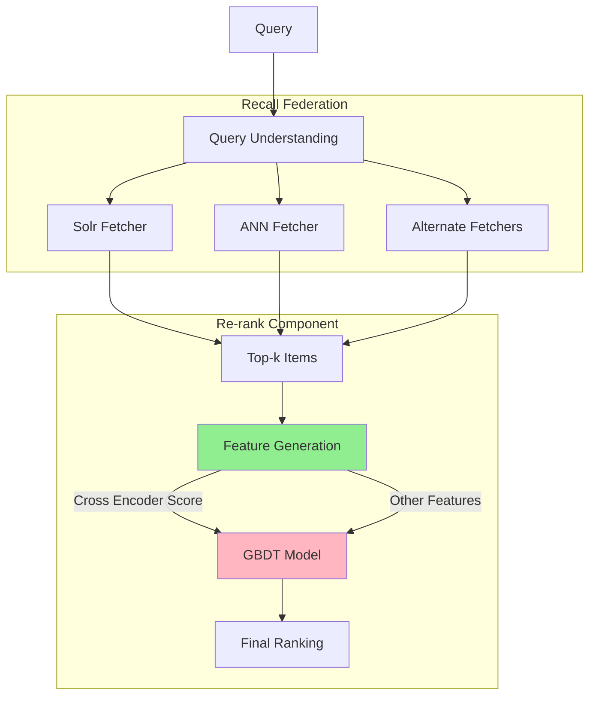
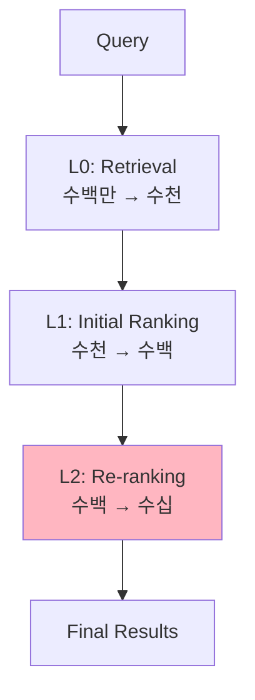
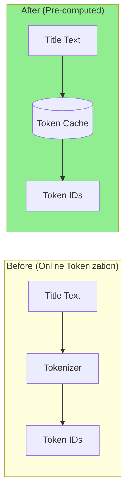
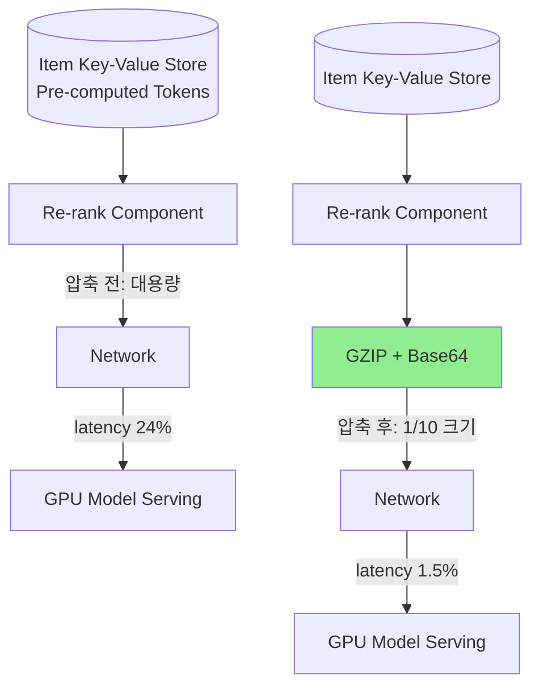

# A) 한줄 요약

**Cross Encoder 기반 BERT 모델을 Walmart 검색 Re-ranking에 대규모 배포**하여 latency 문제를 해결하고 NDCG@5 +4.79% 향상 달성.

- **저자**: Walmart Global Tech (2025)
- **베이스 모델**: BERT-base uncased (12-layer)
- **핵심 기여**: Cross Encoder의 높은 latency 문제를 여러 최적화 기법으로 해결하여 production 배포 성공

# B) 전체 구조

## B.1) 파이프라인

> ⚠️ Cross Encoder는 **최종 ranker가 아니라 GBDT의 feature 중 하나**로 사용됨



**핵심 포인트**:
- Cross Encoder 점수는 **Feature Generation**에서 계산되는 여러 feature 중 하나
- 최종 ranking은 **GBDT (Gradient Boosted Decision Tree)** 가 수행
- Cross Encoder 외에도 BM25, engagement features 등이 GBDT에 입력됨

## B.2) Cross Encoder vs Dual Encoder

| 구분 | Dual Encoder (Two-Tower) | Cross Encoder (Single-Tower) |
|------|-------------------------|------------------------------|
| **구조** | Query/Item 각각 인코딩 후 유사도 계산 | Query+Item 연결하여 함께 인코딩 |
| **입력** | `[CLS] query [SEP]` / `[CLS] item [SEP]` | `[CLS] query [SEP] item [SEP]` |
| **상호작용** | 마지막에 dot product만 | 모든 layer에서 attention |
| **장점** | Item 임베딩 사전 계산 가능 → 빠름 | Query-Item 간 깊은 상호작용 → 정확 |
| **단점** | 상호작용 제한 → 일반화 약함 | 실시간 계산 필요 → 느림 |
| **용도** | Retrieval (대규모 후보군) | Re-ranking (소규모 후보군) |

**왜 Cross Encoder가 더 잘 일반화하는가?**

```
Dual Encoder:
  Query embedding ────┐
                      ├─→ dot product → score
  Item embedding  ────┘

  → Query와 Item이 독립적으로 학습됨
  → "iphone charger"와 "charger for iphone"이 다른 임베딩
  → Long-tail query에서 overfitting 경향

Cross Encoder:
  [CLS] query [SEP] item [SEP]
        ↓
  All 12 layers: Query ↔ Item attention
        ↓
  Score

  → 모든 layer에서 query-item 상호작용
  → token 수준에서 의미 매칭 학습
  → Long-tail에서도 robust
```

# C) 배경 지식

## C.1) Long-tail Query 문제

검색 시스템에서 대부분의 query는 소수의 인기 query가 아닌 **long-tail query**:

```
Query 빈도 분포:
  "iphone"           ████████████████████ (매우 빈번)
  "samsung galaxy"   ████████████ (빈번)
  "usb c charger"    ████████ (보통)
  "vintage lamp"     ███ (드묾)
  "handmade ceramic" █ (매우 드묾) ← Long-tail
```

Long-tail query의 특징:
- 학습 데이터가 적음 → overfitting 위험
- Dual Encoder: query별 독립 임베딩 학습 → 데이터 부족 시 일반화 실패
- Cross Encoder: token 수준 상호작용 → 새로운 query에도 일반화

## C.2) Re-ranking Stage

전체 검색 파이프라인에서 Re-ranking의 위치:



Re-ranking 특성:
- 후보군이 작음 (수백 개) → 복잡한 모델 사용 가능
- 최종 사용자에게 노출 → 정확도가 핵심
- Latency budget이 타이트함

# D) 기존 방법의 한계

## D.1) Dual Encoder의 한계

1. **Late Interaction만 존재**: Query와 Item이 마지막 dot product에서만 상호작용
2. **Long-tail Query에서 Overfitting**: 적은 학습 데이터로 개별 query 임베딩 학습
3. **표현력 제한**: 복잡한 query-item 관계 표현 어려움

## D.2) Cross Encoder 배포의 어려움

Cross Encoder가 더 정확하지만 production 배포가 어려운 이유:

| 문제 | 상세 |
|------|------|
| **계산 비용** | 각 (query, item) 쌍마다 BERT forward pass 필요 |
| **Latency** | 수백 개 item re-ranking에 수백 ms 소요 |
| **Throughput** | 초당 처리 가능한 query 수 제한 |
| **인프라 비용** | GPU 클러스터 필요 |

**이 논문의 핵심**: 이러한 latency 문제들을 해결하여 Cross Encoder를 대규모 배포

# E) 제안 방법

## E.1) 모델 아키텍처

### E.1.1) Base Model

- **BERT-base uncased**: 12 layers, 768 hidden, 12 attention heads
- **입력 형식**: `[CLS] query [SEP] product_info [SEP]`
  - Query: 사용자 검색어
  - Product info: **title + attributes** (product type, color, brand, gender 등)

### E.1.2) Classification Head

```
[CLS] token embedding (768-dim)
        ↓
    Linear Layer
        ↓
    3-class logits
        ↓
    Softmax
        ↓
    [Exact, Partial, Irrelevant]
```

## E.2) Feature Generation (GBDT 입력)

Cross Encoder는 GBDT에 입력되는 **여러 feature 중 하나**:

| Category | Features | 설명 |
|----------|----------|------|
| **Semantic** | Dual encoder cosine sim, **Cross encoder score** | Query-item 의미적 유사도 |
| **Text Match** | BM25, token match ratio | 토큰 기반 매칭 |
| **Query Attributes** | size, color, product type, brand | Query에서 추출한 속성 |
| **Item Attributes** | title length, ratings, reviews, department | 상품 메타데이터 |
| **Engagement** | Query-item CTR, ATC rate | 과거 사용자 행동 |

→ 이 모든 feature가 **GBDT 모델**에 입력되어 최종 ranking score 생성

## E.3) 학습

### E.3.1) Pre-training

두 가지 task로 Walmart 도메인에 특화:

| Task                           | 목표            | 데이터                       |
| ------------------------------ | ------------- | ------------------------- |
| **MLM**                        | 상품 카탈로그 언어 이해 | Walmart 상품 title          |
| **Binarized Order Prediction** | 구매 패턴 학습      | (query, purchased item) 쌍 |

**MLM (Masked Language Modeling)**:
- BERT의 핵심 pre-training task
- 입력 토큰의 15%를 `[MASK]`로 치환 후 원래 토큰 예측
- Walmart 상품 title로 학습 → e-commerce 도메인 언어 이해

```
Input:  "Apple iPhone 14 Pro [MASK] 256GB Space Black"
Target: "Apple iPhone 14 Pro Max 256GB Space Black"
                          ↑
                    [MASK] → "Max" 예측
```

### E.3.2) Fine-tuning

**3-class Classification**:
- **Exact**: Query와 정확히 매칭
- **Partial**: 부분적으로 관련
- **Irrelevant**: 관련 없음

**Weighted Cross-Entropy Loss**:
- 클래스 불균형 해결을 위해 가중치 적용
- Irrelevant 샘플이 많으므로 Exact/Partial에 높은 가중치

### E.3.3) Scoring

최종 relevance score 계산:

$$\text{score} = P(\text{Exact}) + \alpha \cdot P(\text{Partial})$$

- $\alpha$: Partial match 가중치 (hyperparameter)
- Irrelevant 확률은 score에 포함하지 않음

## E.4) Latency 최적화 기법

**핵심 성과**: 5x latency 감소 달성

### E.4.1) Intermediate Representation

> ⚠️ 논문에서 구체적 방법 미공개

Cross Encoder는 self-attention 특성상 query만 따로 캐시하기 어려움:

```
[CLS] query [SEP] item [SEP]
        ↓
Self-Attention: 모든 토큰이 서로 attend
        ↓
Query representation이 item에 의존 → 단순 분리 불가
```

**가능한 해석**:
- BERT layer 내부 계산 시 중간 결과물 효율적 재사용
- Batch 내 공통 연산 최적화
- Operator fusion, vectorization과 합쳐서 **5x 가속** 달성

### E.4.2) Operator Fusion

여러 연산을 하나의 커널로 병합:

```
Before:
  LayerNorm → Dropout → Linear (3개 CUDA 커널)

After:
  FusedLayerNormDropoutLinear (1개 CUDA 커널)
```

Memory bandwidth 절약 → latency 감소

### E.4.3) Vectorization

SIMD 명령어 활용한 병렬 연산:

```python
# Before: 순차 처리
for i in range(768):
    output[i] = input[i] * weight[i]

# After: 벡터화 (8개씩 동시 처리)
# AVX-256 또는 AVX-512 명령어 사용
output = input * weight  # 내부적으로 SIMD 활용
```

### E.4.4) Pre-computed Tokenization

**가장 큰 효과**: Tokenization latency 30% → 3.5%



상품 title은 변하지 않으므로 token ID를 미리 계산하여 저장

### E.4.5) Payload Compression

**압축 대상**: Re-rank 서버 → Remote Model Serving(GPU)으로 전송하는 **Product Tokens**



- **문제**: Intermediate recall set의 모든 상품 tokens를 GPU 서버로 전송 → payload 크기가 큼
- **해결**: GZIP compression + base64 encoding
- **결과**: payload 크기 **10x 감소**, network latency **24% → 1.5%**

### E.4.6) Batching 최적화

| Parameter | 값 | 효과 |
|-----------|-----|------|
| Batch size | 50 | GPU 활용률 vs latency 트레이드오프 |
| Num workers | 튜닝 | GPU 메모리/compute capacity에 맞게 조정 |

**결과**:
- **P50 latency**: 2x 개선
- **P95 latency**: 4x 개선

> Num workers가 너무 많으면 thread contention으로 오히려 느려지고, 너무 적으면 GPU queue latency 증가

# F) 평가 방법론

## F.1) Offline Evaluation

- **Metric**: NDCG@5, NDCG@10 등
- **데이터**: Human-judged relevance labels

## F.2) Online Evaluation

### F.2.1) Interleaving Test

두 랭킹을 섞어서 사용자에게 보여주고 클릭 패턴 비교:

```
Control ranking: [A, B, C, D, E]
Treatment ranking: [C, A, E, B, F]
                      ↓
Interleaved: [A(C), C(T), B(C), A(T), E(C+T), ...]
                      ↓
사용자가 더 클릭한 쪽이 승리
```

장점: A/B 테스트보다 적은 트래픽으로 빠른 결론

### F.2.2) A/B Test

전통적인 방식:
- Control: 기존 시스템
- Treatment: Cross Encoder 적용
- 메트릭: ATC (Add-to-Cart), Revenue 등

### F.2.3) Manual Evaluation

Human evaluator가 직접 랭킹 품질 평가:
- Side-by-side 비교
- Relevance 점수 부여

# G) 실험 결과

## G.1) Latency 개선

| 최적화 기법 | Latency 비중 변화 |
|------------|------------------|
| Tokenization pre-compute | 30% → 3.5% |
| Payload compression | 24% → 1.5% |
| Operator fusion + vectorization | 추가 개선 |
| **총 개선** | **5x 감소** |

## G.2) Online Metrics

> 모든 결과 p-value = 0.00 (통계적 유의)

| 평가 방식                       | Metric              | Lift       |
| --------------------------- | ------------------- | ---------- |
| **Interleaving**            | ATC@40              | **+0.77%** |
| **A/B Test** (2주)           | Sessions with ATC   | +0.37%     |
|                             | Total ATC           | +0.52%     |
|                             | Session Abandonment | **-0.67%** |
|                             | Clicks to ATC       | -0.54%     |
| **Manual Eval** (Long-tail) | NDCG@5              | **+4.79%** |
|                             | NDCG@10             | +4.37%     |

## G.3) 실무적 시사점

1. **Tokenization이 bottleneck**: Pre-compute로 가장 큰 개선 (30% → 3.5%)
2. **Network도 중요**: GZIP 압축으로 24% → 1.5%
3. **Batch size 50이 적절**: GPU 활용률과 latency의 균형점
4. **Cross Encoder는 Re-ranking에 적합**: Retrieval에는 여전히 Dual Encoder 사용

# H) 관련 비교

## H.1) Dual Encoder vs Cross Encoder 사용 사례

| 시스템 | 모델 타입 | 용도 |
|--------|----------|------|
| [[papers/advertisement/UniERF - A Uniform Embedding-based Retrieval Framework for E-Commerce Search|UniERF]] | Dual Encoder | Retrieval (대규모) |
| 본 논문 (Walmart) | Cross Encoder | Re-ranking (소규모) |
| ColBERT | Late Interaction | 중간 (Retrieval + 정확도) |

## H.2) Loss Function 비교

| 방법 | Loss | 용도 |
|------|------|------|
| 본 논문 | Weighted CE (3-class) | Classification 기반 ranking |
| [[InfoNCE]] | Contrastive | Dual Encoder 학습 |
| [[Triplet Loss]] | Hinge | Metric Learning |

# I) References

- Large Scale Deployment of BERT Based Cross Encoder Model for Re-Ranking in Walmart Search Engine (SIGIR 2025)
