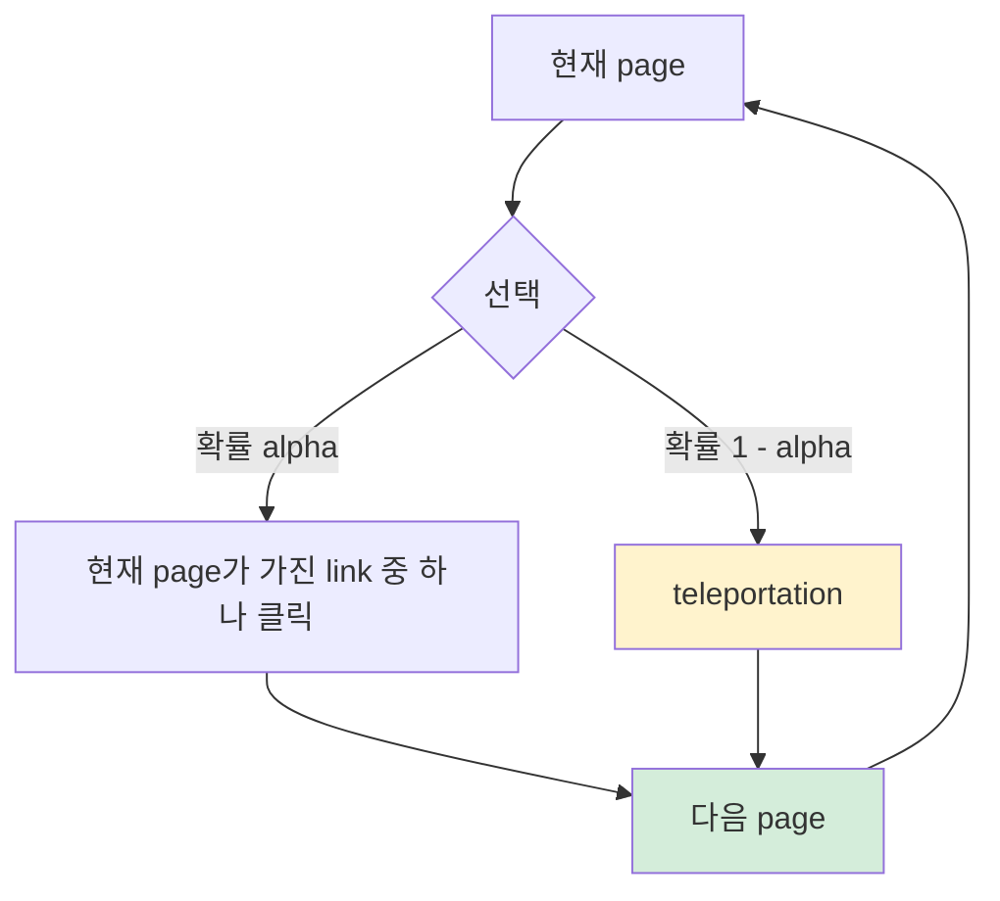

# A) PageRank ?

PageRank는 directed graph에서 **중요한 page가 걸어준 link일수록 더 강한 신뢰 신호로 본다** 는 생각을 수치화한 ranking 알고리즘이다. 처음에는 web page와 hyperlink를 대상으로 만들어졌지만, 본질적으로는 graph 위를 돌아다니는 [[RL/Markov Chain|Markov Chain]]의 장기 방문 확률을 계산하는 방법이다.

단순히 "나를 가리키는 link가 몇 개인가"만 보면 spam page가 건 link와 신뢰도 높은 page가 건 link가 똑같이 취급된다. PageRank에서는 link를 **점수가 이동하는 통로** 처럼 본다. 이미 중요한 page에서 받은 link는 더 큰 점수를 전달하고, 반대로 어떤 page가 100개 page를 link하고 있다면 그 page의 점수는 100개 link로 나뉘어 전달된다.

그래서 어떤 page가 높은 PageRank를 가지려면 두 가지 경로가 있다.

1. 많은 page가 그 page를 link한다.
2. 적은 수라도 중요한 page가 그 page를 link한다.

# B) Random Surfer로 보는 직관

PageRank를 가장 자연스럽게 이해하는 방법은 `random surfer` 모델이다.

사용자가 어떤 web page를 보고 있다고 생각하자. 사용자는 현재 page의 link 중 하나를 무작위로 클릭해 다음 page로 이동한다. 즉, graph 위에서 [[graph/random walk|random walk]] 를 수행한다.

다만 계속 link만 따라가지는 않는다. 어느 순간 지루해져서 주소창에 새 주소를 입력하듯이 직접 다른 page로 이동한다. PageRank에서는 이 동작을 teleportation이라고 부른다.

이 과정을 아주 오래 반복했을 때 사용자가 자주 머무르는 page가 높은 PageRank를 가진다.



여기서 `alpha`는 link를 따라갈 확률이다. 원 논문에서는 보통 `0.85`를 예로 든다. 이 경우 사용자는 85% 확률로 link를 클릭하고, 15% 확률로 다른 page로 새로 이동한다고 보면 된다.

teleportation은 단순한 보정항이 아니다. graph가 끊어져 있거나 다른 page로 나가는 link가 없는 page가 있어도 random walk가 막히지 않게 해준다. 덕분에 "오래 돌아다녔을 때 어느 page에 자주 머무는가"를 안정적으로 계산할 수 있다.

# C) 기본 수식

page $A$를 link하는 page들을 $T_1, \dots, T_n$이라고 하자. $C(T_i)$는 page $T_i$에서 다른 page로 나가는 link 수다. graph 용어로는 out-degree라고 부른다.

여기서 "나가는 link"는 반드시 다른 웹사이트로 가는 외부 도메인 link만 뜻하지 않는다. 같은 사이트 안의 다른 page로 가는 내부 link도 graph의 node로 포함되어 있다면 outgoing link로 센다. 핵심은 **현재 page에서 다른 node로 빠져나가는 edge 수** 다.

그러면 직관적 형태의 PageRank는 다음과 같다.

$$
PR(A) = (1-d) + d\left(\frac{PR(T_1)}{C(T_1)} + \cdots + \frac{PR(T_n)}{C(T_n)}\right)
$$

실제 구현에서는 모든 PageRank score의 합이 1이 되도록 두고, 이를 확률 분포처럼 다룬다. 아래 수식은 "link를 따라 이동하는 부분"과 "teleportation으로 새로 시작하는 부분"을 나누어 쓴 형태다.

$P$를 link 이동 확률 행렬, $v$를 teleportation으로 도착할 page 분포, $\alpha$를 link를 따라갈 확률이라고 하면 PageRank score $x$는 다음 식을 만족한다.

$$
(I - \alpha P)x = (1 - \alpha)v
$$

같은 식을 반복 계산 형태로 쓰면 다음과 같다.

$$
x = \alpha P x + (1 - \alpha)v
$$

여기서:

| 기호 | 의미 |
|---|---|
| $P$ | 현재 node에서 link를 따라 어디로 이동할지 나타내는 확률 행렬 |
| $x$ | 각 node의 PageRank score |
| $\alpha$ | link를 따라 이동할 확률 |
| $v$ | 새로 이동할 page를 고르는 확률 분포 |

$v$가 모든 노드에 거의 균등하면 global PageRank가 된다. 반대로 $v$를 특정 user, item, topic, seed node에 집중시키면 [[graph/PPR|Personalized PageRank]]가 된다.

# D) 계산 흐름

PageRank는 보통 같은 계산을 반복하는 power iteration으로 구한다.

1. 모든 노드에 초기 score를 균등하게 둔다.
2. 각 노드는 자신의 score를 나가는 link 수만큼 나눠서 이웃에게 전달한다.
3. 전달받은 score에 teleportation 항을 섞어 새 score를 만든다.
4. score 변화가 충분히 작아질 때까지 반복한다.

```python
x = v
while not converged:
    x = alpha * P @ x + (1 - alpha) * v
```

대규모 graph에서는 대부분의 node가 전체 node 중 극히 일부와만 연결되어 있다. 그래서 $P$를 거대한 행렬로 통째로 만들지 않고, adjacency list나 sparse matrix처럼 edge가 있는 곳만 저장한 뒤 그 경로를 따라 score를 업데이트한다.

# E) Dangling Node와 Spider Trap

PageRank를 구현할 때 조심해야 하는 대표 문제가 두 가지 있다.

| 문제 | 의미 | 처리 |
|---|---|---|
| Dangling node | 다른 node로 나가는 link가 없는 노드 | 해당 노드의 score를 새로 시작할 위치로 다시 나눠 줌 |
| Spider trap | graph 안의 닫힌 묶음이 score를 계속 가져감 | 매 step마다 teleportation을 섞어 빠져나올 수 있게 만듦 |

teleportation이 없으면 random walk가 특정 묶음 안에 갇히거나, 어떤 ranking이 정답인지 애매해질 수 있다. PageRank가 실용적인 이유는 graph 구조가 조금 지저분해도 안정적인 ranking을 만들 수 있다는 점이다.

# F) Search에서 Recommendation으로

Web search에서 PageRank는 query와 별개로 "이 page 자체가 얼마나 신뢰할 만한가"를 알려주는 점수로 볼 수 있다. 먼저 text matching이나 [[retrieval/sparse/BM25|BM25]] 같은 lexical signal로 후보를 찾고, PageRank는 그 후보 중 더 믿을 만한 page를 위로 올리는 데 쓰였다.

추천 시스템에서는 같은 아이디어가 user-item graph로 옮겨간다. user와 item을 node로 두고 interaction을 edge로 만들면, 특정 user에서 시작한 random walk가 자주 도착하는 item을 추천 후보로 볼 수 있다. 이때 global PageRank보다 [[graph/PPR|PPR]]이 더 자연스럽다. 추천은 전체 graph에서 제일 유명한 item을 찾는 문제가 아니라 **이 user 주변에서 가깝고 관련 있는 item** 을 찾는 문제에 가깝기 때문이다.

예를 들어 user-item graph에서 `user -> item -> similar users -> items` 흐름으로 random walk가 퍼지면, embedding을 학습하지 않아도 "비슷한 user들이 같이 본 item"을 후보로 가져올 수 있다.

# G) Elasticsearch에서는 어떻게 쓰나

[[retrieval/search_engine/Elasticsearch|Elasticsearch]] 안에서 PageRank graph 계산을 직접 돌리는 방식은 보통 정석이 아니다. ES는 검색 엔진이지 graph 계산 엔진이 아니기 때문이다.

실무에서는 보통 이렇게 나눈다.

1. PageRank는 batch job에서 미리 계산한다.
2. 계산된 `pagerank` score를 문서 field로 색인한다.
3. 검색할 때 [[retrieval/sparse/BM25|BM25]] 점수에 `pagerank`를 약하게 더해 ranking signal로 쓴다.

즉 ES에서 PageRank는 **계산 대상** 이 아니라 **미리 계산해 둔 ranking feature** 에 가깝다.

## G.1) `rank_feature`로 넣는 방식

PageRank처럼 "값이 클수록 검색 순위를 올리고 싶은 숫자"는 ES의 `rank_feature` field로 넣을 수 있다.

```json
PUT pages
{
  "mappings": {
    "properties": {
      "title": { "type": "text" },
      "body": { "type": "text" },
      "pagerank": { "type": "rank_feature" }
    }
  }
}
```

검색할 때는 본문 검색 점수를 `must`에 두고, PageRank는 `should`로 살짝 더한다.

```json
GET pages/_search
{
  "track_total_hits": false,
  "query": {
    "bool": {
      "must": [
        { "match": { "body": "vector database" } }
      ],
      "should": [
        {
          "rank_feature": {
            "field": "pagerank",
            "saturation": { "pivot": 10 },
            "boost": 0.2
          }
        }
      ]
    }
  }
}
```

`rank_feature`는 `saturation`, `log`, `sigmoid`, `linear` 같은 함수를 지원한다. 처음에는 `saturation`이 무난하다. PageRank 값은 일부 문서만 유난히 커지는 long-tail 분포가 되기 쉬우므로, 큰 값이 순위를 과하게 흔들지 않도록 `log`나 `saturation`처럼 완만해지는 함수를 쓰는 편이 안전하다.

주의할 점도 있다.

| 항목 | 의미 |
|---|---|
| 값 조건 | `rank_feature`는 문서당 값 하나만 받고, 양수 값만 허용한다 |
| 용도 | 일반 검색/filter/sort/aggregation용 field가 아니라 `rank_feature` query에서 score를 보정하는 용도로 쓴다 |
| 결측값 | score에 영향을 주는 field이므로 가능하면 모든 문서에 값을 채운다 |
| 정밀도 | ranking feature 용도라서 정밀한 수치 분석용 field로 보면 안 된다 |

정렬이 필요하거나 aggregation도 해야 한다면 `rank_feature`와 별도로 `pagerank_raw` 같은 numeric field를 하나 더 둘 수 있다.

## G.2) `function_score`, `script_score`, `rescore`는 언제 쓰나

단순히 "PageRank가 높으면 조금 올린다" 정도라면 `rank_feature`가 가장 깔끔하다. 특히 `track_total_hits`를 `true`로 강제하지 않을 때, `rank_feature` query는 경쟁력이 낮은 hit를 효율적으로 건너뛸 수 있다.

복잡한 공식이 필요하면 `script_score`를 쓸 수 있다.

```json
GET pages/_search
{
  "query": {
    "script_score": {
      "query": {
        "match": { "body": "vector database" }
      },
      "script": {
        "source": "_score + 0.1 * Math.log1p(doc['pagerank_raw'].value)"
      }
    }
  }
}
```

하지만 이 방식은 검색에 걸린 문서마다 script를 실행하므로 후보가 많으면 비용이 커진다. ES 공식 문서도 static field boost에는 `rank_feature` 같은 더 빠른 대안을 권한다.

복잡한 scoring을 꼭 써야 한다면 처음부터 전체 후보에 적용하지 말고 `rescore` 단계로 뒤로 미루는 편이 낫다.

```json
GET pages/_search
{
  "query": {
    "match": { "body": "vector database" }
  },
  "rescore": {
    "window_size": 300,
    "script": {
      "script": {
        "source": "_score + 0.1 * Math.log1p(doc['pagerank_raw'].value)"
      }
    }
  }
}
```

이렇게 하면 전체 1억 문서가 아니라 각 shard의 top-k 후보에만 비싼 score를 적용한다. 검색 시스템에서는 보통 **가벼운 후보 검색 -> 가벼운 static feature 반영 -> 비싼 rescore/rerank** 순서로 비용을 뒤로 미룬다.

## G.3) 1억 건 이상 문서에서는 어떻게 하나

1억 건 이상에서는 PageRank 계산과 ES serving을 분리하는 것이 정석에 가깝다.

```text
문서/링크 수집
  -> link graph 생성 (doc_id, out_doc_id, weight)
  -> Spark GraphX, Flink, Giraph 같은 batch/graph job으로 PageRank 계산
  -> doc_id, pagerank_score 산출
  -> ES 색인 pipeline에 join
  -> ES에서는 rank_feature로 검색 score에 반영
```

여기서 중요한 기준은 문서 수보다 **edge 수** 다. 문서가 1억 개라도 평균 outgoing link가 20개면 edge는 20억 개가 된다. PageRank는 iteration마다 edge를 거의 한 번씩 훑으므로, 계산 비용은 대략 `edge 수 × iteration 수`에 비례한다고 보는 편이 실무적으로 맞다.

그래서 Spark를 쓰는 경우가 많다. 정확히는 Spark 자체보다 Spark 위의 graph processing layer인 **GraphX** 를 쓰거나, 같은 계산을 DataFrame/RDD job으로 직접 구현한다. Spark GraphX에는 PageRank가 기본 알고리즘으로 들어 있고, 고정 iteration만 도는 방식과 score가 충분히 수렴할 때까지 도는 방식이 모두 있다.

다만 Spark가 유일한 정답은 아니다. 이미 Spark 기반 data lake와 batch pipeline이 있다면 Spark/GraphX가 자연스럽고, graph 규모가 더 크거나 graph 전용 운영 경험이 있으면 Giraph, Flink, GraphScope, GraphBLAS 계열, 또는 사내 graph engine을 쓰기도 한다. 중요한 건 **검색 serving 계층과 graph 계산 계층을 분리한다** 는 점이다.

대용량에서 피해야 할 것은 다음과 같다.

- ES query 시점에 graph traversal을 하지 않는다.
- 1억 문서 전체에 `script_score`를 직접 적용하지 않는다.
- PageRank 업데이트 때문에 전체 index를 매번 다시 만들지는 않는다.
- PageRank를 ranking의 유일한 기준처럼 강하게 쓰지 않는다.

운영 쪽에서는 shard sizing도 같이 봐야 한다. Elastic 공식 가이드의 출발점은 shard 하나를 대략 `10GB-50GB` 사이로 두고, shard당 문서 수를 `200M` 아래로 유지하는 것이다. 1억 문서가 전체 index라면 문서 수만으로는 shard 하나에도 들어갈 수 있지만, 실제로는 index size, query QPS, replica, 장애 복구 시간, cache hit ratio 때문에 여러 primary shard로 나누는 경우가 많다.

PageRank score 업데이트는 보통 다음 둘 중 하나다.

| 방식 | 설명 | 적합한 경우 |
|---|---|---|
| 재색인 | 새 index에 문서와 새 PageRank를 함께 색인하고 alias를 교체 | 전체 문서를 주기적으로 다시 만드는 batch 검색 index |
| 부분 업데이트 | `doc_id -> pagerank` 결과만 bulk update | 문서 본문은 그대로 두고 score만 갱신할 때 |

부분 업데이트는 간단해 보이지만, 1억 문서에 자주 수행하면 segment merge와 I/O 부담이 커진다. PageRank가 하루나 몇 시간 단위로만 바뀌는 signal이라면 새 index를 만들고 alias를 새 index로 바꿔 끼우는 방식이 더 예측 가능할 때가 많다.

# H) 다른 Graph Ranking과 구분

| 방법 | 핵심 질문 | 특징 |
|---|---|---|
| Degree centrality | link를 얼마나 많이 받는가 | 단순하지만 link 품질을 보지 않음 |
| Eigenvector centrality | 중요한 노드와 연결되어 있는가 | teleportation이 없어 graph 조건에 민감 |
| PageRank | 중요한 노드가 link하고, random surfer가 자주 도착하는가 | teleportation으로 안정성 확보 |
| HITS | hub와 authority를 분리해 볼 것인가 | query/topic subgraph ranking에 적합 |
| [[graph/PPR]] | 특정 seed에서 가까운 중요한 노드는 무엇인가 | 개인화, local graph search, 추천에 적합 |

PageRank는 eigenvector centrality와 비슷해 보이지만, 다시 시작할 위치 $v$와 link를 따라갈 확률 $\alpha$를 따로 둘 수 있다. 덕분에 graph가 끊어져 있어도 쓰기 쉽고, 개인화된 ranking으로도 확장하기 쉽다.

# I) 실무에서 볼 포인트

- graph 방향을 먼저 정해야 한다. web에서는 page가 link하는 방향이 자연스럽지만, 추천 graph에서는 `user -> item`, `item -> user`, bidirectional edge 중 무엇을 쓸지에 따라 의미가 달라진다.
- edge weight를 어떻게 둘지 정해야 한다. 클릭, 구매, 재방문, 체류 시간 같은 interaction을 같은 weight로 볼지 다르게 볼지에 따라 결과가 크게 바뀐다.
- $\alpha$가 커질수록 random walk가 graph 멀리까지 퍼지고, 작을수록 seed 주변에 머문다. PPR에서는 이 값이 후보를 넓게 가져올지, 가까운 후보 위주로 가져올지를 조절한다.
- global PageRank는 popularity bias를 강화할 수 있다. 추천에서는 PPR, topic-sensitive PageRank, degree normalization, freshness signal 등을 함께 고려하는 편이 안전하다.
- online query마다 정확한 PPR을 계산하기는 비싸다. 대규모 graph에서는 precompute, approximate PPR, Monte Carlo random walk, forward push 같은 근사 기법을 고려한다.
- Elasticsearch에서는 PageRank를 query-time에 계산하지 말고, offline으로 계산한 뒤 `rank_feature`나 rescore 단계에서 반영하는 편이 자연스럽다.

# J) References

- Sergey Brin, Lawrence Page, "The Anatomy of a Large-Scale Hypertextual Web Search Engine", 1998. https://snap.stanford.edu/class/cs224w-readings/Brin98Anatomy.pdf
- Lawrence Page, Sergey Brin, Rajeev Motwani, Terry Winograd, "The PageRank Citation Ranking: Bringing Order to the Web", 1999.
- David F. Gleich, "PageRank Beyond the Web", 2015. https://arxiv.org/abs/1407.5107
- Sibo Wang et al., "Efficient Algorithms for Approximate Single-Source Personalized PageRank Queries", 2019. https://arxiv.org/abs/1908.10583
- Elastic Docs, "Rank feature query". https://www.elastic.co/docs/reference/query-languages/query-dsl/query-dsl-rank-feature-query
- Elastic Docs, "Rank feature field type". https://www.elastic.co/docs/reference/elasticsearch/mapping-reference/rank-feature
- Elastic Docs, "Function score query". https://www.elastic.co/docs/reference/query-languages/query-dsl/query-dsl-function-score-query
- Elastic Docs, "Script score query". https://www.elastic.co/docs/reference/query-languages/query-dsl/query-dsl-script-score-query
- Elastic Docs, "Rescore search results". https://www.elastic.co/docs/reference/elasticsearch/rest-apis/rescore-search-results
- Elastic Docs, "Size your shards". https://www.elastic.co/docs/deploy-manage/production-guidance/optimize-performance/size-shards
- Apache Spark Docs, "GraphX Programming Guide - PageRank". https://spark.apache.org/docs/latest/graphx-programming-guide.html#pagerank
