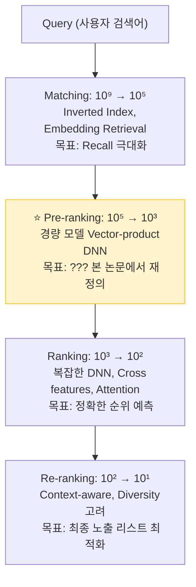
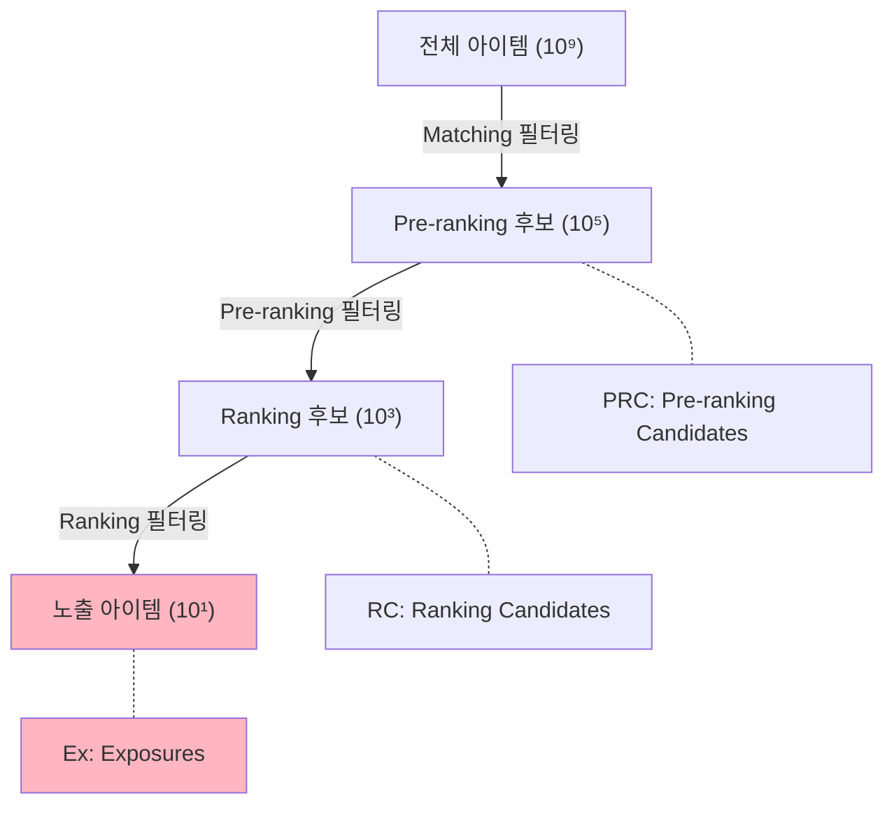
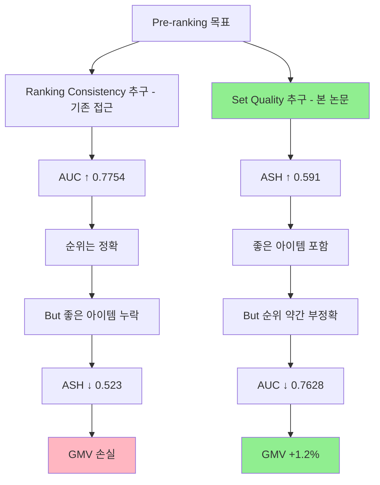
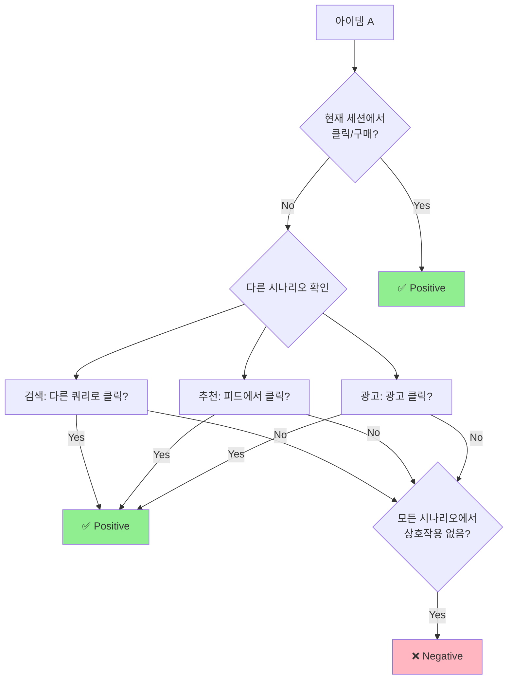
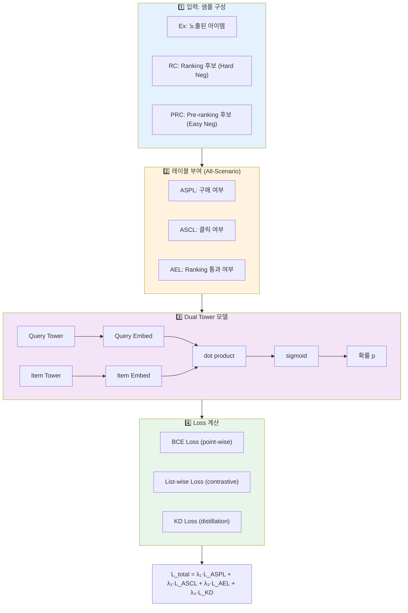
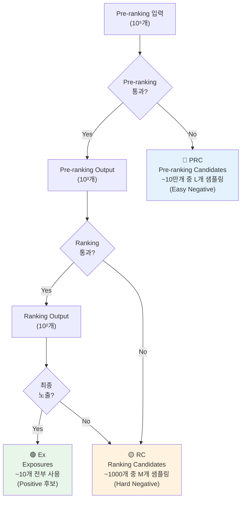
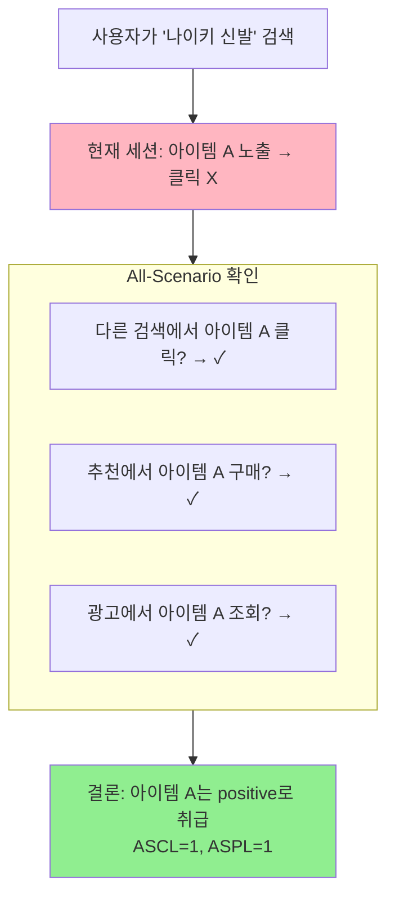
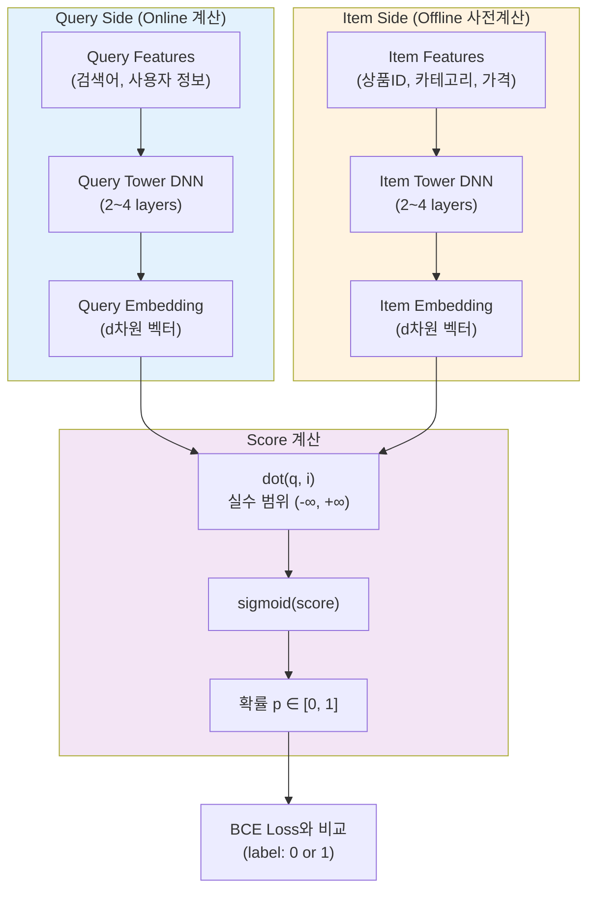
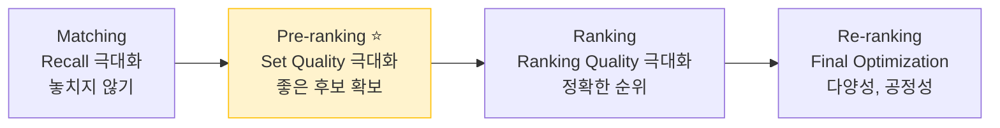

# A) 논문 정보

- **제목**: Rethinking the Role of Pre-ranking in Large-scale E-Commerce Searching System
- **저자**: Zhixuan Zhang, Yuheng Huang, Dan Ou, Sen Li, Longbin Li, Qingwen Liu, Xiaoyi Zeng (Alibaba Group)
- **학회/년도**: ACM Conference 2023
- **시스템**: Taobao Search

# B) 핵심 요약 (TL;DR)

Pre-ranking의 역할을 재정의한 논문. 기존에는 pre-ranking을 "간소화된 ranking 모델"로 취급했지만, 본 논문은 **pre-ranking의 목표는 정렬된 리스트가 아닌 고품질 후보 집합(unordered set)을 반환하는 것**이라고 주장한다.

**핵심 제안:**
1. **ASH@k (All-Scenario Hitrate)**: Set quality를 측정하는 새로운 오프라인 평가 지표
2. **ASMOL (All-Scenario Multi-Objective Learning)**: 다양한 시나리오와 목표를 고려한 학습 프레임워크

**결과**: Taobao Search에서 GMV +1.2% 향상

# C) 배경 지식

## C.1) Multi-Stage Cascade Ranking System

> 상세 정리: [[Cascade Ranking System]]

대규모 검색/추천 시스템에서 사용하는 단계적 필터링 구조:



## C.2) GMV (Gross Merchandise Volume)

**총 상품 거래액**. 이커머스 플랫폼에서 거래된 상품의 총 금액을 의미한다.

$$\text{GMV} = \sum_{i} \text{Price}_i \times \text{Quantity}_i$$

이커머스 비즈니스의 핵심 성과 지표(KPI)로, 플랫폼의 규모와 성장을 측정하는 데 사용된다.

## C.3) Sample Selection Bias (SSB)

Cascade 구조에서 발생하는 학습 데이터 편향 문제:



**문제**: Pre-ranking 모델을 학습할 때 Exposure 데이터만 사용하면, 이미 여러 단계를 거쳐 필터링된 편향된 데이터로 학습하게 된다.

# D) 문제 정의

## D.1) 기존 접근법의 문제

기존에는 pre-ranking을 "ranking 모델의 경량 버전"으로 취급:
- Ranking 모델과 동일한 학습 목표 (CTR, CVR 예측)
- Ranking 모델 점수를 label로 사용하는 Knowledge Distillation
- AUC, NDCG 등 ranking consistency 지표로 평가

**문제점**: Pre-ranking이 정말 ranking처럼 동작해야 할까?

## D.2) Seesaw Effect (시소 효과)

> 상세 정리: [[Seesaw Effect]]

논문에서 발견한 핵심 현상: **Ranking consistency와 Set quality는 trade-off 관계**



**실험으로 확인된 Trade-off:**

| 설정 | AUC (순위 일관성) | ASH@2000 (집합 품질) | GMV |
|------|------------------|---------------------|-----|
| Strong KD | 0.7754 ✓ | 0.523 ✗ | 낮음 |
| ASMOL | 0.7628 ✗ | 0.591 ✓ | **+1.2%** |

**결론**: Pre-ranking에서 Ranking consistency(AUC)를 맹목적으로 추구하면 오히려 비즈니스 성과가 떨어진다.

### D.2.1) Seesaw Effect가 발생하는 이유

**왜 Ranking과 똑같이 학습하면 문제가 생길까?**

Pre-ranking과 Ranking은 근본적으로 **다른 역할**을 수행한다:

| 단계 | 입력 | 출력 | 핵심 목표 |
|------|------|------|----------|
| **Pre-ranking** | 10만 개 | 1천 개 | **좋은 아이템을 놓치지 않기** (Recall 중시) |
| **Ranking** | 1천 개 | 10개 | **정확한 순서대로 정렬** (Precision 중시) |

**Ranking 모델을 그대로 따라하면:**
1. Ranking 모델은 "이미 좋은 아이템들" 사이에서 미세한 순서를 학습
2. Pre-ranking이 이를 모방하면 → 미세한 차이에 집중 → **경계선에 있는 좋은 아이템을 놓침**
3. 결과: 순위 일관성(AUC)은 좋지만, 정작 좋은 아이템이 top-K에서 빠짐

**비유로 설명:**
- **Pre-ranking**: 면접 1차 서류 심사 → "괜찮은 사람은 일단 통과시키자" (넓은 그물)
- **Ranking**: 최종 면접 → "이 중에서 가장 적합한 사람을 뽑자" (정밀 선별)

서류 심사에서 최종 면접처럼 까다롭게 평가하면? → 좋은 후보를 놓칠 수 있음

**핵심 인사이트:**
- Pre-ranking의 치명적 실수: **False Negative** (좋은 아이템을 탈락시킴)
- Ranking의 치명적 실수: **순서가 틀리는 것**

따라서 같은 방식으로 학습하면 안 된다.

## D.3) Pre-ranking의 두 가지 목표

논문에서 재정의한 Pre-ranking의 목표:

| 목표                    | 설명                             | 평가 지표   |
| --------------------- | ------------------------------ | ------- |
| **High Quality Set**  | SSB 문제를 해결하여 output set의 품질 향상 | ASPH@k  |
| **High Quality Rank** | Ranking과 일관성 유지, 좋은 아이템이 노출되도록 | PAUC@10 |

**핵심**: 두 목표를 동시에 최대화하는 것은 **불가능** (Seesaw Effect). **High Quality Set이 더 중요**하며, High Quality Rank는 Set 품질이 떨어지지 않는 선에서 만족시키면 된다.

| 관점      | 기존           | 본 논문            |
| ------- | ------------ | --------------- |
| **목표**  | 정렬된 리스트 반환   | 고품질 집합 반환       |
| **출력**  | Ordered List | Unordered Set   |
| **평가**  | AUC, NDCG    | ASPH@k          |
| **모델링** | Ranking과 동일  | 다른 목표 필요        |

> "Pre-ranking should return high-quality unordered set, not ordered list"

# E) 제안 방법

## E.1) Hitrate 지표: ISPH Vs ASPH

### E.1.1) 두 가지 Hitrate 비교

| 지표 | 정의 | 문제점 |
|------|------|--------|
| **ISPH@k** (In-Scenario Purchase Hitrate) | 현재 검색 세션에서 구매된 아이템만 positive | 항상 1이 됨 (모든 positive가 이미 pre-ranking output에 있으므로) |
| **ASPH@k** (All-Scenario Purchase Hitrate) | 모든 시나리오에서 구매된 아이템을 positive로 | 실제 output set 품질 측정 가능 |

**핵심 문제**: ISPH@k는 **오프라인 모델과 온라인 output의 차이**만 측정하고, **품질**은 측정하지 못한다.

### E.1.2) 개념

ASPH@k는 Pre-ranking의 output set에 "좋은 아이템"이 얼마나 포함되어 있는지를 측정하는 지표.

### E.1.3) 정의

$$\text{ASH@k} = \frac{1}{|Q|} \sum_{q \in Q} \frac{|\text{TopK}(q) \cap \text{Positive}(q)|}{|\text{Positive}(q)|}$$

- $Q$: 쿼리 집합
- $\text{TopK}(q)$: Pre-ranking이 반환한 상위 k개 아이템
- $\text{Positive}(q)$: 해당 쿼리에서 "좋은 아이템" 집합

### E.1.4) "Positive" 정의

기존 방식에서는 "현재 검색 세션에서 클릭/구매된 아이템"만 positive로 취급했다. 하지만 이 접근법의 문제는 **같은 아이템이 다른 상황에서는 positive였을 수 있다**는 점을 무시한다는 것이다.

**All-Scenario Positive**는 다음을 모두 positive로 간주한다:
- **ASPL (All-Scenario Purchase Label)**: 어떤 시나리오에서든 **구매**된 아이템
- **ASCL (All-Scenario Click Label)**: 어떤 시나리오에서든 **클릭**된 아이템
- **AEL (Adaptive Exposure Label)**: **Ranking 단계를 통과**한 아이템

예를 들어, 사용자가 "나이키 신발"을 검색했을 때 아이템 A가 노출되었지만 클릭하지 않았다고 하자. 기존 방식에서는 이 아이템을 negative로 취급한다. 하지만 All-Scenario 접근법에서는:
- 같은 사용자가 추천 피드에서 아이템 A를 클릭했거나
- 다른 검색어로 아이템 A를 구매했거나
- 광고에서 아이템 A를 조회했다면

→ 아이템 A는 **positive**로 취급된다. 이렇게 하면 더 풍부한 supervision signal을 얻을 수 있다.

**All-Scenario**의 의미:



### E.1.5) AUC Vs ASH 비교

| 지표        | 측정 대상                        | Pre-ranking 적합성 |
| --------- | ---------------------------- | --------------- |
| **AUC**   | Ranking consistency (순위 일관성) | △ (불완전)         |
| **NDCG**  | Graded relevance ranking     | △ (불완전)         |
| **ASH@k** | Set quality (집합 품질)          | ○ (적합)          |

## E.2) ASMOL (All-Scenario Multi-Objective Learning)

### E.2.1) 프레임워크 개요



### E.2.2) 학습 샘플 (Training Samples)

#### E.2.2.1) 왜 Exposure만으로는 부족한가?

기존 Pre-ranking 모델은 **Exposure 데이터만** 사용해서 학습했다. 하지만 이 방식의 문제점:

1. **Sample Selection Bias**: Exposure는 이미 Matching → Pre-ranking → Ranking을 거쳐 필터링된 데이터
2. **분포 불일치**: 학습 데이터(Exposure)와 실제 추론 데이터(Pre-ranking 후보 10만개)의 분포가 다름
3. **결과**: 모델이 Pre-ranking 후보 대부분에 대해 신뢰할 수 없는 점수를 출력

#### E.2.2.2) 세 가지 샘플 유형의 관계

Pre-ranking 입력(10⁵개) 중에서:
- **Pre-ranking output**(10³개)으로 선택된 것 중에서
  - **Ranking을 거쳐 최종 노출**된 것 = **Ex** (~10개)
  - **노출되지 않은 것** = **RC** (나머지 ~1000개 중 M개 샘플링)
- **Pre-ranking에서 탈락**한 것 = **PRC** (나머지 ~10만개 중 L개 샘플링)

세 집합은 **서로 겹치지 않음** (mutually exclusive).



| 유형                               | 정의                           | 역할                | 샘플 수       |
| -------------------------------- | ---------------------------- | ----------------- | ---------- |
| **Ex (Exposures)**               | 최종 사용자에게 노출된 아이템             | Positive 후보       | N개 (전부 사용) |
| **RC (Ranking Candidates)**      | Pre-ranking output 중 노출 안된 것 | **Hard Negative** | M개 샘플링     |
| **PRC (Pre-ranking Candidates)** | Pre-ranking에서 탈락한 아이템        | **Easy Negative** | L개 샘플링     |

#### E.2.2.3) Hard Vs Easy Negative 전략

**RC (Hard Negative)**:
- Ranking까지 도달했지만 최종 노출에서 탈락한 아이템
- 품질이 높지만 미세하게 부족 → **미세한 품질 차이**를 학습하는 데 도움

**PRC (Easy Negative)**:
- Pre-ranking에서 바로 탈락한 아이템
- 품질이 명확히 낮음 → **명확한 품질 차이**를 학습하는 데 도움
- Matching의 embedding retrieval과 유사한 학습 방식

#### E.2.2.4) 최적 샘플 비율

논문 실험 결과, 최적 샘플 개수:
- **RC**: 10개/query
- **PRC**: 40개/query

너무 많은 RC/PRC는 오히려 ASPH@3000을 떨어뜨림 (Seesaw Effect 발생).

**PRC 사용의 장점**: Sample Selection Bias를 완화하여 더 일반화된 모델 학습 가능

### E.2.3) 레이블 타입 (Label Types)

| 레이블 | 설명 | 역할 |
|--------|------|------|
| **ASPL** (All-Scenario Purchase Label) | 모든 시나리오의 구매 라벨 | 비즈니스 목표 (GMV) |
| **ASCL** (All-Scenario Click Label) | 모든 시나리오의 클릭 라벨 | 사용자 관심도 |
| **AEL** (Adaptive Exposure Label) | Ranking 통과 여부 라벨 | Ranking과의 일관성 |

**중요: 노출(Exposure)만으로는 Positive가 아니다!**

| 조건 | Positive 여부 |
|------|--------------|
| 노출만 됨 (클릭/구매 없음) | ❌ Negative |
| 클릭 발생 (어느 시나리오든) | ✅ ASCL=1 |
| 구매 발생 (어느 시나리오든) | ✅ ASPL=1 |

AEL은 "Positive"라기보다는 Ranking 모델과의 **일관성 유지**를 위한 Knowledge Distillation 용도이다.

### E.2.4) All-Scenario Label 구성

핵심 아이디어: 현재 검색 세션뿐 아니라 **다른 시나리오**의 라벨도 활용



**핵심: 샘플 유형과 레이블은 독립적이다**

| 샘플 유형 | 현재 세션에서의 상태 | All-Scenario 클릭/구매 있으면? |
|----------|---------------------|------------------------------|
| **Ex** | 노출됨 | Positive (ASCL=1 or ASPL=1) |
| **RC** | Ranking까지 갔지만 노출 안됨 | Positive 가능! |
| **PRC** | Pre-ranking에서 탈락 | Positive 가능! |

즉, **노출 여부와 관계없이** All-Scenario에서 클릭/구매 이력이 있으면 해당 아이템은 Positive로 학습된다. 이것이 Sample Selection Bias를 완화하는 핵심 메커니즘이다.

### E.2.5) Loss Functions

#### E.2.5.1) BCE Loss (Binary Cross-Entropy)

$$L_{BCE} = -\frac{1}{N} \sum_{i=1}^{N} [y_i \log(\hat{y}_i) + (1-y_i) \log(1-\hat{y}_i)]$$

#### E.2.5.2) List-wise Loss (Multi-positive Softmax)

기존 Softmax는 single positive를 가정하지만, ASCL/ASPL은 **multiple positives**:

$$L_{list} = -\frac{1}{|P|} \sum_{i \in P} \log \frac{\exp(s_i)}{\sum_{j=1}^{N} \exp(s_j)}$$

- $P$: Positive 아이템 집합
- $s_i$: 아이템 i의 점수

**InfoNCE와의 비교:**
```python
InfoNCE (single positive):   L = -log( exp(s+) / Σexp(s_j) )
Multi-positive Softmax:      L = -1/|P| Σ_{i∈P} log( exp(s_i) / Σexp(s_j) )
```

List-wise Loss는 사실상 **여러 positive를 허용하는 InfoNCE 변형**이다.

#### E.2.5.3) BCE Vs List-wise Loss: 왜 둘 다 쓰나?

| Loss | 유형 | 장점 | 단점 |
|------|------|------|------|
| **BCE** | Point-wise | Calibration 좋음 (확률 해석 가능) | 상대적 순서 무시 |
| **List-wise** | Contrastive | 순위 학습에 효과적 | Calibration 안 됨 |

**Pre-ranking에서 둘 다 필요한 이유:**
- **Set Quality**: 좋은 아이템을 선별 → List-wise가 효과적
- **Ranking Consistency**: 순서도 어느 정도 맞아야 함 → BCE로 calibration 유지

**Dual Tower 모델에서의 동작:**
```python
score = dot(query_embed, item_embed)  # 실수 범위
p = sigmoid(score)                     # [0, 1]로 변환
BCE_loss = BCE(p, label)               # label은 0 또는 1
```

L2 normalization을 하면 cosine similarity가 `[-1, 1]` 범위가 되지만, BCE를 쓰려면 여전히 sigmoid로 [0, 1]로 변환해야 한다. 순수 contrastive learning에서는 L2 norm + softmax (InfoNCE)를 쓰지만, ranking 특성도 필요한 pre-ranking에서는 BCE를 함께 사용한다.

#### E.2.5.4) Knowledge Distillation Loss

Ranking 모델의 soft label 활용:

$$L_{KD} = \text{KL}(p_{rank} \| p_{pre})$$

### E.2.6) 전체 Loss

$$L_{total} = \lambda_1 L_{ASPL} + \lambda_2 L_{ASCL} + \lambda_3 L_{AEL} + \lambda_4 L_{KD}$$

## E.3) 모델 구조

### E.3.1) Vector-product Based DNN (Dual Tower)

Pre-ranking은 latency 제약으로 인해 경량 모델 사용:



**특징:**
- Item embedding은 **오프라인으로 미리 계산** 가능 (인덱싱)
- 온라인에서는 Query embedding만 계산하고 dot product로 점수 계산
- Cross features 사용 불가 (latency 제약)

**논문에서 공개하지 않은 세부 사항:**

| 항목 | 상태 | 일반적인 업계 관행 |
|------|------|------------------|
| Embedding dimension (d) | 미공개 | 보통 64~256 |
| 모델 파라미터 수 | 미공개 | - |
| Query features | 미공개 | 검색어 토큰, 사용자 프로필, 세션 컨텍스트 |
| Item features | 미공개 | 아이템 ID, 카테고리, 판매자, 가격대, 인기도 |
| Tower DNN 구조 | 미공개 | 2~4 레이어 MLP |

> 산업계 논문은 경쟁사 때문에 세부 구현을 숨기는 경우가 많다.

# F) 실험 결과

## F.1) 오프라인 실험

### F.1.1) Dataset

| 항목 | 규모 |
|------|------|
| 플랫폼 | Taobao Search |
| 기간 | 1주일 |
| 샘플 수 | 수억 건 |

### F.1.2) Sample Strategy 실험 (논문 Table 1)

| Sample Strategy  | ASPH@3000 | PAUC@10 | GMV Gained |
| ---------------- | --------- | ------- | ---------- |
| baseline         | 85.5%     | 90.1%   | 0.0%       |
| ASMOL w/o RC&PRC | 87.3%     | 89.4%   | 0.3%       |
| ASMOL w/o RC     | 90.4%     | 87.5%   | 0.8%       |
| ASMOL w/o PRC    | 91.1%     | 88.9%   | 1.0%       |
| **ASMOL (Full)** | **92.5%** | 87.1%   | **1.2%**   |

→ RC와 PRC 샘플을 모두 포함할 때 ASPH@3000이 가장 높고, GMV도 최대

### F.1.3) Seesaw Effect 검증

| 설정 | AUC | ASH@2000 | 비고 |
|------|-----|----------|------|
| Strong KD | 0.7754 | 0.523 | Ranking consistency 우선 |
| Weak KD + ASMOL | 0.7628 | 0.591 | Set quality 우선 |

→ AUC는 낮지만 ASH는 높음 (Seesaw Effect 확인)

## F.2) 온라인 A/B 테스트

| 지표 | 변화 |
|------|------|
| **GMV** | **+1.2%** |
| CTR | +0.8% |
| CVR | +0.5% |
| Latency | 동일 |

**의미**: Pre-ranking의 역할 재정의를 통해 실제 비즈니스 성과 개선

## F.3) Ablation Study

### F.3.1) 각 컴포넌트 기여도

| 설정               | ΔASH@2000 | 비고                |
| ---------------- | --------- | ----------------- |
| Base (KD only)   | -         | Baseline          |
| + PRC samples    | +3.2%     | SSB 완화            |
| + ASPL           | +4.5%     | 구매 라벨 활용          |
| + ASCL           | +5.8%     | 클릭 라벨 활용          |
| + AEL            | +6.2%     | Ranking 일관성       |
| + List-wise loss | +6.8%     | Multi-positive 처리 |

### F.3.2) Sample Type 영향

| 학습 데이터        | ASH@2000 |
| ------------- | -------- |
| Ex only       | 0.523    |
| Ex + RC       | 0.551    |
| Ex + RC + PRC | 0.591    |

→ Pre-ranking Candidates 포함 시 SSB 완화 효과

# G) 핵심 통찰

## G.1) Pre-ranking의 본질

> **핵심 메시지**
>
> Pre-ranking ≠ 경량화된 Ranking
>
> Pre-ranking = **고품질 후보 집합 생성기**
>
> 목표: "좋은 아이템을 놓치지 않는 것" (순위보다 coverage가 중요)

## G.2) All-Scenario 접근법의 가치

| 기존           | All-Scenario      |
| ------------ | ----------------- |
| 현재 세션 라벨만 사용 | 다른 시나리오 라벨도 활용    |
| 데이터 희소성 문제   | 더 풍부한 supervision |
| 좁은 시각        | 사용자의 전체적 선호 반영    |

## G.3) Seesaw Effect의 교훈

- **Surrogate metric (AUC) ≠ Business metric (GMV)**
- 단계별 역할에 맞는 평가 지표 설계 필요
- 전체 시스템 관점에서 각 단계 최적화

# H) 실무 적용 포인트

## H.1) Pre-ranking 설계 시 고려사항

1. **평가 지표 재설계**: AUC/NDCG → Hitrate 기반 지표
2. **학습 데이터 확장**: Exposure 외 RC, PRC 데이터 활용
3. **Multi-objective Learning**: 다양한 시나리오 라벨 통합

## H.2) Cascade System 최적화



## H.3) 적용 가능 시나리오

- 대규모 이커머스 검색 (타오바오, 쿠팡, 네이버쇼핑 등)
- 추천 시스템의 pre-filter 단계
- 광고 시스템의 bid selection 단계

# I) 제한점 및 향후 연구

## I.1) 논문의 제한점

1. **Taobao 특화**: 다른 도메인/규모에서의 일반화 검증 필요
2. **All-Scenario 데이터 의존**: 다양한 시나리오 데이터가 없으면 적용 어려움
3. **Hyperparameter 민감도**: $\lambda$ 값 튜닝 가이드 부족

## I.2) 향후 연구 방향

1. Matching 단계에도 All-Scenario 개념 적용
2. 동적 $\lambda$ 조절 (Adaptive weighting)
3. Real-time label update 메커니즘

# J) 관련 연구

- [[Deep Neural Networks for YouTube Recommendations]] - Cascade ranking 시스템
- [[Sampling-Bias-Corrected Neural Modeling for Large Corpus Item Recommendations]] - SSB 문제
- [COLD: Towards the Next Generation of Pre-Ranking System](https://arxiv.org/abs/2007.16122) - Pre-ranking 연구

# K) 개인 메모

- Pre-ranking을 단순히 "ranking의 축소판"으로 보지 말 것
- 각 단계의 역할을 명확히 정의하고 그에 맞는 지표 설계가 중요
- All-Scenario 개념은 추천 시스템의 cold-start 완화에도 활용 가능할 듯
