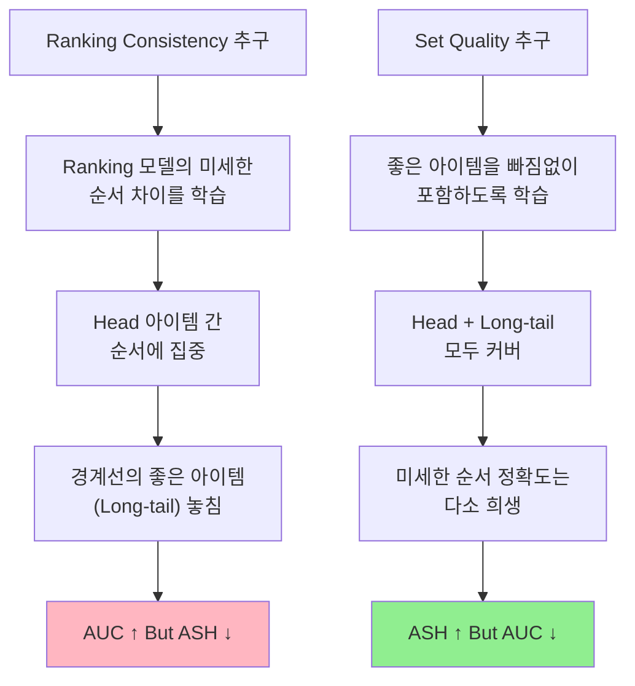
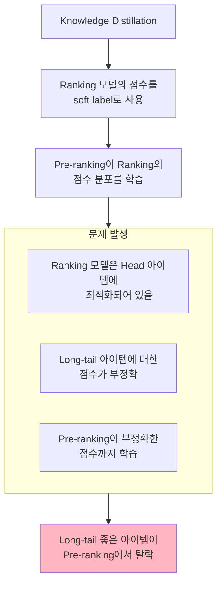
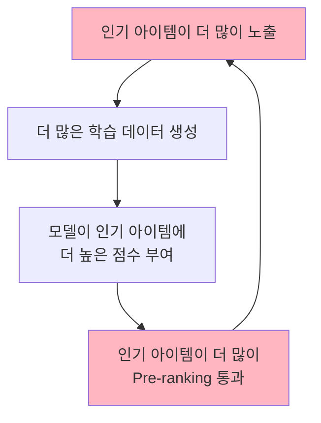
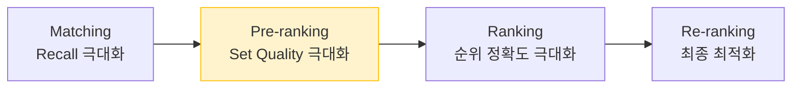

# A) Seesaw Effect

**Cascade ranking 시스템에서 pre-ranking의 ranking consistency(순위 일관성)와 set quality(집합 품질)가 trade-off 관계에 있는 현상.**

하나를 최적화하면 다른 하나가 악화되는, 시소처럼 움직이는 효과를 말한다.

Alibaba의 [[Rethinking the Role of Pre-ranking in Large-scale E-Commerce Searching System|ASMOL 논문 (KDD 2023)]] 에서 처음 명명되었으며, 이후 JD의 HCCP (WWW 2025) 등에서 더 정교하게 정의되었다.

# B) 핵심 개념

## B.1) 두 가지 상충하는 목표

Pre-ranking 단계에는 본질적으로 다른 두 가지 목표가 존재한다:

| 목표                      | 설명                     | 측정 지표          | 비유              |
| ----------------------- | ---------------------- | -------------- | --------------- |
| **Ranking Consistency** | Ranking 모델과 동일한 순서로 정렬 | AUC, NDCG      | 최종 면접처럼 까다롭게 평가 |
| **Set Quality**         | 좋은 아이템을 놓치지 않고 포함      | ASH@k, Hitrate | 서류 심사처럼 넓은 그물   |

## B.2) 왜 동시에 최적화할 수 없는가?

**근본 원인**: Pre-ranking과 Ranking은 다른 역할을 수행한다.

| 단계              | 입력 규모 | 출력 규모 | 핵심 역할              | 치명적 실수                         |
| --------------- | ----- | ----- | ------------------ | ------------------------------ |
| **Pre-ranking** | 10만 개 | 1천 개  | 좋은 후보 확보 (Recall)  | **False Negative** - 좋은 아이템 탈락 |
| **Ranking**     | 1천 개  | 10개   | 정확한 순위 (Precision) | 순서가 틀리는 것                      |

Ranking 모델은 이미 필터링된 "좋은 아이템들" 사이에서 미세한 순서를 학습한다. Pre-ranking이 이를 그대로 모방(Knowledge Distillation)하면, **미세한 차이에 집중** 하게 되어 경계선에 있는 좋은 아이템을 놓치게 된다.

## B.3) 실험적 검증

Taobao Search에서의 실험 결과 (ASMOL 논문):

| 설정 | AUC (순위 일관성) | ASH@2000 (집합 품질) | GMV |
|------|------------------|---------------------|-----|
| Strong KD (Ranking 모방) | **0.7754** | 0.523 | 낮음 |
| ASMOL (Set Quality 우선) | 0.7628 | **0.591** | **+1.2%** |

AUC가 낮더라도 ASH가 높으면 비즈니스 성과(GMV)가 더 좋다. 즉, **Surrogate metric(AUC)과 Business metric(GMV)이 일치하지 않는다.**

# C) Seesaw Effect 발생 메커니즘

## C.1) Knowledge Distillation의 함정

## C.2) Sample Selection Bias와의 관계

Pre-ranking 모델이 Exposure 데이터만으로 학습하면:
1. 이미 여러 단계를 거쳐 필터링된 **편향된 데이터**로 학습
2. 학습 데이터(노출 아이템 약 10개)와 추론 데이터(후보 약 10만개)의 **분포 불일치**
3. 대부분의 후보에 대해 **신뢰할 수 없는 점수** 출력

이 편향은 Seesaw Effect를 더욱 악화시킨다. Ranking consistency를 강하게 추구할수록 편향된 데이터에 overfitting되어 set quality가 더 크게 하락한다.

## C.3) Matthew Effect (마태 효과)

기존 KD 기반 접근법은 **인기 편향** 을 증폭시킨다:

이 악순환은 Long-tail 아이템의 발견 가능성을 지속적으로 감소시킨다.

# D) 해결 접근법

## D.1) ASMOL (Alibaba, KDD 2023)

**핵심 아이디어**: Pre-ranking의 목표를 **순위 → 집합 품질** 로 재정의

| 기법 | 설명 | 효과 |
|------|------|------|
| **ASH@k 지표** | Set quality 측정하는 오프라인 평가 지표 | 올바른 최적화 방향 설정 |
| **All-Scenario Labels** | 다른 시나리오의 클릭/구매 데이터도 positive로 활용 | SSB 완화 |
| **RC + PRC 샘플** | Hard/Easy negative 추가로 학습 데이터 확장 | 분포 불일치 해소 |
| **Multi-objective Loss** | BCE + List-wise + KD loss 조합 | Set quality와 Ranking consistency 균형 |

자세한 내용: [[Rethinking the Role of Pre-ranking in Large-scale E-Commerce Searching System]]

## D.2) HCCP (JD, WWW 2025)

**핵심 아이디어**: Multi-level sampling으로 head와 tail 아이템 모두 커버

| 기법 | 설명 |
|------|------|
| **Hybrid Sample Construction** | Ranking sequence(비균등 샘플링) + Pre-ranking 후보 + In-batch/pool 샘플링 |
| **Margin InfoNCE Loss** | Hard negative와 Easy negative를 구분하는 margin 추가 |

**결과**: JD 이커머스에서 UCVR +14.9%, UCTR +1.3%—head와 tail 정확도 모두 개선

## D.3) COPR (Alibaba, CIKM 2023)

광고 시스템에서의 접근:

| 기법 | 설명 |
|------|------|
| **Chunk-based Sampling** | Ranking 결과를 chunk 단위로 나누어 샘플링 |
| **Rank Alignment Module** | ECPM 기반 순위 일관성 최적화 |
| **Delta-NDCG Weighting** | Chunk 간 샘플 중요도 차별화 |

**결과**: Taobao 광고에서 CTR +12.3%, RPM +5.6%

## D.4) GRACE (SIGIR 2024)

**핵심 아이디어**: Generalizability(일반화)와 Ranking consistency를 **상호보완적 목표**로 재정의

| 기법 | 설명 |
|------|------|
| **Binary Classification** | Top-k 멤버십 예측 태스크 |
| **GNN-pretrained Embeddings** | Long-tail 아이템 표현 강화를 위한 contrastive learning |

## D.5) 접근법 비교

| 논문 | 전략 | 핵심 차이점 |
|------|------|-----------|
| **ASMOL** | Set quality 우선 | 목표 자체를 재정의 |
| **HCCP** | 양쪽 균형 | Multi-level 샘플링으로 둘 다 커버 |
| **COPR** | Consistency 개선 | 광고 도메인 특화 (ECPM 기반) |
| **GRACE** | 상호보완 | Generalizability로 간접 해결 |

# E) 더 넓은 맥락: ML에서의 Seesaw 현상

"Seesaw"라는 메타포는 pre-ranking 외에도 ML의 다양한 영역에서 유사한 trade-off를 설명하는 데 사용된다.

## E.1) Seesaw Loss (CVPR 2021)

Long-tailed instance segmentation에서 head class와 tail class 간의 gradient 불균형 문제:

- **문제**: Head class가 tail class의 negative sample을 지배 → tail class에 대한 과도한 negative gradient
- **해결**: Mitigation factor(tail category 페널티 감소) + Compensation factor(오분류 페널티 증가)

## E.2) Multi-task Learning의 Gradient Conflict

Multi-task learning에서 task 간 gradient가 충돌하는 현상 (PCGrad, CAGrad 등):

| Seesaw 축 A | Seesaw 축 B |
|-------------|-------------|
| Task A의 gradient | Task B의 gradient |
| Head class 정확도 | Tail class 정확도 |
| Vision modality | Language modality |

## E.3) 공통 패턴

모든 Seesaw 현상의 본질: **제한된 리소스(모델 용량, 데이터, 학습 시간) 하에서 하나의 목표를 최적화하면 상관된 다른 목표가 악화된다.**

# F) 실무적 시사점

## F.1) Pre-ranking 설계 원칙

1. **평가 지표 재설계**: AUC/NDCG만으로 pre-ranking을 평가하지 말 것 → Hitrate 기반 지표(ASH@k) 도입
2. **Surrogate metric ≠ Business metric**: 오프라인 지표 개선이 온라인 성과와 일치하는지 반드시 검증
3. **각 단계의 역할 명확화**: Pre-ranking은 "경량화된 Ranking"이 아니라 "고품질 후보 집합 생성기"

## F.2) 단계별 최적화 관점

**핵심**: 각 단계가 **자기 역할에 맞는 목표**를 최적화해야 전체 시스템이 최적화된다. Pre-ranking이 Ranking을 맹목적으로 따라하면 Seesaw Effect로 인해 전체 성과가 떨어진다.

# G) References

- [Rethinking the Role of Pre-ranking (ASMOL) - Alibaba KDD 2023](https://arxiv.org/abs/2305.13647)
- [HCCP: Hybrid Cross-Stage Coordination Pre-ranking - JD WWW 2025](https://arxiv.org/abs/2502.10284)
- [COPR: Consistency-Oriented Pre-Ranking - CIKM 2023](https://arxiv.org/abs/2306.03516)
- [GRACE: Generalizable and Rank-Consistent Pre-Ranking - SIGIR 2024](https://arxiv.org/abs/2405.05606)
- [On Ranking Consistency of Pre-ranking Stage - 2022](https://arxiv.org/abs/2205.01289)
- [Full Stage Learning to Rank - WWW 2024](https://arxiv.org/abs/2405.04844)
- [Seesaw Loss for Long-Tailed Instance Segmentation - CVPR 2021](https://arxiv.org/abs/2008.10032)
