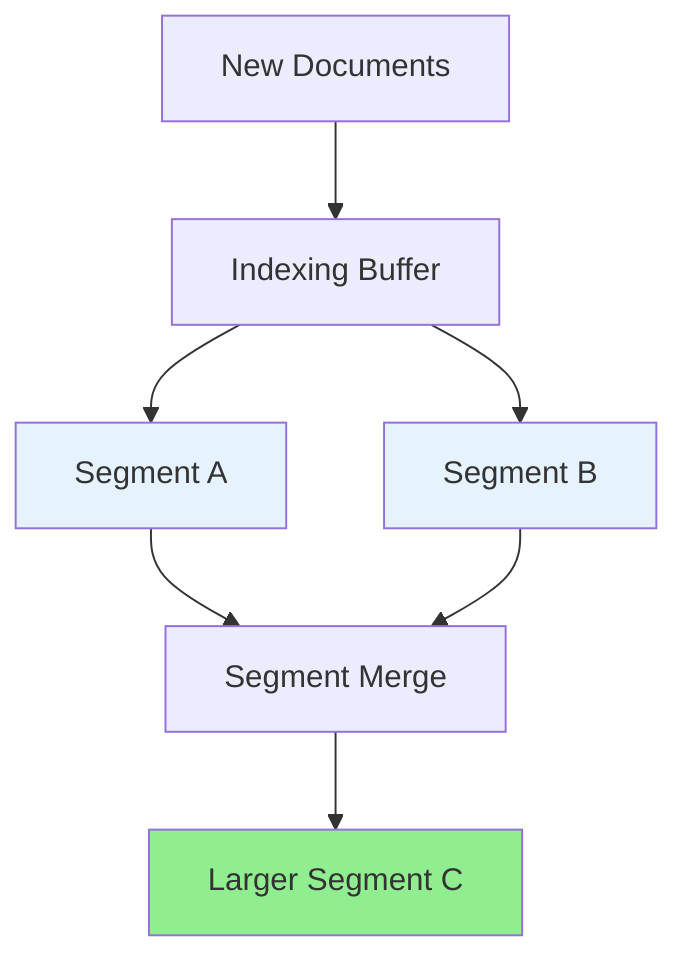

# A) Lucene Segment ?

[[Lucene]]에서 segment는 **Lucene index를 구성하는 immutable한 작은 색인 단위** 다.

문서가 추가될 때 Lucene은 기존 index 파일을 계속 수정하지 않는다. 새로 들어온 문서를 모아 새로운 segment를 만들고, 시간이 지나면 여러 작은 segment를 더 큰 segment로 merge한다.



Segment 하나는 그 자체로 검색 가능한 작은 index처럼 동작한다. 다만 Lucene에서 말하는 `index`는 보통 **여러 segment + commit point** 를 포함하는 더 큰 단위다.

# B) 내부 구성

Segment를 B-tree 같은 단일 자료구조로 생각하면 헷갈리기 쉽다. **Segment는 여러 색인 자료구조와 파일을 묶은 immutable index unit** 에 가깝다.

비유하면 B-tree는 "자료구조 하나"이고, Lucene segment는 "검색 가능한 작은 데이터베이스 파일 묶음"에 가깝다. 그 안에는 term dictionary, posting list, stored fields, doc values, point index, vector index 같은 여러 구조가 함께 들어갈 수 있다.

다만 모든 segment가 아래 구성 요소를 전부 갖는 것은 아니다. 더 정확히는 segment 내부에서 **field별로 필요한 구조가 만들어진다**. 어떤 구조가 만들어지는지는 필드 타입과 색인 옵션에 따라 달라진다.

예를 들어 `text` 필드는 [[Inverted Index|inverted index]] 를 만들고, `keyword` 필드는 exact match와 aggregation을 위해 inverted index와 doc values를 함께 쓰는 경우가 많다. 숫자/date/geo 필드는 range query를 위해 points/BKD tree 계열 구조를 만들 수 있고, dense vector 필드는 knn vector index를 만들 수 있다.

| Segment 내부 구성 | 언제 생기는가 | 자료구조 관점 | 역할 |
|---|---|---|---|
| Term dictionary / terms index | indexed text/keyword field | [[Finite State Transducer]](FST), block/tree-like dictionary 계열 | term을 빠르게 찾는다 |
| Postings | indexed text/keyword field | 압축된 sorted docID list + skip data | 특정 term이 등장한 문서들을 순회한다 |
| Positions / offsets | position/offset 저장 옵션이 켜진 text field | postings의 부가 정보 | phrase query, highlighting 등에 사용 |
| Stored fields | `_source` 또는 stored field가 필요한 경우 | row-oriented 저장 | 검색 결과에서 원문 필드 값을 가져온다 |
| Doc values | sort, aggregation, faceting 대상 field | columnar 저장 | sort, aggregation, faceting에 사용 |
| Points | numeric/date/geo range query 대상 field | BKD tree 계열 | numeric/date/geo range query에 사용 |
| KNN vectors | dense vector nearest neighbor search 대상 field | HNSW 계열 | dense vector nearest neighbor search에 사용 |

따라서 `segment = B-tree` 라기보다는, **segment 안에 여러 자료구조가 있고, 그중 full-text search의 핵심은 term dictionary + postings로 구성된 inverted index** 라고 이해하는 게 정확하다. Term lookup에는 [[Finite State Transducer|FST]] 나 tree-like dictionary 구조가 관여하지만, posting list는 보통 정렬된 docID 리스트를 압축하고 skip 정보를 붙여 순회하는 구조다.

# C) Lucene Index와의 관계

Lucene index는 여러 segment로 이루어진다.

```text
Lucene Index
├── Segment 1
├── Segment 2
├── Segment 3
└── commit point
```

검색할 때는 각 segment를 대상으로 검색한 뒤 결과를 합쳐서 반환한다.

# D) Elasticsearch Index / Shard와의 관계

[[Elasticsearch]]까지 포함하면 계층은 보통 아래처럼 이해하면 된다:

```text
Elasticsearch Index
├── Primary Shard 0  ≈ Lucene Index
│   ├── Segment A
│   ├── Segment B
│   └── Segment C
├── Primary Shard 1  ≈ Lucene Index
│   ├── Segment D
│   └── Segment E
└── Replica Shards
```

즉:

| 용어 | 어느 레벨? | 의미 |
|---|---|---|
| Segment | Lucene | immutable한 작은 색인 파일 묶음 |
| Lucene Index | Lucene | segment들의 집합 |
| Shard | Elasticsearch | 하나의 Lucene index로 구현되는 분산 단위 |
| Elasticsearch Index | Elasticsearch | 여러 shard로 이루어진 논리적 index |

주의할 점은 **Lucene index와 Elasticsearch index가 같은 말이 아니라는 것** 이다. Elasticsearch index는 분산 시스템의 논리적 단위이고, 그 안의 각 shard가 내부적으로 Lucene index로 구현된다.

# E) 실무적으로 중요한 점

Segment가 immutable하기 때문에 update는 내부적으로 기존 문서 delete 표시 + 새 문서 add에 가깝게 처리된다. 시간이 지나면서 작은 segment가 많아지면 검색 시 확인해야 할 segment가 늘어나므로, Lucene/Elasticsearch는 background merge로 segment를 정리한다.

또한 segment 파일은 [[Elasticsearch]]에서 memory-mapped file과 filesystem cache를 통해 읽히는 경우가 많다. 그래서 segment 크기, merge, filesystem cache hit rate는 검색 latency와 tail latency를 이해할 때 중요하다.

# F) References

- [Apache Lucene 10.3.0 - org.apache.lucene.index package summary](https://lucene.apache.org/core/10_3_0/core/org/apache/lucene/index/package-summary.html)
- [Apache Lucene - Index File Formats](https://lucene.apache.org/core/3_6_2/fileformats.html)
- [Elasticsearch Docs - Near real-time search](https://www.elastic.co/docs/manage-data/data-store/near-real-time-search)
