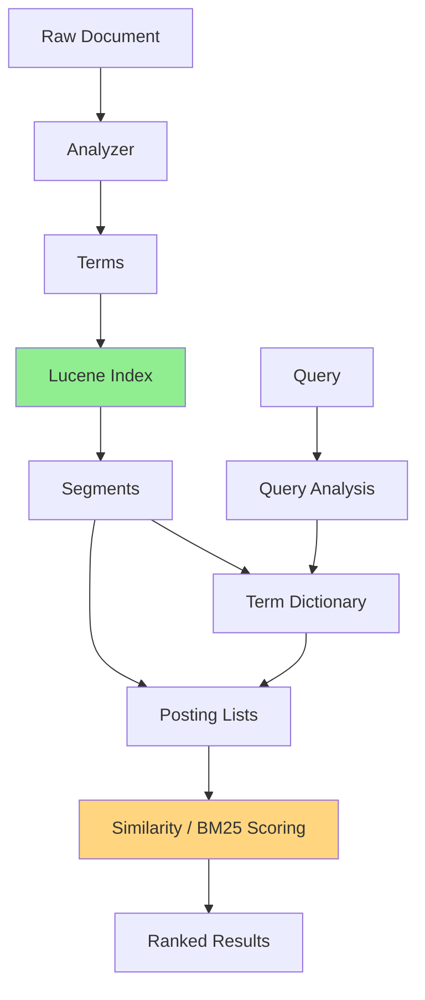

# A) Lucene ?

Apache Lucene은 Java로 작성된 **full-text search library** 다. 검색 서버나 분산 시스템 자체라기보다는, 애플리케이션 안에 임베딩해서 문서 색인(indexing), 검색(search), relevance scoring을 수행하는 검색 엔진 코어에 가깝다.

[[Elasticsearch]], OpenSearch, Solr 같은 검색 시스템은 Lucene 위에 분산 처리, REST API, 클러스터 관리, 운영 기능을 얹은 형태라고 볼 수 있다.

# B) 한줄 요약

Lucene은 [[Inverted Index|inverted index]] 를 실제 파일 포맷, segment, analyzer, scoring, query execution으로 구현한 검색 라이브러리다.

다만 Lucene이 가진 모든 자료구조가 inverted index인 것은 아니다. Full-text search의 핵심은 inverted index지만, stored fields, doc values, points, knn vectors 같은 다른 저장 구조도 함께 제공한다.

# C) 전체 구조

Lucene의 검색 흐름을 단순화하면 아래와 같다:

말로 풀면:

1. 문서가 들어오면 analyzer가 텍스트를 term으로 변환한다
2. Lucene은 term별로 문서 목록을 posting list에 저장한다
3. 색인 데이터는 [[Lucene Segment|immutable segment]] 단위로 쌓인다
4. 검색 시 query도 analyzer를 거쳐 term으로 변환된다
5. 해당 term의 posting list를 읽고, BM25 같은 similarity로 점수를 계산한다
6. 점수가 높은 문서를 ranked result로 반환한다

# D) 핵심 개념

| 개념             | 설명                                                    |
| -------------- | ----------------------------------------------------- |
| Document       | Lucene에 색인되는 기본 단위                                    |
| Field          | 문서 안의 속성. 예: `title`, `body`, `category`              |
| Term           | 검색 가능한 최소 단위. 보통 analyzer를 거친 token                   |
| Analyzer       | 텍스트를 tokenize, lowercase, normalize, stemming 하는 컴포넌트 |
| Inverted Index | `term → documents` 방향으로 저장하는 색인 구조                    |
| Posting List   | 특정 term이 등장하는 문서 ID, 빈도, 위치 등의 목록                     |
| Segment        | 문서 일부를 담은 [[Lucene Segment]]         |
| Similarity     | BM25, TF-IDF 계열 scoring 로직                            |

# E) Lucene Notation 정리

Lucene에서 가장 헷갈리는 점은 `index`라는 단어가 여러 레벨에서 쓰인다는 것이다. 특히 [[Elasticsearch]]의 index/shard 개념과 섞이면 더 헷갈린다. 자세한 segment 내부 구조와 merge 흐름은 [[Lucene Segment]]에서 따로 본다.

| 용어                  | 어느 레벨?        | 의미                           |
| ------------------- | ------------- | ---------------------------- |
| Segment             | Lucene        | [[Lucene Segment]] |
| Lucene Index        | Lucene        | segment들의 집합                 |
| Shard               | Elasticsearch | 하나의 Lucene index로 구현되는 분산 단위 |
| Elasticsearch Index | Elasticsearch | 여러 shard로 이루어진 논리적 index     |

주의할 점은 **Lucene index와 Elasticsearch index가 같은 말이 아니라는 것** 이다. Elasticsearch index는 분산 시스템의 논리적 단위이고, 그 안의 각 shard가 내부적으로 Lucene index로 구현된다.

# F) Lucene과 Inverted Index의 관계

[[Inverted Index]] 는 자료구조 개념이고, Lucene은 그 개념을 production search engine에서 쓸 수 있게 구현한 라이브러리다.

Lucene의 inverted index는 크게 다음으로 볼 수 있다:

| Lucene 구성 | Inverted Index 관점 | 역할 |
|---|---|---|
| Term dictionary | Dictionary / Vocabulary | field별 term 목록과 term metadata를 저장 |
| Postings | Posting list | term을 포함하는 document 목록을 저장 |
| Frequencies | Term frequency | 문서 안에서 term이 몇 번 등장했는지 저장 |
| Positions | Term position | phrase query, proximity query에 필요한 위치 정보 |
| Skip data / impacts | 검색 최적화 | 불필요한 posting을 건너뛰어 빠르게 검색 |

즉, Lucene에서 full-text search를 한다는 것은 대체로 **query term으로 term dictionary를 찾고, 해당 posting list를 순회하면서 scoring하는 과정** 이다.

# G) Full-text Search와 Term-based Search 차이

두 표현은 관점이 다르다.

| 표현                | 관점             | 의미                                      |
| ----------------- | -------------- | --------------------------------------- |
| Full-text search  | 사용자 기능 / 문제 영역 | 긴 자연어 텍스트에서 관련 문서를 찾는 검색                |
| Term-based search | 구현 방식 / 매칭 단위  | term을 기준으로 posting list를 찾고 점수를 계산하는 검색 |

즉, **full-text search는 "무엇을 하려는가"** 에 가깝고, **term-based search는 "어떤 단위로 찾는가"** 에 가깝다.

예를 들어 사용자가 `"파스타 맛집 추천"` 을 검색하면, Lucene/Elasticsearch는 analyzer로 쿼리를 `"파스타"`, `"맛집"`, `"추천"` 같은 term으로 바꾸고 각 term의 posting list를 조회한다. 이 경우 사용자 입장에서는 full-text search이고, 내부 구현 관점에서는 term-based search다.

헷갈리기 쉬운 점은, 모든 term-based search가 full-text search는 아니라는 것이다.

| 예시 | Full-text search? | Term-based search? | 설명 |
|---|---|---|---|
| `body` 필드에서 `"파스타 맛집"` 검색 | Yes | Yes | 자연어 본문 검색이며 term 단위로 매칭 |
| `category:restaurant` 필터 | No | Yes | 자연어 검색이라기보다 정확한 term/keyword 매칭 |
| `user_id:123` 검색 | No | Yes | 식별자 term을 찾는 구조 |
| Dense vector search | 경우에 따라 Yes | No | 자연어 검색일 수 있지만 term/posting list 기반은 아님 |

따라서 Lucene의 inverted index는 **전통적인 full-text search를 term-based 방식으로 구현하는 핵심 구조** 라고 이해하면 된다.

# H) Lucene과 Elasticsearch의 관계

[[Elasticsearch]]는 Lucene을 직접 사용하는 검색/분석 엔진이다. Lucene이 단일 노드의 색인과 검색 코어라면, Elasticsearch는 그 위에 아래 기능을 추가한다:

| 계층 | 역할 |
|---|---|
| Lucene | segment, inverted index, analyzer, query execution, scoring |
| Elasticsearch | REST API, distributed shard/replica, cluster coordination, mapping, aggregation, 운영 기능 |

Elasticsearch의 shard는 내부적으로 Lucene index에 해당하고, Lucene index는 여러 segment로 구성된다. 그래서 Elasticsearch 성능을 이해하려면 Lucene의 segment, filesystem cache, inverted index 구조를 같이 이해해야 한다.

# I) 실무적으로 중요한 점

1. **Analyzer가 검색 품질을 크게 좌우한다**
	- 어떤 token이 index에 들어가는지가 analyzer에서 결정된다
	- 한국어 검색에서는 형태소 분석기, synonym, normalization 설정이 중요하다

2. **Segment는 immutable이다**
	- 새 문서는 [[Lucene Segment|새 segment]] 에 쓰이고, 시간이 지나며 segment merge가 발생한다
	- update는 내부적으로 delete + add에 가깝게 처리된다

3. **Full-text search와 aggregation은 다른 저장 구조를 쓴다**
	- 검색은 주로 inverted index를 사용한다
	- sorting, aggregation, faceting은 doc values 같은 columnar 구조를 많이 사용한다

4. **BM25는 Lucene의 기본 relevance scoring과 연결된다**
	- Elasticsearch/OpenSearch에서 BM25 검색을 한다는 것은 Lucene의 similarity/scoring 체계를 활용한다는 뜻이다

5. **Sparse retrieval과 궁합이 좋다**
	- [[BM25]], [[SPLADE]] 같은 sparse retrieval은 Lucene의 inverted index 인프라를 그대로 활용할 수 있다
	- 반대로 dense vector retrieval은 HNSW/knn vector 같은 별도 구조를 사용한다

# J) References

- [Apache Lucene 10.3.0 - org.apache.lucene.index package summary](https://lucene.apache.org/core/10_3_0/core/org/apache/lucene/index/package-summary.html)
- [Apache Lucene - Index File Formats](https://lucene.apache.org/core/3_6_2/fileformats.html)
- [Elasticsearch Docs - Elasticsearch Reference](https://www.elastic.co/guide/en/elasticsearch/reference/current/index.html/)
- [Elasticsearch Docs - Near real-time search](https://www.elastic.co/docs/manage-data/data-store/near-real-time-search)
