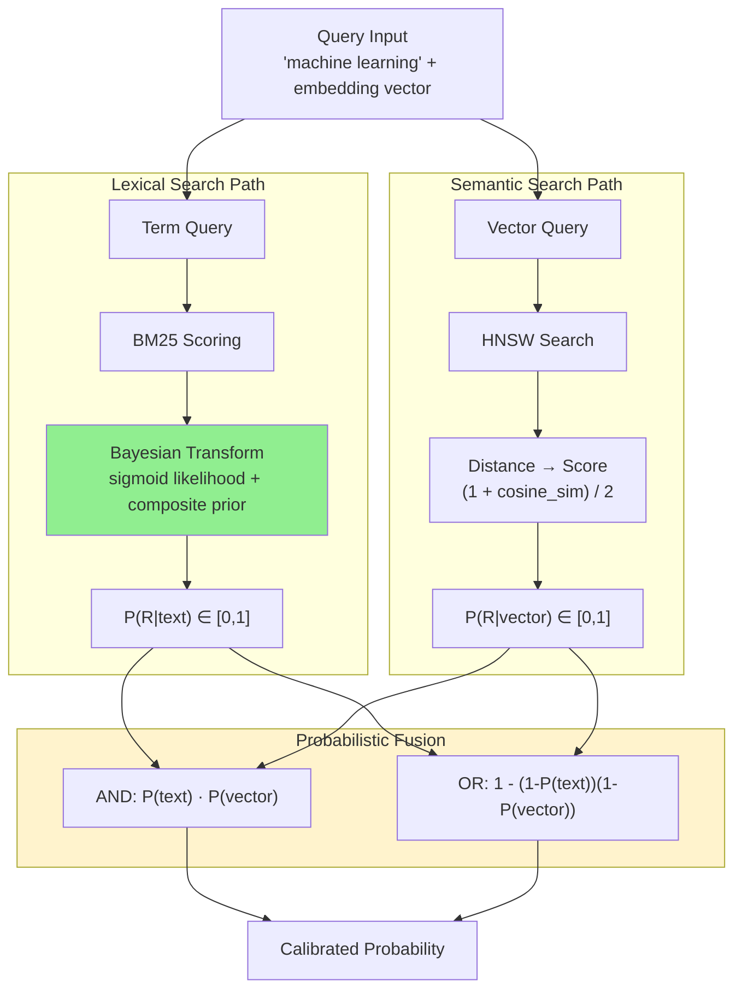

# A) 한줄 요약

**BM25 스코어를 Bayesian inference로 calibrated probability $[0, 1]$로 변환하여, lexical과 vector 시그널을 확률론적으로 결합하는 hybrid search 프레임워크.** Jaepil Jeong (Cognica, Inc.), 2026년 1월 발표. 기존 [[BM25]] 위에 sigmoid likelihood + composite prior를 적용한 posterior 변환이 핵심.

# B) 전체 구조

핵심 파이프라인을 말로 풀면:

1. **Lexical path**: 쿼리 텀으로 BM25 스코어 계산 → sigmoid likelihood + composite prior로 Bayesian posterior 산출 → $P(\text{rel} \mid \text{text}) \in [0, 1]$
2. **Semantic path**: 쿼리 임베딩으로 HNSW 검색 → cosine distance를 확률로 변환 → $P(\text{rel} \mid \text{vector}) \in [0, 1]$
3. **Fusion**: 두 확률을 independence 가정 하에 AND (곱) 또는 OR (inclusion-exclusion)로 결합

# C) 배경 지식

## C.1) BM25 스코어의 문제점

[[BM25]]는 ranking에는 효과적이지만, 스코어 자체에 근본적 한계가 있다:

| 문제                         | 설명                                                 |
| -------------------------- | -------------------------------------------------- |
| **Unbounded Range**        | $\text{BM25}(D, Q) \in [0, +\infty)$, 절대적 해석 불가    |
| **Query Dependence**       | 쿼리 길이·term specificity에 따라 스코어 스케일이 달라짐            |
| **Corpus Dependence**      | IDF가 collection statistics에 의존, cross-corpus 비교 불가 |
| **Signal Incompatibility** | $[0, 1]$ 범위의 vector similarity와 직접 결합 시 스케일 불균형    |
|                            |                                                    |

## C.2) 기존 Fusion 방법의 한계

### C.2.1) Naive Weighted Sum

스케일이 다른 시그널을 단순 합산하면, 크기가 큰 시그널이 ranking을 지배한다 (Signal Dominance, 논문 Thm 1.2.2):

$$\text{Score}_{\text{naive}} = \sum_{i=1}^{n} s_i$$

$\mu_1 \gg \mu_2$ 이면 signal 2가 ranking에 영향을 줄 확률 $\approx 0$.

### C.2.2) Reciprocal Rank Fusion (RRF)

$$\text{RRF}(D) = \sum_{i=1}^{n} \frac{1}{k + \text{rank}_i(D)}$$

RRF의 이론적 한계 (논문 Thm 1.3.2):
1. **Information Loss**: 스코어 크기를 버리고 순위만 사용 → confidence 정보 손실
2. **Rank Sensitivity**: 작은 스코어 변동이 큰 순위 변화 유발
3. **Non-Commutativity with Filtering**: $\text{RRF}(\text{Filter}(L_1), \text{Filter}(L_2)) \neq \text{Filter}(\text{RRF}(L_1, L_2))$
4. **Arbitrary Constant**: $k=60$ 에 이론적 근거 없음
5. **Missing Document Handling**: 일부 리스트에만 존재하는 문서 처리 미정의

# D) 기존 방법의 한계 (왜 Bayesian BM25가 필요한가)

Hybrid search에서 lexical + vector 시그널을 결합하는 방법은 보통 ad-hoc하다:
- **hand-tuned weighted sum**: 가중치를 수동 튜닝, 스케일 불일치 문제
- **RRF**: 스코어 크기 정보 버림, 이론적 근거 부족

**Bayesian BM25의 해결책**: BM25 스코어를 Bayes' theorem으로 calibrated probability로 변환하면, 두 시그널이 모두 유효한 확률이 되므로 표준 확률론 ($P(A \cap B)$, $P(A \cup B)$)으로 결합 가능. 튜닝 파라미터 없이, 출력 범위에 대한 formal guarantee를 제공한다.

# E) 제안 방법

## E.1) Likelihood Model

BM25 스코어 $s$가 주어졌을 때, 문서가 relevant할 확률을 parametric sigmoid로 모델링 (논문 Def 4.1.1):

$$P(s \mid R=1) = \sigma(\alpha \cdot (s - \beta)) = \frac{1}{1 + e^{-\alpha(s - \beta)}}$$

여기서:
- $\alpha > 0$: sigmoid 기울기 (score sensitivity). 클수록 decision boundary가 급격
- $\beta$: sigmoid 중심점 (decision boundary). 이 스코어를 기준으로 relevant/non-relevant 구분

**Symmetric Likelihood Assumption** (논문 Def 4.1.2): non-relevant일 때의 likelihood를 대칭으로 가정:

$$P(s \mid R=0) = 1 - P(s \mid R=1) = \sigma(-\alpha(s - \beta))$$

이 가정 덕분에 posterior 공식이 깔끔하게 유도된다.

## E.2) Posterior Probability (핵심 수식)

Bayes' theorem 적용 (논문 Thm 4.1.3):

$$P(R=1 \mid s) = \frac{L \cdot p}{L \cdot p + (1 - L) \cdot (1 - p)}$$

여기서:
- $L = \sigma(\alpha(s - \beta))$: likelihood
- $p = P(R=1)$: prior (아래 composite prior)

**직관**: likelihood $L$이 높으면 (BM25 스코어가 높으면) posterior가 올라가고, prior $p$가 높으면 (TF가 높고 문서 길이가 적당하면) 기본 확률이 올라간다.

## E.3) Composite Prior Design

Prior는 TF 정보와 document length 정보를 결합하여 설계 (논문 Def 4.2.1-4.2.3):

**Term Frequency Prior**:

$$P_{\text{tf}}(f) = 0.2 + 0.7 \cdot \min\left(1, \frac{f}{10}\right)$$

- TF가 0이면 prior = 0.2 (최소), TF가 10 이상이면 prior = 0.9 (최대, saturation)

**Field Norm Prior** (문서 길이 보정):

$$P_{\text{norm}}(n) = 0.3 + 0.6 \cdot (1 - \min(1, |n - 0.5| \cdot 2))$$

- $n = |D| / \text{avgdl}$. 평균 길이에 가까울수록 ($n \approx 0.5$) prior가 높고, 극단적 길이면 낮아짐

**Composite Prior** (가중 결합 + clamping):

$$P_{\text{prior}}(f, n) = \text{clamp}(0.7 \cdot P_{\text{tf}}(f) + 0.3 \cdot P_{\text{norm}}(n), \ 0.1, \ 0.9)$$

- TF에 70%, length norm에 30% 가중치
- $[0.1, 0.9]$로 clamp하여 extreme prior가 posterior를 지배하는 것 방지

## E.4) Monotonicity 보존

**핵심 성질** (논문 Thm 4.3.1): Bayesian 변환은 BM25의 ranking 순서를 보존한다:

$$s_1 > s_2 \implies P(R=1 \mid s_1) > P(R=1 \mid s_2)$$

(고정된 prior $p$와 $\alpha > 0$ 에서)

이는 posterior $g(s) = \frac{L \cdot p}{L \cdot p + (1-L)(1-p)}$ 의 도함수가 항상 양수임을 보여 증명한다. 즉, **BM25로 잘 ranking하던 것이 Bayesian 변환 후에도 그대로 유지된다.**

## E.5) Hybrid Search Score Combination

두 시그널이 모두 $[0, 1]$ 확률이 되면, independence 가정 하에 표준 확률론으로 결합:

### E.5.1) Probabilistic AND (Conjunction)

$$P(\text{AND}) = \prod_{i=1}^{n} p_i$$

- 두 시그널 **모두** 관련 있을 확률. 더 엄격한 기준
- Log-space 계산: $P(\text{AND}) = \exp\left(\sum \ln(p_i)\right)$
- Bound: $0 < P(\text{AND}) < \min_i p_i$ (항상 개별 확률보다 작음)

### E.5.2) Probabilistic OR (Disjunction)

$$P(\text{OR}) = 1 - \prod_{i=1}^{n} (1 - p_i)$$

- **하나라도** 관련 있을 확률. 더 관대한 기준
- Log-space 계산: $P(\text{OR}) = 1 - \exp\left(\sum \ln(1 - p_i)\right)$
- Bound: $\max_i p_i < P(\text{OR}) < 1$ (항상 개별 확률보다 큼)

**실무적 의미**:
- **AND**: precision 중시, 두 시그널 모두 동의해야 높은 점수
- **OR**: recall 중시, 어느 시그널이든 관련성을 감지하면 올라감

## E.6) Vector Search Integration

Cosine distance $d \in [0, 2]$ 를 확률로 변환 (논문 Def 7.1.1-7.1.2):

$$\text{score}_{\text{vector}} = 1 - d, \quad P_{\text{vector}} = \frac{1 + \text{score}_{\text{vector}}}{2} \in [0, 1]$$

## E.7) Numerical Stability

극단적 확률에서의 underflow 방지를 위해 **log-space 계산** 사용 (논문 Thm 5.3.1):
- 직접 곱셈 $\prod_{i=1}^{100} 0.01$은 $10^{-200}$으로 underflow
- Log-space: $\sum_{i=1}^{100} \ln(0.01) = -460.5$ 는 표현 가능
- Probability clamping: $p_{\text{safe}} = \text{clamp}(p, \epsilon, 1-\epsilon)$ 에서 $\epsilon = 10^{-10}$

# F) WAND/BMW 호환성

실무에서 중요한 부분: Bayesian BM25가 기존 inverted index 최적화 알고리즘과 호환되는가?

## F.1) WAND (Weak AND) 호환

WAND는 upper bound 기반으로 문서를 pruning하는 알고리즘. 핵심 조건:

$$\sum_{i=0}^{\text{pivot}} \text{upper\_bound}_i < \theta$$

일 때 문서를 skip ($\theta$: 현재 top-k의 최소 스코어).

**BM25의 upper bound** (논문 Thm 6.1.1): term $t$에 대해 $\text{upper\_bound}(t) = \text{boost} \cdot \text{IDF}(t)$

**Bayesian BM25 호환 (논문 Thm 6.1.2)**: monotonicity가 보존되므로, BM25 upper bound로 pruning해도 top-k 결과가 달라지지 않는다. 즉, **기존 WAND 인덱스를 그대로 사용 가능.**

## F.2) BMW (Block-Max WAND)

Block 단위로 더 tight한 upper bound를 사용하여 skip rate를 높이는 방법. Bayesian BM25에서도 동일한 이유 (monotonicity)로 호환된다.

| Query Type | Documents Skipped |
|---|---|
| Rare terms (IDF > 5) | 90-99% |
| Common terms (IDF < 2) | 10-30% |
| Mixed queries | 50-80% |

# G) Parameter Learning + 실무적 시사점

## G.1) Parameter Learning

$\alpha$, $\beta$는 relevance label이 있는 데이터로 gradient descent로 학습 가능 (논문 Alg 8.3.1).

**Cross-Entropy Loss** (논문 Def 8.1.1):

$$\mathcal{L}(\alpha, \beta) = -\sum_{i=1}^{n} \left[ y_i \ln(\hat{y}_i) + (1-y_i) \ln(1-\hat{y}_i) \right]$$

여기서 $\hat{y}_i = \sigma(\alpha(s_i - \beta))$.

**Gradients** (논문 Thm 8.2.1):

$$\frac{\partial \mathcal{L}}{\partial \alpha} = \sum_{i} (\hat{y}_i - y_i)(s_i - \beta), \quad \frac{\partial \mathcal{L}}{\partial \beta} = -\sum_{i} (\hat{y}_i - y_i) \cdot \alpha$$

실험에서 $\alpha = 4.3138$, $\beta = 0.7431$ 로 수렴. loss가 0.5750 → 0.0626 (89% 감소).

## G.2) Computational Overhead

| Operation | BM25 | Bayesian BM25 | 비고 |
|---|---|---|---|
| Score computation | 2 div, 2 mul, 1 add | +1 exp, +3 mul, +2 div | Sigmoid 약 50% overhead |
| IDF computation | 1 log, 2 div, 2 add | 동일 | 쿼리 당 1회 |
| Prior computation | N/A | 4 mul, 3 add, 1 clamp | 문서 당 추가 비용 |

전체 overhead는 **$O(1)$ per document**—문서/쿼리 크기에 무관.

**Memory**: Scorer 구조체 32 bytes (boost, k1, b, idf, avg_doc_size, weight, alpha, beta 각 4B).

## G.3) 실무적 시사점

1. **튜닝 없는 hybrid search**: weighted sum의 가중치 튜닝이나 RRF의 $k$ 파라미터 없이, 확률론적으로 정당한 결합
2. **기존 인프라 재활용**: WAND/BMW 인덱스 호환이므로 inverted index 인프라 변경 없이 적용 가능
3. **AND vs OR 선택**: precision이 중요하면 AND, recall이 중요하면 OR—확률론적으로 해석 가능한 기준 제공
4. **Online adaptation**: $\alpha$, $\beta$ 를 도메인별로 학습하여 calibration 정확도 향상 가능
5. **Score interpretability**: 0.8이 나오면 "80% 확률로 relevant"라고 해석 가능 (calibrated 가정 하에)

# H) References

- [Bayesian BM25 Paper (Zenodo)](https://doi.org/10.5281/zenodo.18414941) - Jaepil Jeong, Cognica, Inc., January 2026
- [GitHub: bayesian-bm25](https://github.com/jaepil/bayesian-bm25) - Experimental validation code (Python)
