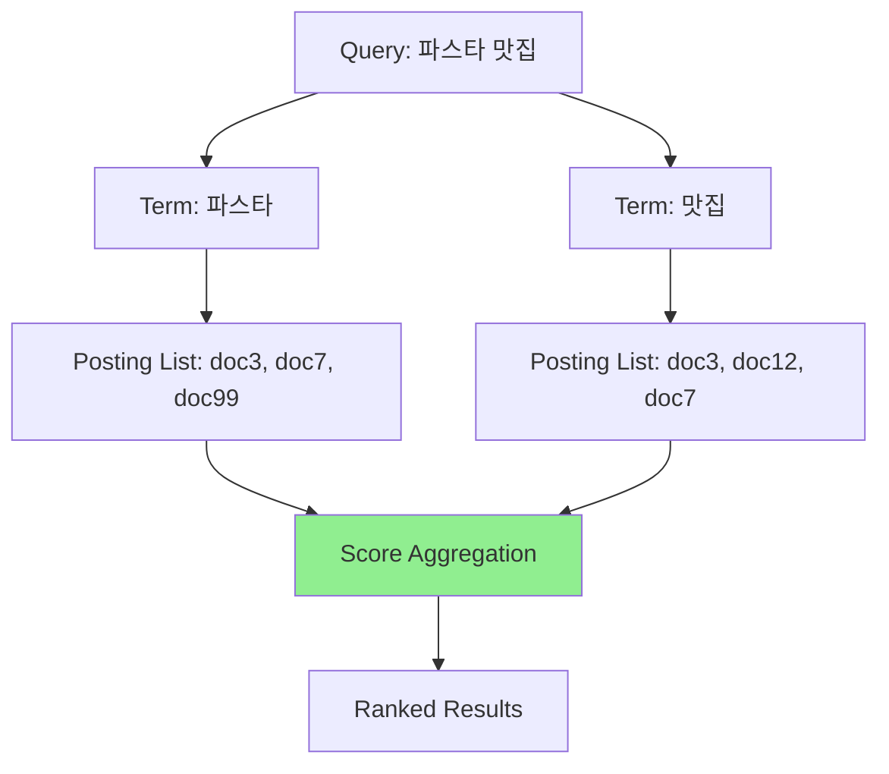
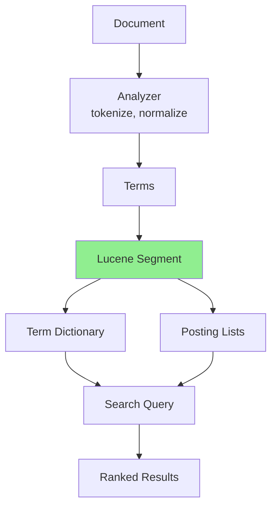

# A) Inverted Index (역색인)

Inverted Index는 검색 엔진의 핵심 자료구조로, **"단어 → 해당 단어가 등장하는 문서 목록(+ 가중치)"** 를 저장하는 방식이다.

일반적인 색인이 `문서 → 단어` 방향이라면, inverted index는 이를 뒤집어 `단어 → 문서 목록` 방향으로 저장한다. 그래서 "inverted" index라고 부른다.

# B) 직관적 예시

```text
"파스타"  → [doc3: 2.1, doc7: 1.5, doc99: 0.8]
"맛집"    → [doc3: 1.0, doc12: 3.2, doc7: 0.5]
"스파게티" → [doc3: 3.0, doc45: 2.0]
```

각 단어에 대한 문서 목록을 **포스팅 리스트(posting list)** 라고 부른다.

쿼리 `"파스타 맛집"`이 들어오면:

1. `"파스타"` 의 posting list를 가져온다
2. `"맛집"` 의 posting list를 가져온다
3. 두 posting list에 등장한 문서들의 점수를 합산한다
4. 점수가 높은 문서를 검색 결과로 반환한다

전체 문서를 하나씩 훑지 않고, 쿼리 단어가 등장하는 문서만 조회하므로 빠르다.



# C) 구성 요소

Inverted index는 크게 두 부분으로 구성된다:

1. **Dictionary (Vocabulary)**: 전체 코퍼스에 등장하는 고유 단어 목록. 보통 해시 테이블이나 트리로 구현
2. **Posting List**: 각 단어에 대해, 해당 단어가 등장하는 문서 ID와 부가 정보(가중치, 위치 등)의 리스트

Posting list에는 보통 아래 정보가 함께 들어간다. 다만 실제 저장 여부는 필드 설정에 따라 달라질 수 있다.

| 정보 | 의미 | 예시 |
|---|---|---|
| `doc_id` | 단어가 등장한 문서 ID | `doc3` |
| `tf` | 문서 안에서 단어가 등장한 횟수 | `2` |
| `weight` | BM25, SPLADE 등에서 계산한 가중치 | `2.1` |
| `position` | phrase query 등에 필요한 단어 위치 | `[4, 19]` |

# D) Lucene과의 관계

[[Elasticsearch]]는 내부 검색 엔진으로 [[Lucene|Apache Lucene]] 을 사용하고, Lucene의 핵심 색인 구조가 바로 inverted index다.

관계를 단순화하면 아래와 같다:



문서를 색인할 때 Lucene은 먼저 analyzer로 텍스트를 토큰화한다. 예를 들어 `"파스타 맛집 추천"` 이라는 문서는 `"파스타"`, `"맛집"`, `"추천"` 같은 term으로 바뀐다. 이후 각 term마다 해당 term이 등장한 문서 ID, 빈도, 위치 등의 정보를 posting list에 저장한다.

즉, Lucene은 inverted index라는 추상적인 자료구조를 실제 검색 시스템에서 쓸 수 있게 구현한 라이브러리다. 단순히 `term → doc_id 목록` 만 저장하는 것이 아니라, 빠른 검색을 위해 다음과 같은 최적화도 함께 제공한다:

| Lucene 구성 | Inverted Index 관점 | 역할 |
|---|---|---|
| Term dictionary | Dictionary / Vocabulary | 어떤 term이 존재하는지 찾는다 |
| Posting list | Posting List | 해당 term이 등장한 문서 목록을 저장한다 |
| [[Lucene Segment]] | Immutable sub-index | 문서 일부를 담은 독립적으로 검색 가능한 색인 단위 |
| Analyzer | Term 생성기 | 원문 텍스트를 검색 가능한 term으로 변환한다 |
| Similarity | Scoring 함수 | BM25 같은 점수 계산을 수행한다 |

따라서 Lucene, Elasticsearch, OpenSearch에서 keyword search나 [[BM25]] 검색을 한다는 것은 대부분 **Lucene이 만든 inverted index의 posting list를 읽고 점수를 계산한다** 는 뜻이다.

단, Lucene의 모든 저장 구조가 inverted index인 것은 아니다. Lucene은 stored fields, doc values, points, knn vectors 같은 별도 자료구조도 함께 제공한다. Inverted index는 그중에서도 **전통적인 full-text search를 term-based 방식으로 수행하기 위한 핵심 구조** 라고 보는 게 정확하다.

# E) Sparse Retrieval에서의 활용

[[BM25]], [[SPLADE]] 등 sparse retrieval 모델은 모두 inverted index 위에서 동작한다. SPLADE의 경우 출력이 vocab 크기의 sparse vector이므로, 0이 아닌 차원(= 활성화된 토큰)만 inverted index에 넣으면 기존 검색 엔진 인프라를 그대로 재활용할 수 있다. Dense retrieval처럼 별도의 vector DB가 필요 없다는 것이 실무적 장점이다.

# F) ANN에서의 Inverted Index

[[faiss]]의 `IndexIVFFlat`, `IndexIVFPQ` 등도 inverted index 구조를 사용한다. 다만 이 경우는 단어가 아닌 **클러스터 centroid** 를 key로, 해당 클러스터에 속하는 벡터들을 posting list로 저장하는 방식이다.

# G) References

- [Apache Lucene 10.3.0 - org.apache.lucene.index package summary](https://lucene.apache.org/core/10_3_0/core/org/apache/lucene/index/package-summary.html)
- [Apache Lucene - Index File Formats](https://lucene.apache.org/core/3_6_2/fileformats.html)
- [Elasticsearch Docs - Elasticsearch Reference](https://www.elastic.co/guide/en/elasticsearch/reference/current/index.html/)
- [Elasticsearch Docs - index_options](https://www.elastic.co/docs/reference/elasticsearch/mapping-reference/index-options)
