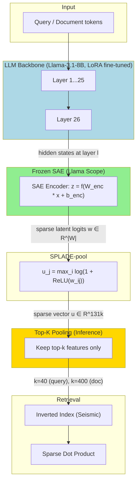
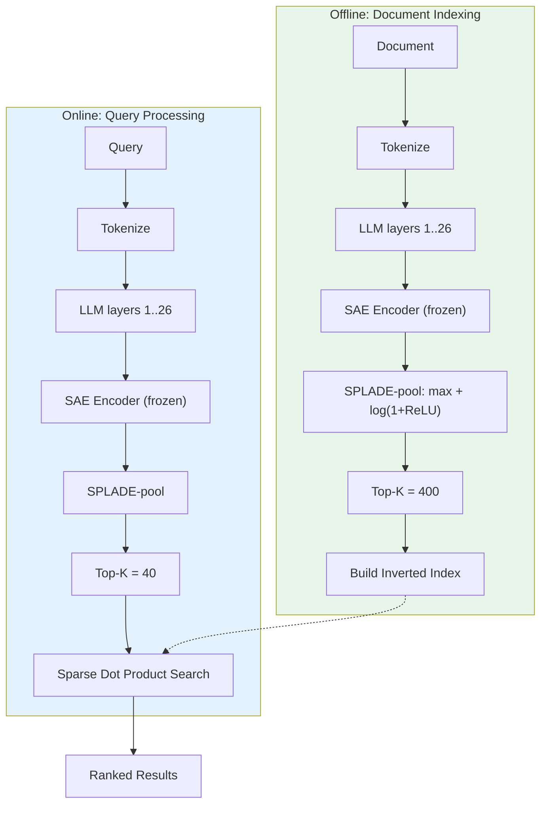

# A) 한줄 요약

**SPLARE (SParse LAtent REtrieval)** 는 Naver Labs Europe에서 제안한 새로운 Learned Sparse Retrieval 방법으로, 기존 [[SPLADE]]가 LLM의 vocabulary space로 투영하는 것과 달리, **pre-trained Sparse Autoencoder (SAE)** 의 latent feature space로 투영하여 language-agnostic하고 semantically structured한 sparse representation을 생성한다. SPLARE-7B는 MMTEB 다국어 retrieval에서 top-10에 진입한 **최초의 LSR 모델** 이다.

- **저자**: Thibault Formal*, Maxime Louis*, Herve Dejean, Stephane Clinchant (Naver Labs Europe)
- **베이스 모델**: Llama-3.1-8B (+ Llama Scope SAE), Gemma-2-2B (+ Gemma Scope SAE)
- **학회**: ICLR 2026 (Poster)

# B) 전체 구조

말로 풀어서 설명하면:

1. **입력 토큰**이 LLM backbone을 통과하되, 마지막 layer까지 가지 않고 **중간 layer (e.g. layer 26/32)** 에서 hidden state를 추출한다
2. 이 hidden state를 **frozen pre-trained SAE의 encoder** 에 통과시켜 131k 차원의 sparse latent representation을 얻는다
3. 모든 토큰의 latent representation에 **log-saturation + max pooling** (SPLADE-pool)을 적용하여 단일 sparse vector를 생성한다
4. Inference 시 **Top-K pooling** 으로 query는 40개, document는 400개 feature만 유지한다
5. Sparse dot product로 유사도를 계산하며, inverted index로 효율적 검색이 가능하다

핵심은 SPLADE가 vocabulary space (`|V|` = 128k)로 투영하는 것을 SAE의 latent space (`|W|` = 131k)로 대체한 것이다.

# C) 배경 지식

## C.1) Sparse Autoencoder (SAE)

LLM의 dense hidden state `x ∈ R^d`를 interpretable한 sparse latent features로 분해하는 single hidden layer 모델:

$$z = f(W_{\text{enc}}x + b_{\text{enc}}), \quad \hat{x} = W_{\text{dec}}z + b_{\text{dec}}$$

여기서:
- `z ∈ R^|W|`: latent representation, `|W| >> d` (e.g. 131k >> 4096)
- `f`: sparsity-inducing activation (ReLU, Top-K, JumpReLU 등)
- 학습 목표: reconstruction loss `L = ||x_hat - x||^2` + sparsity

SAE features의 핵심 속성:
- **Mono-semantic**: 대부분의 feature가 단일 interpretable concept에 대응
- **Language-agnostic**: 같은 개념이 언어에 관계없이 동일한 feature를 활성화
- **Multimodal**: multimodal LLM에서는 modality 간에도 일반화

이 논문에서 사용하는 SAE suites:
- **Llama Scope** (He et al., 2024): Llama-3.1-8B용, `|W| ∈ {32k, 131k}`
- **Gemma Scope** (Lieberum et al., 2024): Gemma-2-2B/9B/27B용, `|W| ∈ {16k ~ 1M}`

## C.2) SPLADE 복습

[[SPLADE]]는 입력을 tokenize한 후 LLM의 **모든 layer를 통과** 시키고, 최종 hidden state를 **LM Head (vocabulary projection)** 로 매핑하여 vocabulary 크기의 sparse vector를 생성한다:

$$u_j = \max_{i=1...n} \log(1 + \text{ReLU}(v_{ij})), \quad j \in \mathcal{V}$$

유사도: $s(q, d) = \langle u^q, u^d \rangle$ (sparse dot product)

**SPLADE의 한계**: vocabulary에 묶여 있어서 multilingual/cross-lingual에서 약하다. 예를 들어 "Indian"과 "indian"이 별도 토큰으로 처리되고, 비라틴 문자 언어에서는 영어 subword에 의존하게 된다.

# D) 기존 방법의 한계

| 문제                          | SPLADE (Vocabulary-based)                | SPLARE (SAE-based)              |
| --------------------------- | ---------------------------------------- | ------------------------------- |
| **Vocabulary 의존성**          | LLM vocab에 고정 (e.g. 128k)                | SAE width로 자유롭게 확장 가능           |
| **Tokenization redundancy** | "Indian", "indian", "Indians" 별도 처리      | 하나의 semantic concept으로 통합       |
| **Multilingual**            | Latin script 토큰에 편향, cross-lingual 매칭 약함 | Language-agnostic features      |
| **Feature space 활용**        | 128k 중 < 100k만 활성화, 불균등 분포               | 거의 모든 131k 차원 활용, 균등 분포         |
| **Scalability**             | Vocab 크기에 제한됨                            | SAE width 증가 시 log-linear 성능 향상 |
| **Sparsifiability**         | Top-K=100에서 성능 6%+ 하락                    | Top-K=100에서 성능 2%만 하락           |

핵심 가설: **LSR 모델이 최근 dense 모델에 뒤처진 이유는 vocabulary 의존성 때문** 이다. 실제로 논문 작성 시점에서 MTEB(Multilingual, v2) leaderboard에 sparse retrieval 모델이 하나도 없었다.

# E) 제안 방법

## E.1) SPLARE 아키텍처

SPLADE와 구조적으로 동일하되, **LM Head를 SAE encoder로 대체** 한다:

**SPLADE**: hidden state → LM Head → vocabulary logits → SPLADE-pool
**SPLARE**: hidden state (at layer $l$) → SAE encoder → latent logits → SPLADE-pool

수식으로 표현하면, SAE encoder의 파라미터 $(W_{\text{enc}}, b_{\text{enc}})$를 layer $l$에 적용:

$$w_{ij} = [f(W_{\text{enc}} \cdot h_i^{(l)} + b_{\text{enc}})]_j, \quad j \in \mathcal{W}$$

여기서 $h_i^{(l)}$은 layer $l$에서의 $i$번째 토큰의 hidden state. 이후 SPLADE와 동일한 pooling:

$$u_j = \max_{i=1...n} \log(1 + \text{ReLU}(w_{ij})), \quad j \in \mathcal{W}$$

> **중요**: SAE의 **encoder만** 사용한다 (decoder는 불필요). Residual stream에 학습된 SAE만 사용한다 (MLP/attention stream SAE는 미사용).

## E.2) 학습 절차

### E.2.1) Pre-training: Bidirectional Attention

모든 backbone에 **bidirectional attention** 을 활성화하고 **Masked Next Token Prediction** 으로 pre-train한다. MS MARCO corpus에서 20% 토큰을 마스킹하여 10k steps 학습 (약 5시간). 이는 LSR 모델에서 pooling이 모든 position에서 발생하므로 (dense 모델의 `<EOS>` 토큰과 달리) 양방향 attention이 특히 중요하기 때문이다.

### E.2.2) Fine-tuning

**학습 방식**: Contrastive learning 대신 **cross-encoder teacher distillation** 을 채택한다.

**Loss function** - KL divergence:

$$\mathcal{L}_{\text{KL}} = \sum_{i=1}^{m} p_i (\log p_i - \log \hat{p}_i)$$

여기서:
- $\hat{p}_i = \frac{e^{s(q,d_i)/\tau}}{\sum_j e^{s(q,d_j)/\tau}}$: student의 relevance distribution
- $p_i = \frac{e^{s_i}}{\sum_j e^{s_j}}$: teacher (cross-encoder)의 relevance distribution
- $\tau$: temperature parameter (SAE suite마다 다름)

**Sparsity regularization** - FLOPS loss:

$$\mathcal{L} = \mathcal{L}_{\text{KL}} + \lambda_q \ell_{\text{FLOPS}}^q + \lambda_d \ell_{\text{FLOPS}}^d$$

**Top-K pooling** (inference time): sparsity를 $\lambda_{d,q}$로 정밀 조절하는 대신, 학습 시에는 moderate sparsity로 훈련하고 inference 시 Top-K로 잘라낸다. 이를 통해 한 번 학습한 모델로 다양한 sparsity 수준을 실험할 수 있다.

### E.2.3) 학습 시 핵심 포인트

- **SAE는 frozen** (학습하지 않음) → interpretability 보존 + 학습 안정화
- **LLM은 LoRA adapter로 fine-tune** → 전체 파라미터 학습보다 성능이 좋고 간단
- SAE 초기화 시 token-level은 sparse하지만, **sequence-level은 수천 개의 non-zero values** → 추가 sparsity regularization 필수
- **Model averaging**: 여러 training run의 weight를 평균하여 generalization 향상 (multilingual model에서 사용)

## E.3) Hyperparameters

| Component | Value |
|-----------|-------|
| LoRA rank $r$ | 64 |
| Max training seq length (English) | 128 |
| Max training seq length (Multilingual) | 512 |
| Epochs | 1 |
| Batch size (w/ gradient accumulation) | 128 |
| Learning rate | $5 \times 10^{-5}$ |
| Warmup ratio | 0.01 |
| Nb negatives per query | 8 |
| $\lambda_d$ (doc FLOPS) | 0.0001 |
| $\lambda_q$ (query FLOPS) | 0.0001 |
| $\tau$ SPLARE (Llama Scope) | 80 |
| $\tau$ SPLARE (Gemma Scope) | 50 |
| $\tau$ SPLADE-Llama | 10 |
| Eval max context size | 1024 |
| Adam $\beta$s | 0.9, 0.999 |

> **$\tau$ (temperature)가 매우 중요**: SAE suite마다 logit scale과 초기 sparsity가 다르므로, 부적절한 $\tau$는 학습 발산 (e.g. $\ell_0$ collapse)을 유발한다. Grid search로 $\{1, 10, 20, 40, 50, 80, 100\}$ 에서 최적값을 선택한다 (NanoBEIR nDCG@10 기준).

## E.4) SAE 관련 선택 사항

- **SAE의 $\ell_0$**: Gemma Scope는 같은 layer/width에 대해 여러 $\ell_0$의 SAE를 제공. 실험 결과 초기 $\ell_0$는 최종 성능에 큰 영향 없음 (backbone LLM을 fine-tune하므로). $\ell_0 \approx 100$인 SAE를 사용
- **SAE type**: Residual SAE만 사용 (MLP, attention stream SAE는 미사용)
- **Activation function**: SAE에 따라 ReLU, Top-K, JumpReLU 등 다양

## E.5) Inference Flow

SPLARE의 장점: layer 26에서 hidden state를 추출하므로 (32 layer 중), **나머지 6 layer를 건너뛰어 inference latency가 줄어든다**. 반면 SPLADE는 모든 layer를 통과해야 한다.

# F) 벤치마크/데이터셋

## F.1) 학습 데이터

**English Setting** (ablation study):
- MS MARCO dataset
- Hard negatives: SPLADE model로 mining
- Distillation targets: DeBERTa-v3 reranker (open-source)

**Multilingual Setting**:
- bge-multilingual-gemma2 data (HuggingFace: `hanhainebula/bge-multilingual-gemma2-data`)
- 포함 데이터: MS MARCO, NQ, HotPotQA, 다수의 Chinese datasets, MIRACL, Mr.TyDi
- BGE multilingual reranker (`BAAI/bge-reranker-v2-m3`)로 annotated된 샘플만 사용
- 최종: **약 1.3M queries** with hard negatives

## F.2) 평가 벤치마크

- **MTEB/MMTEB**: English, Multilingual, Code, Medical, Law, ChemTEB splits
- **MIRACL**: 18개 언어 multilingual retrieval (de, yo는 hidden test set)
- **XTREME-UP**: low-resource 언어에서 영어 corpus 검색 (cross-lingual)
- **BEIR**: 13개 English retrieval datasets
- **MS MARCO**: MRR@10, TREC DL '19, '20

# G) 실험 결과 + Ablation + 실무적 시사점

## G.1) Ablation: Layer Depth

| Backbone | Best Layer | Total Layers | Rule of Thumb |
|----------|-----------|------|-----------|
| Llama-3.1-8B (Llama Scope, 131k) | ~20 | 32 | ~2/3 depth |
| Gemma-2-2B (Gemma Scope, 65k) | ~16 | 26 | ~2/3 depth |

**최적 layer는 약 2/3 depth** 에 위치한다. 이는 중간 layer가 retrieval에 더 풍부한 representation을 제공한다는 선행 연구와 일치한다. 최종 SPLARE-7B는 **layer 26** (32 layer 중)을 사용한다.

SPLADE-Llama를 중간 layer에서 학습시키면? Layer 22에서 43.6, Layer 18에서 **0 (collapse)** → SPLADE는 LM Head가 최종 layer에 맞춰 학습되었으므로 중간 layer에서 사용 불가. SPLARE만의 고유한 장점이다.

## G.2) Ablation: SAE Width

Gemma-2-2B에서 `|W| ∈ {16k, 32k, 65k, 131k, 262k, 524k, 1M}` 실험 결과:

- SAE width와 retrieval 성능 간 **roughly log-linear relationship** 관찰
- **width가 클수록 성능 향상** → SPLADE의 fixed vocab size와 달리 scaling 가능
- 단, Llama Scope (131k)가 훨씬 넓은 Gemma Scope SAE보다 전반적으로 우수

## G.3) Effectiveness-Efficiency Trade-off

SPLARE는 document pruning에 SPLADE보다 훨씬 강건하다:

| Top-K (doc) | SPLARE 성능 하락 | SPLADE 성능 하락 |
|-------------|---------------|---------------|
| 400 (default) | 0% | 0% |
| 100 | **~2%** | **~6%** |

이유:
1. SPLARE의 latent feature space가 더 **compact하고 structured**
2. SPLARE는 거의 **모든 131k 차원을 활용** (균등 분포) vs SPLADE는 128k 중 < 100k만 사용 (불균등)
3. LLM 기반 SPLADE는 본질적으로 sparsify가 어려움

**Retrieval latency**: SPLARE Top-K=(40,400)로 MS MARCO (8.8M docs) 검색 시 **약 5ms/query** (model inference 제외, Seismic library 사용).

## G.4) English-Only 결과 (MS MARCO 학습)

### G.4.1) Table 1: MTEB Splits (English Models)

| Model | English | Multilingual | Code | Medical | Law | ChemTEB |
|-------|---------|-------------|------|---------|-----|---------|
| SPLADE-v3 | 50.7 | 38.1 | 44.5 | 44.2 | 40.4 | 75.6 |
| Lion-SP-8B | 48.5 | 50.0 | 53.3 | 54.4 | 48.5 | 71.1 |
| SPLADE-Llama | 52.9 | 54.3 | **57.3** | 61.0 | 49.0 | **75.9** |
| SPLARE | 52.9 | **56.3** | 55.1 | **62.9** | **51.2** | 70.0 |

핵심 관찰:
- **English에서 동점** (52.9), **Multilingual에서 +2.0** (English-only 학습인데도!)
- **Medical, Law에서 우위**, Code에서 열위 → SAE features가 code semantics에 약함
- SPLADE-Llama가 이미 Lion-SP-8B보다 +4.4 → 강력한 baseline

### G.4.2) Table 5: BEIR 상세 결과 (nDCG@10)

| Dataset | SPLARE | SPLADE-Llama |
|---------|--------|-------------|
| TREC-COVID | **84.7** | 82.4 |
| HotpotQA | 66.8 | **67.6** |
| NQ | **61.6** | 61.2 |
| SciFact | 72.5 | **72.9** |
| MS MARCO (MRR@10) | **40.8** | 40.0 |
| TREC DL '19 | **77.4** | 76.3 |
| Average BEIR | **50.2** | 50.0 |

## G.5) Multilingual 결과

### G.5.1) Table 1: MTEB Splits (Multilingual Models)

| Model | English | Multilingual | Code | Medical | Law | ChemTEB |
|-------|---------|-------------|------|---------|-----|---------|
| SPLADE-Llama | 58.9 | 61.7 | **64.3** | **67.6** | 60.7 | 77.4 |
| SPLARE | **59.3** | **62.3** | 63.0 | 67.7 | **60.8** | **78.1** |

### G.5.2) Table 2: 언어별 상세 비교

| Model | Indic | Scandinavian | German | French | Korean | XTREME-UP | MIRACL |
|-------|-------|-------------|--------|--------|--------|-----------|--------|
| SPLADE-Llama | 91.9 | 70.4 | **57.3** | **65.6** | 74.8 | 56.2 | 69.9 |
| SPLARE | **92.3** | **70.8** | 57.1 | 64.8 | **76.0** | **58.6** | **71.7** |

**XTREME-UP에서 +2.4, MIRACL에서 +1.8** → cross-lingual과 multilingual에서 latent features의 language-agnostic 특성이 빛남.

### G.5.3) Table 3: Top Models 비교 (MTEB Retrieval)

| Model | English | Multilingual | XTREME-UP |
|-------|---------|-------------|-----------|
| gte-Qwen2-7B-instruct | 58.1 | 60.1 | 17.4 |
| voyage-3-large | 53.5 | 66.1 | 39.2 |
| jina-embeddings-v4 | 56.2 | 66.4 | - |
| Qwen-3-Embedding-8B | **69.4** | **70.9** | - |
| gemini-embedding-001 | 64.4 | 67.7 | **64.3** |
| **SPLARE** | 59.3 | 62.3 | 58.6 |
| **SPLARE (no-pooling)** | 61.4 | 63.8 | 61.4 |
| SPLARE Top-K=(20,200) | 55.9 | 59.9 | 53.8 |
| SPLARE Top-K=(10,100) | 50.1 | 56.0 | 46.5 |
| **SPLARE-2B** | 55.9 | 59.1 | 41.6 |

**SPLARE는 MTEB(Multilingual, v2) retrieval top-10, LSR model 중 1위**. Dense 모델들은 3584~4096d 벡터를 사용하지만, SPLARE는 query 40개 + doc 400개 feature만으로 이 성능을 달성한다.

### G.5.4) MIRACL 상세 (18개 언어, nDCG@10)

| Model | Avg | en | fi | hi | ja | ru | sw | de* | yo* |
|-------|-----|----|----|----|----|----|----|-----|-----|
| mE5-large | 66.6 | 52.9 | 77.8 | 62.0 | 70.6 | 67.4 | 74.9 | 56.4 | 78.3 |
| E5-mistral-7b | 63.4 | 57.3 | 74.7 | 52.1 | 66.8 | 67.7 | 68.4 | 54.1 | 79.7 |
| Gemini Embedding | 70.1 | 58.7 | 78.0 | 65.4 | 75.1 | 73.4 | 81.0 | 59.8 | 88.8 |
| M3-Emb (All) | 71.5 | 59.6 | 80.4 | 63.3 | 75.2 | 71.7 | 79.6 | 59.8 | 83.5 |
| SPLADE-Llama | 69.9 | 58.8 | 79.9 | 61.7 | 75.3 | 72.8 | 80.1 | 58.2 | 92.5 |
| **SPLARE-7B** | **71.7** | **60.9** | **81.4** | **65.5** | 75.9 | **74.1** | **81.8** | **62.5** | 90.0 |

*de, yo는 hidden test set (학습 데이터 없음). SPLARE가 en, fi, hi, ru, sw, de에서 SOTA.

### G.5.5) XTREME-UP (Cross-lingual, MRR@10)

| Model | Avg | Selected Languages |
|-------|-----|--------------------|
| Gemini Embedding | 64.3 | - |
| SPLARE | **58.6** | hi: 67.2, ml: 68.9, ta: 63.3, ur: 61.2 |
| SPLARE (Eng Only) | 42.6 | hi: 57.0, ml: 47.6, ta: 45.6, ur: 48.6 |
| SPLADE-Llama | 56.2 | hi: 64.1, ml: 63.2, ta: 59.0, ur: 57.6 |
| SPLADE-Llama (Eng Only) | 30.5 | hi: 54.7, ml: 21.8, ta: 27.8, ur: 19.5 |

English-only 학습에서도 SPLARE 42.6 vs SPLADE 30.5 → **SAE의 language-agnostic 특성이 cross-lingual transfer에 큰 기여**.

## G.6) WSDM Cup 2026 결과

별도 논문 (arxiv:2602.20986)에서 WSDM Cup Multilingual Retrieval에 SPLARE 적용:

| System | nDCG@20 |
|--------|---------|
| Qwen3-8B-Embed (dense baseline) | 0.423 |
| **SPLARE-7B (RUN1)** | **0.498** |
| SPLADE-8B (no-pooling) | 0.512 |
| SPLARE + SPLADE fusion (RRF) | 0.517 |
| SPLARE + Qwen3-Reranker-4B | 0.545 |
| Best system (fusion + reranking) | **0.559** |

SPLARE 단독으로도 Qwen3-8B-Embed 대비 **+7.5 nDCG@20**, reranking 포함 full system 수준의 성능을 first-stage retrieval만으로 달성.

## G.7) Interpretability: Bag-of-Concepts

SPLARE는 Neuronpedia를 활용하여 각 SAE feature의 의미를 해석할 수 있다. XTREME-UP Tamil→English 예시:

**SPLARE** (doc rank = 4):
- "mentions of India and its relation to various contexts" (8.7%)
- "mentions of colonial powers, specifically Britain and France" (6.6%)
- "references to military casualties and losses" (6.5%)

**SPLADE** (doc rank = 23):
- "Indian" (12.6%), "Indians" (11.2%), "casualties" (9.0%), "India" (8.5%), "indian" (7.6%)

SPLADE는 "Indian"과 "indian"을 별도로 처리하고 Latin script에 편향되는 반면, SPLARE는 **semantic concept 수준** 에서 매칭하여 cross-lingual retrieval에서 훨씬 효과적이다.

## G.8) 실무적 시사점

1. **Multilingual/Cross-lingual retrieval에서 SPLARE가 SPLADE보다 일관적으로 우위** → language-agnostic features의 실질적 가치 검증
2. **Layer 2/3 rule**: 최적 layer는 전체 depth의 약 2/3 → inference latency 절감 보너스
3. **SAE width scaling**: 더 넓은 SAE가 사용 가능해지면 성능 향상 여지 (log-linear relationship)
4. **Top-K pooling으로 sparsity 조절**: 학습 한 번으로 다양한 latency/accuracy trade-off 탐색 가능
5. **Code retrieval에서 약점** → domain-specific SAE가 필요할 수 있음 (SAE가 code semantics를 잘 캡처하지 못함)
6. **Temperature $\tau$ 주의**: SAE suite마다 다르며, 잘못 설정하면 학습 발산
7. **No-pooling variant** (+1.5 points)가 가능하지만 retrieval complexity 증가 → 실무에서는 Top-K=(40,400)이 좋은 균형점
8. **Distillation이 contrastive learning보다 효과적** → false negative 문제 회피, SPLADE 계열 모델의 확립된 방법론
9. **Dense 모델과의 비교**: SPLARE는 query 40개 + doc 400개 feature만으로 3584~4096d dense 벡터와 경쟁 → **저장/검색 효율 압도적**

# H) References

- [Learning Retrieval Models with Sparse Autoencoders (ICLR 2026)](https://openreview.net/forum?id=TuFjICawSc)
- [Naver Labs Europe @ WSDM CUP - Multilingual Retrieval (arxiv:2602.20986)](https://arxiv.org/abs/2602.20986)
- [Llama Scope: Extracting Millions of Features from Llama-3.1-8B with Sparse Autoencoders](https://arxiv.org/abs/2410.20526)
- [Gemma Scope: Open Sparse Autoencoders Everywhere All At Once on Gemma 2](https://aclanthology.org/2024.blackboxnlp-1.19/)
- [Neuronpedia - Interactive SAE Feature Interpretation](https://www.neuronpedia.org)
- [Seismic - Efficient Inverted Indexes for Approximate Retrieval over Learned Sparse Representations](https://doi.org/10.1145/3626772.3657769)
