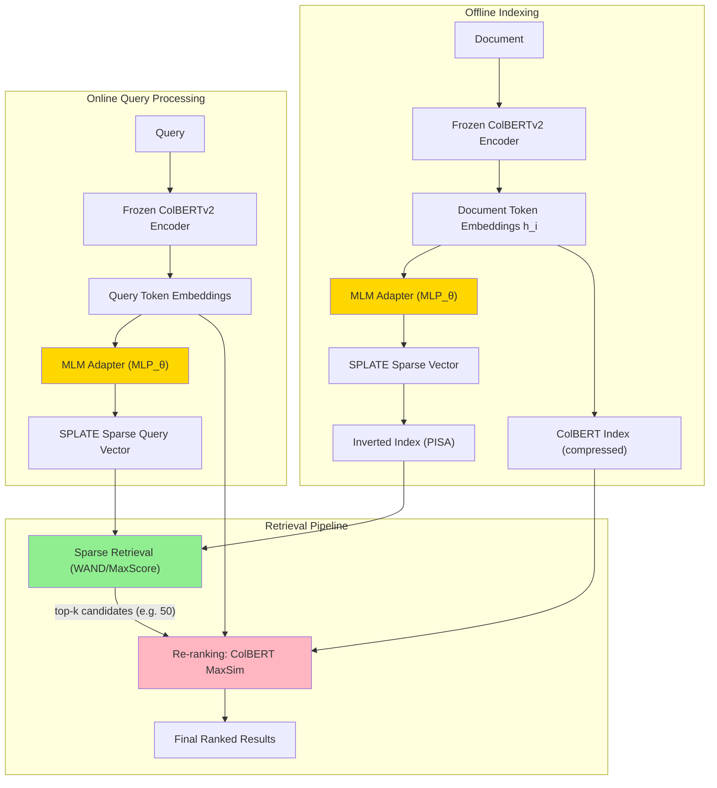
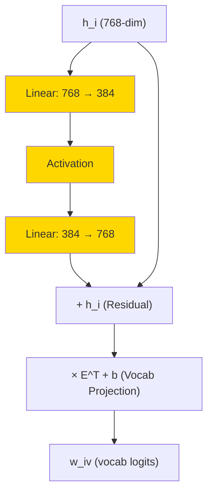

# A) 한줄 요약

ColBERTv2의 frozen token embedding을 경량 MLM adapter (~0.6M 파라미터)로 **sparse vocabulary 공간에 매핑** 하여, inverted index 기반 candidate generation + ColBERT MaxSim re-ranking을 **단일 transformer inference** 로 수행하는 파이프라인. CPU 환경에서 10ms 미만으로 후보를 뽑고, 50개만 re-ranking하면 PLAID ColBERTv2와 동일한 성능을 달성한다.

- 저자: Thibault Formal, Stephane Clinchant, Herve Dejean, Carlos Lassance
- 소속: Naver Labs Europe (Lassance는 Cohere, Naver에서 수행한 연구)
- 학회: **SIGIR 2024** (Short Paper)
- 베이스 모델: [[ColBERT|ColBERTv2]] + [[SPLADE]] MLM Head

# B) 전체 구조

**핵심 포인트**: ColBERTv2 encoder는 한 번만 실행되고, 그 출력이 (1) sparse retrieval용 SPLATE 벡터와 (2) re-ranking용 MaxSim 벡터 **두 가지 용도로 동시에** 사용된다. 추가 transformer inference가 필요 없다.

# C) 배경 지식

## C.1) Late Interaction의 Candidate Generation 문제

[[ColBERT]]의 late interaction은 높은 검색 품질을 제공하지만, **모든 문서에 대해 MaxSim을 계산하는 것은 불가능** 하다. 따라서 먼저 후보 문서를 추려내는 candidate generation이 필수적이다.

기존 접근법들:

| 방법 | Candidate Generation | 장점 | 단점 |
|------|---------------------|------|------|
| [[PLAID]] | Centroid-based filtering | 품질 높음 | **CUDA 커널 필요**, CPU에서 비효율적 |
| BM25 >> ColBERT | BM25 키워드 매칭 | 간단 | ColBERT와 다른 모델 사용, 의미 불일치 |
| SPLADE >> ColBERT | SPLADE sparse retrieval | 의미 검색 가능 | **두 개의 별도 모델** 필요 |

PLAID는 GPU CUDA 커널에 최적화되어 있어 CPU 환경에서는 느리고, BM25나 SPLADE를 사용하면 ColBERT와 별개의 모델을 추가로 관리해야 한다.

## C.2) SPLADE의 MLM Head

[[SPLADE]]는 BERT의 **Masked Language Modeling (MLM) Head**를 활용하여 토큰 임베딩을 vocabulary 공간으로 투영한다:

$$z_{iv} = \text{Transform}(h_i)^T E_v + b_v$$

여기서 Transform = Linear -> GELU -> LayerNorm (BERT MLM Head 구조). 이렇게 얻은 로짓에 `log(1 + ReLU(·))`를 적용하고 max pooling하면 sparse vector가 된다.

SPLATE는 이 아이디어를 ColBERTv2에 적용하되, **전체 MLM Head 대신 경량 adapter만 학습**한다는 점이 다르다.

# D) 기존 방법의 한계

## D.1) PLAID의 한계

[[PLAID]]는 ColBERTv2의 centroid를 활용한 다단계 필터링으로 검색을 가속화하지만:

1. **CUDA 커널 의존**: C++/CUDA로 구현된 fast kernel이 핵심이라 **GPU 없이는 효율이 급감**
2. **Engineered approximation**: Centroid-to-document 매핑이 학습된 것이 아닌 **휴리스틱 기반**
3. **해석 불가**: Centroid 공간에서의 매칭은 사람이 이해하기 어려움

## D.2) 기존 Cascade Pipeline의 한계

BM25 >> ColBERT 또는 SPLADE >> ColBERT 파이프라인의 문제:

1. **모델 불일치**: 1단계(BM25/SPLADE)와 2단계(ColBERT)가 서로 다른 모델이므로, 1단계에서 놓친 문서는 2단계에서 복구 불가
2. **추가 모델 관리**: 두 개의 별도 모델을 학습/배포/관리해야 하는 운영 부담
3. **이중 인코딩 비용**: 쿼리를 두 번 인코딩해야 함 (SPLADE encoder + ColBERT encoder)

# E) 제안 방법: SPLATE

## E.1) 핵심 아이디어

ColBERTv2의 frozen token embedding $h_i$를 **경량 MLP adapter** 로 변환하여 SPLADE 스타일의 sparse vector를 생성한다. 이 과정에서:

- ColBERTv2 backbone은 **완전히 frozen** (파라미터 변경 없음)
- 학습하는 것은 adapter의 MLP 파라미터 $\theta$와 bias $b$뿐 (**~0.6M 파라미터**)
- 동일한 ColBERTv2 임베딩이 sparse retrieval과 dense re-ranking **모두에 사용**

이것이 왜 매력적인가? 기존 SPLADE >> ColBERT 파이프라인은 2개의 transformer를 돌려야 하지만, SPLATE는 **1개의 transformer만으로** 두 가지 표현을 동시에 얻는다.

## E.2) MLM Adapter 아키텍처

### E.2.1) 수식

토큰 $i$의 vocabulary 토큰 $v$에 대한 로짓:

$$w_{iv} = (h_i + \text{MLP}_\theta(h_i))^T E_v + b_v$$

여기서:
- $h_i$: ColBERTv2의 frozen token embedding (768차원)
- $\text{MLP}_\theta$: 2-layer MLP (학습 대상)
- $E_v$: BERT input embedding matrix의 $v$번째 행 (frozen, ColBERTv2의 tied projection layer)
- $b_v$: 토큰별 bias (학습 대상)
- **Residual connection** $h_i + \text{MLP}_\theta(h_i)$: near-identity initialization으로 학습 안정성 확보

### E.2.2) MLP 구조

- **Down-projection**: 768 -> 384 (factor of 2)
- **Up-projection**: 384 -> 768
- Latent dimension 선택은 "not critical"하다고 저자들이 언급
- **총 학습 파라미터 ~0.6M**: MLP weights + vocabulary bias
- Adapter 설계는 Houlsby et al.의 adapter module에서 residual 구조를 차용

### E.2.3) 왜 Residual Connection인가

학습 초기에 MLP 출력이 0에 가까우면, $h_i + \text{MLP}_\theta(h_i) \approx h_i$가 되어 원래 ColBERTv2 임베딩과 거의 동일한 상태에서 출발한다. 이렇게 하면:
1. 학습이 안정적으로 시작됨
2. MLM adapter가 ColBERTv2 임베딩에 **작은 보정**만 가하면 되는 구조

## E.3) Sparse Vector 생성

토큰별 로짓으로부터 문서/쿼리 수준의 sparse vector 생성:

$$w_v = \max_{i \in t} \log(1 + \text{ReLU}(w_{iv})), \quad v \in \{1, ..., |V|\}$$

이것은 [[SPLADE]]의 SPLADE-v2 (Max Pooling) 방식과 동일하다:
- **ReLU**: 음수 로짓 제거 -> 자연스러운 sparsity
- **log(1+x)**: 값 폭주 억제 + 추가적 희소성 유도
- **Max pooling**: 각 vocabulary 토큰에 대해 가장 강한 신호만 선택

### E.3.1) Top-k Pooling

SPLATE는 SPLADE의 FLOPS regularization 대신 **top-k pooling** 으로 sparsity를 제어한다:
- Query: top-$k_q$개의 활성 차원만 유지
- Document: top-$k_d$개의 활성 차원만 유지
- FLOPS regularization보다 단순하면서 거의 동등한 효과

실험된 $(k_q, k_d)$ 조합: (5, 30), (5, 50), (5, 100), (10, 100), (20, 200)

## E.4) 학습 과정

### E.4.1) 학습 대상

| 구성 요소 | 상태 |
|----------|------|
| ColBERTv2 Transformer backbone | **Frozen** |
| ColBERTv2 tied projection layer $E$ | **Frozen** |
| MLP adapter ($\theta$) | **학습** |
| Vocabulary bias ($b$) | **학습** |

### E.4.2) Loss Function

ColBERTv2의 MaxSim 점수를 teacher로 사용하는 **self-distillation**:

$$\mathcal{L} = \alpha \cdot \mathcal{L}_{\text{marginMSE}} + \beta \cdot \mathcal{L}_{\text{KLDiv}}$$

- **marginMSE**: margin 기반 mean squared error (recall에 민감)
- **KLDiv**: Kullback-Leibler divergence (precision에 민감)
- 두 loss의 가중치 $\alpha, \beta$는 논문에서 구체적 값 미공개

핵심은 **frozen ColBERTv2가 teacher이자 backbone**이라는 점. 별도의 teacher 모델이 필요 없다.

### E.4.3) 학습 세팅

| 항목 | 값 |
|------|-----|
| 데이터셋 | MS MARCO passage |
| Batch size | 24 |
| Epochs | 3 |
| Hard negatives per query | 20개 |
| Hard negative source | ColBERTv2 top-1000 |
| GPU | 2x Tesla V100 (32GB) |
| 학습 시간 | **< 2시간** |
| 코드베이스 | SPLADE 공식 repository |

**매우 가벼운 학습**: 0.6M 파라미터만 학습하므로 V100 2장으로 2시간이면 충분하다.

## E.5) 해석 가능한 표현

SPLATE의 sparse vector는 vocabulary 공간에 있으므로 사람이 직접 해석할 수 있다:

| Query | Top activated terms (weight) |
|-------|------------------------------|
| "what is the medium for an artisan" | medium (2.2), art (1.8), ##isan (1.7), media (1.1), craftsman (0.9) |
| "treating tension headaches without medication" | headache (2.1), tension (1.8), without (1.6), treatment (1.5), treat (1.4), medication (1.3) |
| "cost of interior concrete flooring" | price (2.45), concrete (1.96), interior (1.85), floor (1.77) |

ColBERTv2의 128차원 압축 벡터는 해석이 불가능하지만, SPLATE를 통해 **동일한 모델의 내부 표현을 vocabulary 단어로 해석** 할 수 있다. 이는 디버깅과 시스템 이해에 큰 도움이 된다.

# F) 검색 파이프라인

## F.1) Candidate Generation (Sparse Retrieval)

1. Query를 ColBERTv2로 인코딩 -> token embeddings 획득
2. MLM adapter로 sparse vector 생성 -> top-$k_q$ pooling
3. **PISA 엔진**의 [[Inverted Index]]에서 후보 문서 검색
    - Block-max WAND 알고리즘 사용
    - MaxScore 최적화 지원
4. top-$k$ 후보 문서 반환

이것이 논문에서 **"R" (Retrieval only)** setting이다.

## F.2) Re-ranking (Late Interaction)

1. Candidate generation에서 얻은 top-$k$ 문서에 대해
2. ColBERT index에서 해당 문서의 token embeddings를 가져옴 (compressed, 이미 저장되어 있음)
3. Query token embeddings와 MaxSim 계산:

$$\text{Score}(q, d) = \sum_{i \in q} \max_{j \in d} q_i^T d_j$$

4. 최종 점수로 re-ranking

이것이 논문에서 **"e2e" (end-to-end)** setting이다. 기본 re-ranking budget은 $k = 50$.

## F.3) PLAID와의 구조적 차이

| 차이점 | PLAID | SPLATE |
|-------|-------|--------|
| Candidate generation | Centroid-based filtering | **Inverted index** sparse retrieval |
| 학습 여부 | Engineered (비학습) | **Supervised** (distillation) |
| HW 요구사항 | CUDA 커널 필요 | **CPU 친화적** |
| 해석 가능성 | Centroid 공간 (불투명) | **Vocabulary 공간** (해석 가능) |
| 추가 인프라 | PLAID 전용 엔진 | 기존 sparse retrieval 엔진 재활용 |
| 최적화 기법 | Custom CUDA kernels | WAND, MaxScore 등 전통 IR 최적화 |

# G) 실험 결과

## G.1) Latency vs Quality Trade-off (MS MARCO Dev)

$(k_q, k_d)$ 조합에 따른 retrieval latency와 성능:

| $(k_q, k_d)$ | MRT (ms) | R MRR@10 | e2e MRR@10 |
|---------------|----------|----------|------------|
| (5, 30) | **2.9** | 34.5 | 39.5 |
| (5, 50) | 4.3 | 35.5 | 39.7 |
| (5, 100) | 7.4 | 35.6 | 39.8 |
| (10, 100) | 24.0 | 36.7 | 40.0 |
| (20, 200) | 106.0 | 37.4 | 40.0 |

- **MRT**: Mean Response Time (sparse retrieval 단계만)
- **R**: Retrieval only (sparse score만 사용)
- **e2e**: Retrieval + ColBERT MaxSim re-ranking

**핵심 관찰**:
1. (5, 50)만으로도 4.3ms에 e2e MRR@10 = 39.7 달성
2. (10, 100)에서 e2e 40.0으로 ColBERTv2 원본(39.7)을 초과
3. Sparse retrieval 자체(R)의 성능은 낮지만, re-ranking 후(e2e)에는 **모두 비슷한 수준으로 수렴** -> 저렴한 candidate generation이 충분함을 의미

## G.2) 전체 성능 비교 (k_q=10, k_d=100, k=50)

| Model | MS MARCO MRR@10 | DL19 nDCG@10 | BEIR nDCG@10 | LoTTE S@5 |
|-------|-----------------|--------------|--------------|-----------|
| SPLADE++ | 38.0 | 73.2 | 50.7 | -- |
| SparseEmbed | 39.2 | -- | 50.9 | -- |
| SLIM++ | 40.4 | 71.4 | 49.0 | -- |
| ColBERTv2 | 39.7 | -- | -- | 71.6 |
| **PLAID ColBERTv2** | **39.8** | **74.6** | **85.2** | 69.6 |
| BM25 >> ColBERT (k=50) | 34.3 | 68.7 | 73.9 | 62.8 |
| SPLADE++ >> ColBERT (k=50) | 40.4 | 74.4 | 87.5 | **72.0** |
| **SPLATE (R only)** | 36.7 | 72.9 | 84.4 | 66.7 |
| **SPLATE (e2e)** | **40.0** | **74.2** | **84.4** | 71.0 |

**분석**:

1. **SPLATE e2e vs PLAID ColBERTv2**: MS MARCO에서 40.0 vs 39.8로 **동등 이상**, DL19에서 74.2 vs 74.6으로 근소 차이
2. **SPLATE e2e vs SPLADE++ >> ColBERT**: 성능은 비슷하지만, SPLATE는 **단일 모델**만 필요하다는 운영 이점
3. **BM25 >> ColBERT의 한계**: 34.3 MRR@10으로 SPLATE(40.0)에 크게 뒤짐 -> BM25가 놓치는 후보를 ColBERT가 복구할 수 없음을 보여줌
4. **BEIR (out-of-domain)**: SPLATE (84.4) vs PLAID (85.2)로 약간의 차이. RANGER 분석에 따르면 13개 BEIR 데이터셋 중 10개에서 유의미한 차이 없음, 1개에서 개선, 2개에서 하락

## G.3) Candidate Overlap 분석

SPLATE의 top-$k'$ 후보가 ColBERTv2의 실제 top-$k$를 얼마나 포함하는지:

- $k=10$일 때: SPLATE의 **top-50에서 ColBERTv2 top-10의 90% 이상**을 포함
- 즉, 50개만 re-ranking해도 충분한 recall을 확보

## G.4) Out-of-Domain 성능 (LoTTE Search)

| Setting | S@5 |
|---------|-----|
| (5, 50), k=10 | 70.0 |
| (10, 100), k=50 | ~71.0 (ColBERTv2 71.6과 유사) |

Pooling dimension을 높이면 out-of-domain 일반화가 향상된다.

## G.5) Storage

| 구성 요소 | 크기 |
|----------|------|
| MS MARCO PISA sparse index | ~2.2 GB |
| ColBERT dense index | 기존과 동일 |

Sparse index 추가 비용은 ColBERT의 dense index 대비 **무시할 만한 수준**이다.

## G.6) 실무적 시사점

1. **CPU 환경에서의 ColBERT 실용화**: PLAID는 CUDA 필요, SPLATE는 전통적 sparse retrieval 엔진(PISA, Lucene 등)으로 동작 가능
2. **10ms 이하 candidate generation**: (5, 50) 설정으로 4.3ms에 충분한 후보 확보
3. **Re-ranking budget 50이면 충분**: 50개 문서만 MaxSim으로 re-ranking해도 full retrieval과 거의 동일한 성능
4. **Sparse retrieval 인프라 재활용**: Elasticsearch, PISA 등 기존 inverted index 인프라를 그대로 사용 가능
5. **학습 비용 극소**: V100 2장, 2시간 미만, 0.6M 파라미터만 학습
6. **디버깅/해석 가능**: Vocabulary 공간의 sparse vector이므로 어떤 단어가 활성화되었는지 직접 확인 가능
7. **단일 모델 관리**: SPLADE >> ColBERT 파이프라인과 달리, 하나의 ColBERTv2 모델만 관리하면 됨

# H) References

- [SPLATE: Sparse Late Interaction Retrieval (arXiv)](https://arxiv.org/abs/2404.13950)
- [SIGIR 2024 Proceedings (ACM DL)](https://dl.acm.org/doi/10.1145/3626772.3657968)
- [Naver Labs Europe Publication Page](https://europe.naverlabs.com/research/publications/splate-sparse-late-interaction-retrieval/)
- [SPLADE GitHub Repository (naver/splade)](https://github.com/naver/splade)
