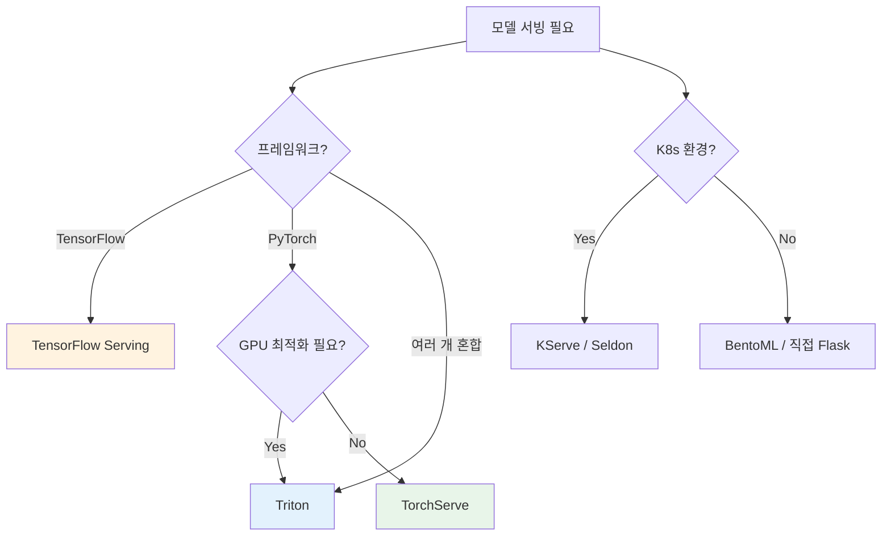

# A) 핵심 요약

**ML Model Serving**: 학습된 ML 모델을 프로덕션 환경에서 예측 API로 제공하는 시스템. 모델 로딩, 스케일링, 전/후처리, 모니터링 등을 자동화.

# B) Model Server의 역할


| 기능 | 설명 |
|------|------|
| **모델 로딩** | 여러 모델을 동시에 로드/관리 |
| **예측 API** | REST/gRPC 엔드포인트 자동 생성 |
| **전/후처리** | 입력 변환, 출력 포맷팅 |
| **스케일링** | 트래픽에 따른 자동 확장 |
| **모니터링** | 지연시간, 처리량, 에러율 추적 |
| **버전 관리** | A/B 테스트, Canary 배포 |

# C) 주요 Model Serving 프레임워크

## C.1) 비교 테이블

| 프레임워크 | 지원 프레임워크 | 특징 | GitHub |
|------------|----------------|------|--------|
| **TensorFlow Serving** | TensorFlow | 고성능, gRPC 지원 | [tensorflow/serving](https://github.com/tensorflow/serving) |
| **TorchServe** | PyTorch | 쉬운 설정, 핸들러 커스텀 | [pytorch/serve](https://github.com/pytorch/serve) |
| **Triton** | TF, PyTorch, ONNX 등 | 멀티 프레임워크, GPU 최적화 | [triton-inference-server](https://github.com/triton-inference-server/server) |
| **BentoML** | 다양함 | Python 친화적, 패키징 쉬움 | [bentoml/BentoML](https://github.com/bentoml/BentoML) |
| **Seldon Core** | 다양함 | K8s 네이티브, 복잡한 파이프라인 | [SeldonIO/seldon-core](https://github.com/SeldonIO/seldon-core) |
| **KServe** | 다양함 | K8s 서버리스, 오토스케일링 | [kserve/kserve](https://github.com/kserve/kserve) |

## C.2) TensorFlow Serving

```yaml
특징:
  - TensorFlow SavedModel 형식 지원
  - gRPC/REST API 자동 생성
  - 모델 버전 관리 내장
  - 배치 추론 지원

사용 예:
  docker run -p 8501:8501 \
    --mount type=bind,source=/models/my_model,target=/models/my_model \
    -e MODEL_NAME=my_model \
    tensorflow/serving
```

## C.3) TorchServe

```yaml
특징:
  - PyTorch 모델 (.pt, .pth) 지원
  - 커스텀 핸들러로 전/후처리 정의
  - 모델 아카이브 (.mar) 패키징
  - Metrics API 내장

사용 예:
  torch-model-archiver --model-name my_model \
    --version 1.0 \
    --model-file model.py \
    --serialized-file model.pth \
    --handler handler.py
```

## C.4) NVIDIA Triton

```yaml
특징:
  - 멀티 프레임워크 (TF, PyTorch, ONNX, TensorRT)
  - Dynamic Batching
  - Model Ensemble (파이프라인)
  - GPU 메모리 최적화

사용 사례:
  - 고성능 GPU 추론 필요 시
  - 여러 프레임워크 모델 통합 서빙
```

# D) 선택 가이드



| 상황 | 추천 |
|------|------|
| TensorFlow 모델, 고성능 필요 | **TensorFlow Serving** |
| PyTorch 모델, 빠른 구축 | **TorchServe** |
| 멀티 프레임워크, GPU 최적화 | **Triton** |
| K8s 환경, 서버리스 | **KServe** |
| 간단한 배포, Python 친화 | **BentoML** |

# E) CPU vs GPU Inference

| 항목 | CPU | GPU |
|------|-----|-----|
| **지연시간** | 높음 | 낮음 |
| **처리량** | 낮음 | 높음 |
| **비용** | 낮음 | 높음 |
| **배치 효율** | 낮음 | 높음 |
| **적합 케이스** | 소규모, 실시간 | 대규모, 배치 |

**CPU 최적화 기법:**
- ONNX Runtime
- Intel OpenVINO
- Quantization (INT8)

# F) Related

- [[TorchServe]]
- [[MLOps]]
- [[Kubernetes]]
- [[Docker]]

# G) References

- [TensorFlow Serving Guide](https://www.tensorflow.org/tfx/guide/serving)
- [TorchServe GitHub](https://github.com/pytorch/serve)
- [Triton Inference Server](https://github.com/triton-inference-server/server)
- [BentoML Docs](https://docs.bentoml.com/)
- [KServe Docs](https://kserve.github.io/website/)
